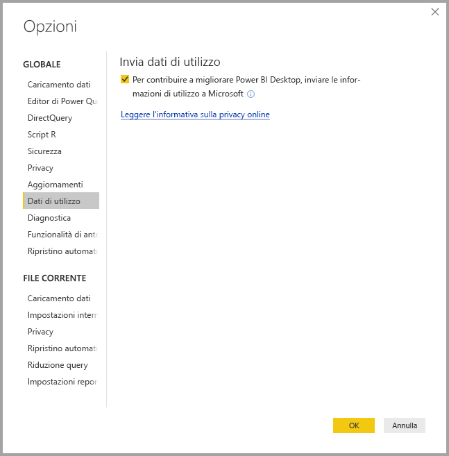
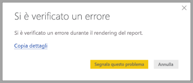

# Privacy di Power BI Desktop

Microsoft opera in modo continuativo per la protezione della privacy degli utenti, fornendo nel contempo prodotti che offrono le prestazioni, la potenza e la praticità desiderate. Microsoft raccoglie determinate informazioni sull'uso di Power BI Desktop, per contribuire alla diagnosi dei problemi e migliorare il prodotto. Per altre informazioni sulla gestione della privacy da parte di Microsoft, vedere l'Informativa sulla privacy Microsoft. L'Informativa sulla privacy si applica ai dati raccolti dall'uso di **Power BI Desktop** da parte degli utenti.
 
Le informazioni raccolte dagli utenti di **Power BI Desktop** possono includere dati del sistema operativo, informazioni di Power BI Desktop e versioni di Internet Explorer. 
 
Per rifiutare esplicitamente questa raccolta di dati, selezionare **File > Opzioni e impostazioni > Opzioni**, quindi nella scheda **Dati di utilizzo** deselezionare la casella di controllo **Invia dati di utilizzo** come mostrato nell'immagine seguente.

## Invio di informazioni aggiuntive

In caso di arresti anomali o altri problemi è possibile scegliere di inviare segnalazioni errori e informazioni aggiuntive, che possono contribuire a risolvere il problema in una versione futura. In tali casi Microsoft raccoglie anche informazioni sullo stato del file di **Power BI Desktop** sul quale l'utente stava lavorando, quali impostazioni locali di documenti, funzionalità di anteprima abilitate e modalità di archiviazione. Le informazioni possono includere screenshot, messaggi di errore e formule del modello. Le informazioni possono includere anche i file di contenuto in uso quando si è verificato un errore. È consigliabile esaminare tali file prima dell'invio. Tenere presente che prima dell'invio è possibile scegliere quali informazioni vengono inviate a Microsoft.  
 
Se non si desidera inviare queste informazioni, è possibile fare clic su **Chiudi** quando si verifica un errore oppure rifiutare esplicitamente l'invio di dati d'uso, come descritto in precedenza. 

