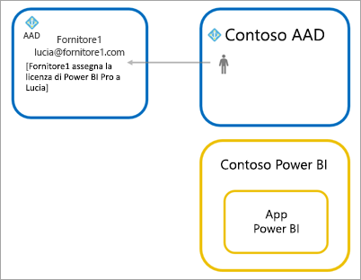

# Distribuire il contenuto di Power BI agli utenti guest esterni usando Azure AD B2B

Power BI consente la condivisione di contenuto con utenti guest esterni tramite Azure Active Directory Business-to-Business (Azure AD B2B).
Con Azure AD B2B, un'organizzazione può abilitare e gestire la condivisione con utenti esterni da una posizione centrale. Per impostazione predefinita, gli utenti guest esterni possono usufruire di un'esperienza di solo consumo. Inoltre, è possibile consentire agli utenti guest all'esterno dell'organizzazione di modificare e gestire il contenuto all'interno dell'organizzazione.

Questo articolo offre un'introduzione di base a Azure AD B2B in Power BI. Per altre informazioni, vedere [Distribuire il contenuto di Power BI agli utenti guest esterni usando Azure Active Directory B2B](../guidance/whitepaper-azure-b2b-power-bi.md).

## Abilitare l'accesso

Prima di invitare utenti guest, verificare che la funzionalità [Condividi contenuti con utenti esterni](service-admin-portal.md#export-and-sharing-settings) sia abilitata nel portale di amministrazione di Power BI. Anche quando questa opzione è abilitata, in Azure Active Directory l'utente deve avere l'autorizzazione per l'invito di utenti guest, che viene concessa tramite l'assegnazione del ruolo Mittente dell'invito guest. 

L'opzione per [consentire agli utenti guest esterni di modificare e gestire contenuto nell'organizzazione](service-admin-portal.md#allow-external-guest-users-to-edit-and-manage-content-in-the-organization) permette di concedere agli utenti guest la possibilità di visualizzare e creare contenuto nelle aree di lavoro, compresa l'esplorazione di Power BI dell'organizzazione.

> [!NOTE]
> L'impostazione [Condividi contenuti con utenti esterni](service-admin-portal.md#export-and-sharing-settings) determina se Power BI consente di invitare utenti esterni nell'organizzazione. Dopo che un utente esterno ha accettato l'invito, diventa un utente guest di Azure AD B2B all'interno dell'organizzazione. Questi utenti vengono visualizzati nelle selezioni utenti nell'intera esperienza di Power BI. Se l'impostazione è disabilitata, gli utenti guest esistenti nell'organizzazione continuano ad avere accesso a tutti gli elementi a cui avevano accesso e continuano a essere elencati nelle esperienze di selezione utenti. In queste esperienze vengono visualizzati anche gli utenti guest aggiunti tramite l'approccio basato su [inviti pianificati](#planned-invites). Per impedire agli utenti guest di accedere a Power BI, è possibile usare i criteri di accesso condizionale di Azure AD.

## Chi è possibile invitare?

È possibile invitare nell'organizzazione utenti guest con la maggior parte degli indirizzi di posta elettronica, inclusi account personali, ad esempio gmail.com, outlook.com e hotmail.com. Azure AD B2B chiama questi indirizzi *identità di social network*.

Non è possibile invitare gli utenti associati a un cloud per enti pubblici, ad esempio [Power BI per il Governo degli Stati Uniti](service-govus-overview.md).

## Invitare gli utenti guest

Gli inviti per gli utenti guest sono richiesti solo per il primo invito nell'organizzazione. Per invitare gli utenti, usare gli inviti pianificati o ad hoc.

Per usare gli inviti ad hoc, usare le funzionalità seguenti:
* Condivisione di report e dashboard
* Elenco di accesso all'app

Gli inviti ad hoc non sono supportati nell'elenco di accesso all'area di lavoro. Per aggiungere questi utenti alla propria organizzazione, usare l'[approccio basato su inviti pianificati](#planned-invites). Quando l'utente esterno è un guest nell'organizzazione, aggiungerlo all'elenco di accesso all'area di lavoro.

### Inviti pianificati

Usare un invito pianificato se si sa quali utenti invitare. È possibile inviare gli inviti con il portale di Azure o PowerShell. È necessario essere un amministratore del tenant per invitare altre persone.

Seguire questi passaggi per inviare un invito nel portale di Azure.

1. Nel [portale di Azure](https://portal.azure.com) selezionare **Azure Active Directory**.

1. In **Gestisci** selezionare **Utenti** > **Tutti gli utenti** > **Nuovo utente guest**.

    

1. Immettere un **indirizzo di posta elettronica** e un **messaggio personale**.

    

1. Selezionare **Invita**.

Per invitare più utenti guest, usare PowerShell. Per altre informazioni, vedere [Codici ed esempi di PowerShell per Collaborazione B2B di Azure AD](/azure/active-directory/b2b/code-samples/).

L'utente guest deve selezionare **Inizia** nell'invito ricevuto tramite posta elettronica. L'utente guest viene quindi aggiunto al tenant.

### Inviti ad hoc

Per invitare un utente esterno in qualsiasi momento, aggiungerlo al dashboard o al report tramite l'interfaccia utente condivisa o all'app tramite la pagina di accesso. Di seguito è riportato un esempio delle operazioni da eseguire quando si invita un utente esterno a usare un'app.

L'utente guest riceverà un messaggio di posta elettronica che indica che l'app è stata condivisa con lui.

L'utente guest deve accedere con l'indirizzo di posta elettronica dell'organizzazione. Riceverà una richiesta di accettazione dell'invito dopo l'accesso. Dopo l'accesso, l'app viene aperta per l'utente guest. Per tornare all'app, l'utente guest deve aggiungere il collegamento ai segnalibri o salvare il messaggio di posta elettronica.

## Gestione delle licenze

L'utente guest deve essere in possesso delle licenze appropriate per visualizzare il contenuto condiviso. Esistono tre modi per verificare che l'utente abbia una licenza appropriata: usare Power BI Premium, assegnare una licenza di Power BI Pro o usare la licenza di Power BI Pro del guest.

Gli [utenti guest che possono modificare e gestire contenuto nell'organizzazione](service-admin-portal.md#allow-external-guest-users-to-edit-and-manage-content-in-the-organization) necessitano di una licenza di Power BI Pro per aggiungere contenuto alle aree di lavoro o condividere contenuto con altri utenti.

### Usare Power BI Premium

L'assegnazione dell'area di lavoro alla [capacità di Power BI Premium](service-premium-what-is.md) consente all'utente guest di usare l'app senza che sia necessaria una licenza di Power BI Pro. Power BI Premium consente anche alle app di sfruttare altre funzionalità come maggiori frequenze di aggiornamento, capacità dedicata e modelli di grandi dimensioni.

### Assegnare una licenza di Power BI Pro all'utente guest

L'assegnazione di una licenza di Power BI Pro a un utente guest, all'interno del tenant, gli consente di visualizzare il contenuto nel tenant. Per altre informazioni sull'assegnazione delle licenze, vedere [Assegnare licenze agli utenti nella pagina Licenze](/office365/admin/manage/assign-licenses-to-users#assign-licenses-to-users-on-the-licenses-page). Prima di assegnare le licenze Pro agli utenti guest, contattare il rappresentante dell'account Microsoft per assicurarsi della conformità con i termini del contratto con Microsoft.

### L'utente guest ha una licenza di Power BI Pro

L'utente guest ha già una licenza di Power BI Pro assegnata nel tenant.

## Utenti guest che possono modificare e gestire contenuto

Quando si usa la funzionalità per [consentire agli utenti guest esterni di modificare e gestire contenuto nell'organizzazione](service-admin-portal.md#allow-external-guest-users-to-edit-and-manage-content-in-the-organization), gli utenti guest specificati ottengono diritti di accesso aggiuntivi al servizio Power BI dell'organizzazione. Gli utenti guest possono visualizzare qualsiasi contenuto per cui hanno l'autorizzazione, accedere alla pagina Home, esplorare le aree di lavoro, installare le app disponibili nell'elenco di accesso e aggiungere contenuto alle aree di lavoro. Possono creare aree di lavoro che fanno uso dell'esperienza della nuova area di lavoro o esserne amministratori. Esistono alcune limitazioni. Nella sezione Considerazioni e limitazioni sono elencate queste restrizioni.
 
Per aiutare gli utenti guest autorizzati ad accedere a Power BI, fornire loro l'URL del tenant. Per trovare l'URL del tenant, seguire questa procedura.

1. Nel servizio Power BI selezionare la guida ( **?** ) nel menu in alto, quindi **Informazioni su Power BI**.

2. Cercare il valore accanto a **URL tenant**. Condividere l'URL del tenant con gli utenti guest autorizzati.

    

## Considerazioni e limitazioni

* Per impostazione predefinita, gli utenti guest di Azure AD B2B esterni sono limitati all'utilizzo del contenuto. Gli utenti guest di Azure AD B2B esterni possono visualizzare app, dashboard e report, esportare i dati e creare sottoscrizioni di posta elettronica per i dashboard e i report. Non possono accedere alle aree di lavoro o pubblicare contenuto personale. Per rimuovere queste limitazioni, è possibile usare la funzionalità [Consenti agli utenti guest esterni di modificare e gestire il contenuto dell'organizzazione](service-admin-portal.md#allow-external-guest-users-to-edit-and-manage-content-in-the-organization).

* Per invitare gli utenti guest è necessaria una licenza di Power BI Pro. Gli utenti della versione di valutazione Pro non possono invitare gli utenti guest in Power BI.

* Alcune esperienze non sono disponibili per gli [utenti guest che possono modificare e gestire contenuto nell'organizzazione](service-admin-portal.md#allow-external-guest-users-to-edit-and-manage-content-in-the-organization). Per aggiornare o pubblicare report, devono usare l'interfaccia utente Web del servizio Power BI, tra cui l'opzione Scarica i dati per caricare i file di Power BI Desktop.  Le esperienze seguenti non sono supportate:
    * Pubblicazione diretta da Power BI Desktop al servizio Power BI
    * Gli utenti guest non possono usare Power BI Desktop per connettersi ai set di dati del servizio nel servizio Power BI
    * Aree di lavoro classiche associate a gruppi di Microsoft 365:
        * Gli utenti guest non possono creare queste aree di lavoro o esserne amministratori
        * Gli utenti guest possono essere membri
    * L'invio di inviti ad hoc non è supportato per gli elenchi di accesso all'area di lavoro
    * Power BI Publisher per Excel non è supportato per gli utenti guest
    * Gli utenti guest non possono installare un Power BI Gateway e connetterlo all'organizzazione
    * Gli utenti guest non possono installare app pubblicate per l'intera organizzazione
    * Gli utenti guest non possono usare, creare, aggiornare o installare pacchetti di contenuto dell'organizzazione
    * Gli utenti guest non possono usare Analizza in Excel
    * Gli utenti guest non possono essere @mentioned nei commenti
    * Gli utenti guest non possono usare le sottoscrizioni
    * Gli utenti guest che usano questa funzionalità dovrebbero avere un account aziendale o dell'istituto di istruzione. 
    
* Gli utenti guest che usano account personali saranno soggetti a maggiori limitazioni a causa di restrizioni di accesso.
    * Possono usare le esperienze nel servizio Power BI tramite un Web browser
    * Non possono usare le app per dispositivi mobili Power BI.
    * Non saranno in grado di accedere per fornire le credenziali quando è richiesto un account aziendale o dell'istituto di istruzione.

* Questa funzionalità non è attualmente disponibile nella Web part Report di SharePoint Online di Power BI.

* Esistono impostazioni di Active Directory che possono limitare le operazioni eseguibili dagli utenti guest esterni all'interno dell'organizzazione. Ciò si applica anche all'ambiente di Power BI. Nella documentazione seguente vengono illustrate le impostazioni:
    * [Gestisci le impostazioni di collaborazione esterna](/azure/active-directory/b2b/delegate-invitations#configure-b2b-external-collaboration-settings)
    * [Consentire o bloccare gli inviti agli utenti B2B di organizzazioni specifiche](https://docs.microsoft.com/azure/active-directory/b2b/allow-deny-list)
    * [Consentire o bloccare l'accesso al servizio Power BI da parte di utenti guest](/azure/active-directory/conditional-access/overview)
    
* La condivisione all'esterno dell'organizzazione non è supportata nei cloud nazionali. Creare invece all'interno dell'organizzazione account utente che gli utenti esterni possono usare per accedere al contenuto. 

* Se si condivide direttamente con un utente guest, Power BI invierà all'utente un messaggio di posta elettronica con il collegamento. Per evitare l'invio di un messaggio di posta elettronica, aggiungere l'utente guest a un gruppo di sicurezza e condividere con il gruppo di sicurezza.  

## Passaggi successivi

Per altre informazioni dettagliate, tra cui come funziona la sicurezza a livello di riga, consultare il white paper: [Distribuire il contenuto di Power BI agli utenti guest esterni usando Azure AD B2B](https://aka.ms/powerbi-b2b-whitepaper).

Per informazioni su Azure AD B2B, vedere [Informazioni su Collaborazione B2B di Azure AD](/azure/active-directory/active-directory-b2b-what-is-azure-ad-b2b/).
