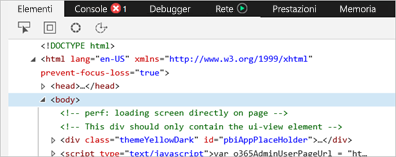
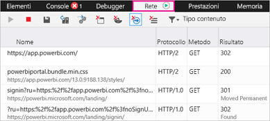
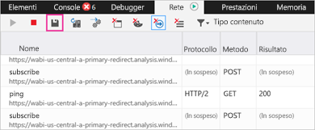

# Acquisire informazioni diagnostiche aggiuntive per Power BI

Questo articolo include istruzioni per raccogliere manualmente informazioni diagnostiche aggiuntive per il client Web di Power BI.

1. Passare a [Power BI](https://app.powerbi.com) con Microsoft Edge o Internet Explorer.

1. Premere **F12** per aprire gli strumenti di sviluppo di Microsoft Edge.

   

1. Selezionare la scheda **Network** (Rete). in cui sarà elencato il traffico già acquisito.

   

    È possibile:

    * Esplorare la finestra e riprodurre qualsiasi problema riscontrato.

    * Nascondere e visualizzare la finestra degli strumenti di sviluppo in qualsiasi momento durante la sessione premendo F12.

1. Per interrompere la profilatura della sessione, selezionare il quadrato rosso nella scheda **Rete** dell'area degli strumenti di sviluppo.

   

1. Selezionare l'icona del dischetto per esportare i dati come file di archivio HTTP (con estensione har).

   

1. Specificare un nome file e salvare il file HAR.

    Il file con estensione har contiene tutte le informazioni sulle richieste di rete tra la finestra del browser e Power BI, tra cui:

    * ID attività per ogni richiesta.

    * Timestamp preciso per ogni richiesta.

    * Eventuali informazioni sugli errori restituite al client.

    Questa traccia includerà anche i dati usati per popolare gli oggetti visivi presenti nella schermata.

1. È possibile fornire il file HAR al supporto per la revisione.

Altre domande? [Provare a rivolgersi alla community di Power BI](https://community.powerbi.com/)
