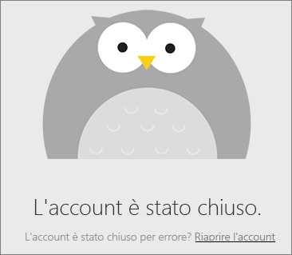
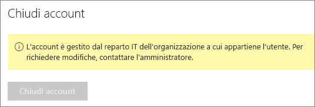

# Chiudere l'account Power BI

Se non si vuole più usare Power BI, è possibile chiudere l'account.  Dopo aver chiuso l'account non è possibile accedere a Power BI. Inoltre, come specificato nei criteri di conservazione dei dati delle Condizioni del servizio Power BI, tutti i dati del cliente caricati o creati in Power BI vengono eliminati. I dati non vengono mantenuti.

## Singoli utenti di Power BI

Se è stata effettuata l'iscrizione per Power BI come singolo utente, è possibile chiudere l'account dalla schermata **Impostazioni**.

1. In Power BI selezionare l'ingranaggio in alto a destra e quindi selezionare **Impostazioni**.

    

1. Nella scheda **Generale** selezionare **Chiudi account**.

    

1. Selezionare un motivo per chiudere l'account (1). È anche possibile fornire altre informazioni (2). Selezionare quindi **Chiudi account**.

    

1. Confermare che si vuole chiudere l'account.

    

    Viene visualizzato un messaggio di conferma della chiusura dell'account di Power BI. Se necessario, è possibile riaprire l'account da qui.

    

## Utenti del tenant gestito

Se si è stati iscritti a Power BI dall'organizzazione, contattare l'amministratore del tenant. Chiedergli di annullare l'assegnazione della licenza dall'account.

Altre domande? [Provare a rivolgersi alla community di Power BI](https://community.powerbi.com/)