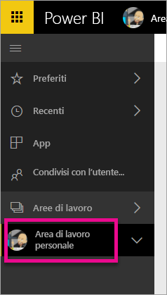
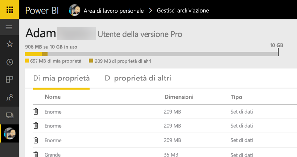
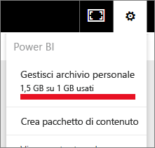

# Gestire l'archiviazione dei dati nelle aree di lavoro di Power BI

Informazioni su come gestire l'archiviazione dei dati nell'area di lavoro personale o in un'area di lavoro per poter continuare a pubblicare report e set di dati.

## Limiti di capacità

I limiti di archiviazione, sia l'area di lavoro personale sia per quella relativa alle app, variano a seconda che l'area di lavoro sia configurata con [capacità condivisa o Premium](../fundamentals/service-basic-concepts.md#capacities).

### Limiti della capacità condivisa
Per le aree di lavoro con capacità condivisa: 

- È previsto un limite di archiviazione per area di lavoro di 100 GB.
- Per le aree di lavoro delle app, l'utilizzo totale non può superare il limite di archiviazione del tenant di 10 GB moltiplicato per il numero di licenze Pro nel tenant.

### Limiti della capacità Premium
Per le aree di lavoro con capacità Premium:
- È previsto un limite di 100 TB per capacità Premium.
- Non esiste alcun limite di archiviazione per utente.

Per informazioni sulle altre funzionalità, vedere l'articolo sui [prezzi di Power BI](https://powerbi.microsoft.com/pricing).

## Dati inclusi nella capacità di archiviazione

Nel limite delle risorse di archiviazione dati rientrano i set di dati e i report di Excel personalizzati e gli elementi condivisi da altri utenti. I set di dati sono una delle origini dati caricate o a cui ci si è connessi. Queste origini dati includono i file di Power BI Desktop e le cartelle di lavoro di Excel in uso. Inoltre, sono inclusi nella capacità dei dati:

* Intervalli di Excel aggiunti a un dashboard.
* Visualizzazioni locali di Reporting Services aggiunte al dashboard di Power BI
* Immagini caricate.

La dimensione di un dashboard da condividere varia a seconda degli elementi aggiunti. Ad esempio, se si aggiungono elementi da due report che fanno parte di due set di dati diversi, le dimensioni includono entrambi i set di dati.

<a name="manage"/>

## Gestire gli elementi di cui si è proprietari

È possibile sapere quante risorse di archiviazione dati si stanno usando nell'account di Power BI e gestire l'account.

1. Per gestire lo spazio di archiviazione personale, passare ad **Area di lavoro personale** nel riquadro di spostamento.
   
    

2. Selezionare l'icona a forma di ingranaggio  nell'angolo in alto a destra \> **Gestisci archivio personale**.
   
    La barra in alto mostra il valore dello spazio di archiviazione utente usato rispetto al limite.
   
    
   
    I set di dati e i report sono separati in due schede:
   
    **Di mia proprietà:** questi report e set di dati sono stati caricati dall'utente nell'account di Power BI, inclusi i set di dati dei servizi, ad esempio di Salesforce e Dynamics CRM.  

    **Di proprietà di altri:** si tratta dei report e dei set di dati che altri utenti hanno condiviso con l'utente.
1. Per eliminare un set di dati o un report, selezionare l'icona del Cestino .

Tenere presente che potrebbero esserci utenti che usano report e dashboard basati su un set di dati. Se quindi si elimina il set di dati, i report e i dashboard non funzioneranno più.

## Gestire l'area di lavoro
1. Selezionare la freccia accanto ad **Aree di lavoro** \> selezionare il nome dell'area di lavoro.
   
    
2. Selezionare l'icona a forma di ingranaggio  nell'angolo in alto a destra \> **Gestisci archiviazione gruppo**.
   
    La barra in alto mostra il valore dello spazio di archiviazione del gruppo usato rispetto al limite.
   
    
   
    I set di dati e i report sono separati in due schede:
   
    **Di nostra proprietà:** questi report e set di dati caricati sono stati caricati dall'utente o da qualcun altro nell'account di Power BI del gruppo, inclusi i set di dati dei servizi, ad esempio di Salesforce e Dynamics CRM.

    **Di proprietà di altri:** si tratta dei report e dei set di dati che altri utenti hanno condiviso con il gruppo.

3. Per eliminare un set di dati o un report, selezionare l'icona del Cestino .
   
   > [!NOTE]
   > Tenere presente che nel gruppo potrebbero esserci utenti che usano report e dashboard basati su un set di dati. Se quindi si elimina il set di dati, i report e i dashboard non funzioneranno più.
   
   Tutti i membri di un'area di lavoro che hanno il ruolo di amministratore, membro o collaboratore sono autorizzati a eliminare dall'area i set di dati e i report.

## Limiti per i set di dati
È previsto un limite di 1 GB per ogni set di dati importato in Power BI. Se si è scelto di mantenere l'esperienza di Excel, invece di importare i dati, il limite per il set di dati sarà è di 250 MB.

## Conseguenze del raggiungimento di un limite
Quando si raggiunge il limite della capacità dei dati concesso, il servizio offre le dovute istruzioni. 

Quando si seleziona l'icona a forma di ingranaggio , viene visualizzata una barra rossa che indica che è stato superato il limite per la capacità dei dati.

Questo limite è indicato anche all'interno di **Gestisci archivio personale**.

 

 Quando si tenta di eseguire un'azione che comporta il raggiungimento di uno dei limiti, viene visualizzato un messaggio che informa che è stato superato il limite. È possibile [gestire](#manage) lo spazio di archiviazione in modo da ridurre la quantità di archiviazione e superare il limite.

 

 ## Passaggi successivi

 Altre domande? [Provare a rivolgersi alla community di Power BI](https://community.powerbi.com/)
