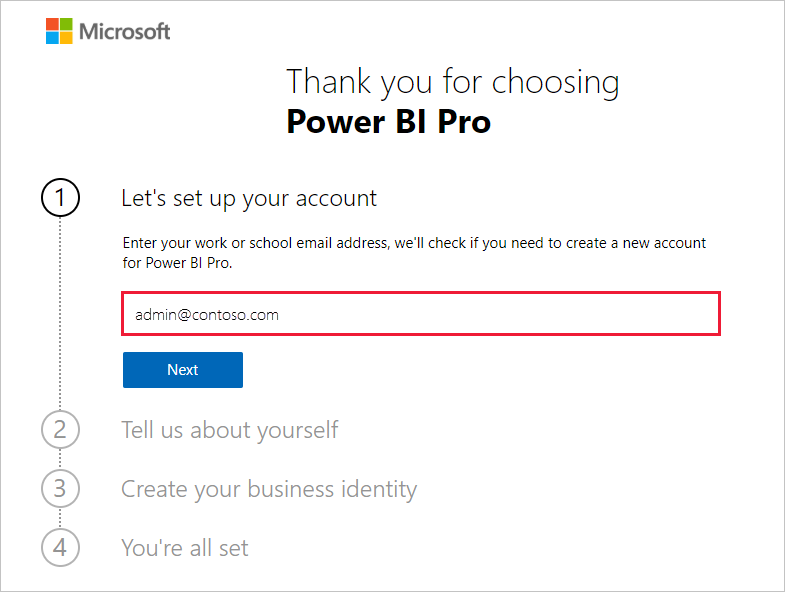
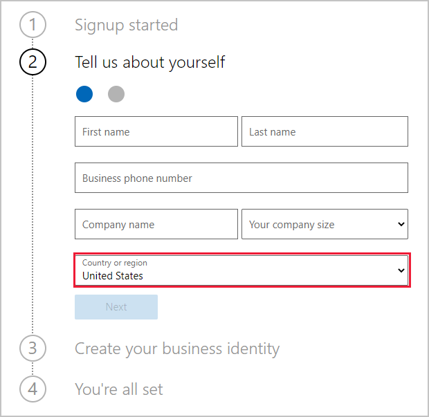

# Ottenere una sottoscrizione di Power BI per l'organizzazione

Gli amministratori possono iscriversi a Power BI tramite la pagina **Acquisto di servizi** dell'interfaccia di amministrazione di Microsoft 365. Quando un amministratore si iscrive a Power BI, può poi assegnare le licenze agli utenti che devono avere accesso al servizio.

Gli utenti nell'organizzazione possono iscriversi a Power BI tramite il sito Web di Power BI. Agli utenti dell'organizzazione che si iscrivono a Power BI viene assegnata automaticamente una licenza di Power BI. Se si vuole disattivare questa funzionalità self-service, seguire la procedura descritta in [Abilitare o disabilitare l'iscrizione e l'acquisto in modalità self-service](service-admin-disable-self-service.md).

## Iscriversi tramite Microsoft 365

Un amministratore globale o un amministratore della fatturazione può ottenere una sottoscrizione di Power BI per l'organizzazione. Per altre informazioni, vedere [Utenti autorizzati ad acquistare e assegnare le licenze](service-admin-licensing-organization.md#who-can-purchase-and-assign-licenses).

> [!NOTE]
>
> La sottoscrizione E5 di Microsoft 365 include già licenze di Power BI Pro. Per informazioni su come gestire le licenze, vedere [Visualizzare e gestire le licenze utente](service-admin-manage-licenses.md).
>
>

Seguire questa procedura per acquistare licenze di Power BI Pro nell'interfaccia di amministrazione di Microsoft 365:

1. Accedere all'[interfaccia di amministrazione di Microsoft 365](https://admin.microsoft.com).

2. Nel menu di spostamento selezionare **Fatturazione** > **Acquisto di servizi**.
  
   

3. Cercare o scorrere per trovare la sottoscrizione da acquistare. **Power BI** è disponibile in **Other categories that might interest you** (Altre categorie che potrebbero interessare) nella parte inferiore della pagina. Selezionare il collegamento per visualizzare le sottoscrizioni di Power BI disponibili per l'organizzazione.

4. Selezionare un'offerta, ad esempio Power BI Pro.

5. Nella pagina **Acquisto di servizi** selezionare **Acquista**. Se non è già stata usata in precedenza, è possibile avviare una sottoscrizione di valutazione gratuita di Power BI Pro, che include 25 licenze e dura un mese.

   

6. Scegliere **Pagamento mensile** o **Pagamento per un intero anno** in base a come si vuole pagare.

7. In **How many users do you want?** (Numero di utenti) immettere il numero di licenze da acquistare, quindi selezionare **Procedi al pagamento** per completare la transazione.

8. Per verificare l'acquisto, passare a **Fatturazione** > **Prodotti e servizi** e cercare **Power BI Pro**.

Per altre informazioni sul modo in cui l'organizzazione può verificare e acquistare il servizio Power BI, vedere [Power BI nell'organizzazione](https://docs.microsoft.com/microsoft-365/admin/misc/power-bi-in-your-organization?view=o365-worldwide).

## Altri modi per ottenere Power BI per l'organizzazione

Se non si è già abbonati a Microsoft 365, attenersi alla procedura seguente per ottenere una versione di valutazione di Power BI Pro per l'organizzazione. In alternativa è possibile [iscriversi per una nuova versione di valutazione di Microsoft 365](service-admin-signing-up-for-power-bi-with-a-new-office-365-trial.md) e quindi aggiungere Power BI seguendo la procedura descritta nella sezione precedente.

Per iscriversi per una sottoscrizione di Power BI, è necessario un account aziendale o dell'istituto di istruzione. Non sono supportati gli indirizzi di posta elettronica forniti dai provider di telecomunicazioni o di servizi di posta elettronica commerciali. Se non si ha un account aziendale o dell'istituto di istruzione, è possibile crearne uno durante l'iscrizione.

Seguire questa procedura per iscriversi:

1. Passare alla [pagina di iscrizione per Power BI Pro](https://signup.microsoft.com/create-account/signup?OfferId=d59682f3-3e3b-4686-9c00-7c7c1c736085&ali=1&products=d59682f3-3e3b-4686-9c00-7c7c1c736085). 

2. Immettere l'indirizzo di posta elettronica aziendale o dell'istituto di istruzione e quindi selezionare **Next** (Avanti). È possibile immettere un indirizzo di posta elettronica che non è considerato un indirizzo di posta elettronica aziendale o dell'istituto di istruzione. Verrà configurato automaticamente un nuovo account quando si crea l'identità aziendale.

   

3. Viene eseguito un controllo rapido per verificare se è necessario creare un nuovo account. Selezionare **Set up account** (Configura account) per continuare con il processo di iscrizione.

   > [!NOTE]
   >Se l'indirizzo di posta elettronica è già in uso con un altro servizio Microsoft, è possibile selezionare **Sign in** (Accedi) o **Create a new account instead** (Crea invece un nuovo account). Se si sceglie di creare un nuovo account, continuare a seguire questa procedura per la configurazione.
>
>
 
4. Completare il modulo per fornire informazioni sull'utente. Assicurarsi di scegliere il paese o l'area corretti. Il paese selezionato determina la posizione in cui vengono archiviati i dati, come illustrato in [Come determinare la posizione del tenant di Power BI](service-admin-where-is-my-tenant-located.md#how-to-determine-where-your-power-bi-tenant-is-located).

   

5. Selezionare **Next** (Avanti). Microsoft dovrà inviare un codice di verifica per verificare l'identità dell'utente. Fornire un numero di telefono a cui è possibile inviare un SMS o una chiamata. Selezionare quindi **Send Verification Code** (Invia codice di verifica).

6. Immettere il codice di verifica e quindi continuare con **Create your business identity** (Crea identità aziendale).

   

    Immettere un nome breve per l'azienda e verificare che sia disponibile. Questo nome breve verrà usato per creare il nome dell'organizzazione nel data center come sottodominio di onmicrosoft.com. È possibile aggiungere il proprio dominio aziendale in un secondo momento. Non è necessario preoccuparsi se il nome breve desiderato risulta già in uso. È probabile che un utente con un nome aziendale simile abbia scelto lo stesso nome breve. È sufficiente provare una variante diversa. Selezionare **Next** (Avanti).
    
7. Creare l'ID utente e la password per accedere al proprio account. Selezionare **Sign up** (Iscrivi) per completare l'operazione.

L'account creato è ora l'amministratore globale di un nuovo tenant di valutazione di Power BI Pro. È possibile accedere all'[interfaccia di amministrazione di Microsoft 365](https://admin.microsoft.com) per aggiungere altri utenti, configurare un dominio personalizzato, acquistare altri servizi e gestire la sottoscrizione di Power BI.

## Passaggi successivi

- [Visualizzare e gestire le licenze utente](service-admin-manage-licenses.md)
- [Abilitare o disabilitare l'iscrizione e l'acquisto in modalità self-service](service-admin-disable-self-service.md)
- [Documentazione sulle sottoscrizioni aziendali e sulla fatturazione](https://docs.microsoft.com/microsoft-365/commerce/?view=o365-worldwide)
