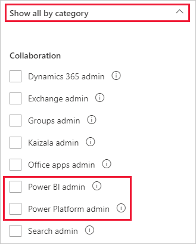

# <a name="understanding-power-bi-service-administrator-roles"></a>Informazioni sui ruoli di amministratore del servizio Power BI

Per amministrare un tenant di Power BI, è necessario appartenere a uno dei ruoli seguenti: Amministratore di Power BI, Amministratore di Power Platform o Amministratore globale di Microsoft 365. Gli amministratori della gestione utenti di Microsoft 365 assegnano gli utenti ai ruoli di amministratore di Power BI o di amministratore di Power Platform nell'interfaccia di amministrazione di Microsoft 365 o tramite uno script di PowerShell. Per altre informazioni, vedere [Assegnare i ruoli agli account utente con Office 365 PowerShell](/office365/enterprise/powershell/assign-roles-to-user-accounts-with-office-365-powershell).

Gli utenti nei ruoli di amministratore di Power BI e amministratore di Power Platform hanno il controllo completo su un tenant di Power BI e sulle relative funzionalità di amministrazione, tranne che sulle licenze. Gli utenti a cui viene assegnato questo ruolo possono accedere al [portale di amministrazione di Power BI](service-admin-portal.md). Lì hanno accesso alle metriche di utilizzo a livello di tenant e possono controllare l'utilizzo delle funzionalità di Power BI a livello di tenant. Questi ruoli di amministratore sono ideali per gli utenti che devono avere accesso al portale di amministrazione di Power BI, senza concedere a tali utenti l'accesso amministrativo completo per Microsoft 365.

> [!NOTE]
> Nella documentazione di Power BI il termine "amministratore di Power BI" si riferisce agli utenti con i ruoli di amministratore di Power BI o di amministratore di Power Platform. La documentazione indica in modo chiaro quando per un'attività è richiesto il ruolo di amministratore globale di Microsoft 365.

## <a name="limitations-and-considerations"></a>Limitazioni e considerazioni

I ruoli di amministratore del servizio Power BI e di amministratore di Power Platform non forniscono le capacità seguenti:

* Possibilità di modificare gli utenti e le licenze nell'interfaccia di amministrazione di Microsoft 365.

* Accesso ai log di controllo. Per altre informazioni, vedere [Tenere traccia delle attività degli utenti in Power BI](service-admin-auditing.md).

Queste funzionalità richiedono il ruolo di amministratore globale di Microsoft 365.

## <a name="assign-users-to-an-admin-role-in-the-microsoft-365-admin-center"></a>Assegnare gli utenti a un ruolo di amministratore nell'interfaccia di amministrazione di Microsoft 365

Per assegnare utenti a un ruolo di amministratore nell'interfaccia di amministrazione di Microsoft 365, seguire questa procedura.

1. Nell'[interfaccia di amministrazione di Microsoft 365](https://portal.office.com/adminportal/home#/homepage) selezionare **Utenti** > **Utenti attivi**.

    

1. Selezionare l'utente a cui si vuole assegnare il ruolo.

1. In **Ruoli** selezionare **Gestisci ruoli**.

    

1. Espandere **Mostra tutti per categoria** e quindi selezionare **Amministratore di Power BI** o **Amministratore di Power Platform**.

    

1. Selezionare **Save changes** (Salva modifiche).

## <a name="assign-users-to-the-admin-role-with-powershell"></a>Assegnare gli utenti al ruolo di amministratore con PowerShell

È anche possibile assegnare utenti ai ruoli usando PowerShell. Gli utenti vengono gestiti in Azure Active Directory (Azure AD). Se non si ha già il modulo Azure AD PowerShell, [scaricare e installare la versione più recente](https://www.powershellgallery.com/packages/AzureAD/).

1. In primo luogo connettersi ad Azure AD:
   ```
   PS C:\Windows\system32> Connect-AzureAD
   ```

1. Quindi ottenere il valore **ObjectId** per il ruolo **Amministratore del servizio Power BI**. È possibile eseguire [Get-AzureADDirectoryRole](/powershell/module/azuread/get-azureaddirectoryrole) per ottenere il valore **ObjectId**.

    ```
    PS C:\Windows\system32> Get-AzureADDirectoryRole

    ObjectId                             DisplayName                        Description
    --------                             -----------                        -----------
    00f79122-c45d-436d-8d4a-2c0c6ca246bf Power BI Service Administrator     Full access in the Power BI Service.
    250d1222-4bc0-4b4b-8466-5d5765d14af9 Helpdesk Administrator             Helpdesk Administrator has access to perform..
    3ddec257-efdc-423d-9d24-b7cf29e0c86b Directory Synchronization Accounts Directory Synchronization Accounts
    50daa576-896c-4bf3-a84e-1d9d1875c7a7 Company Administrator              Company Administrator role has full access t..
    6a452384-6eb9-4793-8782-f4e7313b4dfd Device Administrators              Device Administrators
    9900b7db-35d9-4e56-a8e3-c5026cac3a11 AdHoc License Administrator        Allows access manage AdHoc license.
    a3631cce-16ce-47a3-bbe1-79b9774a0570 Directory Readers                  Allows access to various read only tasks in ..
    f727e2f3-0829-41a7-8c5c-5af83c37f57b Email Verified User Creator        Allows creation of new email verified users.
    ```

    In questo caso, il valore **ObjectId** del ruolo è 00f79122-c45d-436d-8d4a-2c0c6ca246bf.

1. Ottenere quindi il valore **ObjectId** dell'utente. Per trovarlo, eseguire [Get-AzureADUser](/powershell/module/azuread/get-azureaduser).

    ```
    PS C:\Windows\system32> Get-AzureADUser -ObjectId 'tim@contoso.com'

    ObjectId                             DisplayName UserPrincipalName      UserType
    --------                             ----------- -----------------      --------
    6a2bfca2-98ba-413a-be61-6e4bbb8b8a4c Tim         tim@contoso.com        Member
    ```

1. Per aggiungere il membro al ruolo, eseguire [Add-AzureADDirectoryRoleMember](/powershell/module/azuread/add-azureaddirectoryrolemember).

    | Parametro | Descrizione |
    | --- | --- |
    | ObjectId |ID oggetto del ruolo. |
    | RefObjectId |ID oggetto dei membri. |

    ```powershell
    Add-AzureADDirectoryRoleMember -ObjectId 00f79122-c45d-436d-8d4a-2c0c6ca246bf -RefObjectId 6a2bfca2-98ba-413a-be61-6e4bbb8b8a4c
    ```

## <a name="next-steps"></a>Passaggi successivi

[Amministrazione di Power BI nell'organizzazione](service-admin-administering-power-bi-in-your-organization.md)  
[Portale di amministrazione di Power BI](service-admin-portal.md)  

Altre domande? [Provare a rivolgersi alla community di Power BI](https://community.powerbi.com/)