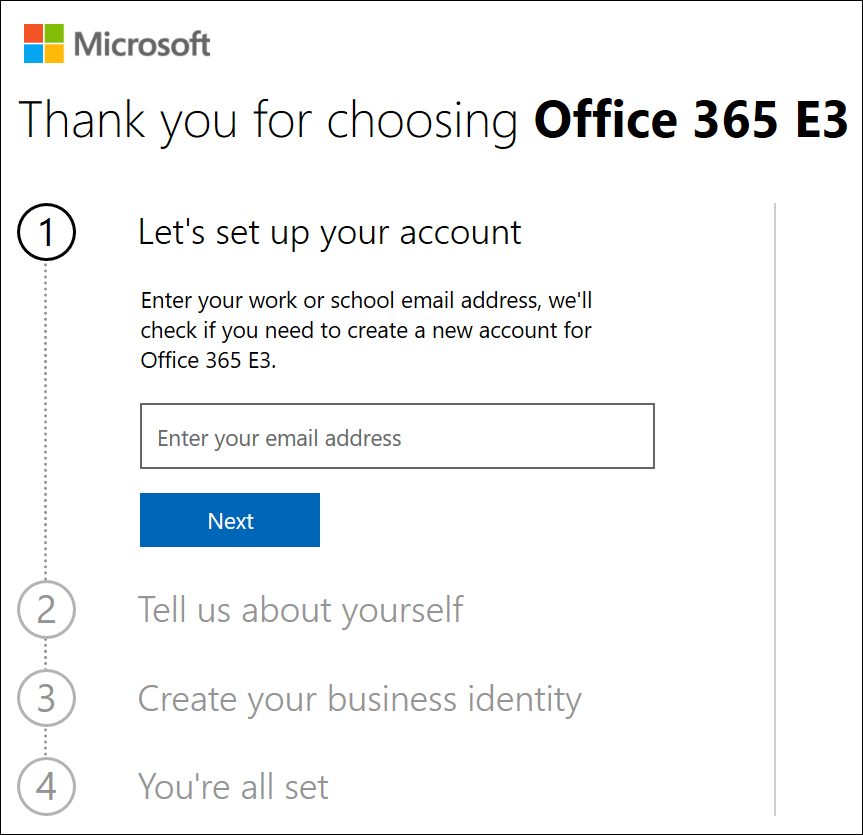
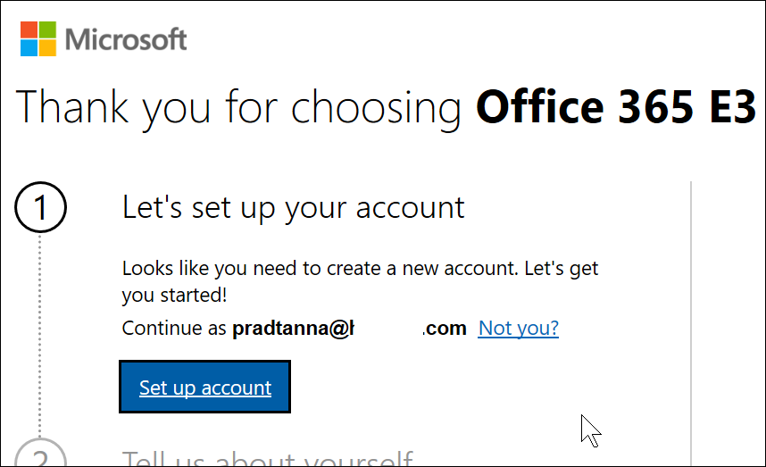
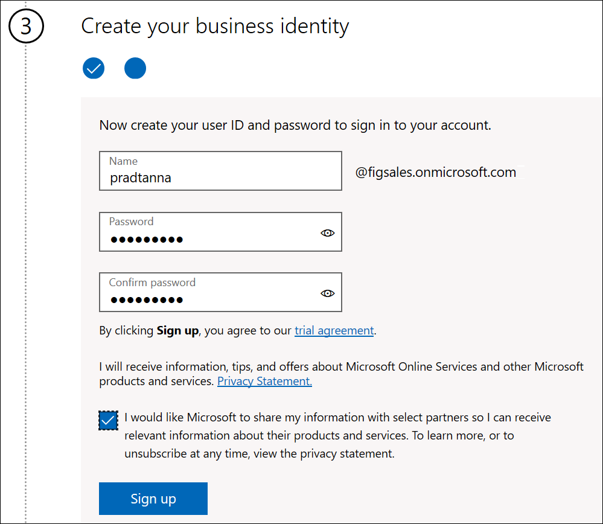
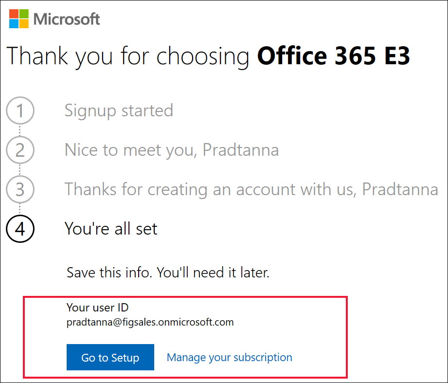

# Iscrizione a Power BI con una nuova versione di valutazione di Microsoft 365

Questo articolo descrive un modo alternativo per iscriversi a Power BI se non si ha già un account di posta elettronica aziendale o dell'istituto di istruzione.

Se non si riesce ad effettuare l'iscrizione a Power BI con il proprio indirizzo di posta elettronica, verificare prima di tutto che si tratti di un [indirizzo di posta elettronica utilizzabile con Power BI](../fundamentals/service-self-service-signup-for-power-bi.md#supported-email-addresses). Se l'iscrizione non riesce, iscriversi per ottenere una versione di valutazione di Microsoft 365 e creare un account aziendale. Usare quindi il nuovo account aziendale per iscriversi al servizio Power BI. Sarà possibile usare Power BI anche dopo la scadenza della versione di valutazione di Microsoft 365.

> [!NOTE]
> Office 365 è stato recentemente rinominato in Microsoft 365. Finché non saranno stati aggiornati tutti gli articoli, è possibile che venga ancora usato il nome Office 365.

## Iscriversi per una versione di valutazione di Microsoft 365 di Office
Iscriversi per una versione di valutazione di Microsoft 365 nel [sito Web Microsoft 365](https://www.microsoft.com/microsoft-365/business/compare-more-office-365-for-business-plans). Se non è già disponibile un account, sarà possibile crearne uno in modo guidato. Poiché gli account di posta elettronica commerciali (ad esempio Hotmail e Gmail) non funzionano con Microsoft 365, verrà creato un nuovo account.  L'account di posta elettronica sarà simile a *zalan@onmicrosoft.com* .

Se si seleziona **Office 365 E5**, la versione di valutazione includerà Power BI Pro. La versione di valutazione di Power BI Pro scadrà contemporaneamente alla versione di valutazione di Office 365 E5, attualmente valida per 30 giorni. Se invece si seleziona **Office 365 E3**, sarà possibile iscriversi per Power BI come utente *gratuito* ed eseguire l'aggiornamento alla versione **Pro** per un periodo di valutazione di 60 giorni. 

1. Immettere l'indirizzo di posta elettronica. Microsoft indicherà se l'indirizzo di posta elettronica potrà essere usato con Microsoft 365 o se sarà necessario crearne uno nuovo.  

    Se è necessario un nuovo indirizzo di posta elettronica, sarà possibile crearne uno in modo guidato. Primo passaggio: creazione di un nuovo account. Selezionare **Set up account** (Configura account).

    

2. Immettere i dettagli relativi al nuovo account.

    

3. Creare il nuovo indirizzo di posta elettronica e la nuova password. Creare un nuovo nome di accesso simile a you@yourcompany.onmicrosoft.com. Si tratta dell'account di accesso che verrà usato con il nuovo account di Office 365 e con Power BI.

    

4. L'operazione è stata completata.  Si dispone ora di un indirizzo di posta elettronica che può essere usato per iscriversi a Power BI. Vedere [Iscriversi a Power BI come utente singolo](../service-self-service-signup-for-power-bi.md).

     

    Potrebbe essere necessario attendere che il nuovo tenant venga creato.

## Considerazioni importanti

In caso di problemi di accesso con il nuovo account, provare a usare una sessione del browser privata.

Con questo metodo di iscrizione viene creato un nuovo tenant aziendale di cui l'utente diventa amministratore. Per altre informazioni, vedere [Che cos'è l'amministrazione di Power BI?](service-admin-administering-power-bi-in-your-organization.md) È possibile aggiungere al tenant nuovi utenti con cui condividere elementi, come descritto nella [documentazione sull'amministrazione di Microsoft 365](https://support.office.com/article/Add-users-individually-to-Office-365---Admin-Help-1970f7d6-03b5-442f-b385-5880b9c256ec).

## Passaggi successivi

[Che cos'è l'amministrazione di Power BI?](service-admin-administering-power-bi-in-your-organization.md)  
[Gestione delle licenze di Power BI nell'organizzazione](service-admin-licensing-organization.md)  
[Iscrizione a Power BI come utente singolo](../fundamentals/service-self-service-signup-for-power-bi.md)

Altre domande? [Provare a rivolgersi alla community di Power BI](https://community.powerbi.com/)
