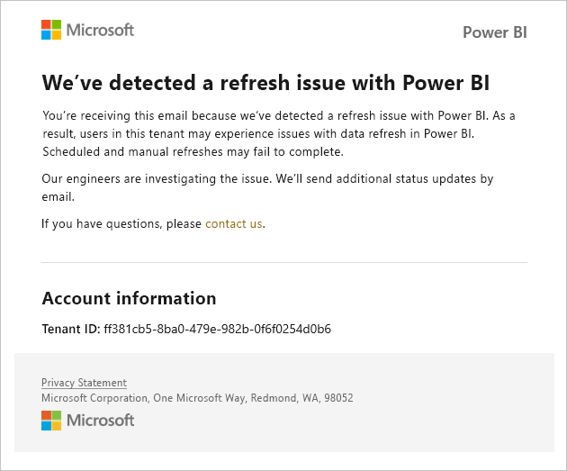
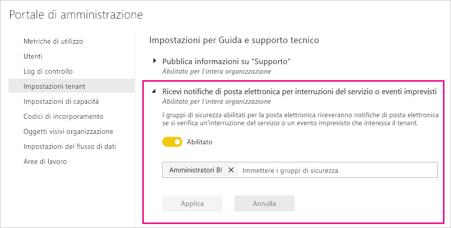

# Notifiche di interruzione del servizio

Avere informazioni dettagliate sulla disponibilità delle applicazioni aziendali critiche è fondamentale. Power BI offre notifiche per gli eventi imprevisti, in modo che sia possibile ricevere messaggi di posta elettronica in caso di interruzione o riduzione del servizio. Nonostante il fatto che nel 99,9% dei casi il contratto di servizio (SLA) di Power BI riduca al minimo l'incidenza di questi eventi, è necessario assicurarsi di essere sempre informati. Lo screenshot seguente illustra il tipo di messaggio di posta elettronica che verrà visualizzato se si abilitano le notifiche:

Attualmente i messaggi di posta elettronica vengono inviati per gli _scenari di affidabilità_ seguenti:

- Affidabilità apertura report
- Affidabilità aggiornamento modello
- Affidabilità aggiornamento query

Vengono inviate notifiche quando si verifica un _ritardo prolungato_ per operazioni come l'apertura di report, l'aggiornamento di set di dati o l'esecuzione di query. Dopo la risoluzione di un evento imprevisto, si riceve un messaggio di posta elettronica di completamento.

> [!NOTE]
> Questa funzionalità attualmente è disponibile solo per capacità dedicate in Power BI Premium. Non è disponibile per la capacità condivisa o incorporata.

## Notifiche di capacità e affidabilità

Quando per una capacità Power BI Premium si riscontrano periodi prolungati di utilizzo elevato delle risorse con potenziali effetti sull'affidabilità, viene inviato un messaggio di posta elettronica di notifica. Esempi di questi effetti includono ritardi notevoli per operazioni quali l'apertura di un report, l'aggiornamento del set di dati e le esecuzioni di query. 

Il messaggio di posta elettronica di notifica fornisce informazioni sul motivo dell'utilizzo elevato delle risorse, incluse le seguenti:

* ID del set di dati responsabile
* Tipo di operazione
* Tempo CPU associato all'utilizzo elevato delle risorse

Power BI invia notifiche tramite posta elettronica anche quando viene rilevato un sovraccarico per una capacità Power BI Premium. Il messaggio di posta elettronica spiega il motivo probabile del sovraccarico, le operazioni che hanno generato il carico nei 10 minuti precedenti e la quantità di carico generata da ciascuna operazione. 

Se è disponibile più di una capacità Premium, il messaggio di posta elettronica include informazioni su tali capacità durante il periodo di sovraccarico, quindi è possibile provare a trasferire le aree di lavoro contenenti elementi con utilizzo intensivo di risorse alle capacità con il carico minimo.

Le notifiche di posta elettronica per il sovraccarico vengono inviate solo quando viene attivata una soglia di sovraccarico. Non si riceverà un secondo messaggio di posta elettronica quando il carico su tale capacità Premium torna a livelli normali.

La figura seguente mostra un messaggio di posta elettronica di notifica di esempio:

## Abilitare le notifiche

Un amministratore di tenant di Power BI abilita le notifiche nel portale di amministrazione:

1. Identificare o creare un gruppo di sicurezza abilitato per la posta elettronica che deve ricevere le notifiche.

1. Nel portale di amministrazione selezionare **Impostazioni tenant**. In **Impostazioni per Guida e supporto tecnico** espandere **Ricevi notifiche di posta elettronica per interruzioni del servizio o eventi imprevisti**.

1. Abilitare le notifiche, immettere un gruppo di sicurezza e selezionare **Applica**.

    

> [!NOTE]
> Power BI invia notifiche dall'account no-reply-powerbi@microsoft.com. Assicurarsi che l'account sia presente nell'elenco di elementi consentiti in modo che le notifiche non finiscano in una cartella di posta indesiderata.

## Passaggi successivi

[Opzioni di supporto per Power BI Pro e Power BI Premium](service-support-options.md)

Altre domande? [Provare la community di Power BI](https://community.powerbi.com/)
