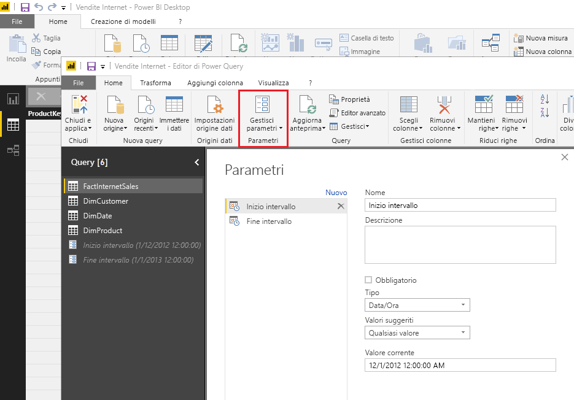
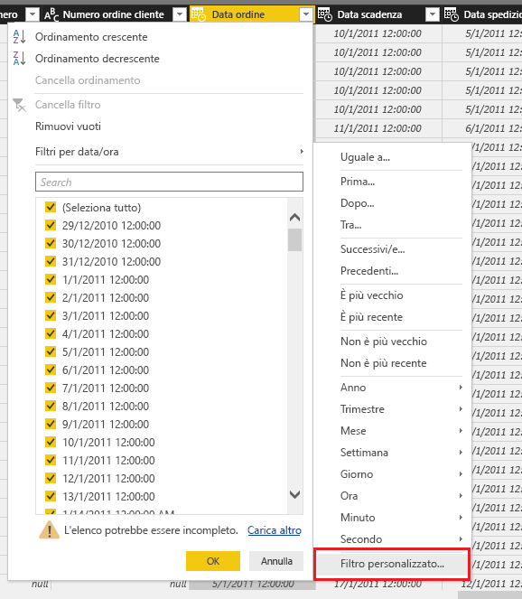
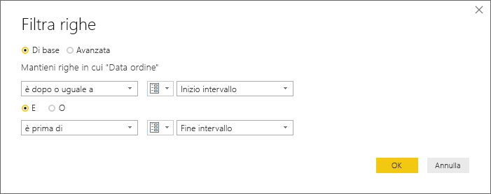
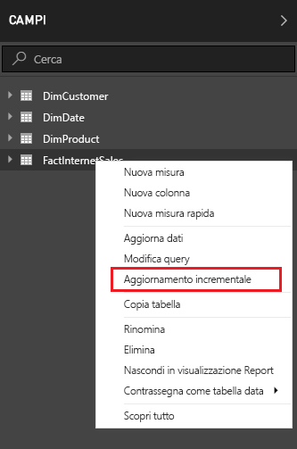

# <a name="incremental-refresh-in-power-bi"></a>Aggiornamento incrementale in Power BI

L'aggiornamento incrementale abilita set di dati molto grandi in Power BI, con i seguenti vantaggi:

> [!div class="checklist"]
> * **Gli aggiornamenti sono più rapidi**: devono essere aggiornati solo i dati che sono stati cambiati. Ad esempio, è sufficiente aggiornare gli ultimi cinque giorni di un set di dati di 10 anni.
> * **Gli aggiornamenti sono più affidabili**: non è più necessario mantenere connessioni con esecuzione prolungata a sistemi di origine volatili.
> * **Il consumo di risorse risulta ridotto**: l'aggiornamento di una quantità di dati inferiore riduce l'uso complessivo di memoria e di altre risorse.

> [!NOTE]
> L'aggiornamento incrementale è ora disponibile per Power BI Pro e Premium e per sottoscrizioni e set di dati condivisi. 

## <a name="configure-incremental-refresh"></a>Configurare l'aggiornamento incrementale

I criteri di aggiornamento incrementale sono definiti in Power BI Desktop e vengono applicati dopo la pubblicazione nel servizio Power BI.


### <a name="filter-large-datasets-in-power-bi-desktop"></a>Filtrare grandi set di dati in Power BI Desktop

I set di dati di grandi dimensioni, contenenti anche miliardi di righe, potrebbero non essere gestibili in un modello di Power BI Desktop, perché il file PBIX è limitato dalle risorse di memoria disponibili nel computer desktop. Questi set di dati vengono quindi in genere filtrati al momento dell'importazione. Questo tipo di filtro si applica sia che si usi l'aggiornamento incrementale o meno. Per l'aggiornamento incrementale, il filtro viene applicato tramite parametri data/ora di Power Query.

#### <a name="rangestart-and-rangeend-parameters"></a>Parametri RangeStart e RangeEnd

Per l'aggiornamento incrementale,i set di dati vengono filtrati tramite i parametri data/ora di Power Query **RangeStart** e **RangeEnd**, i cui nomi sono riservati e fanno distinzione tra maiuscole e minuscole. Questi parametri vengono usati per filtrare i dati importati in Power BI Desktop, nonché per partizionare in modo dinamico i dati in intervalli dopo la pubblicazione nel servizio Power BI. I valori dei parametri vengono sostituiti dal servizio per ogni partizione a cui viene applicato il filtro. Non è necessario definirli nelle impostazioni del set di dati nel servizio. Dopo essere stati pubblicati, i valori dei parametri vengono automaticamente sottoposti a override dal servizio Power BI.

Per definire i parametri con valori predefiniti, nell'editor di Power Query selezionare **Gestisci parametri**.



Dopo aver definito i parametri è possibile applicare il filtro, selezionando l'opzione di menu **Filtro personalizzato** per una colonna.



Verificare che vengano filtrate righe in cui il valore della colonna *è dopo o uguale a* **RangeStart** e *prima di* **RangeEnd**. Altre combinazioni di filtro possono comportare il conteggio doppio delle righe.



> [!IMPORTANT]
> Verificare che le query abbiano un criterio uguale a (= ) in **RangeStart** o **RangeEnd**, ma non in entrambi. Se il criterio uguale a (=) è presente in entrambi i parametri, una riga può soddisfare le condizioni per due partizioni, il che potrebbe causare la duplicazione dei dati nel modello. Ad esempio,  
> \#"Filtered Rows" = Table.SelectRows(dbo_Fact, each [OrderDate] **>= RangeStart** and [OrderDate] **<= RangeEnd**) potrebbe causare dati duplicati.

> [!TIP]
> Il tipo di dati dei parametri deve essere data/ora, ma è possibile convertire i parametri in modo da soddisfare i requisiti dell'origine dati. Ad esempio, la funzione Power Query seguente converte un valore data/ora per renderlo simile a una chiave surrogata di tipo intero con formato *aaaammgg*, comune nei data warehouse. La funzione può essere chiamata dal passaggio di applicazione del filtro.
>
> `(x as datetime) => Date.Year(x)*10000 + Date.Month(x)*100 + Date.Day(x)`

Selezionare **Chiudi e applica** nell'Editor di Power Query. In Power BI Desktop viene reso disponibile un subset del set di dati.

#### <a name="filter-date-column-updates"></a>Filtrare gli aggiornamenti della colonna data

Il filtro sulla colonna data viene usato per partizionare in modo dinamico i dati in intervalli nel servizio Power BI. L'aggiornamento incrementale non è progettato per supportare i casi in cui la colonna data filtrata viene aggiornata nel sistema di origine. Un aggiornamento viene interpretato come un inserimento e un'eliminazione, non come un aggiornamento effettivo. Se l'eliminazione viene eseguita nell'intervallo cronologico e non nell'intervallo incrementale, non verrà rilevata. Ciò può causare errori di aggiornamento dati dovuti a conflitti di partizione-chiave.

#### <a name="query-folding"></a>Riduzione delle query

È importante eseguire la propagazione dei filtri di partizione nel sistema di origine quando vengono inviate query per operazioni di aggiornamento. La propagazione dei filtri implica che l'origine dati supporti la "riduzione delle query". La maggior parte delle origini dati che supportano le query SQL supporta la riduzione delle query. Origini dati quali file flat, BLOB e feed Web, tuttavia, in genere non la supportano. Nei casi in cui il filtro non è supportato dal back-end dell'origine dati, la propagazione non risulta possibile. In questi casi, il motore Mashup compensa e applica il filtro localmente. Questa operazione può richiedere il recupero del set di dati completo dall'origine dati. L'aggiornamento incrementale può pertanto risultare molto lento e il processo può esaurire le risorse nel servizio Power BI o nel gateway dati locale, se usato.

Dal momento che ogni origine dati può avere un livello di supporto della riduzione delle query diverso, è consigliabile eseguire una verifica per assicurarsi che la logica di filtro sia inclusa nelle query di origine. Per semplificare questa operazione, Power BI Desktop tenta di eseguire questa verifica automaticamente. Se non riesce, viene visualizzato un avviso nella finestra di dialogo dell'aggiornamento incrementale al momento della definizione dei criteri di quest'ultimo. Le origini dati basate su SQL, ad esempio SQL, Oracle e Teradata, possono basarsi su questo avviso. Altre origini dati possono essere in grado di effettuare la verifica solo se eseguono la traccia delle query. Se Power BI Desktop non è in grado eseguire la conferma, viene visualizzato l'avviso seguente. Se viene visualizzato questo avviso e si vuole verificare che sia in corso la riduzione delle query necessaria, è possibile usare la funzionalità di diagnostica delle query o tracciare le query ricevute dal database di origine.

 

### <a name="define-the-refresh-policy"></a>Definire i criteri di aggiornamento

L'aggiornamento incrementale è disponibile nel menu di scelta rapida per le tabelle, salvo per i modelli di connessione dinamica.



#### <a name="incremental-refresh-dialog"></a>Finestra di dialogo Aggiornamento incrementale

Viene visualizzata la finestra di dialogo Aggiornamento incrementale. Usare l'interruttore per abilitare la finestra di dialogo.


> [!NOTE]
> Se l'espressione di Power Query per la tabella non fa riferimento ai parametri con i nomi riservati, l'interruttore è disattivato.

Il testo dell'intestazione illustra quanto segue:

- I criteri di aggiornamento sono definiti in Power BI Desktop e vengono applicati dalle operazioni di aggiornamento nel servizio.

- Se si è in grado di scaricare il file PBIX contenente criteri di aggiornamento incrementale dal servizio Power BI, non è possibile aprire tale file in Power BI Desktop. Il supporto di questa funzionalità potrebbe essere disponibile in futuro, ma si tenga presente che questi set di dati possono diventare così grandi che la loro gestione (download e apertura) in un computer desktop tipico può causare problemi.

#### <a name="refresh-ranges"></a>Intervalli di aggiornamento

L'esempio seguente definisce un criterio di aggiornamento per archiviare i dati di cinque anni di calendario completi e i dati dell'anno corrente fino alla data attuale, nonché per aggiornare in modo incrementale 10 giorni di dati. La prima operazione di aggiornamento carica i dati cronologici. Gli aggiornamenti successivi sono incrementali e, se pianificati per l'esecuzione giornaliera, eseguono le operazioni seguenti:

- Aggiungere un nuovo giorno di dati.

- Aggiornare gli ultimi 10 giorni inclusa la data corrente.

- Rimuovere gli anni di calendario con più di cinque anni dalla data corrente. Se ad esempio la data corrente è 1 gennaio 2019, l'anno 2013 viene rimosso.

Il primo aggiornamento nel servizio Power BI può richiedere più tempo perché importa tutti i cinque anni di calendario completi. È probabile che gli aggiornamenti successivi vengano completati in tempi molto più ridotti.


#### <a name="current-date"></a>Data corrente

La *data corrente* è basata sulla data di sistema al momento dell'aggiornamento. Se l'aggiornamento pianificato è abilitato per il set di dati nel servizio Power BI, per la determinazione della data corrente verrà considerato il fuso orario specificato. Sia gli aggiornamenti pianificati sia quelli richiamati manualmente osservano il fuso orario, se disponibile. Ad esempio, un aggiornamento che si verifica alle ore 20.00 del Pacifico (Stati Uniti e Canada) con il fuso orario specificato determinerà la data corrente in base al fuso orario del Pacifico e non all'orario GMT (che altrimenti sarebbe il giorno successivo).


> [!NOTE]
> La definizione di questi intervalli potrebbe essere sufficiente. In tal caso passare direttamente al passaggio relativo alla pubblicazione riportato di seguito. Gli altri elenchi a discesa sono destinati a funzionalità avanzate.

### <a name="advanced-policy-options"></a>Opzioni dei criteri avanzate

#### <a name="detect-data-changes"></a>Rileva modifiche ai dati

L'aggiornamento incrementale di 10 giorni è più efficiente rispetto all'aggiornamento completo di cinque anni. È tuttavia possibile ottenere un'efficienza ancora maggiore. Se si seleziona la casella di controllo **Rileva modifiche ai dati**, è possibile selezionare una colonna di data/ora e usarla per identificare e aggiornare solo i giorni in cui i dati vengono modificati. Questa opzione presuppone l'esistenza di una colonna di questo tipo (usata in genere per operazioni di controllo) nel sistema di origine. **Questa non deve essere la stessa colonna usata per partizionare i dati con i parametri RangeStart/RangeEnd.** Il valore massimo di questa colonna viene valutato per ciascuno dei periodi dell'intervallo incrementale. Se tale valore non è cambiato dall'ultimo aggiornamento, non è necessario aggiornare il periodo. Nell'esempio, questa opzione può ridurre ulteriormente i giorni sottoposti ad aggiornamento incrementale da 10 a circa due.


> [!TIP]
> La struttura corrente richiede che la colonna per il rilevamento delle modifiche ai dati sia persistente e memorizzata nella cache. Può essere utile considerare una delle tecniche seguenti per ridurre la cardinalità e il consumo di memoria.
>
> Mantenere solo il valore massimo della colonna al momento dell'aggiornamento, ad esempio con una funzione di Power Query.
>
> Ridurre la precisione a un livello accettabile in base ai requisiti di frequenza di aggiornamento.
>
> Definire una query personalizzata per rilevare le modifiche ai dati usando l'endpoint XMLA ed evitare di rendere persistente il valore della colonna. Per altre informazioni, vedere più avanti le query personalizzate per il rilevamento delle modifiche ai dati.

#### <a name="only-refresh-complete-periods"></a>Aggiorna solo periodi completi

Si supponga che l'aggiornamento sia stato pianificato per l'esecuzione ogni mattina alle 4.00. Se durante queste 4 ore appaiono dati nel sistema di origine, è possibile che non si desideri includere tali dati nel set complessivo. Alcune metriche di business, ad esempio i barili al giorno nel settore estrattivo, non hanno alcun significato se sono relativi a giorni parziali.

Un altro esempio è l'aggiornamento dei dati di un sistema finanziario in cui i dati per il mese precedente vengono approvati il giorno 12 del mese. È possibile impostare l'intervallo incrementale su 1 mese e pianificare l'esecuzione dell'aggiornamento il dodicesimo giorno del mese. Con questa opzione selezionata, ad esempio, i dati di gennaio verranno aggiornati il 12 febbraio.


> [!NOTE]
> Le operazioni di aggiornamento nel servizio vengono eseguite in base all'ora UTC. Questa impostazione può determinare la data di validità e influire sui periodi completi. È prevista l'aggiunta della possibilità di sostituire la data di validità per un'operazione di aggiornamento.

## <a name="publish-to-the-service"></a>Pubblicare nel servizio

Ora è possibile aggiornare il modello. Il primo aggiornamento può richiedere più tempo per l'importazione dei dati cronologici. Gli aggiornamenti successivi sono in genere molto più rapidi perché usano l'aggiornamento incrementale.

## <a name="query-timeouts"></a>Timeout della query

L'articolo [Scenari per la risoluzione dei problemi di aggiornamento](../connect-data/refresh-troubleshooting-refresh-scenarios.md) spiega che le operazioni di aggiornamento nel servizio Power BI sono soggette a timeout. Le query possono essere limitate anche dal timeout predefinito dell'origine dati. La maggior parte delle origini relazionali consente l'override dei timeout nell'espressione M. Ad esempio l'espressione seguente usa la [funzione di accesso ai dati di SQL Server](https://docs.microsoft.com/powerquery-m/sql-database) per impostare il timeout su 2 ore. Ogni periodo definito dagli intervalli dei criteri invia una query osservando l'impostazione di timeout del comando.

```powerquery-m
let
    Source = Sql.Database("myserver.database.windows.net", "AdventureWorks", [CommandTimeout=#duration(0, 2, 0, 0)]),
    dbo_Fact = Source{[Schema="dbo",Item="FactInternetSales"]}[Data],
    #"Filtered Rows" = Table.SelectRows(dbo_Fact, each [OrderDate] >= RangeStart and [OrderDate] < RangeEnd)
in
    #"Filtered Rows"
```

## <a name="xmla-endpoint-benefits-for-incremental-refresh"></a>Vantaggi dell'endpoint XMLA per l'aggiornamento incrementale

È possibile abilitare per le operazioni di lettura/scrittura l'[endpoint XMLA](service-premium-connect-tools.md) per i set di dati in una capacità Premium. Questo può offrire notevoli vantaggi per l'aggiornamento incrementale. Il numero di operazioni di aggiornamento tramite l'endpoint XMLA non è limitato a [48 aggiornamenti al giorno](../connect-data/refresh-data.md#data-refresh) e il [timeout di aggiornamento pianificato](../connect-data/refresh-troubleshooting-refresh-scenarios.md#scheduled-refresh-timeout) non viene imposto. Questo può essere utile negli scenari di aggiornamento incrementale.

### <a name="refresh-management-with-sql-server-management-studio-ssms"></a>Gestione dell'aggiornamento con SQL Server Management Studio (SSMS)

Se l'endpoint XMLA è abilitato per le operazioni di lettura-scrittura, è possibile usare SSMS per visualizzare e gestire le partizioni generate dall'applicazione di criteri di aggiornamento incrementale.


#### <a name="refresh-historical-partitions"></a>Aggiornare partizioni cronologiche

È possibile, ad esempio, aggiornare una partizione cronologica specifica non compresa nell'intervallo incrementale per eseguire un aggiornamento retrodatato senza dover aggiornare tutti i dati cronologici.

#### <a name="override-incremental-refresh-behavior"></a>Eseguire l'override del comportamento dell'aggiornamento incrementale

Con SSMS è anche possibile esercitare un maggiore controllo sulla modalità di richiamo degli aggiornamenti incrementali usando il linguaggio [TMSL (Tabular Model Scripting Language)](https://docs.microsoft.com/analysis-services/tmsl/tabular-model-scripting-language-tmsl-reference?view=power-bi-premium-current) e il modello [TOM (Tabular Object Model)](https://docs.microsoft.com/analysis-services/tom/introduction-to-the-tabular-object-model-tom-in-analysis-services-amo?view=power-bi-premium-current). In Object Explorer in SSMS, ad esempio, fare clic con il pulsante destro del mouse su una tabella e quindi selezionare l'opzione di menu **Elabora tabella**, infine fare clic sul pulsante **Script** per generare un comando refresh in TMSL.


È possibile inserire i parametri seguenti nel comando refresh TMSL per eseguire l'override del comportamento di aggiornamento incrementale predefinito.

- **applyRefreshPolicy**: se per una tabella è definito un criterio di aggiornamento incrementale, applyRefreshPolicy determina se il criterio deve essere applicato o meno. Se il criterio non viene applicato, un'operazione di elaborazione completa lascerà invariate le definizioni delle partizioni e tutte le partizioni nella tabella verranno aggiornate completamente. Il valore predefinito è true.

- **effectiveDate**: se viene applicato, un criterio di aggiornamento incrementale deve conoscere la data corrente per determinare gli intervalli delle finestre temporali per l'intervallo cronologico e l'intervallo incrementale. Il parametro effectiveDate consente di eseguire l'override della data corrente. Questo è utile per gli scenari di test, demo e aziendali in cui i dati vengono aggiornati in modo incrementale fino a una data precedente o futura (ad esempio, per i budget previsti per il futuro). Il valore predefinito è la [data corrente](#current-date).

```json
{ 
  "refresh": {
    "type": "full",

    "applyRefreshPolicy": true,
    "effectiveDate": "12/31/2013",

    "objects": [
      {
        "database": "IR_AdventureWorks", 
        "table": "FactInternetSales" 
      }
    ]
  }
}
```

### <a name="custom-queries-for-detect-data-changes"></a>Query personalizzate per le modifiche dei dati rilevate

Per eseguire l'override del comportamento delle modifiche dei dati rilevate, è possibile usare il linguaggio TMSL e/o il modello TOM. Questo non solo consente di evitare di rendere persistente la colonna dell'ultimo aggiornamento nella cache in memoria, ma può rendere possibili scenari in cui alcuni processi ETL preparano una tabella di configurazione/istruzioni allo scopo di contrassegnare solo le partizioni che devono essere aggiornate. In questo modo è possibile creare un processo di aggiornamento incrementale più efficiente in cui vengono aggiornati solo i periodi necessari, indipendentemente dal tempo trascorso dall'aggiornamento dei dati.

pollingExpression deve essere un'espressione M semplice o il nome di un'altra query M. Deve restituire un valore scalare ed essere eseguita per ogni partizione. Se il valore restituito è diverso rispetto all'ultima esecuzione di un aggiornamento incrementale, la partizione viene contrassegnata per l'elaborazione completa.

L'esempio seguente interessa tutti i 120 mesi dell'intervallo cronologico per l'esecuzione di modifiche retrodatate. Se si specificano 120 mesi anziché 10 anni, è possibile che la compressione dei dati non sia altrettanto efficiente, ma si evita di dover aggiornare un intero anno cronologico, operazione più impegnativa, quando invece per una modifica retrodatata un mese potrebbe essere sufficiente.

```json
"refreshPolicy": {
    "policyType": "basic",
    "rollingWindowGranularity": "month",
    "rollingWindowPeriods": 120,
    "incrementalGranularity": "month",
    "incrementalPeriods": 120,
    "pollingExpression": "<M expression or name of custom polling query>",
    "sourceExpression": [
    "let ..."
    ]
}
```

## <a name="metadata-only-deployment"></a>Distribuzione di soli metadati

Quando si pubblica una nuova versione di un file PBIX da Power BI Desktop in un'area di lavoro nel servizio Power BI, se un set di dati con lo stesso nome esiste già, viene chiesto se sostituire il set di dati esistente.


In alcuni casi non si deve sostituire il set di dati, in particolare se è in corso un aggiornamento incrementale. Il set di dati in Power BI Desktop potrebbe essere molto più piccolo di quello presente nel servizio. Se al set di dati nel servizio è applicato un criterio di aggiornamento incrementale, tale set di dati può contenere diversi anni di dati cronologici che andrebbero persi nel caso in cui il set di dati venisse sostituito. L'aggiornamento di tutti i dati cronologici può richiedere ore e causare tempo di inattività del sistema per gli utenti.

È invece preferibile eseguire una distribuzione di soli metadati. In questo modo è possibile distribuire nuovi oggetti senza perdere i dati cronologici. Se ad esempio sono state aggiunte alcune misure, è possibile distribuire solo le nuove misure senza aggiornare i dati, risparmiando molto tempo.

Se è configurato per le operazioni di lettura-scrittura, l'endpoint XMLA garantisce la compatibilità con gli strumenti che consentono questo tipo di distribuzione. Per eseguire la distribuzione dei soli metadati è ad esempio possibile usare ALM Toolkit, uno strumento di confronto di schemi per i set di dati di Power BI.

Scaricare e installare la versione più recente di ALM Toolkit dal [repository Git di Analysis Services](https://github.com/microsoft/Analysis-Services/releases). I collegamenti alla documentazione e le informazioni sul supporto sono disponibili tramite la barra multifunzione Help (Guida). Per eseguire una distribuzione di soli metadati, eseguire un confronto e selezionare l'istanza di Power BI Desktop in esecuzione come origine e il set di dati esistente nel servizio come destinazione. Prendere in considerazione le differenze visualizzate e ignorare l'aggiornamento della tabella con partizioni con aggiornamento incrementale. In alternativa, nella finestra di dialogo Options (Opzioni) mantenere le partizioni per gli aggiornamenti delle tabelle. Convalidare la selezione per garantire l'integrità del modello di destinazione e quindi procedere con l'aggiornamento.


## <a name="see-also"></a>Vedere anche

[Connettività ai set di dati con l'endpoint XMLA](service-premium-connect-tools.md)   
[Scenari per la risoluzione dei problemi di aggiornamento](../connect-data/refresh-troubleshooting-refresh-scenarios.md)   
