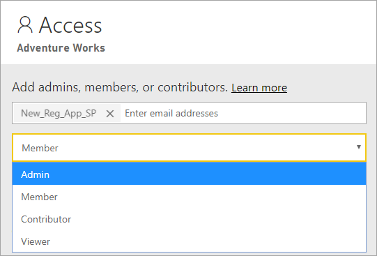

# <a name="automate-premium-workspace-and-dataset-tasks-with-service-principals"></a>Automatizzare le attività Premium per aree di lavoro e set di dati con le entità servizio

Le entità servizio sono *registrazioni di app* di Azure Active Directory create all'interno del tenant per l'esecuzione automatica di operazioni a livello di servizio e di risorsa. Si tratta di un tipo univoco di identità utente con nome app, ID applicazione, ID tenant e *segreto client* o certificato per una password.

Power BI Premium usa la stessa funzionalità per le entità servizio di Power BI Embedded. Per altre informazioni, vedere [Incorporamento di contenuto di Power BI con entità servizio](../developer/embedded/embed-service-principal.md).

In **Power BI Premium** le entità servizio possono essere usate anche con l'[endpoint XMLA](service-premium-connect-tools.md) per automatizzare le attività di gestione del set di dati, ad esempio il provisioning delle aree di lavoro, la distribuzione di modelli e l'aggiornamento dei set di dati con:

- PowerShell
- Automazione di Azure
- App per la logica di Azure
- Applicazioni client personalizzate

Le entità servizio possono essere usate solo con l'endpoint XMLA per le [nuove aree di lavoro](../collaborate-share/service-new-workspaces.md). Le aree di lavoro classiche non sono supportate. Un'entità servizio ha solo le autorizzazioni necessarie per eseguire attività per le aree di lavoro a cui viene assegnata. Le autorizzazioni vengono assegnate tramite l'accesso all'area di lavoro, in modo analogo a quanto avviene con i normali account UPN.

Per eseguire operazioni di scrittura, il **carico di lavoro Set di dati** della capacità deve avere l'[endpoint XMLA abilitato per la lettura/scrittura](service-premium-connect-tools.md#enable-xmla-read-write). Per i set di dati pubblicati da Power BI Desktop è necessario che sia abilitata la funzionalità per il [formato ottimizzato dei metadati](../connect-data/desktop-enhanced-dataset-metadata.md).

> [!NOTE]
> La funzionalità Endpoint XMLA in Power BI Premium è in **anteprima**. Non è consigliabile usare le funzionalità in anteprima in un ambiente di produzione. Alcune funzionalità, il supporto e la documentazione sono limitati.  Per informazioni dettagliate, vedere [Condizioni dei servizi online Microsoft](https://www.microsoft.com/licensing/product-licensing/products?rtc=1).

## <a name="create-a-service-principal"></a>Creare un'entità servizio

Le entità servizio vengono create come registrazione di app nel portale di Azure o tramite PowerShell. Quando si crea l'entità servizio, assicurarsi di copiare e salvare separatamente il nome dell'app, l'ID applicazione (client), l'ID directory (tenant) e il segreto client. Per informazioni sulla procedura per creare un'entità servizio, vedere:

[Creare un'entità servizio - Portale di Azure](https://docs.microsoft.com/azure/active-directory/develop/howto-create-service-principal-portal)   
[Creare un'entità servizio - PowerShell](https://docs.microsoft.com/azure/active-directory/develop/howto-authenticate-service-principal-powershell)

## <a name="create-an-azure-ad-security-group"></a>Creare un gruppo di sicurezza di Azure AD

Per impostazione predefinita, le entità servizio possono accedere a tutte le impostazioni del tenant per cui sono abilitate. In base alle impostazioni di amministrazione, l'accesso può includere gruppi di sicurezza specifici o l'intera organizzazione.

Per limitare l'accesso dell'entità servizio a impostazioni specifiche del tenant, è possibile consentire l'accesso solo a gruppi di sicurezza specifici. In alternativa, è possibile creare un gruppo di sicurezza dedicato per le entità servizio ed escluderlo dalle impostazioni specifiche del tenant. Per istruzioni su come creare un gruppo di sicurezza e aggiungere un'entità servizio, vedere [Creare un gruppo di base e aggiungere membri con Azure Active Directory](https://docs.microsoft.com/azure/active-directory/fundamentals/active-directory-groups-create-azure-portal).

## <a name="enable-service-principals"></a>Abilitare le entità servizio

Prima di usare le entità servizio in Power BI, un amministratore deve abilitare l'accesso all'entità servizio nel portale di amministrazione di Power BI.

In Power BI, nel **portale di amministrazione** > **Impostazioni tenant** espandere **Consenti alle entità servizio di usare le API Power BI** e quindi fare clic su **Abilitato**. Per applicare le autorizzazioni a un gruppo di sicurezza, aggiungere il nome del gruppo a **Gruppi di sicurezza specifici**.


## <a name="workspace-access"></a>Accesso all'area di lavoro

Affinché l'entità servizio disponga delle autorizzazioni necessarie per eseguire le operazioni Premium su aree di lavoro e set di dati, è necessario aggiungere l'entità servizio come membro o amministratore dell'area di lavoro. L'uso dell'accesso all'area di lavoro nel servizio Power BI è descritto qui, ma è anche possibile usare l'[API REST Add Group User (Aggiungi utente gruppo)](https://docs.microsoft.com/rest/api/power-bi/groups/addgroupuser).

1. Nel servizio Power BI, per un'area di lavoro selezionare **Altro** > **Accesso all'area di lavoro**.

    

2. Eseguire una ricerca in base al nome dell'applicazione e aggiungere l'entità servizio come **amministratore** o **membro** all'area di lavoro.

    

## <a name="connection-strings-for-the-xmla-endpoint"></a>Stringhe di connessione per l'endpoint XMLA

Dopo aver creato un'entità servizio, abilitato le entità servizio per il tenant e aggiunto l'entità servizio all'accesso all'area di lavoro, è possibile usarla come identità utente nelle stringhe di connessione con l'endpoint XMLA. La differenza è che per i parametri ID utente e Password si specificano l'ID applicazione, l'ID tenant e il segreto dell'applicazione.

`Data Source=powerbi://api.powerbi.com/v1.0/myorg/<workspace name>; Initial Catalog=<dataset name>;User ID=app:<appId>@<tenantId>;Password=<app_secret>;`

### <a name="powershell"></a>PowerShell

#### <a name="using-sqlserver-module"></a>Uso del modulo SQLServer

Nell'esempio seguente vengono usati AppId, TenantId e AppSecret per autenticare un'operazione di aggiornamento del set di dati:

```powershell
Param (
        [Parameter(Mandatory=$true)] [String] $AppId,
        [Parameter(Mandatory=$true)] [String] $TenantId,
        [Parameter(Mandatory=$true)] [String] $AppSecret
       )
$PWord = ConvertTo-SecureString -String $AppSecret -AsPlainText -Force

$Credential = New-Object -TypeName "System.Management.Automation.PSCredential" -ArgumentList $AppId, $PWord

Invoke-ProcessTable -Server "powerbi://api.powerbi.com/v1.0/myorg/myworkspace" -TableName "mytable" -Database "mydataset" -RefreshType "Full" -ServicePrincipal -ApplicationId $AppId -TenantId $TenantId -Credential $Credential
```

### <a name="amo-and-adomd"></a>AMO e ADOMD

Quando ci si connette ad applicazioni client e app Web, i pacchetti installabili delle [librerie client AMO e ADOMD](https://docs.microsoft.com/azure/analysis-services/analysis-services-data-providers) versione 15.0.2 e successive di NuGet supportano le entità servizio nelle stringhe di connessione con la sintassi seguente: `app:AppID` e password o `cert:thumbprint`.

Nell'esempio seguente vengono usati `appID` e una `password` per eseguire un'operazione di aggiornamento del database modello:

```csharp
string appId = "xxx";
string authKey = "yyy";
string connString = $"Provider=MSOLAP;Data source=powerbi://api.powerbi.com/v1.0/<tenant>/<workspacename>;Initial catalog=<datasetname>;User ID=app:{appId};Password={authKey};";
Server server = new Server();
server.Connect(connString);
Database db = server.Databases.FindByName("adventureworks");
Table tbl = db.Model.Tables.Find("DimDate");
tbl.RequestRefresh(RefreshType.Full);
db.Model.SaveChanges();
```

## <a name="next-steps"></a>Passaggi successivi

[Connettività ai set di dati con l'endpoint XMLA](service-premium-connect-tools.md)  
[Automazione di Azure](https://docs.microsoft.com/azure/automation)  
[App per la logica di Azure](https://docs.microsoft.com/azure/logic-apps/)  
[API REST di Power BI](https://docs.microsoft.com/rest/api/power-bi/)
