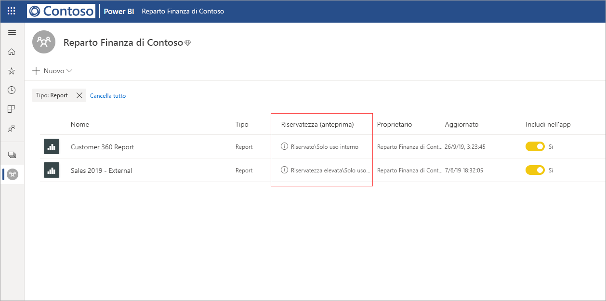
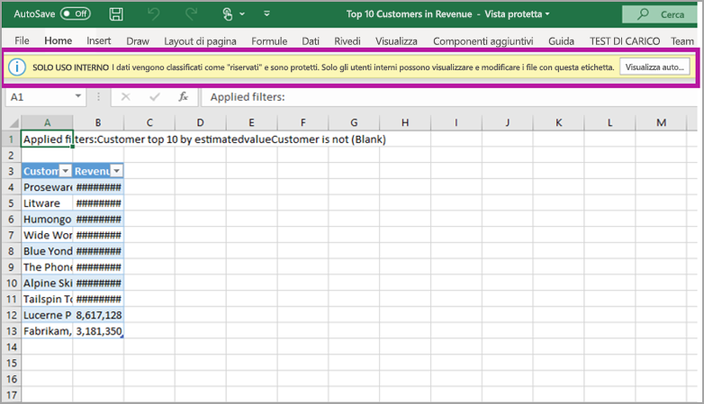

# Protezione dei dati in Power BI (anteprima)

Le aziende moderne applicano rigorose normative e requisiti aziendali per gestire e proteggere i propri dati sensibili. Power BI può essere integrato con Microsoft Information Protection e Microsoft Cloud App Security per offrire più controllo e visibilità sui dati sensibili in Power BI. 

Con la funzionalità di protezione dei dati per Power BI, è possibile eseguire le operazioni seguenti:

* Usare le etichette di riservatezza di Microsoft per classificare ed etichettare il contenuto nel servizio Power BI (dashboard, report, set di dati e flussi di dati), con la stessa tassonomia usata per classificare e proteggere i file in Office 365. 

* Applicare le impostazioni di protezione, come la crittografia o le filigrane, quando si esportano i dati dal servizio Power BI ai file applicando l'etichetta di riservatezza e la protezione del contenuto (Excel, PowerPoint e PDF). 

  Si supponga, ad esempio, che un utente applichi un'etichetta Riservato a un report in Power BI. Quando questi dati vengono esportati in un file di Excel, Power BI applicherà l'etichetta Riservato al file. L'etichetta può crittografare il contenuto e applicare una filigrana Riservato.

* Usare Microsoft Cloud App Security per monitorare le attività in Power BI, analizzare i problemi di sicurezza e proteggere il contenuto in Power BI con Controllo app per l'accesso condizionale di Microsoft Cloud App Security. 

## Etichette di riservatezza in Power BI

Le etichette di riservatezza vengono create e gestite nel [Centro sicurezza Microsoft 365](https://security.microsoft.com/) o nel [Centro conformità Microsoft 365](https://compliance.microsoft.com/).

Per accedere alle etichette di riservatezza in uno di questi centri, passare a **Classificazione > Etichette di riservatezza**. Queste etichette di riservatezza possono essere usate da più servizi Microsoft, ad esempio Azure Information Protection, app di Office e servizi di Office 365.

> [!IMPORTANT]
> I clienti di Azure Information Protection dovranno eseguire la migrazione delle etichette a uno dei servizi indicati per abilitare l'uso delle etichette di riservatezza in Power BI. Inoltre, le etichette di riservatezza sono supportate solo nei cloud pubblici e non possono essere usate per i tenant nei cloud, ad esempio i cloud sovrani.
>
> Per altre informazioni, vedere l'articolo sulla [migrazione delle etichette di riservatezza di Azure Information Protection](https://docs.microsoft.com/azure/information-protection/configure-policy-migrate-labels).

## Come funzionano le etichette di riservatezza

L'applicazione di un'etichetta di riservatezza a un dashboard, un report, un set di dati o un flusso di dati di Power BI è simile all'applicazione di un *tag* alla risorsa con in più i vantaggi seguenti:
* **Personalizzabile**: è possibile creare categorie per diversi livelli di contenuto sensibile nell'organizzazione, ad esempio Personale, Pubblico, Generale, Riservato e Riservatezza elevata.
* **Testo non crittografato**: poiché l'etichetta è in testo non crittografato, è facile per gli utenti comprendere come gestire il contenuto in base alle linee guida per le etichette di riservatezza.
* **Persistente**: dopo l'applicazione di un'etichetta di riservatezza al contenuto, questa rimane associata al contenuto quando viene esportato nei seguenti tipi di file supportati: Excel, PowerPoint e PDF. 

  Ciò significa che l'etichetta di riservatezza segue il contenuto, incluse le impostazioni di protezione, e diventa la base per l'applicazione dei criteri. 

## Esempio di etichetta di riservatezza 

Ecco un rapido esempio di come può essere usata un'etichetta di riservatezza in Power BI.

1. Nel servizio Power BI viene applicata un'etichetta **Highly Confidential - Internal Only** (Riservatezza elevata - Solo uso interno) a un report.

   

2. Quando i dati del report vengono esportati in un file di Excel, a tale file vengono applicate l'etichetta di riservatezza e la protezione.

   

Nelle applicazioni di Microsoft Office, un'etichetta di riservatezza viene visualizzata come tag nel messaggio di posta elettronica o nel documento, in modo simile all'immagine precedente.

È anche possibile assegnare una classificazione al contenuto (come un adesivo) che rimane associata al contenuto e lo segue mentre questo viene usato e condiviso. La classificazione può essere usata per generare report sull'utilizzo e visualizzare i dati delle attività per il contenuto sensibile. In base a queste informazioni, è sempre possibile scegliere in seguito di applicare impostazioni di protezione.

## Uso delle etichette di riservatezza in Power BI

Prima di abilitare le etichette di riservatezza in Power BI, è necessario verificare che siano soddisfatti i prerequisiti seguenti: 

* Assicurarsi che le etichette di riservatezza siano state definite nel [Centro sicurezza Microsoft 365](https://security.microsoft.com/) o nel [Centro conformità Microsoft 365](https://compliance.microsoft.com/). 
* [Abilitare le etichette di riservatezza](service-security-enable-data-sensitivity-labels.md) (anteprima) in Power BI.
* Assicurarsi che gli utenti dispongano della licenza appropriata.
  * Per applicare o visualizzare le etichette in Power BI, gli utenti devono disporre di una licenza Premium P1 o Premium P2 di Azure Information Protection. È possibile acquistare una licenza di Microsoft Azure Information Protection autonoma o inclusa in uno dei gruppi di licenze Microsoft. Per informazioni dettagliate, vedere [Prezzi di Azure Information Protection](https://azure.microsoft.com/pricing/details/information-protection/).
  * Per applicare etichette alle risorse di Power BI, un utente deve avere una licenza di Power BI Pro e una delle licenze di Azure Information Protection indicate in precedenza. 

## Proteggere il contenuto con Microsoft Cloud App Security

È possibile proteggere il contenuto in Power BI da perdite indesiderate o violazioni usando Microsoft Cloud App Security. Dopo aver implementato e configurato Microsoft Cloud App Security, gli amministratori della sicurezza possono monitorare l'accesso e l'attività degli utenti, eseguire l'analisi dei rischi in tempo reale e impostare controlli specifici delle etichette.

Le organizzazioni possono ad esempio usare Microsoft Cloud App Security per configurare un criterio che impedisca agli utenti di scaricare dati sensibili da Power BI in dispositivi non gestiti. Una configurazione di questo tipo consente agli utenti di rimanere produttivi e connettersi a Power BI da qualsiasi luogo, usando Microsoft Cloud App Security per impedire azioni utente compromettenti. Tutto questo in tempo reale. 

### Requisiti

Per l'uso delle etichette di riservatezza con Microsoft Cloud App Security, è necessario che siano soddisfatti i prerequisiti seguenti: 

* Cloud App Security e Azure Information Protection [devono essere abilitati per il tenant](https://docs.microsoft.com/cloud-app-security/azip-integration).
* L'app [deve essere connessa a Microsoft Cloud App Security](https://docs.microsoft.com/cloud-app-security/enable-instant-visibility-protection-and-governance-actions-for-your-apps).

## Considerazioni e limiti

Nell'elenco seguente sono riportate alcune limitazioni delle etichette di riservatezza in Power BI:

* Per l'applicazione e la visualizzazione delle etichette di riservatezza di Microsoft Information Protection in Power BI, è necessaria una licenza Premium P1 o Premium P2 di Azure Information Protection. È possibile acquistare una licenza di Microsoft Azure Information Protection autonoma o inclusa in uno dei gruppi di licenze Microsoft. Per informazioni dettagliate, vedere [Prezzi di Azure Information Protection](https://azure.microsoft.com/pricing/details/information-protection/).
* Le etichette di riservatezza possono essere applicate solo a dashboard, report, set di dati e flussi di dati.
* L'applicazione dei controlli di protezione e delle etichette nei file esportati è supportata solo per i file di Excel, di PowerPoint e in formato PDF. Le etichette e la protezione non vengono applicate quando i dati vengono esportati in file CSV, messaggi di posta elettronica di sottoscrizione, oggetti visivi incorporati e stampe.
* Un utente che esporta un file da Power BI dispone delle autorizzazioni per modificare il file e accedervi in base alle impostazioni dell'etichetta di riservatezza. L'utente che esporta i dati non ottiene le autorizzazioni di proprietario sul file. 
* Le etichette di riservatezza non sono attualmente disponibili per i [report impaginati]( https://docs.microsoft.com/power-bi/paginated-reports-report-builder-power-bi) e le cartelle di lavoro.
* Le etichette di riservatezza negli asset di Power BI sono visibili solo nell'elenco delle aree di lavoro e nelle visualizzazioni di derivazione. Non sono attualmente visibili nelle visualizzazioni dei contenuti preferiti, condivisi con l'utente, recenti o relativi alle app. Si noti, tuttavia, che un'etichetta applicata a un asset di Power BI, anche se non visibile, rimarrà sempre associata ai dati esportati nei file di Excel, di PowerPoint e in formato PDF.
* L'*impostazione di crittografia dei file* dell'etichetta di riservatezza, configurata nel [Centro sicurezza Microsoft 365](https://security.microsoft.com/) o nel [Centro conformità Microsoft 365](https://compliance.microsoft.com/), si applica solo ai file che vengono *esportati da* Power BI. Non viene applicata *all'interno di* Power BI.
* La [protezione HYOK](https://docs.microsoft.com/azure/information-protection/configure-adrms-restrictions) non è supportata per le etichette applicate in Power BI.
* Per la visualizzazione e l'applicazione di etichette nelle app di Office devono essere soddisfatti determinati [requisiti di licenza](https://docs.microsoft.com/microsoft-365/compliance/get-started-with-sensitivity-labels#subscription-and-licensing-requirements-for-sensitivity-labels).
* Le etichette di riservatezza sono supportate solo per i tenant nel cloud globale (pubblico). Le etichette di riservatezza non sono supportate per i tenant in altri cloud.
* Le etichette di riservatezza dei dati non sono supportate per le app modello. Le etichette di riservatezza impostate dall'autore dell'app modello vengono rimosse quando l'app viene estratta e installata e le etichette di riservatezza aggiunte agli artefatti in un'app modello installata da parte dell'utente dell'app vanno perdute (reimpostate su nothing) quando l'app viene aggiornata.
* Power BI non supporta le etichette di riservatezza dei tipi di protezione **Non inoltrare** e **Ad hoc**.

## Passaggi successivi

In questo articolo è stata presentata una panoramica della protezione dei dati in Power BI. Negli articoli seguenti sono riportate altre informazioni sulla protezione dei dati in Power BI. 

* [Abilitare le etichette di riservatezza dei dati in Power BI](service-security-enable-data-sensitivity-labels.md)
* [Applicare le etichette di riservatezza dei dati in Power BI](../designer/service-security-apply-data-sensitivity-labels.md)
* [Uso dei controlli di Microsoft Cloud App Security in Power BI](service-security-using-microsoft-cloud-app-security-controls.md)
* [Report sulle metriche di protezione dei dati](service-security-data-protection-metrics-report.md)