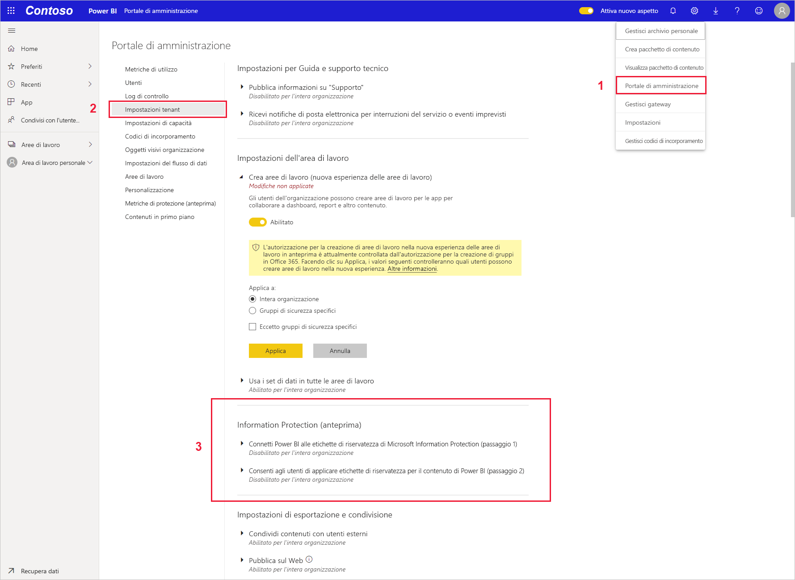
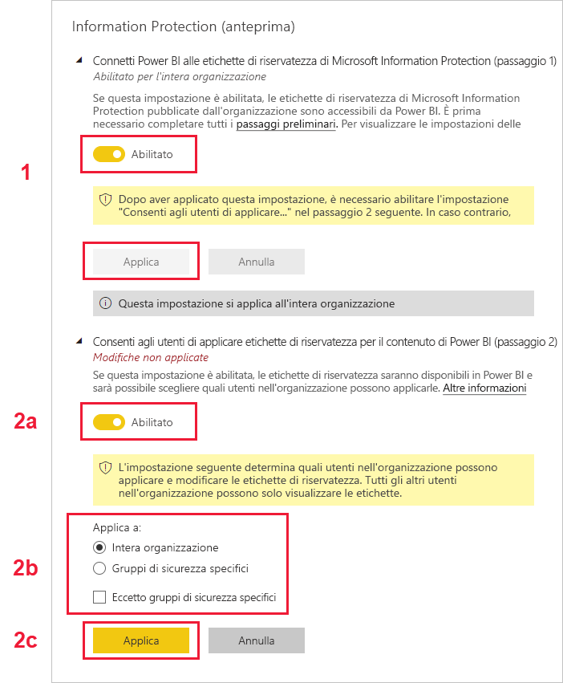

# Abilitare le etichette di riservatezza dei dati in Power BI (anteprima)

Quando in Power BI sono abilitate le [etichette di riservatezza dei dati di Microsoft Information Protection](https://docs.microsoft.com/microsoft-365/compliance/sensitivity-labels), si verifica quanto segue:

* Alcuni utenti e gruppi di sicurezza di un'organizzazione possono classificare e [applicare etichette di riservatezza](../collaborate-share/service-security-apply-data-sensitivity-labels.md) ai propri dashboard, report, set di impostazioni e flussi di dati di Power BI (di seguito definiti *asset*).
* Tutti i membri dell'organizzazione possono visualizzare tali etichette.

Le etichette di riservatezza favoriscono la protezione dei dati informando gli autori e gli utenti di Power BI della loro riservatezza e al tempo stesso spiegando il significato della classificazione e il modo in cui devono essere gestiti i dati così classificati.

Quando i dati di Power BI con un'etichetta di riservatezza vengono esportati in un file di Excel, di PowerPoint o in formato PDF, l'etichetta rimane associata a tali dati. Ciò significa che un utente senza autorizzazione di accesso ai dati cui è assegnata un'etichetta, a causa dei criteri delle etichette di riservatezza, non sarà in grado di aprire i file *all'esterno* di Power BI, ovvero in Excel, in PowerPoint o in un'app per PDF.

Per abilitare le etichette di riservatezza dei dati è necessario disporre di una licenza di Azure Information Protection. Per altre informazioni, vedere [Gestione delle licenze](#licensing).

## Abilitare le etichette di riservatezza dei dati

Per abilitare l'uso delle etichette di riservatezza dei dati di Microsoft Information Protection in Power BI, passare al portale di amministrazione di Power BI, aprire il riquadro Impostazioni tenant e trovare la sezione Information Protection.

Nella sezione **Information Protection** seguire questa procedura:
1.  Abilitare l'opzione **Abilita etichette di riservatezza di Microsoft Information Protection** e scegliere **Applica**. Questo passaggio ha *solo* l'effetto di rendere visibili le etichette di riservatezza all'intera organizzazione. Non viene applicata alcuna etichetta. Per definire chi può applicare tali etichette in Power BI, è necessario completare il passaggio 2.
2.  Definire chi può applicare e modificare le etichette di riservatezza negli asset di Power BI. Questo passaggio include tre azioni:
    1.  Abilitare l'opzione **Imposta le etichette di riservatezza per il contenuto e i dati di Power BI**.
    2.  Selezionare uno o più gruppi di sicurezza pertinenti. Per impostazione predefinita, tutti gli utenti dell'organizzazione sono in grado di applicare le etichette di riservatezza, ma è possibile scegliere di abilitare l'impostazione delle etichette di riservatezza solo per determinati utenti o gruppi di sicurezza. Con l'intera organizzazione o specifici gruppi di sicurezza selezionati, è possibile escludere determinati subset di utenti o gruppi di sicurezza.
    * Quando le etichette di riservatezza sono abilitate per l'intera organizzazione, vengono in genere definite eccezioni per i gruppi di sicurezza.
    * Quando invece le etichette di riservatezza sono abilitate solo per determinati utenti o gruppi di sicurezza, le eccezioni riguardano in genere utenti specifici.  
    Questo approccio consente di impedire a determinati utenti di applicare etichette di riservatezza in Power BI, anche se appartengono a un gruppo che dispone delle autorizzazioni necessarie.
    
    3. Scegliere **Applica**.

> [!IMPORTANT]
> Solo gli utenti di Power BI Pro che dispongono delle autorizzazioni di *creazione* e *modifica* sull'asset, e che fanno parte del gruppo di sicurezza appropriato impostato in questa sezione, possono impostare e modificare le etichette di riservatezza. Queste operazioni non sono consentite agli utenti che non fanno parte di questo gruppo. 

## Considerazioni e limitazioni

In Power BI vengono usate le etichette di riservatezza di Microsoft Information Protection. Se pertanto viene restituito un messaggio di errore quando si tenta di abilitare le etichette di riservatezza, il problema può essere dovuto a uno dei motivi seguenti:

* Non si dispone di una [licenza](#licensing) di Azure Information Protection.
* Non è stata eseguita la migrazione delle etichette di riservatezza alla versione di Microsoft Information Protection supportata da Power BI. Per altre informazioni, vedere [Migrazione di etichette di riservatezza](https://docs.microsoft.com/azure/information-protection/configure-policy-migrate-labels).
* Nell'organizzazione non è stata definita alcuna etichetta di riservatezza di Microsoft Information Protection. Inoltre, per essere utilizzabile, un'etichetta deve far parte di un criterio pubblicato. [Vedere altre informazioni sulle etichette di riservatezza](https://docs.microsoft.com/Office365/SecurityCompliance/sensitivity-labels) o visitare il [Centro sicurezza e conformità Microsoft](https://sip.protection.office.com/sensitivity?flight=EnableMIPLabels) per informazioni su come definire le etichette e pubblicare i criteri per l'organizzazione.

## Licenze

* Per visualizzare o applicare le etichette di Microsoft Information Protection in Power BI gli utenti devono avere una licenza Premium P1 o Premium P2 di Azure Information Protection. È possibile acquistare una licenza di Microsoft Azure Information Protection autonoma o inclusa in uno dei gruppi di licenze Microsoft. Per informazioni dettagliate, vedere [Prezzi di Azure Information Protection](https://azure.microsoft.com/pricing/details/information-protection/).
* Per applicare etichette agli asset di Power BI, gli utenti devono disporre di una licenza di Power BI Pro.

## Passaggi successivi

In questo articolo è stato illustrato come abilitare le etichette di riservatezza dei dati in Power BI. Negli articoli seguenti sono riportate altre informazioni sulla protezione dei dati in Power BI. 

* [Panoramica della protezione dei dati in Power BI](service-security-data-protection-overview.md)
* [Applicare le etichette di riservatezza dei dati in Power BI](../collaborate-share/service-security-apply-data-sensitivity-labels.md)
* [Uso dei controlli di Microsoft Cloud App Security in Power BI](service-security-using-microsoft-cloud-app-security-controls.md)
* [Report sulle metriche di protezione dei dati](service-security-data-protection-metrics-report.md)