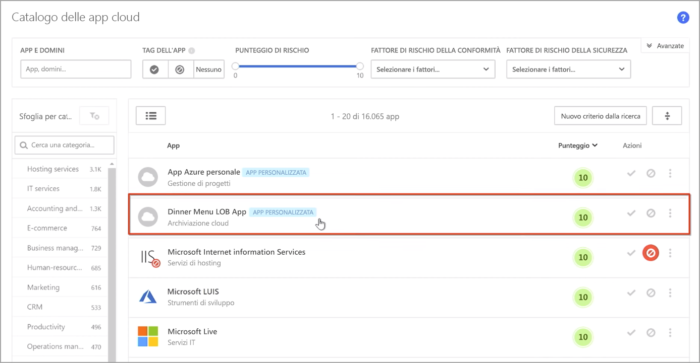
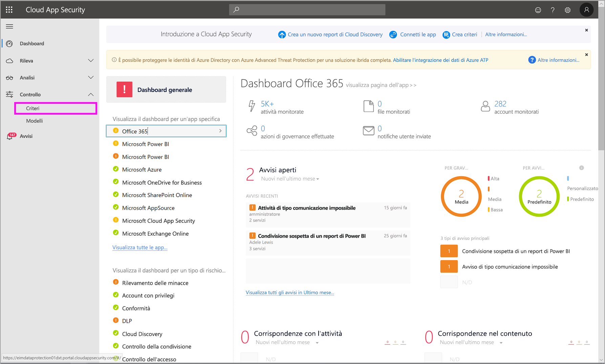
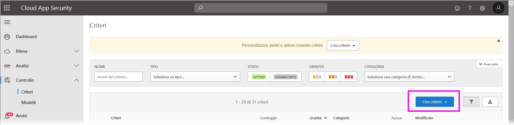
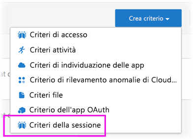
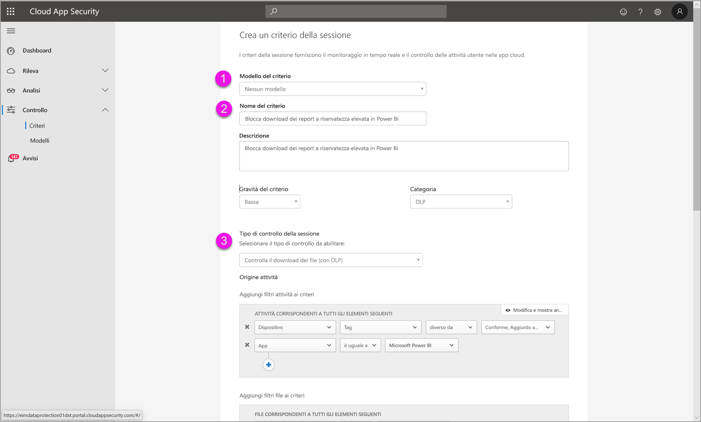
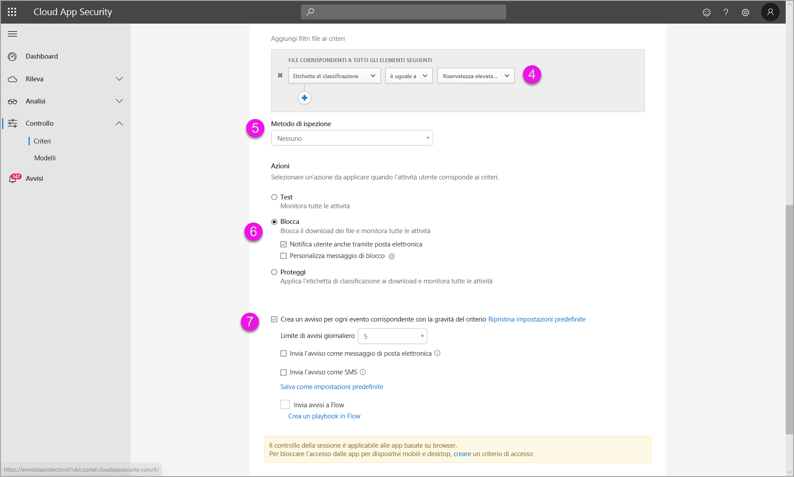
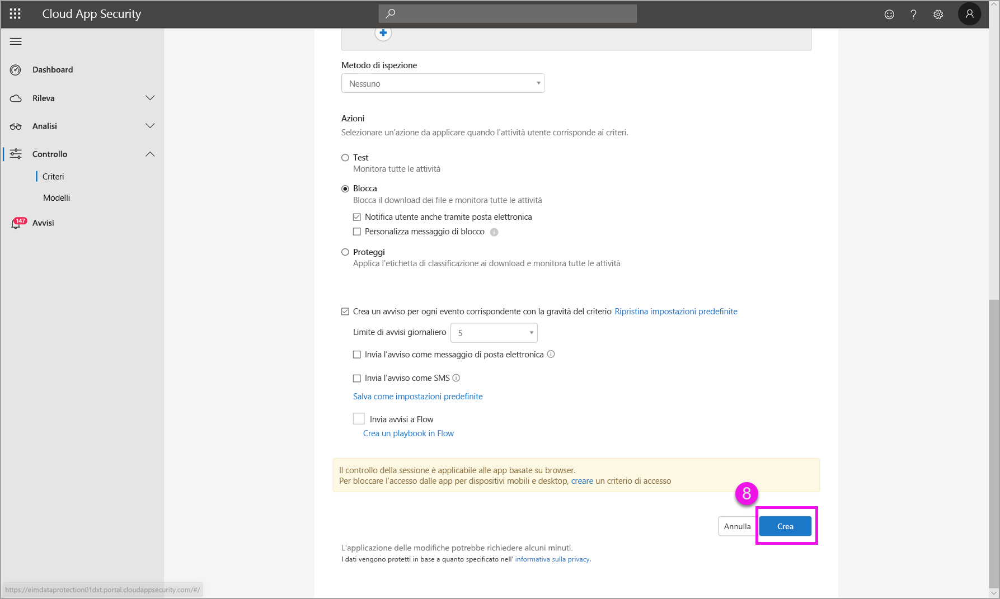

# Uso dei controlli di Microsoft Cloud App Security in Power BI (anteprima)

L'uso di Microsoft Cloud App Security con Power BI consente di favorire la protezione di report, dati e servizi di Power BI da perdite o violazioni indesiderate. Con Cloud App Security, è possibile creare criteri di accesso condizionale per i dati della propria organizzazione, tramite controlli della sessione in tempo reale in Azure Active Directory (Azure AD), che contribuiscono a garantire la sicurezza dell'analisi in Power BI. Dopo aver impostato questi criteri, gli amministratori possono monitorare l'accesso e l'attività degli utenti, eseguire l'analisi dei rischi in tempo reale e impostare controlli specifici delle etichette. 

È possibile configurare Microsoft Cloud App Security per tutti i tipi di app e servizi, non solo per Power BI. Cloud App Security è un servizio Microsoft che protegge app e dispositivi e viene gestito tramite uno specifico dashboard. È necessario configurare Cloud App Security per l'uso con Power BI per trarre vantaggio dalla tecnologia di protezione di Cloud App Security per i dati e l'analisi di Power BI. Per altre informazioni su Cloud App Security, tra cui una panoramica del funzionamento, il dashboard e i punteggi di rischio delle app, vedere la documentazione di [Microsoft Cloud App Security](https://docs.microsoft.com/cloud-app-security/).

## Uso di Microsoft Cloud App Security con Power BI

Per usare Microsoft Cloud App Security con Power BI, è necessario eseguire e configurare i servizi di sicurezza Microsoft pertinenti, alcuni dei quali sono impostati all'esterno di Power BI.

### Licenze di Microsoft Cloud App Security

Per avere Microsoft Cloud App Security nel tenant, è necessario disporre di una delle licenze seguenti:
* MCAS: fornisce le funzionalità di OCAS per tutte le app supportate, parte delle famiglie di prodotti EMS E5 e M365 E5.
* CAS-D: fornisce solo la funzionalità di individuazione di MCAS.
* OCAS: fornisce le funzionalità di MCAS solo per Office 365, parte della famiglia di prodotti Office E5.
* Facoltativo: AAD P1 e AIP P1 per trarre vantaggio dalle principali funzionalità di Microsoft Cloud App Security.

Nelle sezioni seguenti vengono descritti i passaggi per l'uso di Microsoft Cloud App Security in Power BI.

### Impostare i criteri di sessione in Azure Active Directory (obbligatorio)
I passaggi necessari per impostare i controlli della sessione vengono completati nei portali di Azure AD e Microsoft Cloud App Security. Nel portale di Azure AD si crea un criterio di accesso condizionale per Power BI e si indirizzano le sessioni usate in Power BI tramite il servizio Microsoft Cloud App Security. 

Il componente Microsoft Cloud App Security funziona usando un'architettura di proxy inverso ed è integrato con l'accesso condizionale di Azure AD per monitorare in tempo reale l'attività utente di Power BI. Di seguito sono riportati i passaggi per facilitare la comprensione del processo e collegamenti ad altri articoli con istruzioni dettagliate sulle operazioni da eseguire. È anche possibile leggere questo [articolo su Cloud App Security](https://docs.microsoft.com/cloud-app-security/proxy-deployment-aad) che descrive l'intero processo.

1.  [Creare criteri di test di accesso condizionale in Azure AD](https://docs.microsoft.com/cloud-app-security/proxy-deployment-aad#add-azure-ad)
2.  [Accedere a ogni app usando un utente con ambito ai criteri](https://docs.microsoft.com/cloud-app-security/proxy-deployment-aad#sign-in-scoped)
3.  [Verificare che le app siano configurate per l'uso di accessi e controlli della sessione](https://docs.microsoft.com/cloud-app-security/proxy-deployment-aad#portal)
4.  [Testare la distribuzione](https://docs.microsoft.com/cloud-app-security/proxy-deployment-aad#step-4-test-the-deployment)

Il processo per l'impostazione dei criteri di sessione è descritto in dettaglio nell'articolo [Criteri di sessione](https://docs.microsoft.com/cloud-app-security/session-policy-aad). 

### Impostare criteri di rilevamento anomalie per monitorare le attività PBI (consigliato)
È possibile definire criteri di rilevamento anomalie per Power BI che possono avere un ambito indipendente, in modo da essere applicati solo agli utenti e ai gruppi da includere ed escludere nei criteri. [Altre informazioni](https://docs.microsoft.com/cloud-app-security/anomaly-detection-policy#scope-anomaly-detection-policies)

Cloud App Security dispone anche di due criteri di rilevamento predefiniti dedicati per Power BI. [Per informazioni dettagliate, vedere la sezione più avanti in questo documento](#built-in-microsoft-cloud-app-security-detections-for-power-bi).

### Usare le etichette di riservatezza di Microsoft Information Protection (consigliato)

Le etichette di riservatezza consentono di classificare e proteggere contenuti sensibili per consentire agli utenti di un'organizzazione di collaborare con partner esterni, pur continuando a prestare attenzione ai contenuti e ai dati sensibili. 

È possibile leggere l'articolo sulle [etichette di riservatezza in Power BI](../designer/service-security-apply-data-sensitivity-labels.md), che illustra in dettaglio l'uso di queste etichette per Power BI. Vedere di seguito per un [esempio di criterio di Power BI basato sulle etichette di riservatezza](#example).

## Rilevamenti di Microsoft Cloud App Security predefiniti per Power BI

I rilevamenti di Microsoft Cloud App Security consentono agli amministratori di monitorare le attività specifiche di un'app. Per Power BI sono attualmente disponibili due rilevamenti di Cloud App Security predefiniti dedicati: 

* **Suspicious share** (Condivisione sospetta): rileva quando un utente condivide un report sensibile con un messaggio di posta elettronica non noto (esterno all'organizzazione). Un report sensibile è un report la cui etichetta di riservatezza è impostata su **INTERNAL-ONLY** (SOLO USO INTERNO) o superiore. 

* **Mass share of reports** (Condivisione di massa dei report): rileva quando un utente condivide molti report diversi in un'unica sessione.

Le impostazioni per questi rilevamenti vengono configurate nel portale di Cloud App Security. [Altre informazioni](https://docs.microsoft.com/cloud-app-security/anomaly-detection-policy#unusual-activities-by-user) 

## Ruolo di amministratore di Power BI in Microsoft Cloud App Security

Quando si usa Microsoft Cloud App Security con Power BI viene creato un nuovo ruolo per gli amministratori di Power BI. Quando si accede come amministratore di Power BI al [portale di Cloud App Security](https://portal.cloudappsecurity.com/), si ha accesso limitato a dati, avvisi, utenti a rischio, log attività e altre informazioni relative a Power BI.

## Considerazioni e limitazioni 
L'uso di Cloud App Security con Power BI è stato pensato per proteggere il contenuto e i dati di un'organizzazione, con funzionalità di rilevamento che consentono di monitorare le sessioni utente e le relative attività. Quando si usa Cloud App Security con Power BI, è necessario tenere presenti alcune limitazioni:

* Microsoft Cloud App Security può funzionare solo su file di Excel, di PowerPoint e in formato PDF.
* Se si vogliono usare le funzionalità delle etichette di riservatezza nei criteri di sessione per Power BI, è necessario disporre di una licenza Premium P1 o Premium P2 di Azure Information Protection. È possibile acquistare una licenza di Microsoft Azure Information Protection autonoma o inclusa in uno dei gruppi di licenze Microsoft. Per informazioni dettagliate, vedere [Prezzi di Azure Information Protection](https://azure.microsoft.com/pricing/details/information-protection/). È inoltre necessario che agli asset di Power BI siano state applicate etichette di riservatezza.

> [!CAUTION]
> * Il criterio di *ispezione del contenuto* in Microsoft Cloud App Security non è attualmente disponibile in Power BI quando si applicano criteri per i file di Excel. Evitare pertanto di impostare questo criterio per Power BI.
> * Nella parte "Azione" dei criteri di sessione l'azione "Proteggi" funziona solo se all'elemento non è applicata alcuna etichetta. Se è già presente un'etichetta, l'azione "Proteggi" non verrà applicata. Non è possibile eseguire l'override di un'etichetta già applicata a un elemento in Power BI.

## Esempio

L'esempio seguente mostra come creare nuovi criteri di sessione usando Microsoft Cloud App Security con Power BI.

Per prima cosa, creare nuovi criteri di sessione. Selezionare **Criteri** dal menu a sinistra nel portale di **Cloud App Security**.

Nella finestra visualizzata selezionare l'elenco a discesa **Crea criterio**.

Dalle opzioni disponibili nell'elenco a discesa selezionare **Criteri della sessione**.

Nella finestra visualizzata creare i criteri di sessione. I passaggi numerati descrivono le impostazioni per l'immagine seguente.

  1. Dall'elenco a discesa **Modello di criteri** scegliere *Nessun modello*.
  2. Per la casella **Nome criteri** specificare un nome pertinente per i criteri di sessione.
  3. Per **Tipo di controllo della sessione** selezionare *Controlla il download dei file (con DLP)* .

      Per la sezione**Origine attività** scegliere i criteri di blocco pertinenti. È consigliabile bloccare i dispositivi non gestiti e non conformi. Scegliere di bloccare i download quando la sessione è in Power BI.

        

        Scorrendo verso il basso è possibile visualizzare altre opzioni. L'immagine seguente mostra le opzioni disponibili, con altri esempi. 

  4. Per *Etichetta di classificazione* scegliere *Riservatezza elevata* o qualunque altra soluzione più adatta alla propria organizzazione.
  5. Impostare **Metodo di ispezione** su *Nessuno*.
  6. Scegliere l'opzione **Blocca** in base alle proprie esigenze.
  7. Assicurarsi di creare un avviso per l'azione selezionata.

        

        

  8. Selezionare infine il pulsante **Crea** per creare i criteri di sessione.

        

> [!CAUTION]
> Assicurarsi di non creare un criterio di **ispezione del contenuto** per i file di Excel in Power BI. Si tratta di una limitazione nota di questa versione di *anteprima*.

## Passaggi successivi
In questo articolo è stato illustrato come Microsoft Cloud App Security può offrire funzionalità di protezione dei dati e del contenuto per Power BI. Possono essere interessanti anche gli articoli seguenti, che descrivono la funzionalità di protezione dei dati per Power BI e il supporto del contenuto per i servizi di Azure in cui tale protezione è abilitata.

* [Panoramica della protezione dei dati in Power BI](service-security-data-protection-overview.md)
* [Abilitare le etichette di riservatezza dei dati in Power BI](service-security-enable-data-sensitivity-labels.md)
* [Applicare le etichette di riservatezza dei dati in Power BI](../designer/service-security-apply-data-sensitivity-labels.md)

Possono essere interessanti anche gli articoli seguenti relativi ad Azure e alla sicurezza:

* [Proteggere le app tramite Controllo app per l'accesso condizionale di Microsoft Cloud App Security](https://docs.microsoft.com/cloud-app-security/proxy-intro-aad)
* [Distribuire Controllo app per l'accesso condizionale per le app in primo piano](https://docs.microsoft.com/cloud-app-security/proxy-deployment-aad)
* [Criteri di sessione](https://docs.microsoft.com/cloud-app-security/session-policy-aad)
* [Panoramica delle etichette di riservatezza](https://docs.microsoft.com/microsoft-365/compliance/sensitivity-labels)