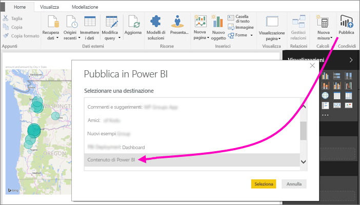
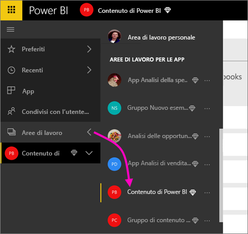
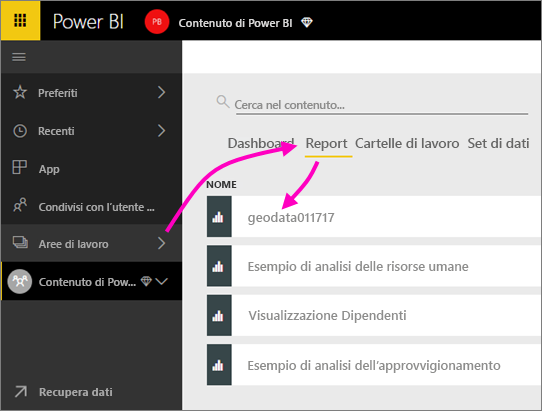
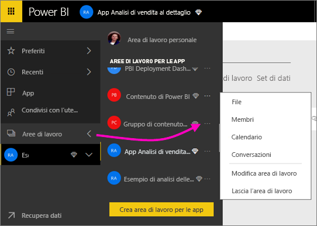
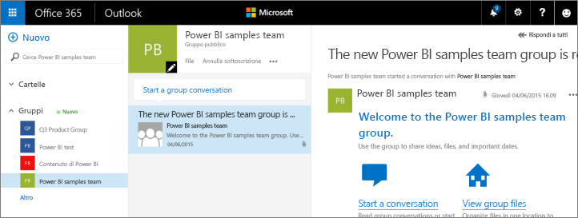
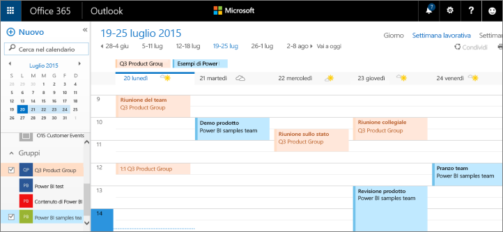

# Collaborare in un'area di lavoro classica
Le aree di lavoro di Power BI sono la soluzione ideale per collaborare con i colleghi a dashboard, report e set di dati per la creazione di *app*. Questo articolo riguarda le aree di lavoro *classiche* originali.  

La collaborazione non è limitata alle aree di lavoro in Power BI. Quando si crea una delle aree di lavoro classiche in Power BI, in background si crea automaticamente un gruppo di Office 365. Office 365 offre altri servizi di gruppo, come la condivisione di file in OneDrive for Business, le conversazioni in Exchange, le attività e i calendari condivisi e così via. Altre informazioni sui [gruppi in Office 365](https://support.office.com/article/Create-a-group-in-Office-365-7124dc4c-1de9-40d4-b096-e8add19209e9).

> [!NOTE]
> La nuova esperienza dell'area di lavoro cambia la relazione tra le aree di lavoro di Power BI e i gruppi di Office 365. Quando si crea una delle nuove aree di lavoro in Power BI, in background non si crea più automaticamente un gruppo di Office 365. Per altre informazioni, vedere [Creare le nuove aree di lavoro in Power BI](service-create-the-new-workspaces.md).

Per creare un'area di lavoro, è necessaria una [licenza di Power BI Pro](../fundamentals/service-features-license-type.md).

## Collaborare ai file di Power BI Desktop in un'area di lavoro
Dopo aver creato un file di Power BI Desktop, è possibile pubblicarlo in un'area di lavoro per consentire a ogni membro dell'area di lavoro di collaborare.

1. In Power BI Desktop selezionare **Pubblica** nella scheda **Home** della barra multifunzione e quindi selezionare l'area di lavoro nella casella **Selezionare una destinazione**.
   
    
2. Nel servizio Power BI selezionare la freccia accanto ad **Aree di lavoro** > selezionare l'area di lavoro.
   
    
3. Selezionare la scheda **Report** e quindi scegliere il report.
   
    
   
    Da questo punto, è come qualsiasi altro report in Power BI. Tutti i membri dell'area di lavoro possono modificare il report e salvare i riquadri in un dashboard a propria scelta.

## Collaborare in Office 365
La collaborazione in Office 365 inizia nell'area di lavoro classica in Power BI.

1. Nel servizio Power BI selezionare la freccia accanto ad **Aree di lavoro** > selezionare **Altre opzioni** (...) accanto al nome dell'area di lavoro. 
   
   
2. Da questo menu, è possibile collaborare con il gruppo in vari modi: 
   
   * Avviare una [conversazione di gruppo in Office 365](#have-a-group-conversation-in-office-365).
   * [Pianificare un evento](#schedule-an-event-on-the-group-workspace-calendar) nel calendario dell'area di lavoro del gruppo.
   
   Il primo accesso all'area di lavoro del gruppo in Office 365 potrebbe richiedere alcuni minuti. Attendere 15-30 minuti, quindi aggiornare il browser.

## Avviare una conversazione di gruppo in Office 365
1. Selezionare **Altre opzioni** (...) accanto al nome dell'area di lavoro \> **Conversazioni**. 
   
    
   
   Verrà aperto il sito per la posta elettronica e le conversazioni dell'area di lavoro del gruppo in Outlook per Office 365.
   
   
2. Altre informazioni sulle [conversazioni di gruppo in Outlook per Office 365](https://support.office.com/Article/Have-a-group-conversation-a0482e24-a769-4e39-a5ba-a7c56e828b22).

## Pianificare un evento nel calendario dell'area di lavoro del gruppo
1. Selezionare **Altre opzioni** (...) accanto al nome dell'area di lavoro \> **Calendario**. 
   
   
   
   Verrà aperto il calendario dell'area di lavoro del gruppo in Outlook per Office 365.
   
   
2. Altre informazioni sui [calendari di gruppo in Outlook per Office 365](https://support.office.com/Article/Add-edit-and-subscribe-to-group-events-0cf1ad68-1034-4306-b367-d75e9818376a).

## Gestire un'area di lavoro classica
Se si è proprietari o amministratori di un'area di lavoro, è anche possibile aggiungere o rimuovere i membri dell'area di lavoro. Vedere altre informazioni sulla [gestione di un'area di lavoro di Power BI](service-manage-app-workspace-in-power-bi-and-office-365.md).

## Passaggi successivi
* [Pubblicare app in Power BI](service-create-distribute-apps.md).
* Altre domande? [Provare la community di Power BI](https://community.powerbi.com/).
* Per inviare commenti e suggerimenti, visitare il forum [Power BI Ideas](https://ideas.powerbi.com/forums/265200-power-bi).
