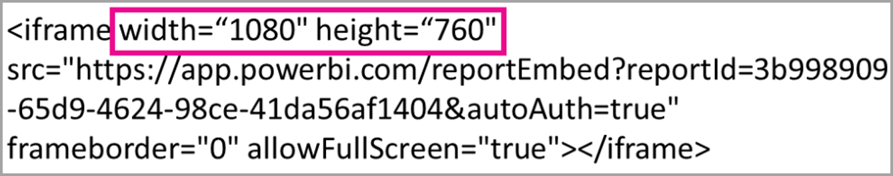
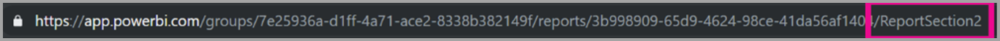

# <a name="embed-a-report-in-a-secure-portal-or-website"></a>Incorporare un report in un portale o un sito Web sicuro

La nuova opzione **Incorpora** per i report di Power BI consente di incorporare report nei portali Web interni in modo facile e sicuro. Questi portali possono essere **basati sul cloud** o **ospitati in locale**, come SharePoint 2019. I report incorporati rispettano tutte le autorizzazioni per gli elementi e i criteri di sicurezza dei dati tramite la [sicurezza a livello di riga](../admin/service-admin-rls.md). Questi report consentono l'incorporamento senza codice in qualsiasi portale che accetta un URL o un iFrame. 

L'opzione **Incorpora** supporta [filtri URL](service-url-filters.md) e impostazioni per gli URL. Consente l'integrazione con i portali con un approccio che richiede poco codice e solo conoscenze di base di HTML e JavaScript.

## <a name="how-to-embed-power-bi-reports-into-portals"></a>Come incorporare report di Power BI nei portali

1. Aprire un report nel servizio Power BI.

2. Nel menu **Altre opzioni (...)** selezionare **Incorpora** >  **Sito Web o portale**.

    

2. Selezionare l'opzione **Incorpora** per aprire una finestra di dialogo che fornisce un collegamento e un iFrame che è possibile usare per incorporare il report in modo sicuro.

    

3. Se un utente apre un URL di un report direttamente oppure uno incorporato in un portale Web, l'accesso al report richiede l'autenticazione. Se l'utente non ha eseguito l'accesso a Power BI nella sessione del browser, viene visualizzata la schermata seguente. Quando si seleziona **Accedi** può venire aperta una nuova finestra o scheda del browser. Chiedere agli utenti di controllare i blocchi popup, se non viene visualizzata la richiesta di accesso.

    

4. Dopo che l'utente ha eseguito l'accesso, il report viene visualizzato con i dati ed è possibile spostarsi tra le pagine e impostare filtri. Solo gli utenti che hanno l'autorizzazione di visualizzazione possono vedere il report in Power BI. Vengono applicate anche tutte le regole di [sicurezza a livello di riga](../admin/service-admin-rls.md). Infine, l'utente deve disporre di una licenza corretta, ovvero avere una licenza di Power BI Pro oppure il report deve essere in un'area di lavoro inclusa in una capacità di Power BI Premium. L'utente deve effettuare l'accesso ogni volta che apre una nuova finestra del browser. Tuttavia, una volta effettuato l'accesso, gli altri report vengono caricati automaticamente.

    

5. Quando si usa un iFrame, può essere necessario modificare i valori di **altezza** e **larghezza** in base alla pagina Web del portale.

    

## <a name="granting-report-access"></a>Concessione dell'accesso al report

L'opzione **Incorpora** non consente automaticamente agli utenti di visualizzare il report. Le autorizzazioni di visualizzazione sono impostate nel servizio Power BI.

Nel servizio Power BI è possibile condividere report incorporati con gli utenti richiedendo l'accesso. Se si usa un gruppo di Office 365, è possibile elencare l'utente come membro dell'area di lavoro. Per altre informazioni, vedere come [gestire l'area di lavoro in Power BI e Office 365](service-manage-app-workspace-in-power-bi-and-office-365.md).

## <a name="licensing"></a>Gestione delle licenze

Per visualizzare il report incorporato, gli utenti devono avere una licenza di Power BI Pro oppure il contenuto deve trovarsi in un'area di lavoro inclusa in una [capacità di Power BI Premium (SKU EM o P)](../admin/service-admin-premium-purchase.md).

## <a name="customize-your-embed-experience-using-url-settings"></a>Personalizzare l'esperienza di incorporamento usando le impostazioni per l'URL

È possibile personalizzare l'esperienza utente usando le impostazioni di input dell'URL di incorporamento. Nell'iFrame fornito è possibile aggiornare le impostazioni **src** dell'URL.

| Proprietà  | Descrizione  |  |  |  |
|--------------|-----------------------------------------------------------------------------------------------------------------------------------------------------------------------------------------------------------------------|---|---|---|
| pageName  | È possibile usare il parametro della stringa di query **pageName** per impostare la pagina del report da aprire. È possibile trovare questo valore alla fine dell'URL del report quando si visualizza un report nel servizio Power BI, come illustrato di seguito. |  |  |  |
| Filtri URL  | È possibile usare [filtri URL](service-url-filters.md) nell'URL di incorporamento ricevuto dall'interfaccia utente di Power BI per filtrare il contenuto incorporato. In questo modo è possibile realizzare integrazioni con poco codice e conoscenze di base di HTML e JavaScript.  |  |  |  |

## <a name="set-which-page-opens-for-an-embedded-report"></a>Impostare la pagina che viene aperta per un report incorporato 

È possibile trovare il valore di **pageName** alla fine dell'URL del report quando si visualizza un report nel servizio Power BI.

1. Aprire il report dal servizio Power BI nel Web browser e quindi copiare l'URL dalla barra degli indirizzi.

    

2. Aggiungere l'impostazione **pageName** all'URL.

    

## <a name="filter-report-content-using-url-filters"></a>Filtrare il contenuto del report con i filtri URL 

È possibile usare [filtri URL](service-url-filters.md) per fornire diverse visualizzazioni dei report. Ad esempio, l'URL seguente filtra il report in modo da visualizzare i dati per il settore energetico.

L'uso combinato di **pageName** e [filtri URL](service-url-filters.md) offre grandi potenzialità. È possibile creare esperienze con codice HTML e JavaScript molto semplice.

Ecco ad esempio un pulsante che è possibile aggiungere in una pagina HTML:

```html
<button class="textLarge" onclick='show("ReportSection", "Energy");' style="display: inline-block;">Show Energy</button>
```

Una volta premuto, il pulsante chiama una funzione per aggiornare l'iFrame con un URL aggiornato, che include il filtro per il settore energetico.

```javascript
function show(pageName, filterValue)

{

var newUrl = baseUrl + "&pageName=" + pageName;

if(null != filterValue && "" != filterValue)

{

newUrl += "&$filter=Industries/Industry eq '" + filterValue + "'";

}

//Assumes there's an iFrame on the page with id="iFrame"

var report = document.getElementById("iFrame")

report.src = newUrl;

}
```


È possibile aggiungere tutti i pulsanti desiderati per creare un'esperienza personalizzata con poco codice. 

## <a name="considerations-and-limitations"></a>Considerazioni e limiti

* I report impaginati sono supportati con gli scenari di incorporamento sicuri, come anche i report impaginati con parametri URL. Per altre informazioni, vedere [Passare un parametro di report in un URL per un report impaginato in Power BI](../paginated-reports/report-builder-url-pass-parameters.md).

* Non supporta utenti guest esterni con Azure Business To Business (B2B).

* L'incorporamento sicuro è disponibile per i report pubblicati nel servizio Power BI.

* L'utente deve effettuare l'accesso per visualizzare il report ogni volta che apre una nuova finestra del browser.

* Alcuni browser richiedono di aggiornare la pagina dopo aver effettuato l'accesso, soprattutto quando si usa la modalità InPrivate o in incognito.

* È possibile che si verifichino problemi se si usano versioni del browser non supportate. Power BI supporta i [browser indicati di seguito](../fundamentals/power-bi-browsers.md).

* Il server SharePoint classico non è supportato perché richiede le versioni di Internet Explorer precedenti a 11 o l'abilitazione della modalità di visualizzazione di compatibilità.

* Per ottenere un'esperienza Single Sign-On, usare l'[opzione Incorpora in SharePoint Online](service-embed-report-spo.md) oppure creare un'integrazione personalizzata usando il metodo di incorporamento di [dati di proprietà dell'utente](../developer/embedded/embed-sample-for-your-organization.md). 

* La funzionalità di autenticazione automatica fornita con l'opzione **Incorpora** non funziona con l'API JavaScript di Power BI. Per l'API JavaScript di Power BI, usare il metodo di incorporamento di [dati di proprietà dell'utente](../developer/embedded/embed-sample-for-your-organization.md). 

* La durata del token di autenticazione viene controllata in base alle impostazioni di AAD. Quando il token di autenticazione scade, l'utente deve aggiornare il browser per ottenere un token di autenticazione aggiornato. La durata predefinita è di un'ora, ma l'organizzazione può scegliere una durata più breve o più lunga.

## <a name="next-steps"></a>Passaggi successivi

* [Modalità per la condivisione del lavoro in Power BI](service-how-to-collaborate-distribute-dashboards-reports.md)

* [Filtrare un report usando i parametri della stringa di query nell'URL](service-url-filters.md)

* [Incorporare con web part report in SharePoint Online](service-embed-report-spo.md)

* [Pubblicare sul Web da Power BI](service-publish-to-web.md)
