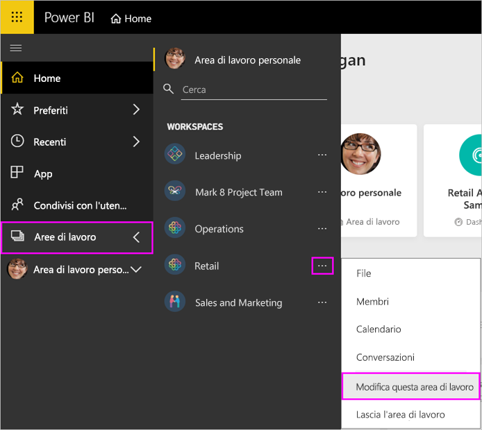
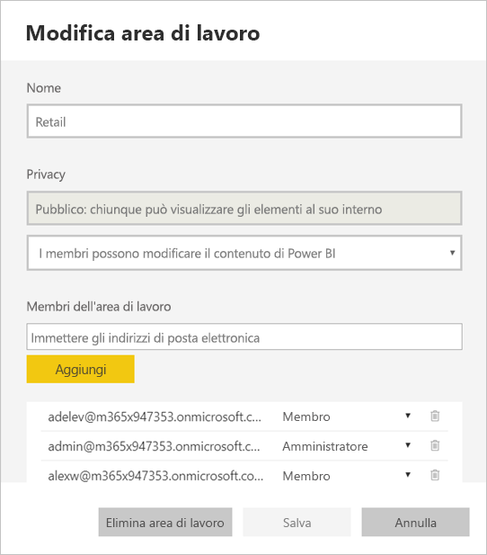
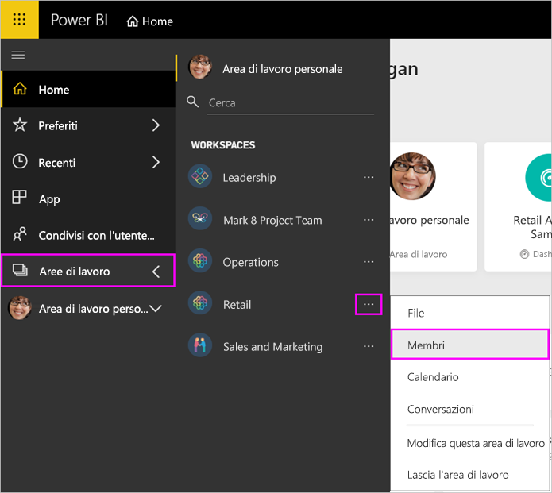
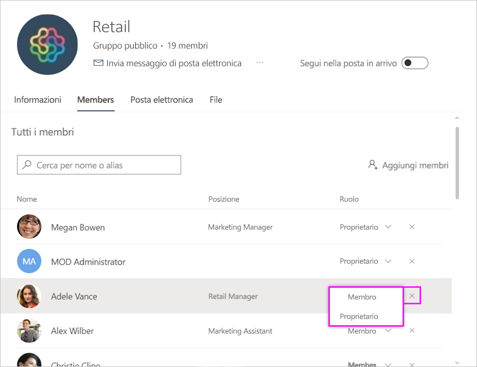
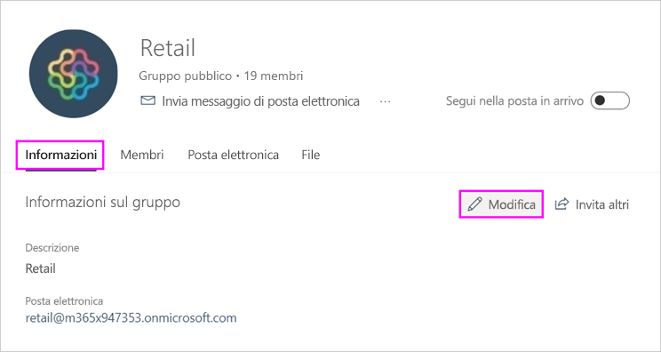
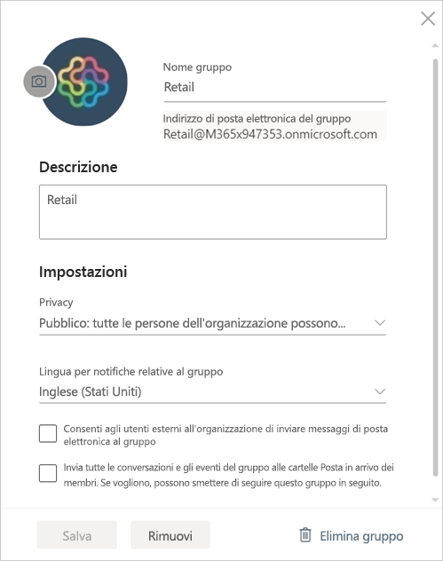

# Gestire l'area di lavoro in Power BI e Microsoft 365

Il creatore o l'amministratore di un'[area di lavoro in Power BI](service-create-distribute-apps.md) o in Microsoft 365 può gestire alcuni aspetti dell'area di lavoro in Power BI, mentre altri devono essere gestiti in Microsoft 365.

> [!NOTE]
> La nuova esperienza dell'area di lavoro cambia la relazione tra le aree di lavoro di Power BI e i gruppi di Microsoft 365. Non viene creato automaticamente un gruppo di Microsoft 365 ogni volta che si crea una delle nuove aree di lavoro. Informazioni sulla [creazione di nuove aree di lavoro](service-create-the-new-workspaces.md).

In **Power BI** è possibile:

* Aggiungere o rimuovere membri dell'area di lavoro, nonché impostare un membro dell'area di lavoro come amministratore.
* Modificare il nome dell'area di lavoro.
* Eliminare l'area di lavoro. Viene eliminato anche il gruppo di Microsoft 365.

In **Microsoft 365** è possibile:

* Aggiungere o rimuovere i membri del gruppo dell'area di lavoro, nonché impostare un membro come proprietario.
* Modificare il nome, l'immagine, la descrizione e altre impostazioni del gruppo.
* Visualizzare l'indirizzo di posta elettronica del gruppo.
* Eliminare il gruppo.

Per diventare amministratore o membro di un'area di lavoro è necessaria una [licenza di Power BI Pro](../fundamentals/service-features-license-type.md). Anche gli utenti delle app devono avere una licenza di Power BI Pro, a meno che l'area di lavoro non sia inclusa in una capacità di Power BI Premium. Per informazioni dettagliate, leggere [What is Power BI Premium?](../admin/service-premium-what-is.md) (Che cos'è Power BI Premium?).

## Modificare l'area di lavoro in Power BI

1. Nel servizio Power BI fare clic sulla freccia accanto ad **Aree di lavoro** > selezionare **Altre opzioni** (...) accanto al nome dell'area di lavoro > **Modifica questa area di lavoro**.

   

   > [!NOTE]
   > L'opzione **Modifica questa area di lavoro** viene visualizzata solo se l'utente è un amministratore dell'area di lavoro.

1. In questa schermata è possibile rinominare l'area di lavoro, aggiungere o rimuovere membri o eliminare l'area di lavoro.

   

1. Selezionare **Salva** o **Annulla**.

## Modificare le proprietà dell'area di lavoro di Power BI in Microsoft 365

È anche possibile modificare gli aspetti di un'area di lavoro direttamente in Outlook per Microsoft 365.

### Modificare i membri del gruppo dell'area di lavoro

1. Nel servizio Power BI selezionare la freccia accanto ad **Aree di lavoro** > selezionare **Altre opzioni** (...) accanto al nome dell'area di lavoro > **Membri**.

   

   Verrà aperta la visualizzazione del gruppo di Outlook per Microsoft 365 per l'area di lavoro. Potrebbe essere necessario accedere all'account aziendale.

1. Selezionare il ruolo accanto al nome del collega per impostarlo come **Membro** o **Proprietario**. Selezionare il simbolo **X** per rimuovere la persona dal gruppo.

   

### Aggiungere un'immagine e impostare altre proprietà dell'area di lavoro

Quando si distribuisce l'app dall'area di lavoro, l'immagine aggiunta qui diventa l'immagine dell'app. Vedere [Aggiungere un'immagine all'area di lavoro di Microsoft 365](service-create-workspaces.md#add-an-image-to-your-microsoft-365-workspace-optional) nell'articolo **Creare le nuove aree di lavoro**.

1. Nella visualizzazione Outlook per Microsoft 365 dell'area di lavoro passare alla scheda **Informazioni su** e selezionare **Modifica**.

    
1. È possibile modificare il nome, la descrizione e la lingua per le notifiche relative al gruppo. È anche possibile aggiungere un'immagine e impostare altre proprietà.

   

1. Selezionare **Salva** o **Rimuovi**.

## Passaggi successivi

* [Pubblicare un'app in Power BI](service-create-distribute-apps.md)

* Altre domande? [Provare la community di Power BI](https://community.powerbi.com/)
