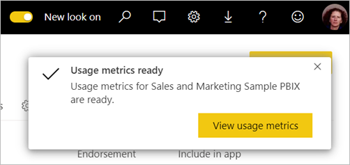

# Monitorare le metriche di utilizzo nella nuova esperienza dell'area di lavoro

Sapere come viene usato il contenuto consente di dimostrare l'impatto e assegnare priorità agli interventi. Le metriche di utilizzo possono mostrare che uno dei report viene utilizzato ogni giorno da un importante segmento dell'organizzazione e potrebbe mostrare che un dashboard creato dall'utente non viene affatto visualizzato. Questo tipo di commenti e suggerimenti è estremamente utile nel guidare gli interventi.

Se si creano report in aree di lavoro moderne, è possibile accedere a report sulle metriche di utilizzo migliorati, che consentono di individuare il modo in cui tali report vengono usati in tutta l'organizzazione e chi li usa. È anche possibile identificare problemi di prestazioni di alto livello. I report sull'utilizzo migliorati nell'esperienza dell'area di lavoro moderna sostituiscono i report sulle metriche di utilizzo esistenti documentati in [Monitorare le metriche di utilizzo per dashboard e report di Power BI](service-usage-metrics.md).

> [!NOTE]
> È possibile eseguire report sulle metriche di utilizzo solo nel servizio Power BI. Se tuttavia si salva un report sulle metriche di utilizzo o lo si aggiunge a un dashboard, è possibile aprire e usare il report nei dispositivi mobili.

## Prerequisiti

- Per eseguire ed accedere ai dati delle metriche di utilizzo è necessaria una licenza di Power BI Pro. La funzionalità delle metriche di utilizzo acquisisce tuttavia le informazioni sull'utilizzo da tutti gli utenti, indipendentemente dalla licenza a loro assegnata.
- Per accedere alle metriche di utilizzo migliorate per un report, il report deve trovarsi in un'area di lavoro moderna ed è necessario avere accesso in modifica a tale report.
- L'amministratore di Power BI deve avere abilitato le metriche di utilizzo per i creatori di contenuti. L'amministratore di Power BI potrebbe anche avere abilitato la raccolta di dati per ogni utente nelle metriche di utilizzo. Vedere come [abilitare queste opzioni nel portale di amministrazione](../admin/service-admin-portal.md#control-usage-metrics).

## Creare e visualizzare un report sulle metriche di utilizzo migliorato

Solo gli utenti con autorizzazioni di amministratore, membro o collaboratore possono visualizzare il report sulle metriche di utilizzo migliorato. Le autorizzazioni di visualizzazione non sono sufficienti. Se si è almeno un collaboratore in un'area di lavoro moderna in cui risiede il report, è possibile seguire questa procedura per visualizzare le metriche di utilizzo migliorate:

1. Aprire l'area di lavoro che contiene il report per il quale si vogliono analizzare le metriche di utilizzo.
2. Dall'elenco del contenuto dell'area di lavoro, aprire il menu di scelta rapida del report e scegliere **Visualizza il report sulla metrica di utilizzo**. In alternativa, aprire il report, quindi aprire il menu di scelta rapida sulla barra dei comandi e infine scegliere **Metriche di utilizzo**.

    

1. La prima volta che si esegue questa operazione, Power BI crea un report sulle metriche di utilizzo e avvisa l'utente appena è pronto.

    

1. Per vedere i risultati, selezionare **Visualizza metriche di utilizzo**.
2. Se è la prima volta che si esegue questa operazione, Power BI potrebbe aprire il report sulle metriche di utilizzo precedente. Per visualizzare il report sulle metriche di utilizzo migliorato, nell'angolo in alto a destra, impostare l'opzione Nuovo report sull'utilizzo disattivato su **Attivato**.

    

    > [!NOTE]
    > L'opzione Nuovo report sull'utilizzo è disponibile solo se il report si trova in un'area di lavoro moderna. Le aree di lavoro legacy non offrono report sulle metriche di utilizzo migliorati.

## Informazioni sul report sulle metriche di utilizzo migliorato

Quando si visualizza il report sulle metriche di utilizzo migliorato seguendo la procedura precedente, Power BI genera un report predefinito con le metriche di utilizzo per tale contenuto negli ultimi 30 giorni, che avrà un aspetto molto simile ai report di Power BI con cui si ha già familiarità. È possibile filtrare i dati a seconda della modalità di accesso degli utenti finali, a seconda del fatto che accedano tramite un'app Web o per dispositivi portatili e così via. Man mano che i report si evolvono, si evolve anche il report sulle metriche di utilizzo, che viene aggiornato quotidianamente con i nuovi dati.

> [!NOTE]
> I report sulle metriche di utilizzo non vengono visualizzati in Recenti, Aree di lavoro, Preferiti o in altri elenchi di contenuti. Non possono essere aggiunti a un'app. Se si aggiunge un riquadro da un report sulle metriche di utilizzo a un dashboard, non è possibile aggiungere tale dashboard a un'app.

### Set di dati del report sulle metriche di utilizzo

Il report sulle metriche di utilizzo migliorato si basa su un set di dati Report sulle metriche di utilizzo, che Power BI crea automaticamente al primo avvio del report sulle metriche di utilizzo migliorato. Power BI aggiorna quindi questo set di dati ogni giorno. Sebbene non sia possibile modificare la pianificazione dell'aggiornamento, è possibile aggiornare le credenziali che Power BI usa per aggiornare i dati delle metriche di utilizzo. Questa operazione potrebbe essere necessaria per riprendere l'aggiornamento pianificato in caso di scadenza delle credenziali o se viene rimosso l'utente che ha avviato per la prima volta il report sulle metriche di utilizzo dall'area di lavoro in cui risiede il set di dati.

### Pagine del report sulle metriche di utilizzo

Il report sulle metriche di utilizzo migliorato include le pagine seguenti:

- **Report usage** (Utilizzo report) Fornisce informazioni sulle visualizzazioni del report e sui visualizzatori del report, ad esempio il numero di utenti che hanno visualizzato il report in base alla data.
- **Report performance** (Prestazioni report) Mostra gli orari di apertura del report tipici suddivisi in base al metodo di utilizzo e ai tipi di browser.
- **FAQ** (Domande frequenti) Fornisce risposte a domande frequenti, ad esempio: Che cos'è un "visualizzatore" e che cos'è una "visualizzazione"?

### Quali metriche vengono inserite nel report?

| **Page** | **Metrica** | **Descrizione** |
| --- | --- | --- |
| Generare report sull'utilizzo | Report views | Viene registrata una visualizzazione del report ogni volta che un utente apre un report. Si noti che la definizione di visualizzazione è diversa da quella dei report sulle metriche di utilizzo precedenti. Cambiare pagina del report non è più considerata una visualizzazione aggiuntiva. |
| Generare report sull'utilizzo | Unique viewers | Un visualizzatore è un utente che ha aperto il report almeno una volta durante il periodo di tempo (in base all'account utente di AAD). |
| Generare report sull'utilizzo | View trend | La tendenza di visualizzazione rispecchia le variazioni del numero di visualizzazioni nel tempo. Confronta la prima metà del periodo di tempo selezionato con la seconda metà. |
| Generare report sull'utilizzo | Date slicer | È possibile modificare il periodo di tempo nella pagina Report usage (Utilizzo report), ad esempio per calcolare le tendenze settimanali o quindicinali. Nell'angolo inferiore sinistro della pagina Report usage (Utilizzo report) è possibile determinare la data meno recente e quella più recente per cui sono disponibili i dati di utilizzo per il report selezionato. |
| Generare report sull'utilizzo | Rank | In base al numero di visualizzazioni, la classificazione indica la popolarità di un report rispetto a tutti gli altri report nell'organizzazione.   |
| Generare report sull'utilizzo | Report views per day | Numero totale di visualizzazioni al giorno. |
| Generare report sull'utilizzo | Report viewers per day | Numero totale di utenti diversi che hanno visualizzato il report (in base all'account utente AAD). |
| Generare report sull'utilizzo | Distribution method | Il modo in cui gli utenti hanno ottenuto accesso al report, ad esempio in quanto membri di un'area di lavoro, come destinatari della condivisione del report o tramite l'installazione di un'app. |
| Generare report sull'utilizzo | Platform slicer | Se è stato eseguito l'accesso al report tramite il servizio Power BI (powerbi.com), Power BI Embedded o un dispositivo mobile. |
| Generare report sull'utilizzo | Users with report views | Mostra l'elenco di utenti che hanno aperto il report ordinato in base al numero di visualizzazioni. |
| Generare report sull'utilizzo | Pagine | Se il report contiene più di una pagina filtrarlo in base alla pagina (o alle pagine) visualizzata. Se viene visualizzata un'opzione di elenco per "Vuoto", significa che la pagina del report è stata aggiunta di recente (entro 24 ore il nome effettivo della nuova pagina viene visualizzato nell'elenco del filtro dei dati) e/o che le pagine del report sono state eliminate. "Vuoto" acquisisce questo tipo di situazioni. |
| Report performance | Typical opening time | Il tempo di apertura tipico del report corrisponde al cinquantesimo percentile del tempo necessario per l'apertura del report. In altre parole, è il tempo entro il quale viene completato il 50% delle azioni di apertura del report. La pagina Report performance (Prestazioni report) suddivide inoltre il tempo di apertura tipico del report in base al metodo di accesso e al tipo di browser.   |
| Report performance | Opening time trend | La tendenza del tempo di apertura rispecchia le variazioni delle prestazioni di apertura del report nel tempo. Confronta i tempi di apertura per il report della prima metà del periodo di tempo selezionato con i tempi di apertura della seconda metà. |
| Report performance | Date slicer | È possibile modificare il periodo di tempo nella pagina Report performance (Prestazioni report), ad esempio per calcolare le tendenze settimanali o quindicinali. Nell'angolo inferiore sinistro della pagina Report performance (Prestazioni report) è possibile determinare la data meno recente e quella più recente per cui sono disponibili i dati di utilizzo per il report selezionato. |
| Report performance | Daily performance | Prestazioni per il 10%, il 50% e il 90% delle azioni di apertura report calcolate per ogni singolo giorno. |
| Report performance | 7-day performance | Prestazioni per il 10%, il 50% e il 90% delle azioni di apertura report calcolate per gli ultimi 7 giorni per ogni data. |
| Report performance | Consumption method | Modalità di apertura del report da parte degli utenti, ad esempio tramite il servizio Power BI (powerbi.com), Power BI Embedded o un dispositivo mobile. |
| Report performance | Browser | Quale browser hanno usato gli utenti per aprire il report, ad esempio Firefox, Edge e Chrome. |

## Aggiornare le credenziali per il report sulle metriche di utilizzo

Usare la procedura seguente per acquisire la proprietà di un set di dati Report sulle metriche di utilizzo e aggiornare le credenziali.

1. Aprire l'area di lavoro che contiene il report per il quale si vuole aggiornare il set di dati Report sulle metriche di utilizzo.
2. Nella barra di intestazione nera nella parte superiore selezionare l'icona **Impostazioni** e quindi selezionare **Impostazioni**.

    

3. Passare alla scheda **Set di dati**.

1. Selezionare il set di dati Report sulle metriche di utilizzo. 

    
    
    Se non si è il proprietario del set di dati corrente, è necessario assumerne la proprietà prima di poter aggiornare le credenziali dell'origine dati. 
    
5. Selezionare il pulsante **Acquisisci proprietà** e quindi nella finestra di dialogo **Acquisisci proprietà delle impostazioni del set di dati** selezionare di nuovo **Acquisisci proprietà**.

1. In **Credenziali dell'origine dati** selezionare **Modifica credenziali**.

    

2. Nella finestra di dialogo **Configura Report sulle metriche di utilizzo** selezionare **Accedi**.

    

1. Completare la sequenza di accesso e prendere nota della notifica che l'origine dati è stata aggiornata correttamente.

    > [!NOTE]
    > Il set di dati Report sulle metriche di utilizzo contiene i dati di utilizzo per gli ultimi 30 giorni. Potrebbero essere necessarie fino a 24 ore prima che vengano importati nuovi dati di utilizzo. Non è possibile attivare un aggiornamento manuale usando l'interfaccia utente di Power BI.

## Disabilitare i report sulle metriche di utilizzo

I report sulle metriche di utilizzo sono una funzionalità che l'amministratore di Power BI o Office 365 può attivare o disattivare. Gli amministratori hanno un controllo granulare sugli utenti autorizzati ad accedere alle metriche di utilizzo. L'accesso alle metriche è attivato per impostazione predefinita per tutti gli utenti dell'organizzazione. Vedere [Controllare le metriche di utilizzo](../admin/service-admin-portal.md#control-usage-metrics) nell'articolo del portale di amministrazione per informazioni dettagliate su queste impostazioni.

> [!NOTE]
> Solo gli amministratori del tenant di Power BI possono vedere il portale di amministrazione e modificare le impostazioni.

## Escludere le informazioni utente dai report sulle metriche di utilizzo

Per impostazione predefinita, i dati per utente sono abilitati nelle metriche di utilizzo e le informazioni sull'account del consumer di contenuto sono incluse nel report delle metriche. Se gli amministratori non vogliono esporre queste informazioni per alcuni o tutti gli utenti, possono escludere le informazioni sugli utenti dal report sull'utilizzo disabilitando i dati per utente nelle metriche di utilizzo per i creatori di contenuto nelle impostazioni del tenant del portale di amministrazione di Power BI per i gruppi di sicurezza specificati o per l'intera organizzazione.

1. Nella scheda **Impostazioni tenant** del portale di amministrazione, in **Impostazioni di controllo e utilizzo** espandere **Dati per utente nella metrica di utilizzo per i creatori di contenuti** e selezionare **Disabilitato**.

2. Decidere se selezionare **Elimina tutti i dati per utente nel contenuto della metrica di utilizzo corrente** e selezionare **Applica**.

    

Se le informazioni sugli utenti vengono escluse, nel report sull'utilizzo gli utenti saranno senza nome.

Quando disabilitano le metriche di utilizzo per l'intera organizzazione, gli amministratori possono usare l'opzione Elimina tutto il contenuto della metrica di utilizzo esistente per eliminare tutti i report esistenti e i riquadri di dashboard creati usando i report sulle metriche di utilizzo. Questa opzione rimuove completamente l'accesso ai dati delle metriche di utilizzo per tutti gli utenti dell'organizzazione che le usano. L'eliminazione del contenuto delle metriche di utilizzo esistente è irreversibile.

> [!NOTE]
> Solo gli amministratori per il tenant di Power BI possono visualizzare il portale di amministrazione e configurare i dati per utente nell'impostazione delle metriche di utilizzo per i creatori di contenuti.

## Personalizzare il report sulle metriche di utilizzo

Per analizzare i dati dei report o creare report personalizzati in base al set di dati sottostante, sono disponibili varie opzioni:

- **[Creare una copia del report](#create-a-copy-of-the-usage-report) nel servizio Power BI.**   Usare **Salva una copia** per creare un'istanza separata del report sulle metriche di utilizzo, che è possibile personalizzare per soddisfare esigenze specifiche.
- **[Connettersi al set di dati](#create-a-new-usage-report-in-power-bi-desktop) con un nuovo report.**   Per ogni area di lavoro, il set di dati ha il nome "Report sulle metriche di utilizzo", come illustrato in precedenza nella sezione [Set di dati del report sulle metriche di utilizzo](#usage-metrics-report-dataset). È possibile usare Power BI Desktop per creare report sulle metriche di utilizzo personalizzati in base al set di dati sottostante.
- **[Usare Analizza in Excel](#analyze-usage-data-in-excel).**   È anche possibile sfruttare le tabelle pivot, i grafici e le funzionalità di filtro in Microsoft Excel 2010 SP1 o versione successiva per analizzare i dati di utilizzo di Power BI. Vedere altre informazioni sulla funzionalità [Analizza in Excel](service-analyze-in-excel.md).

### Creare una copia del report di utilizzo

Quando si crea una copia del report di utilizzo predefinito di sola lettura, Power BI crea un'istanza modificabile del report. A prima vista non c'è alcuna differenza. Tuttavia, dopo questa operazione è possibile aprire il report nella visualizzazione di modifica, aggiungere visualizzazioni, filtri e pagine, modificare o eliminare le visualizzazioni esistenti e molto altro ancora. Power BI salva il nuovo report nell'area di lavoro corrente.

1. Nel nuovo report sulle metriche di utilizzo selezionare il menu **Altre opzioni** (...) e quindi selezionare **Salva una copia**.

    

2. Nella finestra di dialogo **Salva il report** immettere un nome e quindi selezionare **Salva**.

    Power BI crea un report di Power BI modificabile, salvato nell'area di lavoro corrente e apre la copia del report. 

3. Selezionare il menu **Altre opzioni** (...) e quindi selezionare **Modifica** per passare alla visualizzazione di modifica. 

    Ad esempio, è possibile modificare i filtri, aggiungere nuove pagine e creare nuove visualizzazioni, formattare i tipi di carattere e i colori, e così via.

1. Il nuovo report viene salvato nella scheda Report nell'area di lavoro corrente e aggiunto all'elenco di contenuto Recenti.

    

### Creare un nuovo report sull'utilizzo in Power BI Desktop

È possibile creare un nuovo report sull'utilizzo in Power BI Desktop, in base al set di dati Report sulle metriche di utilizzo. Per stabilire una connessione al set di dati Report sulle metriche di utilizzo e creare un report personalizzato, è necessario accedere al servizio Power BI in Power BI Desktop. 

1. Aprire Power BI Desktop.

2. Se non è stato effettuato l'accesso al servizio Power BI, nel menu **File** selezionare **Accedi**.

1. Per connettersi al set di dati Report sulle metriche di utilizzo, nella barra multifunzione **Home** selezionare **Recupera dati**.

4. Nel riquadro sinistro selezionare **Power Platform** e quindi selezionare **Set di dati Power BI** > **Connetti**.

    

1. Scorrere fino al set di dati desiderato o digitare *Report sulle metriche di utilizzo* nella casella di ricerca. 

6. Assicurarsi di selezionare il set di dati corretto nella colonna Area di lavoro e quindi selezionare **Crea**. 

    

7. Controllare l'elenco Campi in Power BI Desktop, che consente di accedere alle tabelle, alle colonne e alle misure del set di dati selezionato.

    

1. A questo punto è possibile creare e condividere report sull'utilizzo personalizzati, tutti dallo stesso set di dati Report sulle metriche di utilizzo.

### Analizzare i dati di utilizzo in Excel

Quando ci si connette ai dati di utilizzo in Excel, è possibile creare tabelle pivot che usano misure predefinite. Si noti che le tabelle pivot di Excel non supportano l'aggregazione di campi numerici mediante trascinamento della selezione in caso di connessione a un set di dati di Power BI.

1. Prima di tutto, se non è già stato fatto, [creare una copia del report sulle metriche di utilizzo](#create-a-copy-of-the-usage-report). 

2. Aprire il nuovo report sulle metriche di utilizzo, selezionare il menu **Altre opzioni** (...) e selezionare **Analizza in Excel**.

    

1. Se viene visualizzata la finestra di dialogo **Sono necessari alcuni aggiornamenti di Excel**, selezionare **Scarica** e installare gli aggiornamenti più recenti per la connettività Power BI oppure selezionare **Ho già installato questi aggiornamenti**.

    

    > [!NOTE]
    > Alcune organizzazioni potrebbero aver definito regole di Criteri di gruppo che impediscono l'installazione degli aggiornamenti di Analizza in Excel necessari in Excel. Se non è possibile installare gli aggiornamenti, rivolgersi all'amministratore.

1. Nella finestra di dialogo del browser che chiede cosa si vuole fare con il file con estensione odc del report sulle metriche di utilizzo, selezionare **Apri**.

    

1. Power BI avvia Excel. Verificare il nome e il percorso del file con estensione odc, quindi selezionare **Abilita**.

    

1. Ora che Excel è stato aperto e si dispone di una tabella pivot vuota, è possibile trascinare i campi nelle caselle Righe, Colonne, Filtri e Valori e creare visualizzazioni personalizzate dei dati di utilizzo.

    

## Metriche di utilizzo nei cloud nazionali

Power BI è disponibile in cloud nazionali separati. Questi cloud offrono gli stessi livelli di sicurezza, privacy, conformità e trasparenza della versione globale di Power BI, in combinazione con un modello univoco per le normative locali per l'erogazione dei servizi, la residenza dei dati, l'accesso e il controllo. A causa di questo modello univoco per i regolamenti locali, le metriche di utilizzo non sono disponibili nei cloud nazionali. Per altre informazioni, vedere [Cloud nazionali](https://powerbi.microsoft.com/clouds/).

## Considerazioni e limiti

È importante comprendere le differenze che si possono riscontrare quando si confrontano il report sulle metriche di utilizzo migliorato con quello precedente. In particolare, le metriche di utilizzo sono ora basate sui dati delle attività raccolti dal servizio Power BI. Le versioni precedenti del report sulle metriche di utilizzo si basavano sui dati di telemetria del client, non sempre corrispondenti alle metriche di utilizzo raccolte dal servizio. Inoltre, il report sulle metriche di utilizzo migliorato usa una definizione diversa per "visualizzazione". Una visualizzazione è un evento di apertura del report, così come viene registrato nel servizio ogni volta che un utente apre un report. Cambiare pagina del report non è più considerata una visualizzazione aggiuntiva.

> [!NOTE]
> Dato che il report sulle metriche di utilizzo migliorato si basa sui dati delle attività raccolti dal servizio Power BI, le metriche di utilizzo corrispondono ora ai conteggi aggregati delle attività nei log di controllo e nei log attività. Un conteggio non accurato delle attività a causa di connessioni di rete instabili, utilità di blocco degli annunci pubblicitari e altri problemi sul lato client non causa più distorsioni dei conteggi di visualizzazioni e visualizzatori.

Oltre alle differenze indicate in precedenza tra il report sulle metriche di utilizzo precedente e quello migliorato, tenere presenti le limitazioni seguenti per la versione di anteprima:

- Le metriche di utilizzo dei dashboard continuano a basarsi sulla versione precedente dei report sulle metriche di utilizzo.
- I report sulle metriche di utilizzo migliorati sono disponibili solo per i report nelle aree di lavoro moderne. I report nelle aree di lavoro legacy supportano solo la versione precedente dei report sulle metriche di utilizzo.
- Le metriche delle prestazioni dei report sono basate sui dati di telemetria dei client. Alcuni tipi di visualizzazioni non sono inclusi nelle misurazioni delle prestazioni. Ad esempio, quando un utente seleziona un collegamento a un report in un messaggio di posta elettronica, la visualizzazione viene conteggiata per l'utilizzo del report, ma non viene registrato alcun evento nelle metriche delle prestazioni.
- Le metriche delle prestazioni dei report non sono disponibili per i report impaginati. Nella scheda Pagine della pagina Report usage (Utilizzo report) e nei grafici della pagina Report performance (Prestazioni report) non vengono visualizzati i dati relativi a questi tipi di report.
- Il mascheramento degli utenti non funziona come previsto quando si usano gruppi annidati. Se l'organizzazione ha disabilitato i dati per utente nelle metriche di utilizzo per i creatori di contenuti nelle impostazioni del tenant del portale di amministrazione di Power BI, verranno mascherati solo i membri del primo livello. I membri dei sottogruppi sono ancora visibili.
- L'inizializzazione del set di dati Report sulle metriche di utilizzo potrebbe richiedere alcuni minuti, con la conseguente visualizzazione di un report sulle metriche di utilizzo vuoto perché l'interfaccia utente di Power BI non attende il completamento dell'aggiornamento. Controllare la cronologia dell'aggiornamento nelle impostazioni del set di dati Report sulle metriche di utilizzo per verificare che l'operazione di aggiornamento sia stata completata.
- L'inizializzazione del set di dati Report sulle metriche di utilizzo potrebbe non riuscire a causa di un timeout rilevato durante l'aggiornamento. Per risolvere il problema, vedere la sezione relativa alla risoluzione dei problemi riportata di seguito.

## Domande frequenti

Oltre alle considerazioni e alle limitazioni presentate in precedenza, le domande e risposte seguenti sulle metriche di utilizzo possono essere utili per gli utenti e gli amministratori:

**D:** non è possibile eseguire le metriche di utilizzo per un report.

**R:** è possibile visualizzare le metriche di utilizzo solo per i report di cui si è proprietari o che si è autorizzati a modificare.

**D:** perché non è possibile visualizzare l'interruttore Nuovo report sull'utilizzo attivato nell'angolo superiore destro del report sulle metriche di utilizzo esistente?

**R:** il report sulle metriche di utilizzo migliorato è disponibile solo per i report nelle aree di lavoro moderne.

**D:** quale periodo di tempo è coperto dal report?

**R:** il report sull'utilizzo è basato sui dati delle attività degli ultimi 30 giorni, escluse le attività del giorno corrente. È possibile restringere il periodo di tempo tramite il filtro della data nella pagina Report usage (Utilizzo report), ad esempio per analizzare solo i dati della settimana precedente.

**D:** quando verranno visualizzati i dati delle attività più recenti?

**R:** il report sull'utilizzo include i dati delle attività fino all'ultimo giorno completo in base al fuso orario UTC. I dati visualizzati nel report dipendono anche da quando è stato aggiornato il set di dati. Power BI aggiorna il set di dati una volta al giorno.

**D:** i dati non sembrano essere aggiornati.

**R:** si noti che potrebbero essere necessarie fino a 24 ore prima che i nuovi dati delle attività compaiano nel report sull'utilizzo.

**D:** qual è l'origine dati per i dati di utilizzo?

**R:** il set di dati Report sulle metriche di utilizzo importa i dati da un archivio di metriche di utilizzo interno a Power BI usando un connettore dati per le metriche di utilizzo personalizzato. È possibile aggiornare le credenziali per il connettore dati per le metriche di utilizzo nella pagina Impostazioni del set di dati Report sulle metriche di utilizzo.

**D:** in che modo è possibile connettersi ai dati? O modificare il report predefinito?

**R:** è possibile creare una copia del report di utilizzo predefinito di sola lettura. La copia del report si connette allo stesso set di dati Report sulle metriche di utilizzo e consente di modificare i dettagli del report.

**D:** che cos'è un "visualizzatore" e che cos'è una "visualizzazione"?

**R:** un visualizzatore è un utente che ha aperto il report almeno una volta durante il periodo di tempo. Una visualizzazione è un evento di apertura del report. Viene registrata una visualizzazione del report ogni volta che un utente apre un report.

Si noti che la definizione di visualizzazione è diversa da quella dei report sulle metriche di utilizzo precedenti. Cambiare pagina del report non è più considerata una visualizzazione aggiuntiva.

**D:** in che modo viene calcolata la "tendenza di visualizzazione"?

**R:** la tendenza di visualizzazione rispecchia le variazioni del numero di visualizzazioni nel tempo. Confronta la prima metà del periodo di tempo selezionato con la seconda metà. È possibile modificare il periodo di tempo usando il filtro della data nella pagina Report usage (Utilizzo report), ad esempio per calcolare le tendenze settimanali o quindicinali.

**D:** cosa significano "distribuzione" e "piattaforma"?

**R:** la distribuzione mostra il modo in cui i visualizzatori hanno ottenuto l'accesso a un report: condiviso direttamente, tramite l'accesso all'area di lavoro o tramite un'app.

La piattaforma indica la tecnologia usata da un visualizzatore per aprire un report: PowerBI.com, Mobile o Embedded.

**D:** come funziona la classificazione del report?

**R:** in base al numero di visualizzazioni, la classificazione indica la popolarità di un report rispetto a tutti gli altri report nell'organizzazione.

**D:** che cosa sono gli "utenti senza nome"?

**R:** l'organizzazione può decidere di escludere le informazioni sugli utenti dal report sull'utilizzo. Se queste informazioni vengono escluse, nel report sull'utilizzo gli utenti saranno senza nome.

**D:** che cos'è il "tempo di apertura tipico del report"?

**R:** il tempo di apertura tipico del report corrisponde al cinquantesimo percentile del tempo necessario per l'apertura del report. In altre parole, è il tempo entro il quale viene completato il 50% delle azioni di apertura del report. La pagina Report performance (Prestazioni report) suddivide inoltre il tempo di apertura tipico del report in base al metodo di apertura e al tipo di browser.

**D:** come viene calcolata la "tendenza del tempo di apertura"?

**R:** la tendenza del tempo di apertura rispecchia le variazioni delle prestazioni di apertura del report nel tempo. Confronta i tempi di apertura per il report della prima metà del periodo di tempo selezionato con i tempi di apertura della seconda metà. È possibile modificare il periodo di tempo usando il filtro della data nella pagina Report performance (Prestazioni report), ad esempio per calcolare le tendenze settimanali o quindicinali.

**D:**  nella versione precedente del report sulle metriche di utilizzo sono presenti quattro report, ma la versione migliorata ne visualizza solo tre.

**R:**  il report sulle metriche di utilizzo migliorato include solo i report aperti negli ultimi 30 giorni, mentre la versione precedente copre gli ultimi 90 giorni. Se un report non è incluso nel report sulle metriche di utilizzo migliorato, probabilmente non è stato usato per più di 30 giorni.

## Risoluzione dei problemi: Eliminare il set di dati

Se si sospettano problemi di coerenza dei dati o di aggiornamento, può essere utile eliminare il set di dati Report sulle metriche di utilizzo esistente. Eseguire quindi di nuovo Visualizza metriche di utilizzo per generare un nuovo set di dati con i report sulle metriche di utilizzo migliorati associati. Seguire questa procedura.

### Eliminare il set di dati

1. Aprire l'area di lavoro che contiene il report per il quale si vuole reimpostare il set di dati Report sulle metriche di utilizzo.

2. Nella barra di intestazione nera nella parte superiore selezionare l'icona **Impostazioni** e quindi selezionare **Impostazioni**.

    

3. Passare alla scheda **Set di dati** e selezionare il set di dati Report sulle metriche di utilizzo. 

    

5. Copiare gli ID dell'area di lavoro e del set di dati dall'URL visualizzato nella barra degli indirizzi del browser.

    

1. Nel browser passare a [https://docs.microsoft.com/rest/api/power-bi/datasets/deletedatasetingroup](https://docs.microsoft.com/rest/api/power-bi/datasets/deletedatasetingroup) e selezionare il pulsante **Prova**.

    

1. Accedere a Power BI, incollare l'ID dell'area di lavoro nella casella di testo **groupId** e l'ID del set di dati nella casella di testo **datasetId**, quindi selezionare **Esegui**. 

    

1. Sotto il pulsante **Esegui** verificare che il servizio restituisca un codice di risposta **200**. Il codice indica che il set di dati e i report sulle metriche di utilizzo associati sono stati eliminati.

    

### Creare un nuovo report sulle metriche di utilizzo

1. Tornando al servizio Power BI si noterà che il set di dati è scomparso.

    

2. Se il report sulle metriche di utilizzo è ancora visualizzato nell'elenco Report, aggiornare il browser.

3. [Creare un nuovo report sulle metriche di utilizzo](#create--view-an-improved-usage-metrics-report).

## Passaggi successivi

[Amministrazione di Power BI nel portale di amministrazione](../admin/service-admin-portal.md)

Altre domande? [Provare la community di Power BI](https://community.powerbi.com/)
