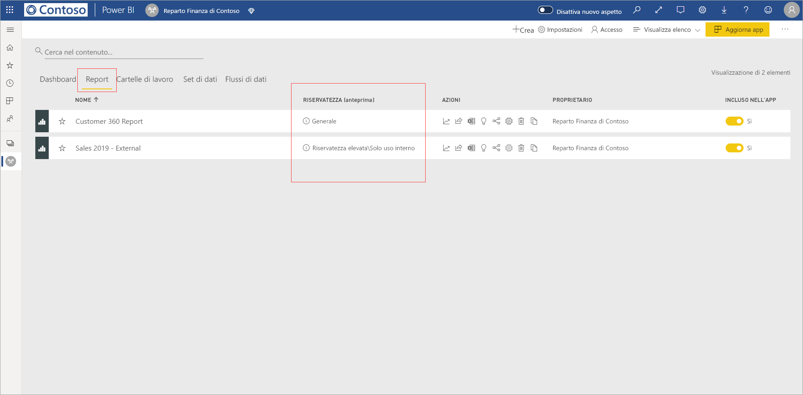
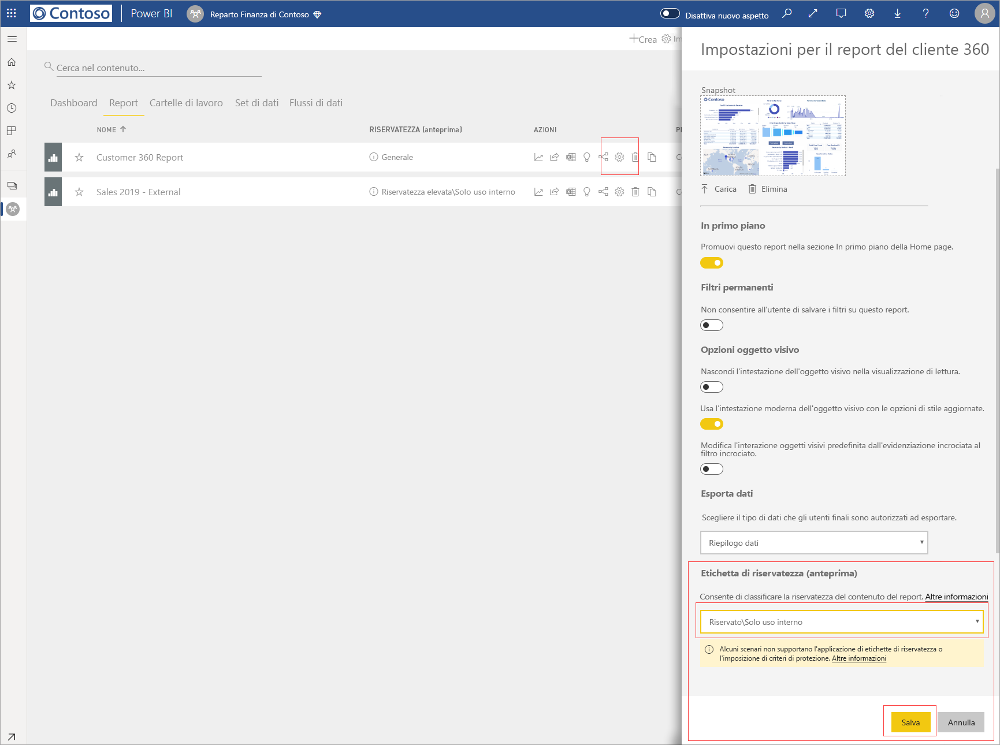
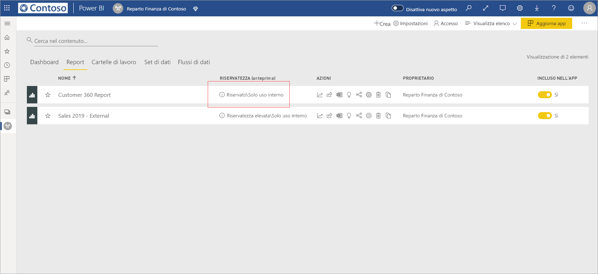
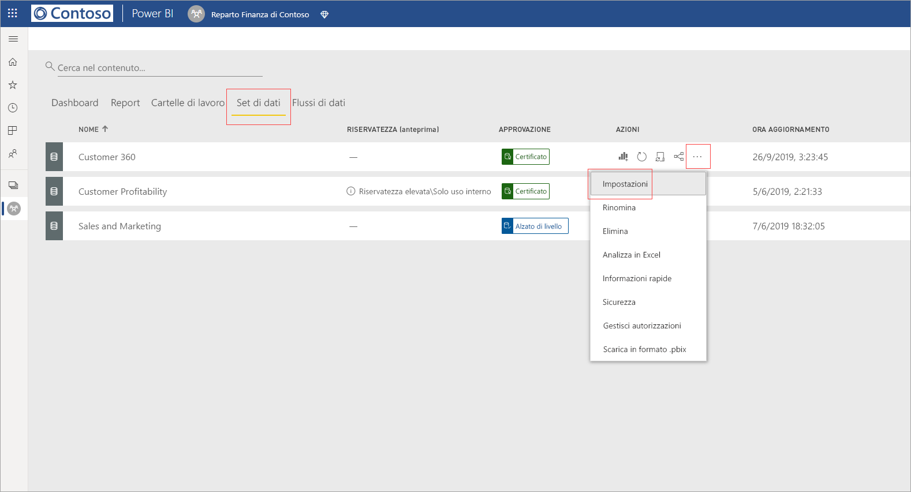
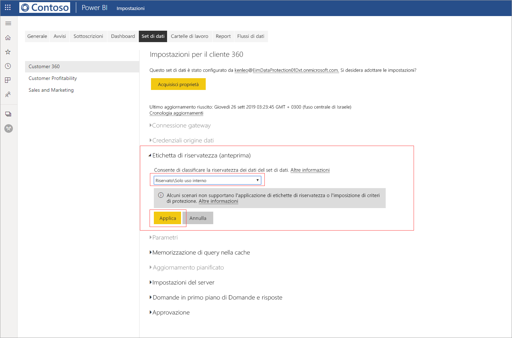
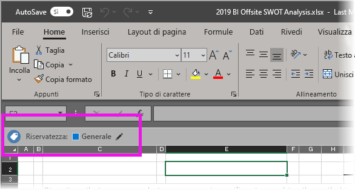

# Applicare le etichette di riservatezza dei dati in Power BI (anteprima)

Quando le etichette di riservatezza sono abilitate nel servizio Power BI, è possibile proteggere i dashboard, i report, i set di dati e i flussi di dati da accessi non autorizzati e da perdite indesiderate applicando etichette di riservatezza dei dati a tali asset. L'applicazione corretta di etichette di riservatezza dei dati consente di assicurarsi che i dati siano accessibili solo alle persone autorizzate.

Quando la protezione dei dati è abilitata, le etichette di riservatezza vengono visualizzate nella colonna Riservatezza nella visualizzazione elenco di dashboard, report, set di dati e flussi di dati.

> [!NOTE]
> Per applicare etichette di riservatezza a dashboard, report, set di dati e flussi di caratteri di Power BI è necessario disporre di determinate licenze e autorizzazioni. Per informazioni dettagliate, vedere [Applicazione delle etichette di riservatezza](#applying-sensitivity-labels).

## Applicazione delle etichette di riservatezza

Per applicare le etichette di riservatezza in Power BI, è necessario che l'utente e l'organizzazione dispongano dei requisiti seguenti:

* L'organizzazione deve aver definito etichette di riservatezza nel [Centro sicurezza Microsoft 365](https://security.microsoft.com/) o nel [Centro conformità Microsoft 365](https://compliance.microsoft.com/).
* L'utente deve appartenere a un gruppo di sicurezza che disponga delle autorizzazioni necessarie per applicare etichette di riservatezza dei dati, come descritto nell'articolo intitolato [Abilitare le etichette di riservatezza dei dati in Power BI (anteprima)](../admin/service-security-enable-data-sensitivity-labels.md#enable-data-sensitivity-labels).
* L'utente deve disporre di una licenza di Power BI Pro e di autorizzazioni di modifica per le risorse a cui vuole assegnare etichette. 
* L'utente deve avere una licenza Premium P1 o Premium P2 di Azure Information Protection. È possibile acquistare una licenza di Microsoft Azure Information Protection autonoma o inclusa in uno dei gruppi di licenze Microsoft. Per informazioni dettagliate, vedere [Prezzi di Azure Information Protection](https://azure.microsoft.com/pricing/details/information-protection/).

Per applicare o modificare un'etichetta di riservatezza in un report, fare clic sull'icona delle impostazioni sulla voce del report nell'elenco dell'area di lavoro e quindi passare alla sezione relativa alla riservatezza dei dati nel riquadro laterale delle impostazioni. Scegliere l'etichetta di riservatezza appropriata e salvare le impostazioni.

Nella colonna Riservatezza viene visualizzata l'etichetta di riservatezza aggiornata. 

Per l'applicazione o la modifica di un'etichetta di riservatezza in un dashboard viene usata la stessa procedura descritta per i report. 

È anche possibile impostare etichette di riservatezza per set di dati e flussi di dati. L'immagine seguente mostra come impostare un'etichetta di riservatezza su un set di dati. I passaggi da seguire per i flussi di data sono simili.

Per impostare un'etichetta di riservatezza su un set di dati, selezionare la scheda dei set di dati, fare clic sui tre puntini di sospensione relativi al set di dati a cui si vuole applicare un'etichetta e scegliere **Impostazioni**.

Nella pagina delle impostazioni per il set di dati aprire la sezione relativa alle etichette di riservatezza, scegliere l'etichetta di riservatezza desiderata e fare clic su **Applica**.

Per l'applicazione o la modifica di un'etichetta di riservatezza in un flusso di dati viene usata la stessa procedura descritta per i set di dati.

## Rimozione delle etichette di riservatezza
Per rimuovere un'etichetta di riservatezza da un report, un dashboard, un set di dati o un flusso di dati, seguire la [stessa procedura usata per applicare le etichette](#applying-sensitivity-labels), ma scegliere **(Nessuno)** quando viene richiesto di classificare la riservatezza dei dati. 

## Protezione dei dati nei file esportati

Quando si [esportano dati da un report](https://docs.microsoft.com/power-bi/consumer/end-user-export) con un'etichetta di riservatezza, quest'ultima viene ereditata dal file generato, ovvero Excel, PowerPoint e PDF. I file CSV non sono supportati. L'etichetta di riservatezza sarà visibile nel file e l'accesso al file sarà limitato a coloro che dispongono di autorizzazioni sufficienti.

## Considerazioni e limitazioni

Per l'applicazione di etichette di riservatezza dei dati tenere presenti le considerazioni seguenti:

* Per l'applicazione e la visualizzazione delle etichette di riservatezza di Microsoft Information Protection in Power BI, è necessaria una licenza Premium P1 o Premium P2 di Azure Information Protection. È possibile acquistare una licenza di Microsoft Azure Information Protection autonoma o inclusa in uno dei gruppi di licenze Microsoft. Per informazioni dettagliate, vedere [Prezzi di Azure Information Protection](https://azure.microsoft.com/pricing/details/information-protection/).
* Le etichette di riservatezza possono essere applicate solo a dashboard, report, set di dati e flussi di dati.
* L'applicazione dei controlli di protezione e delle etichette nei file esportati è supportata solo per i file di Excel, di PowerPoint e in formato PDF. Le etichette e la protezione non vengono applicate quando i dati vengono esportati in file CSV, messaggi di posta elettronica di sottoscrizione, oggetti visivi incorporati e stampe.
* Un utente che esporta un file da Power BI dispone delle autorizzazioni per modificare il file e accedervi in base alle impostazioni dell'etichetta di riservatezza. L'utente che esporta i dati non ottiene le autorizzazioni di proprietario sul file. 
* Le etichette di riservatezza non sono attualmente disponibili per i [report impaginati]( https://docs.microsoft.com/power-bi/paginated-reports-report-builder-power-bi) e le cartelle di lavoro. 
* Le etichette di riservatezza negli asset di Power BI sono visibili solo nell'elenco delle aree di lavoro e nelle visualizzazioni di derivazione. Non sono attualmente visibili nelle visualizzazioni dei contenuti preferiti, condivisi con l'utente, recenti o relativi alle app. Si noti, tuttavia, che un'etichetta applicata a un asset di Power BI, anche se non visibile, rimarrà sempre associata ai dati esportati nei file di Excel, di PowerPoint e in formato PDF.
* L'*impostazione di crittografia dei file* dell'etichetta di riservatezza, configurata nel [Centro sicurezza Microsoft 365](https://security.microsoft.com/) o nel [Centro conformità Microsoft 365](https://compliance.microsoft.com/), si applica solo ai file che vengono *esportati da* Power BI. Non viene applicata *all'interno di* Power BI.
* La [protezione HYOK](https://docs.microsoft.com/azure/information-protection/configure-adrms-restrictions) non è supportata per le etichette applicate in Power BI.
* Per la visualizzazione e l'applicazione di etichette nelle app di Office devono essere soddisfatti determinati [requisiti di licenza](https://docs.microsoft.com/microsoft-365/compliance/get-started-with-sensitivity-labels#subscription-and-licensing-requirements-for-sensitivity-labels).
* Le etichette di riservatezza sono supportate solo per i tenant nel cloud globale (pubblico). Le etichette di riservatezza non sono supportate per i tenant in altri cloud.
* Le etichette di riservatezza non sono supportate per [utenti esterni (utenti guest di Azure Active Directory B2B)](../admin/service-admin-azure-ad-b2b.md). Questo significa che gli utenti esterni non possono visualizzare le etichette e sarà loro impedito di esportare i dati in file di Excel, PDF e PPTX. [Rimuovere l'etichetta](#removing-sensitivity-labels) per consentire agli utenti esterni di esportare i dati in questi tipi di file.

## Passaggi successivi

In questo articolo è stato illustrato come applicare le etichette di riservatezza dei dati in Power BI. Negli articoli seguenti sono riportate altre informazioni sulla protezione dei dati in Power BI. 

* [Panoramica della protezione dei dati in Power BI](../admin/service-security-data-protection-overview.md)
* [Abilitare le etichette di riservatezza dei dati in Power BI](../admin/service-security-enable-data-sensitivity-labels.md)
* [Uso dei controlli di Microsoft Cloud App Security in Power BI](../admin/service-security-using-microsoft-cloud-app-security-controls.md)