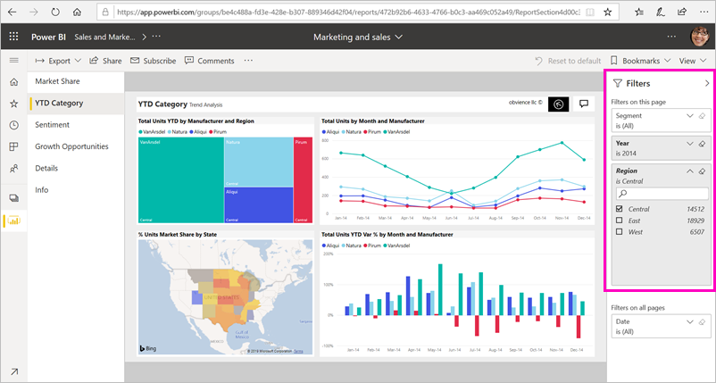

# Filtrare e condividere un report di Power BI
La *condivisione* è un approccio valido per consentire ad alcuni utenti di accedere ai dashboard e ai report. Cosa accade se si vuole condividere una versione filtrata di un report? Si può volere, ad esempio, che il report visualizzi solo i dati relativi a una città, a un venditore o a un anno specifico. Questo articolo illustra come filtrare un report e condividere la versione filtrata di questo. Un altro modo per condividere un report filtrato consiste nell'[aggiungere parametri di query all'URL del report](service-url-filters.md). In entrambi i casi, il report viene filtrato quando i destinatari lo aprono per la prima volta. I destinatari possono annullare le selezioni di filtro nel report.

Power BI offre anche [altri modi per collaborare e distribuire i report](service-how-to-collaborate-distribute-dashboards-reports.md). Con la condivisione, l'utente e i destinatari necessitano di una [licenza Power BI Pro](../fundamentals/service-features-license-type.md). In caso contrario, il contenuto deve avere una [capacità Premium](../admin/service-premium-what-is.md). 

## Dati di esempio per l'apprendimento guidato

Questo articolo usa l'app modello di esempio Sales and Marketing. Si vuole provare? 

1. Installare l'[app modello di esempio Sales and Marketing](https://appsource.microsoft.com/product/power-bi/microsoft-retail-analysis-sample.salesandmarketingsample?tab=Overview).
2. Selezionare l'app e selezionare **Esplora app**.

   

3. Selezionare l'icona a forma di matita per aprire l'area di lavoro installata con l'app.

    

4. Nell'elenco dei contenuti dell'area di lavoro selezionare **Report** e quindi selezionare il report **Sales and Marketing Sample PBIX** (PBIX di esempio Sales and Marketing).

    

    A questo punto è possibile iniziare l'apprendimento guidato.

## Impostare un filtro nel report

Aprire un report nella [visualizzazione di modifica](../consumer/end-user-reading-view.md) e applicare un filtro.

In questo esempio viene filtrata la pagina YTD Category dell'app modello di esempio Marketing and Sales in modo da visualizzare solo i valori dove **Region** è uguale a **Central**. 
 

Salvare il report.

## Condividere il report filtrato

1. Selezionare **Condividi**.

   

2. Deselezionare **Invia notifica tramite posta elettronica ai destinatari** perché sia possibile inviare invece un collegamento filtrato, selezionare **Condividi il report con filtri e filtri dei dati correnti** e quindi selezionare **Condividi**.

    

4. Selezionare di nuovo **Condividi**.

   

5. Selezionare la scheda **Accesso** e quindi **Gestisci visualizzazioni report condivise**.

    

6. Fare clic con il pulsante destro del mouse sull'URL voluto e selezionare **Copia collegamento**.

    

7. Quando si condividerà il collegamento, i destinatari visualizzeranno il report filtrato. 

## Passaggi successivi
* [Modalità per la condivisione del lavoro in Power BI](service-how-to-collaborate-distribute-dashboards-reports.md)
* [Share a dashboard (Condividi un dashboard)](service-share-dashboards.md)
* Altre domande? [Provare la community di Power BI](https://community.powerbi.com/).
* Per inviare suggerimenti, passare al [sito della community di Power BI](https://community.powerbi.com/).
