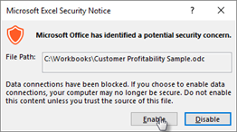

# Esercitazione: Usare Analizza in Excel di Power BI, a partire da Excel

L'organizzazione usa Power BI per condividere l'accesso ai dati. Da Excel si avvia la funzionalità Analizza in Excel di Power BI per creare in Excel tabelle e grafici pivot che possono offrire contesto aggiuntivo ai dati dell'analisi o ridurre il tempo necessario per trovare e importare i set di dati rilevanti.

Per iniziare a usare un set di dati di Power BI, in Excel selezionare "Analizza in Excel". Verrà avviata la creazione guidata di una tabella pivot in cui vengono usati i dati.  

È possibile trovare set di dati aggiuntivi condivisi dall'organizzazione tornando alla pagina Set di dati.

Se si riscontrano problemi in qualsiasi momento, selezionare **No** nel passaggio appropriato del flusso seguente e aggiungere feedback nel modulo collegato.  

In questa esercitazione verranno illustrate le procedure per:

> [!div class="checklist"]
> * Scaricare un file ODC dalla pagina Set di dati di Power BI.
> * Abilitare l'accesso al set di dati da Excel.
> * Iniziare a usare il set di dati per creare tabelle pivot, grafici e fogli di foglio

## Prerequisiti

Per completare questa esercitazione, sono necessari:

* Un account di Power BI. Se non si è ancora iscritti a Power BI, [iscriversi per ottenere una versione di prova gratuita](https://app.powerbi.com/signupredirect?pbi_source=web) prima di iniziare.

* Assicurarsi di avere familiarità con tutti i passaggi descritti nell'esercitazione [Introduzione al servizio Power BI](https://docs.microsoft.com/power-bi/service-get-started).

* Sono necessari un set di dati di Power BI Premium e una licenza di Power BI Pro. Vedere [Che cos'è Power BI Premium?](https://docs.microsoft.com/power-bi/service-premium-what-is) per altre informazioni.

* Per un elenco completo dei prerequisiti, vedere il documento completo [Analizza in Excel](https://docs.microsoft.com/power-bi/service-analyze-in-excel#requirements).

* Una [sottoscrizione di Microsoft Office E5](https://www.microsoft.com/microsoft-365/business/office-365-enterprise-e5-business-software?activetab=pivot%3aoverviewtab) attiva

## Introduzione

Partendo da Excel, selezionare l'opzione per creare tabelle pivot con dati condivisi di Power BI e passare alla pagina Set di dati di Power BI.

Quando si usa il flusso di lavoro Analizza in Excel, vengono visualizzate diverse richieste. Specificare se è stato completato ogni passaggio per poter proseguire. Se in uno dei passaggi si verificano problemi, selezionare **No** e aggiungere commenti nel modulo corrispondente.

## Scaricare e aprire il file ODC

Scegliere il set di dati dall'elenco corrispondente e l'area di lavoro associata, quindi fare clic su Analizza in Excel. Power BI crea un file ODC e lo scarica dal browser nel computer.

Quando il file viene aperto in Excel, viene visualizzato un elenco vuoto per Tabelle pivot e Campi con tutte le tabelle, i campi e le misure del set di dati di Power BI. È possibile creare tabelle pivot, grafici e analizzare tale set di dati esattamente come per un set di dati locale in Excel.

## Abilitare le connessioni dati

Per analizzare i dati di Power BI dati in Excel, è possibile che venga richiesto di verificare l'attendibilità della connessione. Dal portale di amministrazione di Power BI gli amministratori possono disabilitare l'uso di Analizza in Excel con i set di dati locali contenuti in database di Analysis Services.

## Installare aggiornamenti ed eseguire l'autenticazione

La prima volta che si apre un nuovo file ODC, potrebbe anche essere richiesto di eseguire l'autenticazione con l'account di Power BI.  In caso di problemi, vedere il documento completo [Analizza in Excel](https://docs.microsoft.com/power-bi/service-analyze-in-excel#sign-in-to-power-bi ) per altre informazioni oppure fare clic su No durante il flusso di lavoro.

## Analizzare in qualsiasi luogo

Analogamente ad altre cartelle di lavoro locali, la funzionalità Analizza in Excel consente di creare tabelle pivot, grafici, aggiungere dati e creare fogli di lavoro diversi con visualizzazioni nei dati. L'uso di Analizza in Excel consente a tutti gli utenti che dispongono di un'autorizzazione per il set di dati di visualizzare dati dettagliati. È possibile salvare la cartella di lavoro, ma non è possibile pubblicarla o importarla di nuovo in Power BI oppure condividerla con altri utenti dell'organizzazione. Per altre informazioni e altri casi d'uso, vedere [Analizza in Excel](https://docs.microsoft.com/power-bi/service-analyze-in-excel#analyze-away).

## Pulire le risorse

Le interazioni con il servizio Power BI e la pagina Set di dati devono essere limitate al download del file ODC e alla selezione del flusso di lavoro. In caso di problemi con uno di questi passaggi, specificare **No** nel passaggio appropriato e aggiungere commenti nel modulo collegato. Il modulo contiene un collegamento ad altre informazioni riguardanti il problema. Rivedere la pagina Set di dati per riprovare il processo o selezionare un altro set di dati.

## Passaggi successivi

Potrebbero essere interessanti anche gli articoli seguenti:

* [Usare il drill-through tra report in Power BI Desktop](https://docs.microsoft.com/power-bi/desktop-cross-report-drill-through)

* [Uso dei filtri dei dati in Power BI Desktop](https://docs.microsoft.com/power-bi/visuals/power-bi-visualization-slicers)
