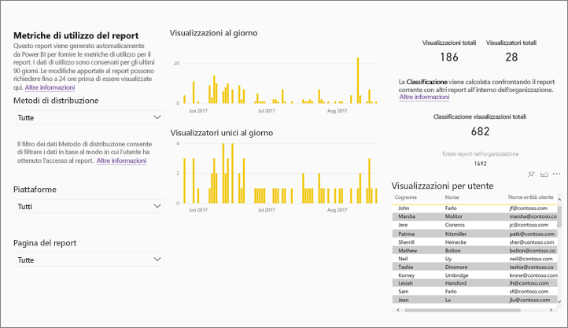
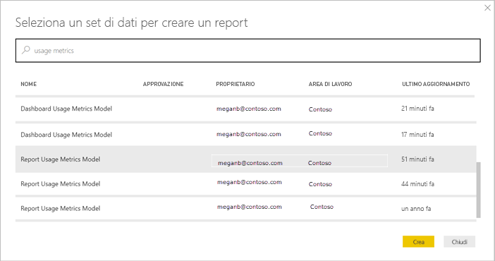
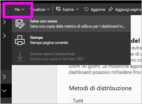
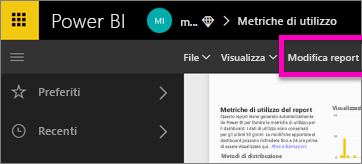

# Monitorare le metriche di utilizzo per dashboard e report di Power BI

Se si creano dashboard e report, le metriche di utilizzo aiutano a comprenderne l'impatto. L'esecuzione di metriche di utilizzo per dashboard o report permette di scoprire come vengono usati questi elementi all'interno dell'organizzazione, chi li usa e per quali scopi.  

I report sulle metriche di utilizzo sono di sola lettura. È comunque possibile copiare un report sulle metriche di utilizzo. La copia crea un report di Power BI standard che è possibile modificare. È anche possibile creare report personalizzati in Power BI Desktop in base al set di dati sottostante, che contiene le metriche di utilizzo per tutti i dashboard o i report in un'area di lavoro. Per iniziare, il report copiato mostra le metriche solo per il report o il dashboard selezionato. È possibile rimuovere il filtro predefinito e accedere al set di dati sottostante, con tutte le metriche di utilizzo dell'area di lavoro selezionata. Potrebbero essere visibili anche i nomi di utenti specifici, se l'amministratore ha acconsentito.

> [!NOTE]
> Le metriche di utilizzo tengono traccia dei report incorporati in SharePoint Online. Le metriche di utilizzo, tuttavia, non tengono traccia di dashboard e report incorporati tramite il flusso di tipo "le credenziali sono di proprietà dell'utente" o "le credenziali sono di proprietà dell'app". Le metriche di utilizzo non tengono inoltre traccia dell'utilizzo di report incorporati report tramite [Pubblica sul Web](service-publish-to-web.md).

## Perché sono importanti le metriche di utilizzo

Sapere come viene usato il contenuto consente di dimostrare l'impatto e assegnare priorità agli interventi. Le metriche di utilizzo possono mostrare che uno dei report viene utilizzato ogni giorno da un importante segmento dell'organizzazione e potrebbe mostrare che un dashboard creato dall'utente non viene affatto visualizzato. Questo tipo di commenti e suggerimenti è estremamente utile nel guidare gli interventi.

È possibile eseguire report sulle metriche di utilizzo solo nel servizio Power BI. Se tuttavia si salva un report sulle metriche di utilizzo o lo si aggiunge a un dashboard, è possibile aprire e usare il report nei dispositivi mobili.

## Prerequisiti

- Per eseguire ed accedere ai dati delle metriche di utilizzo è necessaria una licenza di Power BI Pro. La funzionalità delle metriche di utilizzo acquisisce tuttavia le informazioni sull'utilizzo da tutti gli utenti, indipendentemente dalla licenza a loro assegnata.
- Per accedere alle metriche di utilizzo per un determinato dashboard o report, è necessario avere accesso in modifica al dashboard o report.
- L'amministratore di Power BI deve avere abilitato le metriche di utilizzo per gli autori di contenuti. L'amministratore di Power BI potrebbe anche avere abilitato la raccolta di dati per ogni utente nelle metriche di utilizzo. Vedere come [abilitare queste opzioni nel portale di amministrazione](../admin/service-admin-portal.md#control-usage-metrics). 

## Visualizzare un report Metrica di utilizzo

1. Iniziare nell'area di lavoro che contiene il dashboard o report.
2. Dall'elenco del contenuto dell'area di lavoro o dallo stesso dashboard o report, selezionare l'icona di **Metriche di utilizzo** .

    

    
3. La prima volta che si esegue questa operazione, Power BI crea un report sulle metriche di utilizzo e avvisa l'utente appena è pronto.

    
4. Per vedere i risultati, selezionare **Visualizza metriche di utilizzo**.

    Le metriche di utilizzo sono un potente alleato quando si distribuiscono e si aggiornano dashboard e report di Power BI. Come scegliere quali pagine del report è utile mantenere e quali eliminare? Sezionare in base alla **pagina del report** per scoprirlo. Come determinare se è opportuno creare un layout mobile per il dashboard? Sezionare in base alle **piattaforme** per scoprire quanti utenti accedono al contenuto tramite l'app per dispositivi mobili e quanti tramite il Web browser.

5. Facoltativamente, passare il puntatore del mouse su una visualizzazione e selezionare l'icona a forma di puntina per aggiungere la visualizzazione a un dashboard. In alternativa, dalla barra dei menu superiore selezionare **Aggiungi pagina dinamica** per aggiungere l'intera pagina a un dashboard. Dal dashboard è possibile monitorare le metriche di utilizzo con maggiore facilità oppure condividerle con altri utenti.

    > [!NOTE]
    > Se si aggiunge un riquadro da un report sulle metriche di utilizzo a un dashboard, non è possibile aggiungere tale dashboard a un'app.

### Report Metriche di utilizzo del dashboard

### Report Metriche di utilizzo del report

## Informazioni sul report Metriche di utilizzo

Quando si seleziona **Metriche di utilizzo** o l'icona  accanto a un dashboard o a un report, Power BI genera un report predefinito con le metriche di utilizzo per tale contenuto relative agli ultimi 90 giorni,  che avrà un aspetto molto simile ai report di Power BI con cui si ha già familiarità. È possibile filtrare i dati a seconda della modalità di accesso degli utenti finali, a seconda del fatto che accedano tramite un'app Web o per dispositivi portatili e così via. Man mano che i dashboard e i report si evolvono, si evolve anche il report sulle metriche di utilizzo, che viene aggiornato quotidianamente con i nuovi dati.  

I report sulle metriche di utilizzo non vengono visualizzati in **Recenti**, **Aree di lavoro**, **Preferiti** o in altri elenchi di contenuti. Non possono essere aggiunti a un'app. Se si aggiunge un riquadro da un report sulle metriche di utilizzo a un dashboard, non è possibile aggiungere tale dashboard a un'app.

Per analizzare i dati dei report o creare report personalizzati in base al set di dati sottostante, sono disponibili due opzioni: 

- Creare una copia del report nel servizio Power BI. Vedere [Salvare una copia del report sulle metriche di utilizzo](#save-a-copy-of-the-usage-metrics-report) più avanti in questo articolo per informazioni dettagliate.
- Connettersi al set di dati da Power BI Desktop. Per ogni area di lavoro, il set di dati ha il nome "Report Usage Metrics Model" (Modello di report Metrica di utilizzo). Vedere [Stabilire una connessione a un set di dati pubblicato](../connect-data/desktop-report-lifecycle-datasets.md#establish-a-power-bi-service-live-connection-to-the-published-dataset) per informazioni dettagliate.

    

## Quali metriche vengono inserite nel report?

| Metrica | Dashboard | Report | Descrizione |
| --- | --- | --- | --- |
| Filtro dei dati del metodo di distribuzione |sì |sì |Il modo in cui gli utenti hanno ottenuto l'accesso al contenuto. Sono disponibili 3 metodi: gli utenti possono accedere al dashboard o al report se sono membri di un'[area di lavoro](../consumer/end-user-experience.md), consentendo la [condivisione del proprio contenuto](service-share-dashboards.md) o installando un pacchetto di contenuto o un'app.  Si noti che le visualizzazioni tramite app sono conteggiate come "pacchetto di contenuto". |
| Filtro dei dati delle piattaforme |sì |sì |L'accesso al dashboard o al report è stato eseguito attraverso il servizio Power BI (PowerBI.com) o un dispositivo mobile? I dispositivi mobili includono tutte le app per iOS, Android e Windows. |
| Filtro dei dati pagine del report |no |sì |Se il report contiene più di una pagina filtrarlo in base alla pagina (o alle pagine) visualizzata. Se viene visualizzata un'opzione di elenco per "Vuoto", significa che la pagina del report è stata aggiunta di recente (entro 24 ore il nome effettivo della nuova pagina viene visualizzato nell'elenco del filtro dei dati) e/o che le pagine del report sono state eliminate. "Vuoto" acquisisce questo tipo di situazioni. |
| Visualizzazioni al giorno |sì |sì |Numero totale delle visualizzazioni al giorno: per visualizzazione si intende il caricamento di una pagina del report o del dashboard da parte di un utente. |
| Visualizzatori unici al giorno |sì |sì |Numero di utenti *diversi* che hanno visualizzato il dashboard o il report (in base all'account utente AAD). |
| Visualizzazioni per utente |sì |sì |Numero di visualizzazioni negli ultimi 90 giorni, suddivise per i singoli utenti. |
| Condivisioni al giorno |sì |no |Numero di volte in cui il dashboard è stato condiviso con un altro utente o gruppo. |
| Visualizzazioni totali |sì |sì |Numero di visualizzazioni negli ultimi 90 giorni. |
| Visualizzatori totali |sì |sì |Numero di visualizzatori unici negli ultimi 90 giorni. |
| Condivisioni totali |sì |no |Numero di volte in cui il dashboard o il report è stato condiviso negli ultimi 90 giorni. |
| Totale nell'organizzazione |sì |sì |Conteggio di tutti i dashboard o report in tutta l'organizzazione che sono stati visualizzati almeno una volta negli ultimi 90 giorni.  Usato per calcolare la classificazione. |
| Classificazione: Visualizzazioni totali |sì |sì |Per le visualizzazioni totali di tutti i dashboard o i report nell'organizzazione negli ultimi 90 giorni, dove si classifica questo dashboard o report. |
| Classificazione: Condivisioni totali |sì |no |Per le condivisioni totali di tutti i dashboard nell'organizzazione negli ultimi 90 giorni, dove si classifica questo dashboard o report. |

## Salvare una copia del report sulle metriche di utilizzo

Usare **Salva con nome** per convertire il report sulle metriche di utilizzo in un normale report di Power BI che è possibile personalizzare per soddisfare esigenze specifiche. È anche possibile usare Power BI Desktop per creare report sulle metriche di utilizzo personalizzati in base al set di dati sottostante. Vedere [Stabilire una connessione a un set di dati pubblicato](../connect-data/desktop-report-lifecycle-datasets.md#establish-a-power-bi-service-live-connection-to-the-published-dataset) per informazioni dettagliate.

In più, il set di dati sottostante include i dettagli di utilizzo per tutti i dashboard o report nell'area di lavoro. Diventano così disponibili altre possibilità. Si potrebbe ad esempio creare un report che confronti tutti i dashboard nell'area di lavoro in base all'utilizzo. Oppure, è possibile creare un dashboard sulle metriche di utilizzo per l'app Power BI aggregando i dati di utilizzo per tutti i contenuti distribuiti all'interno dell'app.  Vedere come rimuovere il filtro e [visualizzare tutte le metriche di utilizzo per l'area di lavoro](#see-all-workspace-usage-metrics) più avanti in questo articolo.

### Creare una copia del report di utilizzo

Quando si crea una copia del report di utilizzo di sola lettura pre-compilato, Power BI crea una copia modificabile del report. A prima vista non c'è alcuna differenza. Tuttavia, dopo questa operazione è possibile aprire il report nella visualizzazione di modifica, aggiungere visualizzazioni, filtri e pagine, modificare o eliminare le visualizzazioni esistenti e molto altro ancora. Power BI salva il nuovo report nell'area di lavoro corrente.

1. Nel report sulle metriche di utilizzo pre-compilato, selezionare **File > Salva con nome**. Power BI crea un report di Power BI modificabile, salvato nell'area di lavoro corrente.

    
2. Aprire il report nella Visualizzazione di modifica e [interagire con esso come si farebbe con qualsiasi altro report di Power BI](../create-reports/service-interact-with-a-report-in-editing-view.md). Ad esempio, aggiungere nuove pagine e creare nuove visualizzazioni, aggiungere filtri, formattare i tipi di carattere e i colori, e così via.

    
3. Il nuovo report viene salvato nella scheda **Report** nell'area di lavoro corrente e aggiunto all'elenco di contenuto **Recenti**.

    

## Vedere *tutte* le metriche di utilizzo per l'area di lavoro

Per visualizzare le metriche per tutti i dashboard o per tutti i report nell'area di lavoro, è necessario rimuovere un filtro. Per impostazione predefinita, il report viene filtrato per visualizzare le metriche solo per il dashboard o report usato per la creazione.

1. Selezionare **Modifica report** per aprire il report nella visualizzazione di modifica.

    
2. Nel riquadro Filtri individuare il bucket **Filtri a livello di report** e rimuovere il filtro selezionando l'icona a forma di gomma accanto a **ReportGuid**.

    

    A questo punto il report personalizzato visualizza le metriche per l'intera area di lavoro.

## Controlli di amministrazione di Power BI per le metriche di utilizzo

I report sulle metriche di utilizzo sono una funzionalità che l'amministratore di Power BI o Office 365 può attivare o disattivare. Gli amministratori hanno un controllo granulare sugli utenti autorizzati ad accedere alle metriche di utilizzo. L'accesso alle metriche è **attivato** per impostazione predefinita per tutti gli utenti dell'organizzazione.

> [!NOTE]
> Solo gli amministratori del tenant di Power BI possono vedere il portale di amministrazione e modificare le impostazioni. 

Per impostazione predefinita, i dati per utente sono abilitati nelle metriche di utilizzo e le informazioni sull'account del consumer di contenuto sono incluse nel report delle metriche. Se gli amministratori non vogliono esporre queste informazioni per alcuni o tutti gli utenti, possono disabilitare la funzionalità per specifici gruppi di sicurezza o per un'intera organizzazione. Le informazioni sull'account vengono quindi visualizzate nel report come *Senza nome*.

Quando disabilitano le metriche di utilizzo per l'intera organizzazione, gli amministratori possono usare l'opzione **Elimina tutto il contenuto della metrica di utilizzo esistente** per eliminare tutti i report esistenti e i riquadri di dashboard creati usando i report sulle metriche di utilizzo. Questa opzione rimuove completamente l'accesso ai dati delle metriche di utilizzo per tutti gli utenti dell'organizzazione che le usano. L'eliminazione del contenuto delle metriche di utilizzo esistente è irreversibile.

Vedere [Controllare le metriche di utilizzo](../admin/service-admin-portal.md#control-usage-metrics) nell'articolo del portale di amministrazione per informazioni dettagliate su queste impostazioni. 

## Metriche di utilizzo nei cloud nazionali

Power BI è disponibile in cloud nazionali separati. Questi cloud offrono gli stessi livelli di sicurezza, privacy, conformità e trasparenza della versione globale di Power BI, in combinazione con un modello univoco per le normative locali per l'erogazione dei servizi, la residenza dei dati, l'accesso e il controllo. A causa di questo modello univoco per i regolamenti locali, le metriche di utilizzo non sono disponibili nei cloud nazionali. Per altre informazioni, vedere [Cloud nazionali](https://powerbi.microsoft.com/clouds/).

## Considerazioni e limiti

### Discrepanze tra log di controllo e metriche di utilizzo

È importante comprendere le differenze che possono verificarsi quando si confrontano i log di controllo e le metriche di utilizzo e il motivo di tali differenze. I *log di controllo* vengono raccolti usando i dati del servizio Power BI e le *metriche di utilizzo* vengono raccolte nel client. I conteggi aggregati delle attività nei log di controllo potrebbero non corrispondere sempre alle metriche di utilizzo, per i motivi seguenti:

* Le metriche di utilizzo potrebbero talvolta sottostimare le attività a causa di connessioni di rete non coerenti, funzionalità di blocco degli annunci o altri problemi che possono interrompere l'invio di eventi dal client.
* Alcuni tipi di visualizzazioni non sono inclusi nelle metriche di utilizzo, come descritto in precedenza in questo articolo.
* Le metriche di utilizzo potrebbero talvolta sovrastimare le attività, ad esempio quando il client viene aggiornato senza necessità di inviare una richiesta al servizio Power BI.

### Altre considerazioni

È necessario visualizzare il contenuto dell'area di lavoro, dall'interno di questa, almeno una volta. Se non risulta neanche una visualizzazione del contenuto dall'area di lavoro stessa, non viene creata la correlazione dei dati dalle visualizzazioni dell'applicazione nel report Metriche di utilizzo. Per sbloccare l'elaborazione dei dati per questo report, è sufficiente visualizzare il contenuto dell'area di lavoro almeno una volta.

## Domande frequenti

Oltre alle potenziali differenze tra i log di controllo e le metriche di utilizzo, le domande e risposte seguenti sulle metriche di utilizzo possono essere utili per gli utenti e gli amministratori:

**D:**    non è possibile eseguire le metriche di utilizzo per un dashboard o un report

**R:**    è possibile visualizzare solo le metriche di utilizzo di cui si è proprietari o che si è autorizzati a modificare.

**D:**    le metriche di utilizzo acquisiscono viste da dashboard e report incorporati?

**R:**    le metriche di utilizzo attualmente non supportano l'acquisizione dell'utilizzo per dashboard e report incorporati e per il flusso [Pubblica sul Web](service-publish-to-web.md). In questi casi, è consigliabile usare le piattaforme di analisi Web esistenti per tenere traccia dell'utilizzo dell'app o del portale di hosting.

**D:**    non è possibile eseguire le metriche di utilizzo in nessun contenuto.

**R1:**    gli amministratori possono disattivare questa funzionalità per la loro organizzazione.  Contattare l'amministratore per verificare se è questo il caso.

**R2:**    le metriche di utilizzo sono una funzionalità di Power BI Pro.

**D:**    i dati non sembrano essere aggiornati. Ad esempio, i metodi di distribuzione non vengono visualizzati, mancano le pagine del report e così via.

**R:**    l'aggiornamento dei dati può richiedere fino a 24 ore.

**D:**    ci sono quattro report nell'area di lavoro, ma il report sulle metriche di utilizzo ne visualizza solo tre.

**R:**    il report sulle metriche di utilizzo include solo i report (o i dashboard) a cui gli utenti hanno avuto accesso negli ultimi 90 giorni.  Se un report (o dashboard) non viene visualizzato, è probabile che non sia stato usato per più di 90 giorni.

## Passaggi successivi

[Amministrazione di Power BI nel portale di amministrazione](../admin/service-admin-portal.md)

Altre domande? [Provare la community di Power BI](https://community.powerbi.com/)
