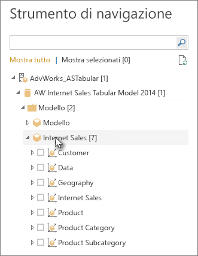

# Connettersi ai dati tabulari di Analysis Services in Power BI Desktop
Con Power BI Desktop è possibile connettersi in due modi ai modelli tabulari di SQL Server Analysis Services e recuperare dati da tali modelli: Esplorare usando una connessione dinamica o selezionare gli elementi e importarli in Power BI Desktop,

come verrà illustrato nelle sezioni successive.

**Esplorare usando una connessione dinamica**: quando si usa una connessione dinamica, gli elementi nel modello tabulare o nella prospettiva, come tabelle, colonne e misure, vengono visualizzati nell'elenco del riquadro **Campi** di Power BI Desktop. È possibile usare gli strumenti di visualizzazione e report avanzati di Power BI Desktop per esplorare il modello tabulare in modi nuovi e altamente interattivi.

Durante la connessione in tempo reale, non viene importato alcun dato dal modello tabulare in Power BI Desktop. Ogni volta che si interagisce con una visualizzazione, Power BI Desktop esegue una query sul modello tabulare e calcola i risultati visualizzati. I dati visualizzati sono sempre quelli più recenti disponibili nel modello tabulare, dall'ultima elaborazione o dalle tabelle DirectQuery disponibili nel modello tabulare. 

Tenere presente che i modelli tabulari sono molto sicuri. Gli elementi visualizzati in Power BI Desktop dipendono dalle autorizzazioni per il modello tabulare a cui si è connessi.

Dopo aver creato i report dinamici in Power BI Desktop, è possibile condividerli con la pubblicazione nel sito di Power BI. Quando si pubblica un file di Power BI Desktop con una connessione dinamica a un modello tabulare nel sito di Power BI, è necessario che il gateway dati locale sia installato e configurato da un amministratore. Per altre informazioni, vedere [Gateway dati locale](service-gateway-onprem.md).

**Selezionare gli elementi e importarli in Power BI Desktop**: quando ci si connette con questa opzione, è possibile selezionare elementi quali tabelle, colonne e misure nel modello tabulare o nella prospettiva e caricarli in un modello di Power BI Desktop. Usare l'editor di Power Query di Power BI Desktop per definire con più precisione i dati desiderati e le funzionalità di modellazione dell'editor per modellare ulteriormente i dati. Poiché non viene gestita alcuna connessione dinamica tra Power BI Desktop e il modello tabulare, è quindi possibile esplorare il modello di Power BI Desktop offline o pubblicarlo nel sito di Power BI.

## Per connettersi a un modello tabulare
1. Nella scheda **Home** di Power BI Desktop selezionare **Recupera dati** > **Altro** > **Database**.
   
1. Selezionare **Database di SQL Server Analysis Services** e quindi **Connetti**.
   
   
3. Nella finestra **Database di SQL Server Analysis Services** immettere il nome di **Server**, scegliere una modalità di connessione e quindi selezionare **OK**.
   
   
4. Questo passaggio nella finestra **Strumento di navigazione** dipende dalla modalità di connessione selezionata:

   - Se si esegue la connessione in modalità dinamica, selezionare un modello tabulare o una prospettiva.
  
      
   - Se si sceglie di selezionare gli elementi e recuperare i dati, selezionare un modello tabulare o una prospettiva e quindi selezionare una tabella o una colonna specifica da caricare. Per effettuare il data shaping prima del caricamento, selezionare **Modifica query** per aprire l'editor di Power Query. Quando si è pronti, selezionare **Carica** per importare i dati in Power BI Desktop.

      

## Domande frequenti
**Domanda:** è necessario un gateway dati locale?

**Risposta:** Dipende. Se si usa Power BI Desktop per la connessione dinamica a un modello tabulare, ma non si ha intenzione di pubblicare nel sito di Power BI, non è necessario un gateway. Se invece si intende eseguire la pubblicazione nel sito di Power BI, un gateway dati è necessario per stabilire comunicazioni protette tra il servizio Power BI e il server Analysis Services locale. È opportuno rivolgersi all'amministratore del server Analysis Services prima di installare un gateway dati.

Se si sceglie di selezionare gli elementi e recuperare i dati, i dati del modello tabulare vengono importati direttamente nel file di Power BI Desktop e pertanto non è necessario alcun gateway.

**Domanda:** qual è la differenza tra la connessione in tempo reale a un modello tabulare dal servizio Power BI rispetto alla connessione in tempo reale da Power BI Desktop?

**Risposta:** durante la connessione dinamica a un modello tabulare dal sito nel servizio Power BI a un database locale di Analysis Services all'interno dell'organizzazione, è necessario un gateway dati locale per proteggere le comunicazioni. Quando si stabilisce una connessione dinamica a un modello tabulare da Power BI Desktop, non è necessario un gateway perché sia Power BI Desktop sia il server di Analysis Services a cui ci si connette sono in esecuzione in locale all'interno dell'organizzazione. Tuttavia, se si pubblica il file di Power BI Desktop nel sito di Power BI, è necessario un gateway.

**Domanda:** se è stata creata una connessione dinamica, è possibile connettersi a un'altra origine dati nello stesso file di Power BI Desktop?

**Risposta:** No. Non è possibile esplorare i dati con una connessione dinamica e connettersi a un altro tipo di origine dati nello stesso file. Se sono già stati importati dati o ci si è connessi a un'origine dati diversa in un file di Power BI Desktop, sarà necessario creare un nuovo file per esplorare con una connessione dinamica.

**Domanda:** se è stata creata una connessione dinamica, è possibile modificare il modello o la query in Power BI Desktop?

**Risposta:** è possibile creare misure a livello di report in Power BI Desktop, ma tutte le altre funzionalità di query e modellazione sono disabilitate durante l'esplorazione di dati dinamici.

**Domanda:** una connessione dinamica è protetta?

**Risposta:** Sì. Per connettersi al server Analysis Services vengono usate le credenziali di Windows correnti. Non è possibile usare credenziali di base o credenziali archiviate nel servizio Power BI o in Power BI Desktop durante l'esplorazione con una connessione dinamica.

**Domanda:** nello strumento di navigazione vengono visualizzati un modello e una prospettiva. Qual è la differenza?

**Risposta:** una prospettiva è una visualizzazione specifica di un modello tabulare. Può includere solo particolari tabelle, colonne o misure in base a un'esigenza di analisi dati univoci. Un modello tabulare contiene sempre almeno una prospettiva, che potrebbe includere tutti gli elementi nel modello. Se non si è certi della prospettiva da selezionare, rivolgersi all'amministratore.

**Domanda:** esistono altre funzionalità di Analysis Services che modificano il comportamento di Power BI?

**Risposta:** Sì. A seconda delle funzionalità usate dal modello tabulare, l'esperienza in Power BI Desktop può cambiare. Di seguito sono riportati alcuni esempi:
* Le misure del modello possono essere raggruppate nella parte superiore dell'elenco del riquadro **Campi** anziché nelle tabelle insieme alle colonne. La modalità d'uso delle misure è sempre la stessa. In questo modo è solo più facile trovarle.

* Se per il modello tabulare sono definiti gruppi di calcolo, sarà possibile usarli solo in combinazione con le misure del modello e non con le misure implicite create aggiungendo campi numerici a un oggetto visivo. Per il modello può anche essere impostato manualmente il flag **DiscourageImplicitMeasures**, che produce lo stesso effetto. Per altre informazioni, vedere [Gruppi di calcolo in Analysis Services](https://docs.microsoft.com/analysis-services/tabular-models/calculation-groups#benefits).

## Per modificare il nome del server dopo la connessione iniziale
Dopo aver creato un file di Power BI Desktop con una connessione di esplorazione dinamica, possono verificarsi alcuni casi in cui si vuole passare la connessione a un server diverso. Ad esempio, se è stato creato il file di Power BI Desktop quando ci si connette a un server di sviluppo e prima di pubblicarlo nel servizio Power BI, si vuole passare la connessione al server di produzione.

Per modificare il nome del server:

1. Selezionare **Modifica query** dalla scheda **Home**.

2. Nella finestra **Database di SQL Server Analysis Services** immettere il nuovo nome di **Server** e quindi selezionare **OK**.

   
## Risoluzione dei problemi 
L'elenco seguente descrive tutti i problemi noti relativi alla connessione a SQL Server Analysis Services (SSAS) o ad Azure Analysis Services: 

* **Errore: non è stato possibile caricare lo schema del modello**: questo errore si verifica in genere quando l'utente che si connette ad Analysis Services non ha accesso al database o al modello.

