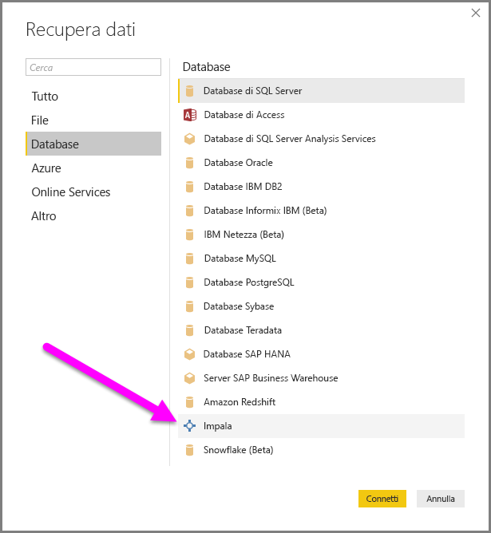
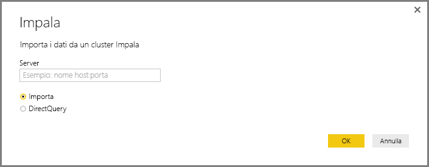
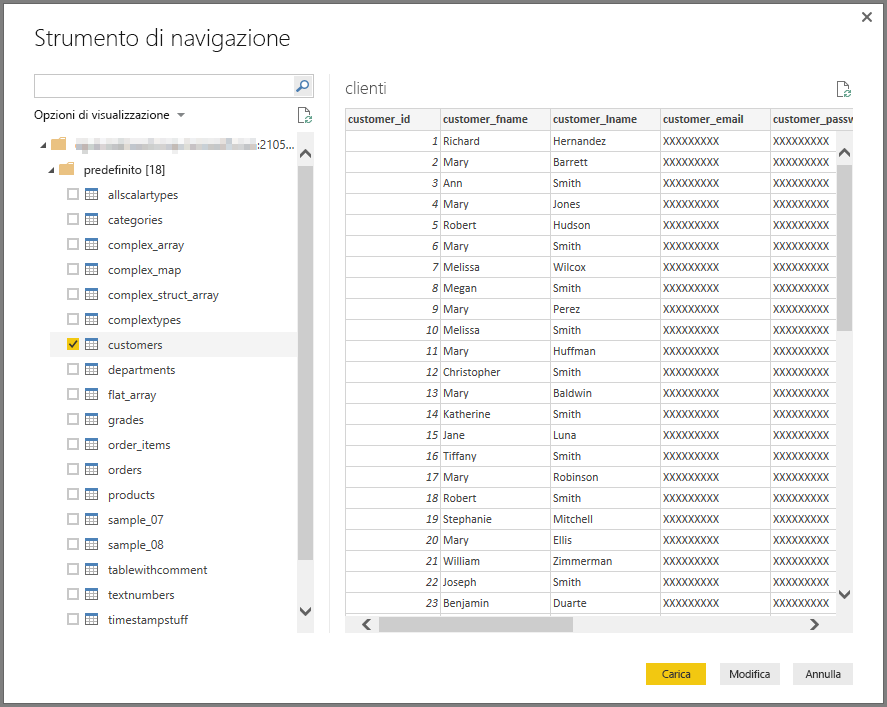

# Connettersi a un database Impala in Power BI Desktop
In Power BI Desktop è possibile connettersi a un database **Impala** e usare i dati sottostanti esattamente come qualsiasi altra origine dati di Power BI Desktop.

## Connettersi a un database Impala
Per connettersi a un database **Impala**, eseguire questa procedura: 

1. Selezionare **Recupera dati** nella scheda **Home** della barra multifunzione in Power BI Desktop. 

2. Selezionare **Database** nelle categorie a sinistra. Verrà visualizzato **Impala**.

    

3. Nella finestra **Impala** che viene visualizzata digitare o incollare il nome del server Impala nella casella. Selezionare quindi **OK**. È possibile **importare** i dati direttamente in Power BI oppure usare **DirectQuery**. Leggere altre informazioni sull'[uso di DirectQuery](desktop-use-directquery.md).

    

4. Quando richiesto, immettere le credenziali o connettersi in modo anonimo. Il connettore per Impala supporta l'autenticazione anonima di base (nome utente + password) e l'autenticazione di Windows.

    

    > [!NOTE]
    > Dopo avere inserito il nome utente e la password per un particolare server **Impala**, Power BI Desktop usa quelle stesse credenziali nei successivi tentativi di connessione. Le credenziali possono essere modificate selezionando **File > Opzioni e impostazioni > Impostazioni origine dati**.

5. Dopo la connessione, viene visualizzata la finestra **Strumento di navigazione** in cui sono presenti i dati disponibili nel server. Scegliere da questi dati gli elementi da importare e usare in **Power BI Desktop**.

    

## Considerazioni e limitazioni
Ci sono alcune limitazioni e considerazioni da tenere presenti con il connettore per **Impala**:

* Il connettore per Impala è supportato nel gateway dati locale, tramite uno dei tre meccanismi di autenticazione supportati.

## Passaggi successivi
Con Power BI Desktop è possibile connettersi a molte origini dati diverse. Per altre informazioni sulle origini dati, vedere le risorse seguenti:

* [Che cos'è Power BI Desktop?](../fundamentals/desktop-what-is-desktop.md)
* [Origini dati in Power BI Desktop](desktop-data-sources.md)
* [Effettuare il data shaping e combinare i dati con Power BI Desktop](desktop-shape-and-combine-data.md)
* [Connettersi a cartelle di lavoro di Excel in Power BI Desktop](desktop-connect-excel.md)   
* [Immettere dati direttamente in Power BI Desktop](desktop-enter-data-directly-into-desktop.md)   
