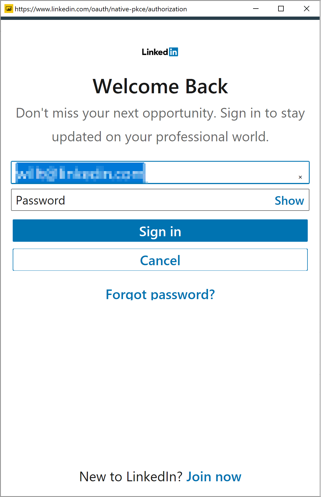

# Connettersi a LinkedIn Sales Navigator in Power BI Desktop

In **Power BI Desktop** è possibile connettersi a **LinkedIn Sales Navigator** per individuare e creare relazioni esattamente come con qualsiasi altra origine dati in Power BI Desktop e creare report sullo stato di avanzamento pronti per l'uso.

Per connettersi ai dati di LinkedIn usando **LinkedIn Sales Navigator**, è necessario avere un piano di LinkedIn Sales Navigator Enterprise ed essere un amministratore o un utente report nel contratto Sales Navigator.

Il video seguente offre una breve panoramica e un'esercitazione per l'uso dell'app modello **LinkedIn Sales Navigator**, descritta in dettaglio [più avanti in questo articolo](#using-the-linkedin-sales-navigator-template-app). 

> [!VIDEO https://www.youtube.com/embed/ZqhmaiORLw0]

## Connettersi a LinkedIn Sales Navigator

Per connettersi ai dati di **LinkedIn Sales Navigator**, selezionare **Dati** nella barra multifunzione **Home** in Power BI Desktop. Selezionare **Servizi online** dalle categorie a sinistra e scorrere fino a visualizzare **LinkedIn Sales Navigator (Beta)** .

Verrà visualizzato un messaggio che indica che ci si sta connettendo a un connettore di terze parti che è ancora in fase di sviluppo. 

Quando si seleziona **Continua**, viene chiesto di specificare da dove si vogliono recuperare i dati.

Nella finestra **LinkedIn Sales Navigator** visualizzata selezionare i dati che si vuole vengano restituiti, *All contacts* (Tutti i contatti) o *Selected contacts* (Contatti selezionati) dal primo selettore a discesa. È quindi possibile specificare le date di inizio e di fine per vincolare i dati ricevuti a un determinato intervallo di tempo.

Una volta specificate le informazioni, Power BI Desktop si connette ai dati associati al contratto LinkedIn Sales Navigator. Usare lo stesso indirizzo di posta elettronica usato per accedere a LinkedIn Sales Navigator tramite il sito Web. 

Una volta eseguito l'accesso, viene richiesto di selezionare i dati del contratto LinkedIn Sales Navigator dalla finestra **Navigator**.

È possibile creare qualsiasi report con i dati di LinkedIn Sales Navigator. Per semplificare le operazioni, è disponibile anche un file con estensione pbix di LinkedIn Sales Navigator che è possibile scaricare e che include dati di esempio già disponibili, in modo da acquisire familiarità con i dati e i report, senza dover iniziare da zero.

È possibile scaricare il file con estensione pbix dalla posizione seguente:
* [PBIX per LinkedIn Sales Navigator](service-template-apps-samples.md)

Oltre al file con estensione pbix, LinkedIn Sales Navigator ha anche un'app modello che è possibile scaricare e usare. La sezione successiva descrive in modo dettagliato l'app modello.

## Uso dell'app modello di LinkedIn Sales Navigator

Per semplificare l'uso di **LinkedIn Sales Navigator**, è possibile usare [l'app modello](service-template-apps-overview.md) che crea un report pronto all'uso con i dati di LinkedIn Sales Navigator.

Quando si scarica l'app, è possibile scegliere se connettersi ai propri dati o esplorare l'app con dati di esempio. È sempre possibile tornare indietro e connettersi ai propri dati di LinkedIn Sales Navigator dopo aver esplorato i dati di esempio. 

È possibile ottenere l'app modello di **LinkedIn Sales Navigator** dal collegamento seguente:
* [App modello di LinkedIn Sales Navigator](https://appsource.microsoft.com/en-us/product/power-bi/pbi-contentpacks.linkedin_navigator)

L'app modello include quattro schede che consentono di analizzare e condividere le informazioni:

* Usage
* Ricerca
* InMail
* SSI

Nella scheda **Usage** (Utilizzo) vengono visualizzati i dati globali di LinkedIn Sales Navigator.

La scheda**Search** (Cerca) consente di analizzare i risultati della ricerca:

La scheda **InMail** offre dati analitici sull'uso di InMail, incluso il numero di messaggi inviati, le percentuali di accettazione e altre informazioni utili:

La scheda **SSI** offre dettagli aggiuntivi sull'indice SSI (Social Selling Index):

Per passare dai dati di esempio ai propri dati, selezionare **modifica app** nell'angolo superiore destro (l'icona a forma di matita) e quindi selezionare **Connettere i dati** dalla schermata visualizzata.

Da qui è possibile connettere i propri dati, selezionando il numero di giorni per cui caricare i dati. È possibile caricare fino a 365 giorni di dati. Eseguire l'accesso, ancora una volta usando lo stesso indirizzo di posta elettronica usato per accedere a LinkedIn Sales Navigator tramite il sito Web. 

In seguito l'app modello aggiorna i dati nell'app con i dati dell'utente. È anche possibile configurare un aggiornamento pianificato, in modo che i dati nell'app siano aggiornati in base alla frequenza specificata. 

Una volta aggiornati i dati, è possibile visualizzare l'app popolata con i propri dati.

## Chiedere assistenza

Se si verificano problemi durante la connessione ai dati, è possibile contattare il supporto di LinkedIn Sales Navigator all'indirizzo https://www.linkedin.com/help/sales-navigator. 

## Passaggi successivi
È possibile connettersi a molti tipi di dati usando Power BI Desktop. Per altre informazioni sulle origini dati, vedere le risorse seguenti:

* [Che cos'è Power BI Desktop?](../fundamentals/desktop-what-is-desktop.md)
* [Origini dati in Power BI Desktop](desktop-data-sources.md)
* [Effettuare il data shaping e combinare i dati con Power BI Desktop](desktop-shape-and-combine-data.md)
* [Connettersi a cartelle di lavoro di Excel in Power BI Desktop](desktop-connect-excel.md)   
* [Immettere dati direttamente in Power BI Desktop](desktop-enter-data-directly-into-desktop.md)   
