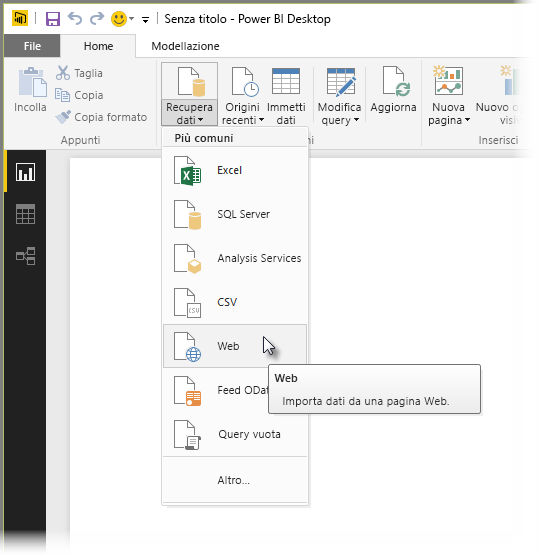
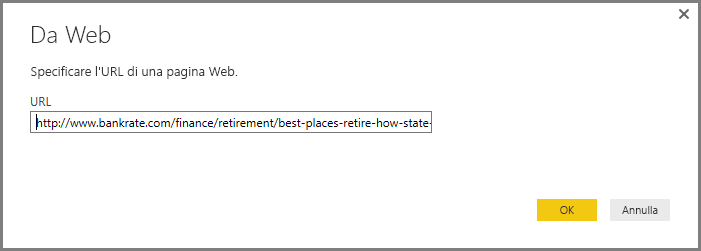
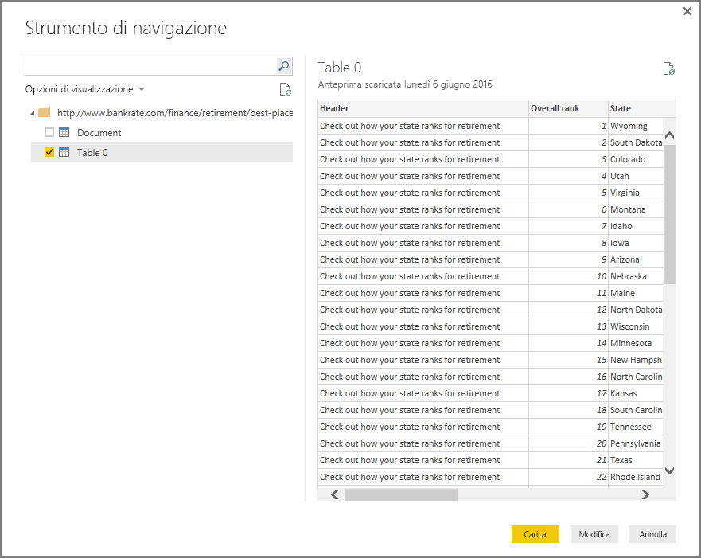
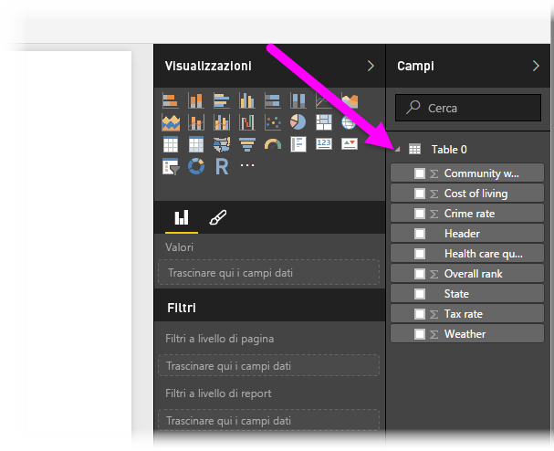

# Connettersi a pagine Web da Power BI Desktop

È possibile connettersi a una pagina Web e importarne i dati in Power BI Desktop per usarli negli oggetti visivi e nei modelli di dati.

In Power BI Desktop selezionare **Recupera dati > Web** dalla barra multifunzione **Home**.

Viene visualizzata una finestra di dialogo che richiede l'URL della pagina Web da cui si vogliono importare i dati.

Dopo avere digitato o incollato l'URL, selezionare **OK**. Power BI Desktop si connette alla pagina, quindi presenta i dati disponibili della pagina nella finestra **Strumento di navigazione**. Quando si seleziona uno degli elementi di dati disponibili, ad esempio una tabella dell'intera pagina, la finestra **Strumento di navigazione** mostra un'anteprima dei dati sul lato destro.

È possibile scegliere il pulsante **Modifica**, che avvia l'**Editor di query**, in cui è possibile modificare e trasformare i dati nella pagina Web prima di importarla in Power BI Desktop. In alternativa, è possibile selezionare il pulsante **Carica** e importare tutti i gli elementi di dati selezionati nel riquadro sinistro.

Quando si seleziona **Carica**, Power BI Desktop importa gli elementi selezionati e li rende disponibili nel riquadro **Campi**, disponibile nel lato destro della visualizzazione Report in Power BI Desktop.

Non è necessario eseguire altre operazioni per connettersi a una pagina Web e importarne i dati in Power BI Desktop.

È quindi possibile trascinare i campi nell'area di disegno Report e creare tutte le visualizzazioni necessarie. È anche possibile usare i dati dalla pagina Web esattamente come si usano altri dati, ovvero è possibile modificarli, creare relazioni tra i dati e altre origini dati nel modello ed eseguire le operazioni necessarie per creare il report di Power BI desiderato.

Per altre informazioni sulla connessione a una pagina Web, vedere [Introduzione a Power BI Desktop](../fundamentals/desktop-getting-started.md).

## Passaggi successivi
È possibile connettersi a molti tipi di dati usando Power BI Desktop. Per altre informazioni sulle origini dati, vedere le risorse seguenti:

* [Origini dati in Power BI Desktop](desktop-data-sources.md)
* [Effettuare il data shaping e combinare i dati con Power BI Desktop](desktop-shape-and-combine-data.md)
* [Connettersi a cartelle di lavoro di Excel in Power BI Desktop](desktop-connect-excel.md)   
* [Connettersi a file CSV in Power BI Desktop](desktop-connect-csv.md)   
* [Immettere dati direttamente in Power BI Desktop](desktop-enter-data-directly-into-desktop.md)   
