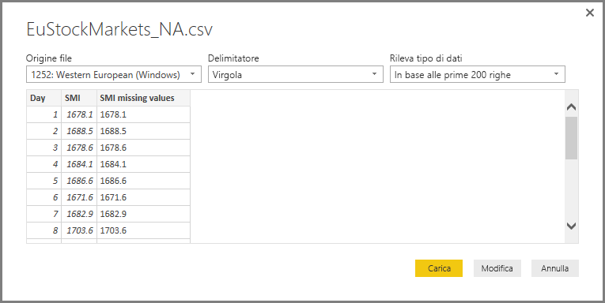
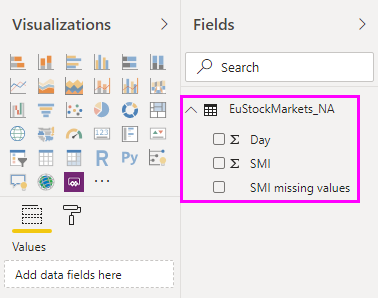
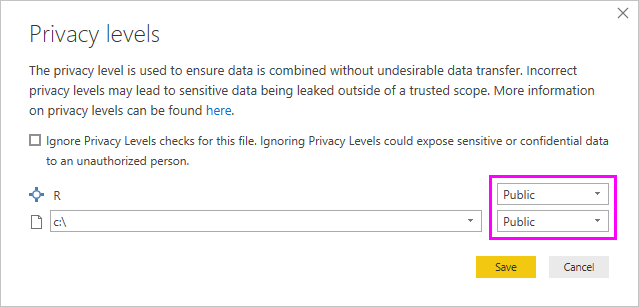
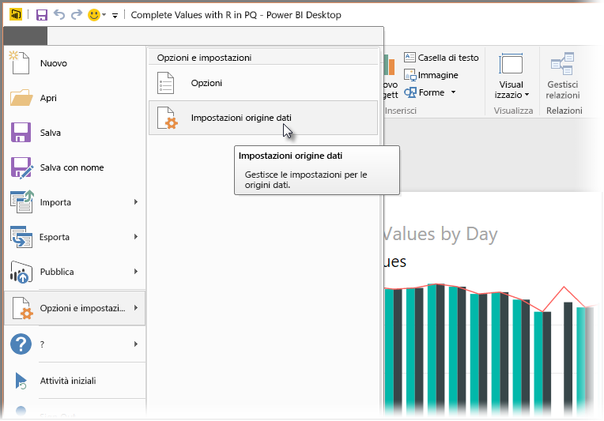

# <a name="use-r-in-power-query-editor"></a>Usare R nell'Editor di Power Query

[Il linguaggio R](https://mran.microsoft.com/documents/what-is-r) è un potente linguaggio di programmazione usato da numerosi esperti di statistica, data scientist e analisti di dati. È possibile usare R nell'editor di Power Query di Power BI Desktop per eseguire queste operazioni:

* Preparare i modelli di dati.

* Creare report.

* Eseguire attività di pulizia dei dati, modifica avanzata della forma dei dati e analisi dei set di dati, inclusi il completamento dei dati mancanti, le stime, il clustering e altro ancora.  

## <a name="install-r"></a>Installare R

È possibile scaricare R gratuitamente dalla [pagina di download di Revolution R Open](https://mran.revolutionanalytics.com/download/) e dal [repository CRAN](https://cran.r-project.org/bin/windows/base/).

## <a name="install-mice"></a>Installare mice

Come prerequisito, è necessario installare la [libreria mice](https://www.rdocumentation.org/packages/mice/versions/3.5.0/topics/mice) nell'ambiente R. Senza mice, il codice degli script di esempio non funziona correttamente. Il pacchetto mice implementa un metodo per gestire i dati mancanti.

Per installare la libreria mice:

1. Avviare il programma R.exe, ad esempio C:\Programmi\Microsoft\R Open\R-3.5.3\bin\R.exe.  

2. Eseguire il comando install dal prompt di R:

   ``` 
   install.packages('mice') 
   ```

## <a name="use-r-in-power-query-editor"></a>Usare R nell'Editor di Power Query

Per illustrare l'uso di R nell'editor di Power Query si userà un set di dati di esempio del mercato azionario contenuto in un file con estensione csv e si eseguirà la procedura seguente:

1. [Scaricare il file EuStockMarkets_NA.csv](https://download.microsoft.com/download/F/8/A/F8AA9DC9-8545-4AAE-9305-27AD1D01DC03/EuStockMarkets_NA.csv). Ricordare il percorso in cui viene salvato.

1. Caricare il file in Power BI Desktop. Nella scheda **Home** selezionare **Recupera dati** > **Testo/CSV**.

   

1. Selezionare il file EuStockMarkets_NA.csv e quindi scegliere **Apri**. I dati CSV vengono visualizzati nella finestra di dialogo del **file di testo/CSV**.

   

1. Selezionare **Carica** per caricare i dati dal file. Dopo che Power BI ha caricato i dati, la nuova tabella viene visualizzata nel riquadro **Campi**.

   

1. Per aprire l'editor di Power Query, nella scheda **Home** della barra multifunzione selezionare **Modifica query**.

   

1. Dalla scheda **Trasformazione** selezionare **Esegui script R**. Verrà visualizzato l'editor **Esegui script R**. Nelle righe 15 e 20 mancano dei dati, così come in altre righe che non sono visibili nell'immagine. La procedura seguente mostra come usare R per completare automaticamente le righe.

   

1. Per questo esempio, immettere il codice di script seguente nella casella **Script** della finestra di **Esegui script R**. Sostituire *&lt;Your File Path&gt;* con il percorso del file EuStockMarkets_NA.csv nel file system locale, ad esempio C:/Utenti/John Doe/Documenti/Microsoft/EuStockMarkets_NA.csv.

    ```r
       dataset <- read.csv(file="<Your File Path>/EuStockMarkets_NA.csv", header=TRUE, sep=",")
       library(mice)
       tempData <- mice(dataset,m=1,maxit=50,meth='pmm',seed=100)
       completedData <- complete(tempData,1)
       output <- dataset
       output$completedValues <- completedData$"SMI missing values"
    ```

    > [!NOTE]
    > Potrebbe essere necessario sovrascrivere una variabile denominata *output* per creare correttamente il nuovo set di dati con i filtri applicati.

7. Selezionare **OK**. L'editor di Power Query mostrerà un avviso relativo alla privacy dei dati.

   
8. Nel messaggio di avviso selezionare **Continua**. Nella finestra di dialogo **Livelli di privacy** visualizzata impostare tutte le origini dati su **Pubblico** per fare in modo che gli script R funzionino correttamente nel servizio Power BI. 

   

   Per altre informazioni sulle impostazioni di privacy e sulle relative implicazioni, vedere [Livelli di privacy di Power BI Desktop](../admin/desktop-privacy-levels.md).

 9. Selezionare **Salva** per eseguire lo script. 

   Si noti una nuova colonna nel riquadro **Campi** denominata **completedValues**. Si noti che alcuni elementi dati risultano mancanti, ad esempio nelle righe 15 e 18. Scoprire come questo problema viene gestito in R nella prossima sezione.

   Con appena cinque righe di script R, l'editor di Power Query ha inserito i valori mancanti con un modello predittivo.

## <a name="create-visuals-from-r-script-data"></a>Creare oggetti visivi da dati di script R

È ora possibile creare un oggetto visivo per verificare in che modo il codice dello script R con la libreria mice completa i valori mancanti.


È possibile salvare tutti gli oggetti visivi completati in un file con estensione pbix di Power BI Desktop e usare il modello di dati e i relativi script R nel servizio Power BI.

> [!NOTE]
> È possibile scaricare un [file con estensione pbix](https://download.microsoft.com/download/F/8/A/F8AA9DC9-8545-4AAE-9305-27AD1D01DC03/Complete%20Values%20with%20R%20in%20PQ.pbix) con tutti questi passaggi completati.

Dopo aver caricato il file con estensione pbix nel servizio Power BI, è necessario eseguire altri passaggi per abilitare l'aggiornamento dei dati del servizio e gli oggetti visivi aggiornati:  

* **Abilitare l'aggiornamento pianificato per il set di dati**: per abilitare l'aggiornamento pianificato per la cartella di lavoro che contiene il set di dati con gli script R, vedere l'articolo [Configurare l'aggiornamento pianificato](refresh-scheduled-refresh.md), in cui sono incluse informazioni anche sui gateway personali.

* **Installare un gateway personale**: è necessario che sia installato un gateway personale nel computer in cui si trovano il file e l'installazione di R. Il servizio Power BI accede a tale cartella di lavoro ed esegue nuovamente il rendering degli oggetti visivi aggiornati. Per altre informazioni, vedere [Usare i gateway personali in Power BI](service-gateway-personal-mode.md).

## <a name="limitations"></a>Limitazioni

Esistono alcune limitazioni per le query che includono script R creati nell'editor di Power Query:

* Tutte le impostazioni dell'origine dati R devono essere impostate su **Pubblico**. Anche tutti gli altri passaggi in una query dell'editor di Power Query devono essere pubblici. 

   Per ottenere le impostazioni dell'origine dati, in Power BI Desktop selezionare **File** > **Opzioni e impostazioni** > **Impostazioni origine dati**.

   

   Nella finestra di dialogo **Impostazioni origine dati** selezionare una o più origini dati e quindi selezionare **Modifica autorizzazioni**. Impostare **Livello di privacy** su **Pubblico**.

     
  
* Per pianificare l'aggiornamento degli oggetti visivi o del set di dati R, abilitare l'aggiornamento pianificato e installare un gateway personale nel computer in cui si trovano la cartella di lavoro e l'installazione di R. 

Con R e le query personalizzate è possibile eseguire molte operazioni. Esplorare i dati ed effettuare il data shaping per visualizzare i dati nel modo desiderato.

## <a name="next-steps"></a>Passaggi successivi

* [Introduzione a R](https://mran.microsoft.com/documents/what-is-r) 

* [Eseguire script R in Power BI Desktop](desktop-r-scripts.md) 

* [Usare un IDE R esterno con Power BI](desktop-r-ide.md) 

* [Creare oggetti visivi usando pacchetti R nel servizio Power BI](service-r-packages-support.md)
