# <a name="tutorial-shape-and-combine-data-in-power-bi-desktop"></a>Esercitazione: Data shaping e combinazione di dati in Power BI Desktop

Con Power BI Desktop è possibile connettersi a molti tipi diversi di origini dati e quindi modificare la forma dei dati in base alle esigenze, consentendo la creazione di report visivi da condividere con altri utenti. Per *data shaping* si intende la trasformazione dei dati: ridenominazione di colonne o tabelle, trasformazione del testo in numeri, rimozione di righe, impostazione della prima riga come intestazione e così via. Per *combinazione* dei dati si intende la connessione di due o più origini dati, il data shaping necessario e quindi il consolidamento dei dati in un'unica query utile.

In questa esercitazione verrà illustrato come:

* Modificare la forma dei dati usando l'Editor di query.
* Connettersi a varie origini dati.
* Combinare le origini dati e creare un modello di dati da usare nei report.

Questa esercitazione descrive come modificare la forma di una query usando Power BI Desktop ed evidenzia le attività più comuni. La query usata in questo esempio viene descritta in modo più dettagliato, con indicazioni anche su come creare la query partendo da zero, in [Introduzione a Power BI Desktop](../fundamentals/desktop-getting-started.md).

L'Editor di query in Power BI Desktop usa ampiamente i menu di scelta rapida e la barra multifunzione **Trasforma**. La maggior parte delle opzioni che è possibile selezionare nella barra multifunzione è disponibile anche facendo clic con il pulsante destro del mouse su un elemento, ad esempio una colonna, e scegliendo un'opzione dal menu visualizzato.

## <a name="shape-data"></a>Data shaping
Quando si eseguono operazioni di data shaping nell'Editor di query, si forniscono istruzioni dettagliate, eseguite automaticamente dall'Editor di query, che permettono di modificare i dati durante la fase di caricamento e di presentazione. L'origine dati originale non subisce alcuna modifica. Viene modificata, o sottoposta a *data shaping*, solo questa vista specifica dei dati.

I passaggi specificati (ad esempio rinominare una tabella, trasformare un tipo di dati o eliminare una colonna) vengono registrati dall'Editor di query. Ogni volta che questa query si connette all'origine dati, l'Editor di query esegue tali passaggi in modo che i dati abbiano sempre la forma specificata. Questo processo si verifica ogni volta che si usa l'Editor di query oppure per chiunque usi la query condivisa, ad esempio nel servizio Power BI. Questi passaggi vengono acquisiti, in sequenza, nel riquadro **Impostazioni query** in **Passaggi applicati**. Tutti questi passaggi verranno esaminati nei paragrafi seguenti.

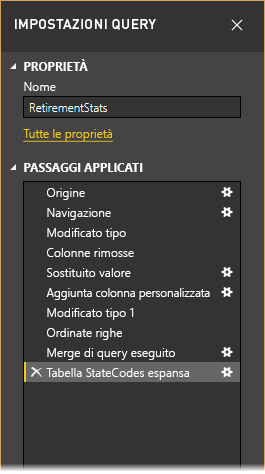

Da [Introduzione a Power BI Desktop](../fundamentals/desktop-getting-started.md) si useranno i dati relativi al pensionamento, ottenuti con una connessione a un'origine dati Web, per eseguire il data shaping in base alle esigenze. Si aggiungerà una colonna personalizzata per calcolare il rango in base al presupposto che tutti i dati siano fattori uguali e si confronterà questa colonna con la colonna esistente **Rank**.  

1. Dalla barra multifunzione **Aggiungi colonna** selezionare **Colonna personalizzata**, che consente di aggiungere una colonna personalizzata.

    

1. Nella finestra **Colonna personalizzata**, in **Nome nuova colonna** immettere _New Rank_. In **Formula colonna personalizzata** immettere i dati seguenti:

    ```
    ([Cost of living] + [Weather] + [Health care quality] + [Crime] + [Tax] + [Culture] + [Senior] + [#"Well-being"]) / 8
    ```
 
1. Verificare che il messaggio di stato sia *Non sono stati rilevati errori di sintassi* e selezionare **OK**.

    

1. Per mantenere la coerenza dei dati della colonna, trasformare in numeri interi i nuovi valori della colonna. Per modificarli, fare clic con il pulsante destro del mouse sull'intestazione di colonna e quindi scegliere **Modifica tipo \> Numero intero**. 

    Se è necessario scegliere più di una colonna, selezionare una colonna, tenere premuto **MAIUSC**, selezionare altre colonne adiacenti e quindi fare clic con il pulsante destro del mouse su un'intestazione di colonna. È anche possibile usare **CTRL** per selezionare colonne non adiacenti.

    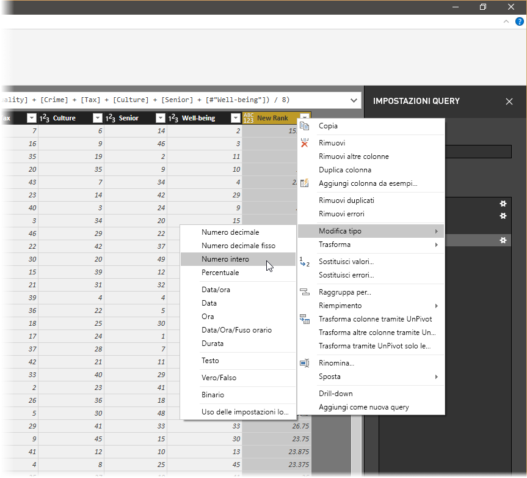

1. Per *trasformare* i tipi di dati della colonna, in cui si trasforma il tipo di dati corrente in un altro, selezionare **Tipo di dati: Testo** dalla barra multifunzione **Trasforma**. 

   

1. In **Impostazioni query** l'elenco **Passaggi applicati** riflette tutti i passaggi di data shaping applicati ai dati. Per rimuovere un passaggio dal processo di data shaping, selezionare la **X** a sinistra del passaggio. 

    Nell'immagine seguente l'elenco **Passaggi applicati** riflette i passaggi aggiunti finora: 
     - **Origine**: connessione al sito Web.
     - **Navigazione**: selezione della tabella. 
     - **Modificato tipo**: modifica delle colonne di numeri basate su testo da *Testo* a *Numero intero*. 
     - **Aggiunta colonna personalizzata**: aggiunta di una colonna personalizzata.
     - **Modificato tipo 1**: ultimo passaggio applicato.

       

## <a name="adjust-data"></a>Modificare i dati

Prima di poter usare questa query, è necessario apportare alcune modifiche per sistemare i dati:

   - Modificare le classificazioni rimuovendo una colonna.

       Si è deciso che **Cost of living** non è un fattore significativo nei risultati. Dopo la rimozione di questa colonna si noterà che i dati rimangono invariati. 

   - Correggere alcuni errori.

       Dato che è stata rimossa una colonna, è necessario adattare i calcoli nella colonna **New Rank** modificando una formula.

   - Ordinare i dati.

       Ordinare i dati in base alle colonne **New Rank** e **Rank**.
 
   - Sostituire i dati.

       Verrà illustrato come sostituire un valore specifico ed evidenziata la necessità di inserire un **passaggio applicato**.

   - Modificare il nome della tabella. 

       Poiché **Table 0** non è un descrittore utile per la tabella, il nome verrà modificato.

1. Per rimuovere la colonna **Cost of living**, selezionare la colonna, scegliere la scheda **Home** della barra multifunzione e quindi selezionare **Rimuovi colonne**.

    

   Si noti che i valori di **New Rank** non sono cambiati, a causa dell'ordine dei passaggi. Poiché l'Editor di query registra i passaggi in sequenza, ma indipendentemente uno dall'altro, in **Passaggi applicati** è possibile spostare ogni passaggio applicato verso l'alto o verso il basso nella sequenza. 

1. Fare clic con il pulsante destro del mouse su un passaggio. L'Editor di query visualizza un menu che consente di eseguire le attività seguenti: 
   - **Rinomina**: rinominare il passaggio.
   - **Elimina**: eliminare il passaggio.
   - **Elimina** **fino alla fine**: rimuovere il passaggio corrente e tutti i passaggi successivi.
   - **Sposta su**: spostare il passaggio verso l'alto nell'elenco.
   - **Sposta giù**: spostare il passaggio verso il basso nell'elenco.

1. Spostare l'ultimo passaggio, **Rimosse colonne**, subito sopra il passaggio **Aggiunta colonna personalizzata**.

   

1. Selezionare il passaggio **Aggiunta colonna personalizzata**. 

   Si noti che i dati ora mostrano un _errore_ che sarà necessario risolvere.

   

   È possibile ottenere altre informazioni su ogni errore in diversi modi. Se si seleziona la cella senza fare clic sulla parola *Errore*, l'Editor di query visualizza le informazioni sull'errore nella parte inferiore della finestra.

   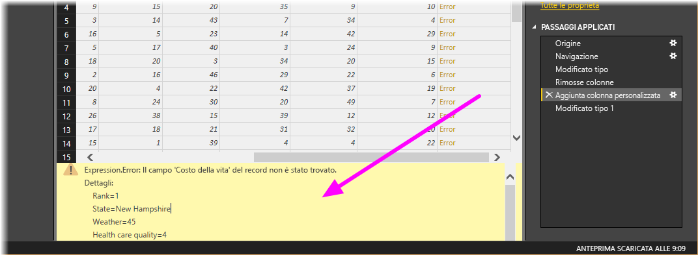

   Se si seleziona direttamente la parola *Errore*, l'Editor di query crea una sezione **Passaggi applicati** nel riquadro **Impostazioni query** e visualizza le informazioni sull'errore. 

1. Poiché non è necessario visualizzare informazioni sugli errori, selezionare **Annulla**.

1. Per risolvere gli errori, selezionare la colonna **New Rank**, quindi visualizzare la formula dei dati della colonna selezionando la casella di controllo **Barra della formula** nella scheda **Visualizza**. 

   

1. Rimuovere il parametro _Cost of living_ e decrementare il divisore, modificando la formula come segue: 
   ```
    Table.AddColumn(#"Removed Columns", "New Rank", each ([Weather] + [Health care quality] + [Crime] + [Tax] + [Culture] + [Senior] + [#"Well-being"]) / 7)
   ```

1. Selezionare il segno di spunta verde a sinistra della casella della formula o premere **INVIO**.

  L'Editor di query sostituisce i dati con i valori modificati e il passaggio **Aggiunta colonna personalizzata** viene completato senza errori.

   > [!NOTE]
   > È anche possibile selezionare **Rimuovi errori**, usando la barra multifunzione o il menu di scelta rapida, che rimuove tutte le righe che contengono errori, ma in questa esercitazione non è stato fatto perché si volevano mantenere i dati nella tabella.

1. Ordinare i dati in base alla colonna **New Rank**. Selezionare prima di tutto l'ultimo passaggio applicato, **Tipo modificato 1** per visualizzare i dati più recenti. Selezionare quindi l'elenco a discesa accanto all'intestazione di colonna **New Rank** e selezionare **Ordinamento crescente**.

   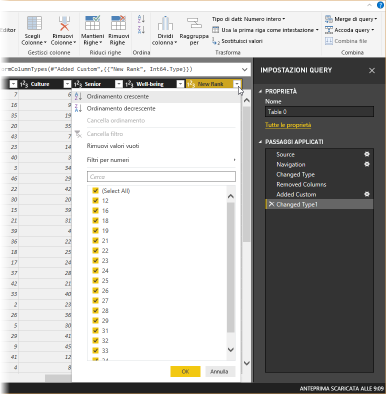

   I dati sono ora ordinati in base a **New Rank**. Se tuttavia si osserva la colonna **Rank**, si noterà che i dati non sono ordinati correttamente nei casi in cui il valore di **New Rank** è un valore equivalente. Il problema verrà risolto nel passaggio successivo.

1. Per risolvere il problema di ordinamento dei dati, selezionare la colonna **New Rank** e sostituire la formula nella **Barra della formula** con la formula seguente:

   ```
    = Table.Sort(#"Changed Type1",{{"New Rank", Order.Ascending},{"Rank", Order.Ascending}})
   ```

1. Selezionare il segno di spunta verde a sinistra della casella della formula o premere **INVIO**. 

   Le righe sono ora ordinate sia in base a **New Rank** che a **Rank**. In **Passaggi applicati** è anche possibile selezionare un passaggio in un punto qualsiasi dell'elenco e continuare con il data shaping in questo punto della sequenza. L'Editor di query inserisce automaticamente un nuovo passaggio dopo quello attualmente selezionato in **Passaggi applicati**. 

1. In **Passaggi applicati** selezionare il passaggio che precede la colonna personalizzata, ovvero il passaggio **Rimosse colonne**. In questo esempio verrà sostituito il valore del rango **Weather** in Arizona. Fare clic con il pulsante destro del mouse sulla cella appropriata che contiene il rango **Weather** dell'Arizona e scegliere **Sostituisci valori**. Notare il **passaggio applicato** attualmente selezionato.

   

1. Selezionare **Inserisci**.

    Poiché si sta inserendo un passaggio, l'Editor di query avvisa del pericolo di questa operazione. I passaggi successivi potrebbero causare l'interruzione della query. 

    

1. Impostare il valore dei dati su _51_. 

   L'Editor di query sostituisce i dati per l'Arizona. Quando si crea un nuovo **passaggio applicato**, l'Editor di query assegna al passaggio un nome in base all'azione, in questo caso **Sostituito valore**. Se sono presenti più passaggi con lo stesso nome nella query, l'Editor di query aggiunge un numero (in sequenza) a ogni **passaggio applicato** successivo per distinguerli.

1. Selezionare l'ultimo **passaggio applicato**, **Ordinate righe**. 

   Si noti che sono cambiati i dati relativi alla nuova classificazione di Arizona. Questa modifica si verifica perché è stato inserito il passaggio **Sostituito valore** nella posizione corretta, prima del passaggio **Aggiunta colonna personalizzata**.

1. Infine, vien ora modificato il nome della tabella in uno più descrittivo. Nel riquadro **Impostazioni query**, in **Proprietà** immettere il nuovo nome della tabella e quindi selezionare **Immetti**. Assegnare a questa tabella il nome *RetirementStats*.

   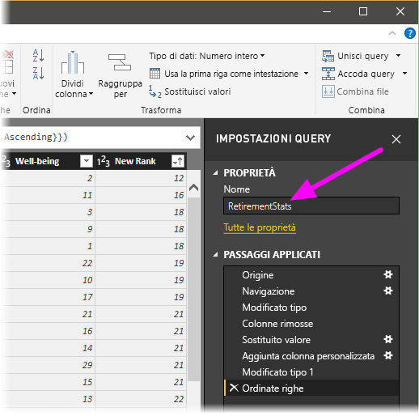

   Quando si inizia a creare i report, è utile usare nomi di tabella descrittivi, soprattutto nel caso di una connessione a più origini dati, elencate nel riquadro **Campi** della vista **Report**.

   Il data shaping è stato completato nel modo desiderato. Ci si connetterà ora a un'altra origine dati per combinare i dati.

## <a name="combine-data"></a>Combinare i dati
I dati sui diversi stati sono interessanti e saranno utili per la creazione di analisi e query aggiuntive. Esiste tuttavia un problema: la maggior parte dei dati usa un'abbreviazione di due lettere per i codici relativi allo stato, non il nome completo dello stato. È necessario trovare un modo per associare i nomi degli stati e le rispettive abbreviazioni.

Fortunatamente, è disponibile un'altra origine dati pubblica che esegue proprio questa operazione, ma è necessaria una quantità elevata di data shaping prima che sia possibile connettersi alla tabella relativa al pensionamento. Per modificare la forma dei dati, seguire questa procedura:

1. Nella barra multifunzione **Home** dell'Editor di query selezionare **Nuova origine \> Web**. 

2. Immettere l'indirizzo del sito Web per le abbreviazioni degli stati, *https://en.wikipedia.org/wiki/List_of_U.S._state_abbreviations* e quindi selezionare **Connetti**.

   Lo strumento di navigazione visualizza il contenuto del sito Web.

    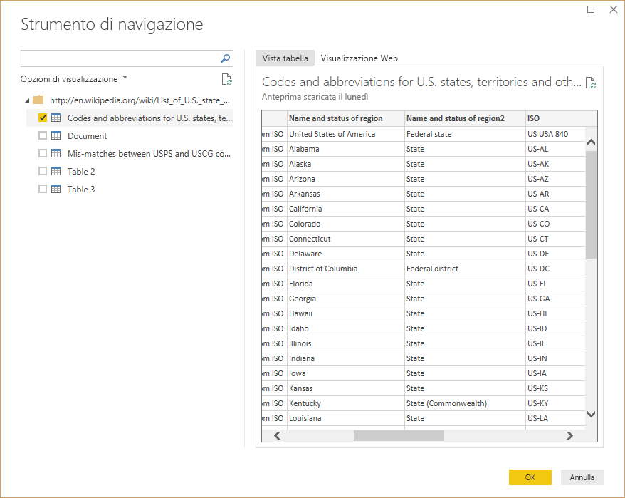

1. Selezionare **Codes and abbreviations** (Codici e abbreviazioni). 

   > [!TIP]
   > Saranno necessarie alcune operazioni di data shaping per ridurre la quantità di dati della tabella. Esiste un modo più veloce o più semplice per eseguire la procedura seguente e cioè creare una *relazione* tra le due tabelle e modellare i dati in base a tale relazione. È comunque sufficiente apprendere le procedure seguenti per utilizzare le tabelle. Le relazioni possono tuttavia aiutare a usare rapidamente i dati provenienti da più tabelle.
> 
> 

Per modificare la forma dei dati, seguire questa procedura:

1. Rimuovere la prima riga. Poiché è il risultato del modo in cui è stata creata la tabella della pagina Web, non è necessaria. Nella scheda **Home** della barra multifunzione selezionare **Riduci righe \> Rimuovi righe \> Rimuovi prime righe**.

    

    Viene visualizzata la finestra **Rimuovi prime righe** , in cui è possibile specificare il numero di righe da rimuovere.

    > [!NOTE]
    > Se Power BI Importa accidentalmente le intestazioni di tabella come una riga nella tabella dati, è possibile selezionare **Usa la prima riga come intestazione** dalla scheda **Home** o dalla scheda **Trasforma** sulla barra multifunzione per correggere la tabella.

1. Rimuovere le ultime 26 righe. Queste righe sono territori statunitensi, che non è necessario includere. Nella scheda **Home** della barra multifunzione selezionare **Riduci righe \> Rimuovi righe \> Rimuovi ultime righe**.

    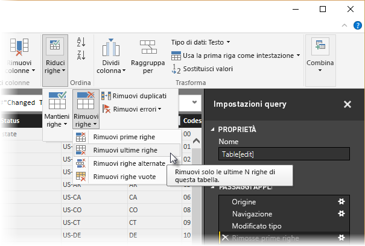

1. Poiché la tabella RetirementStats non contiene informazioni per Washington DC, è necessario escluderla dall'elenco con un filtro. Selezionare l'elenco a discesa **Region Status**, quindi deselezionare la casella di controllo accanto a **Federal district**.

    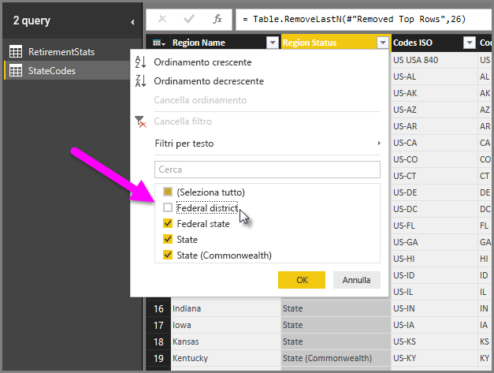

1. Rimuovere alcune colonne non necessarie. Poiché è necessario solo il mapping di ogni stato alla rispettiva abbreviazione di due lettere ufficiale, è possibile rimuovere le colonne seguenti: **Column1**, **Column3**, **Column4** e da **Column6** a **Column11**. Selezionare prima **Column1** e, tenendo premuto **CTRL**, selezionare ognuna delle altre colonne da rimuovere. Nella scheda **Home** della barra multifunzione selezionare **Rimuovi colonne \> Rimuovi colonne**.

   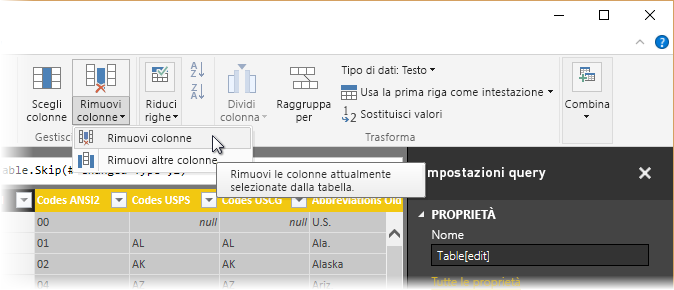

   > [!NOTE]
   > È utile notare che la *sequenza* dei passaggi applicati nell'Editor di query è importante e può influire sul data shaping. È anche importante valutare l'eventuale impatto di un passaggio su un passaggio successivo. Se si rimuove un passaggio in Passaggi applicati, i passaggi successivi potrebbero non dare gli stessi risultati previsti inizialmente, a causa dell'impatto della sequenza di passaggi della query.

   > [!NOTE]
   > Quando si ridimensiona la finestra dell'Editor di query per ridurne la larghezza, alcuni elementi della barra multifunzione vengono compressi per ottimizzare l'uso dello spazio visibile. Quando si aumenta la larghezza della finestra dell'Editor di query, gli elementi della barra multifunzione vengono estesi per ottimizzare l'uso dell'area ingrandita.

1. Rinominare le colonne e la tabella. È possibile rinominare una colonna in diversi modi: Selezionare prima di tutto la colonna, quindi selezionare **Rinomina** dalla scheda **Trasforma** sulla barra multifunzione oppure fare clic con il pulsante destro del mouse e scegliere **Rinomina**. L'immagine seguente contiene delle frecce che puntano a entrambe le opzioni; è sufficiente sceglierne solo una.

   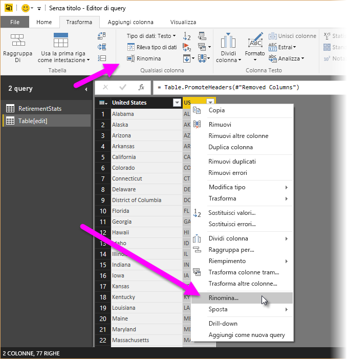

1. Rinominare le colonne in *State Name* e *State Code*. Per rinominare la tabella, immettere il **nome** nel riquadro **Impostazioni query**. Assegnare a questa tabella il nome *StateCodes*.

## <a name="combine-queries"></a>Combinare le query

Ora che è stata data la forma desiderata alla tabella StateCodes, queste due tabelle, o query, verranno combinate in una sola. Poiché le tabelle ottenute sono il risultato delle query applicate ai dati, spesso vengono chiamate *query*.

È possibile combinare le query in due modi principali: *merge* e *accodamento*.

- Quando sono presenti una o più colonne da aggiungere a un'altra query, è consigliabile eseguire il *merge* delle query. 
- Quando sono presenti righe aggiuntive di dati da aggiungere a una query esistente, è consigliabile *accodare* la query.

In questo caso verrà eseguito il merge delle query. A questo scopo, attenersi alla procedura seguente:
 
1. Dal riquadro sinistro dell'Editor di query selezionare la query *in cui* si vuole eseguire il merge dell'altra query. In questo caso, si tratta di **RetirementStats**. 

1. Selezionare **Combina \> Merge di query** nella scheda **Home** della barra multifunzione.

   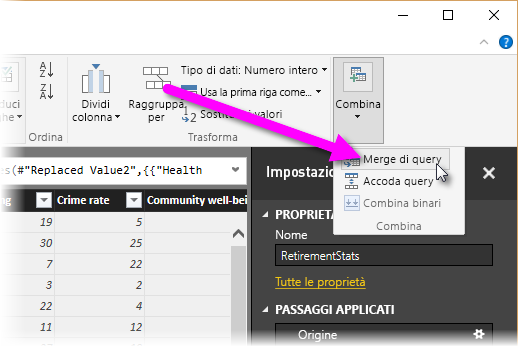

   Potrebbe essere richiesto di impostare i livelli di privacy, per garantire che i dati vengano combinati senza includere o trasferire dati che non devono essere trasferiti.

   Viene visualizzata la finestra **Merge**. Viene chiesto di selezionare la tabella di cui eseguire il merge nella tabella selezionata e le colonne corrispondenti da usare per il merge. 

1. Selezionare **State** dalla tabella RetirementStats, quindi selezionare la query **StateCodes**. 

   Quando si selezionano le colonne corrispondenti corrette, il pulsante **OK** è abilitato.

   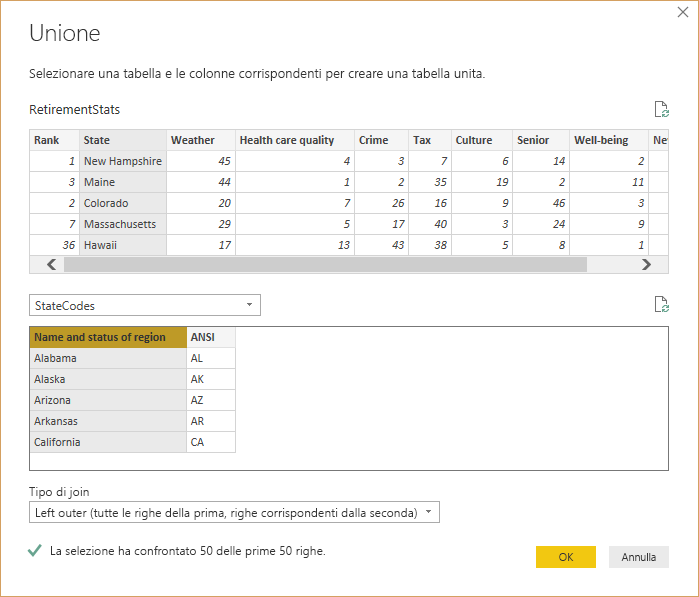

1. Selezionare **OK**.

   Alla fine della query l'Editor di query crea una colonna **NewColumn**, che include i contenuti della tabella (query) dopo il merge con la query esistente. Tutte le colonne della query sottoposta a merge vengono condensate nella colonna **NewColumn**, ma è possibile **espandere** la tabella e includere le colonne desiderate.

   

1. Per espandere la tabella sottoposta a merge e selezionare le colonne da includere, fare clic sull'icona di espansione (). 

   Verrà visualizzata la finestra **Espandi** .

   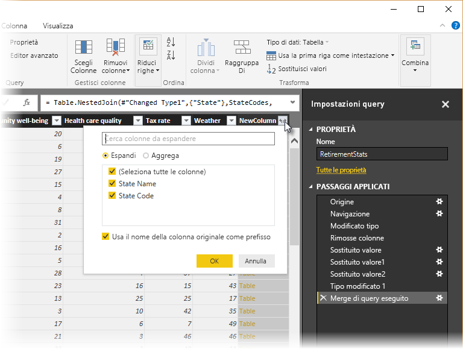

1. In questo caso, è necessaria solo la colonna **State Code**. Selezionare tale colonna, deselezionare **Usa il nome della colonna originale come prefisso** e quindi selezionare **OK**.

   Se la casella di controllo **Usa il nome della colonna originale come prefisso** fosse stata lasciata selezionata, il nome della colonna sottoposta a merge sarebbe **NewColumn.State Code**.

   > [!NOTE]
   > È possibile scegliere diversi modi per inserire la tabella NewColumn. È possibile fare alcune prove e, se i risultati non sono quelli desiderati, sarà sufficiente eliminare il passaggio dall'elenco **Passaggi applicati** nel riquadro **Impostazioni query**. La query tornerà allo stato precedente all'applicazione del passaggio **Espandi**. È possibile ripetere più volte l'operazione, fino a ottenere il risultato desiderato dal processo di espansione.

   È ora disponibile una singola query (tabella) che combina due origini dati, ognuna delle quali è stata sottoposta a data shaping per soddisfare le esigenze specifiche. Questa query può essere usata come base per diverse connessioni dati aggiuntive e interessanti, ad esempio le statistiche relative ai costi delle abitazioni, i dati demografici o le opportunità di lavoro in ogni stato.

1. Per applicare le modifiche e chiudere l'Editor di query, selezionare **Chiudi e applica** nella scheda **Home** della barra multifunzione. 

   Il set di dati trasformato viene visualizzato in Power BI Desktop, pronto per l'uso nella creazione di report.

   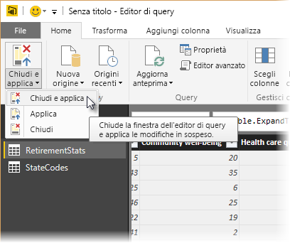

## <a name="next-steps"></a>Passaggi successivi
Per altre informazioni su Power BI Desktop e sulle sue funzionalità, vedere le risorse seguenti:

* [Che cos'è Power BI Desktop?](../fundamentals/desktop-what-is-desktop.md)
* [Panoramica delle query in Power BI Desktop](../transform-model/desktop-query-overview.md)
* [Origini di dati in Power BI Desktop](desktop-data-sources.md)
* [Connettersi ai dati in Power BI Desktop](desktop-connect-to-data.md)
* [Attività di query comuni in Power BI Desktop](../transform-model/desktop-common-query-tasks.md)   
