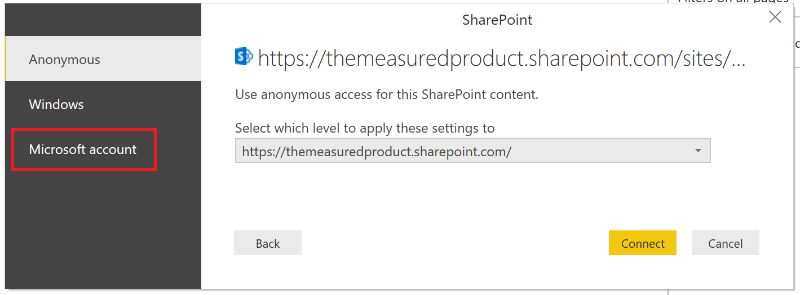

# Creare un report in un elenco SharePoint

Molti team e organizzazioni usano gli elenchi in SharePoint Online per archiviare i dati perché gli utenti possono configurarli e aggiornarli facilmente.  In alcuni casi gli utenti possono comprendere molto più facilmente e rapidamente i dati con un grafico che esaminando l'elenco stesso. In questa esercitazione viene illustrato come trasformare i dati dell'elenco SharePoint in un report di Power BI.

Guardare questo video di esercitazione di cinque minuti o scorrere verso il basso per istruzioni dettagliate.

<iframe width="400" height="450" src="https://www.youtube.com/embed/OZO3x2NF8Ak" frameborder="0" allowfullscreen></iframe>

## Parte 1: Connettersi all'elenco SharePoint

1. Se non è già stato fatto, scaricare e installare[Power BI Desktop](https://powerbi.microsoft.com/desktop/).
2. Aprire Power BI Desktop e nella scheda Home della barra multifunzione selezionare **Recupera dati** > **Altro**.
3. Selezionare **Servizi online**, quindi selezionare **Elenchi SharePoint Online**.  

    

4. Selezionare **Connetti**.
4. Trovare l'indirizzo (noto anche come URL) del sito di SharePoint Online che contiene l'elenco.  Da una pagina di SharePoint Online è in genere possibile ottenere l'indirizzo del sito selezionando **Home** nel riquadro di spostamento o l'icona del sito nella parte superiore, quindi copiando l'indirizzo dalla barra degli indirizzi del Web browser.

   Guardare un video di questo passaggio:
   <iframe width="400" height="300" src="https://www.youtube.com/embed/OZO3x2NF8Ak?start=48&end=90" frameborder="0" allowfullscreen></iframe>

5. In Power BI Desktop incollare l'indirizzo nel campo **URL sito** della finestra di dialogo aperta.

6. È possibile che venga visualizzata una schermata di accesso a SharePoint come quella dell'immagine seguente.  Se non viene visualizzata, andare al passaggio 10.  Se viene visualizzata, selezionare **Account Microsoft** sul lato sinistro della pagina.

    

7. Selezionare **Accedi** e immettere il nome utente e la password usati per accedere a Microsoft 365.

    

8. Al termine della procedura di accesso, selezionare **Connetti**.

9. Sul lato sinistro dello Strumento di navigazione selezionare la casella di controllo accanto all'elenco SharePoint a cui ci si vuole connettere.

    

10. Selezionare **Carica**.  Power BI carica i dati dell'elenco in un nuovo report.

## Parte 2: Creare un report.

1. Sul lato sinistro selezionare l'icona **Dati** per verificare che i dati dell'elenco SharePoint siano stati caricati.

2. Verificare che per le colonne dell'elenco contenenti numeri sia visualizzata l'icona Somma (Sigma) nel **riquadro Campi** sulla destra.  Per le colonne per cui non è visualizzata, selezionare l'intestazione della colonna nella visualizzazione tabella, selezionare la scheda **Creazione di modelli**, quindi impostare **Tipo di dati** su **Numero decimale** o su **Numero intero**, a seconda dei dati.  Se viene chiesto di confermare la modifica, selezionare **Sì**.  Se il numero è in un formato speciale, ad esempio quello di valuta, è possibile sceglierlo impostando **Formato**.

   Guardare un video di questo passaggio:
   <iframe width="400" height="300" src="https://www.youtube.com/embed/OZO3x2NF8Ak?start=147&end=204" frameborder="0" allowfullscreen></iframe>

3. Sul lato sinistro selezionare l'icona **Report**.
4. Per selezionare le colonne da visualizzare, selezionare la relativa casella di controllo nel riquadro **Campi** sulla destra.

   Guardare un video di questo passaggio:
   <iframe width="400" height="300" src="https://www.youtube.com/embed/OZO3x2NF8Ak?start=215&end=252" frameborder="0" allowfullscreen></iframe>

5. Se necessario, cambiare il tipo di oggetto visivo.
6. Per creare più visualizzazioni nello stesso report, deselezionare l'oggetto visivo esistente, quindi selezionare le caselle di controllo per le altre colonne nel riquadro **Campi**.
7. Selezionare **Salva** per salvare il report.
