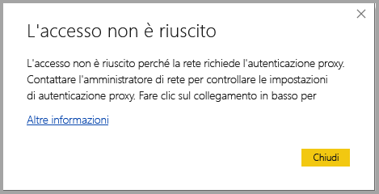
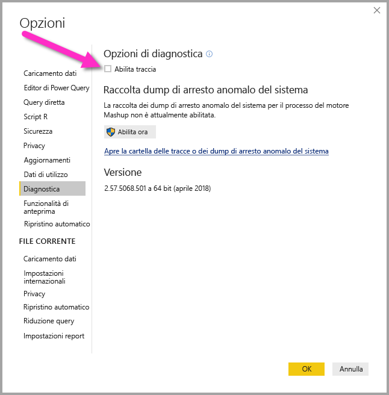

# Risoluzione dei problemi di accesso per Power BI Desktop
In alcuni casi possono verificarsi errori durante il tentativo di accesso a **Power BI Desktop**. Esistono due motivi principali per i problemi di accesso: **errori di autenticazione proxy** ed **errori di reindirizzamento di URL non HTTPS**. 

Per determinare quale problema sta causando il problema di accesso, il primo passaggio consiste nel contattare l'amministratore e fornire le informazioni di diagnostica in modo che sia possibile stabilire la causa del problema. Tracciando i problemi associati al problema di accesso, gli amministratori possono determinare quale degli errori seguenti è applicabile. 

Verranno ora esaminati tutti questi problemi singolarmente. Alla fine di questo articolo sono disponibili indicazioni su come acquisire una *traccia* in Power BI Desktop, utile per risalire alle cause dei problemi.

## Errore Richiesta autenticazione proxy

La schermata seguente mostra un esempio dell'errore *Richiesta autenticazione proxy*.

Le eccezioni seguenti nei file di traccia di *Power BI Desktop* sono associate a questo errore:

* *Microsoft.PowerBI.Client.Windows.Services.PowerBIWebException*
* *HttpStatusCode: ProxyAuthenticationRequired*

Quando si verifica questo errore, il motivo più probabile è che un server di autenticazione proxy nella rete sta bloccando le richieste Web inviate da **Power BI Desktop**. 

Se la rete usa un server di autenticazione proxy, l'amministratore può risolvere questo problema aggiungendo i domini seguenti all'elenco degli elementi consentiti nel server di autenticazione proxy:

* app.powerbi.com
* api.powerbi.com
* domini nello spazio dei nomi *.analysis.windows.net

Per i clienti che fanno parte di un cloud per enti pubblici, è possibile risolvere il problema aggiungendo i domini seguenti nell'elenco degli elementi consentiti nel server di autenticazione proxy:

* app.powerbigov.us
* api.powerbigov.us
* domini nello spazio dei nomi *.analysis.usgovcloudapi.net

## Errore di reindirizzamento di URL non HTTPS non supportato

Le versioni correnti di **Power BI Desktop** usano la versione corrente di Active Directory Authentication Library (ADAL), che non consente un reindirizzamento a URL non protetti (non HTTPS). 

Le eccezioni seguenti nei file di traccia di *Power BI Desktop* sono associate a questo errore:

* *Microsoft.IdentityModel.Clients.ActiveDirectory.AdalServiceException: Non-HTTPS url redirect is not supported in webview* (Reindirizzamento di URL non HTTPS non supportato nella visualizzazione Web)
* *ErrorCode: non_https_redirect_failed*

Se si verifica l'errore *ErrorCode: non_https_redirect_failed*, significa che una o più pagine o provider di reindirizzamento nella catena di reindirizzamento non rappresentano un endpoint protetto HTTPS oppure che un'autorità di certificazione di uno o più reindirizzamenti non è inclusa tra le radici attendibili del dispositivo. Tutti i provider in qualsiasi catena di reindirizzamento dell'accesso devono usare un URL HTTPS. Per risolvere questo problema, contattare l'amministratore e richiedere l'uso di URL protetti per i relativi siti di autenticazione. 

## Come raccogliere una traccia in Power BI Desktop

Per raccogliere una traccia in **Power BI Desktop**, seguire questa procedura:

1. Abilitare la traccia in **Power BI Desktop**. A questo scopo, passare a **File > Opzioni e impostazioni > Opzioni** e quindi selezionare **Diagnostica** tra le opzioni nel riquadro sinistro. Nel riquadro visualizzato selezionare la casella di controllo accanto ad **Abilita traccia**, come illustrato nella figura seguente. Potrebbe essere necessario riavviare **Power BI Desktop**.
   
   

2. Seguire quindi i passaggi per riprodurre l'errore. Quando si verifica questo errore, **Power BI Desktop** aggiunge gli eventi nel log di traccia, mantenuto nel computer locale.

3. Passare alla cartella Traces nel computer locale. È possibile trovare tale cartella selezionando il collegamento in **Diagnostica** in cui è stata abilitata la traccia, visualizzato come *Apre la cartella delle tracce o dei dump di arresto anomalo del sistema* nell'immagine precedente. Questa cartella spesso si trova nel computer locale nel percorso seguente:

    `C:\Users/<user name>/AppData/Local/Microsoft/Power BI Desktop/Traces`

In tale cartella possono esistere molti file di traccia. Assicurarsi di inviare solo i file recenti all'amministratore per facilitare l'identificazione rapida dell'errore. 

## Uso delle credenziali di sistema predefinite per il proxy Web

Le richieste Web rilasciate da Power BI Desktop non usano credenziali del proxy Web. Nelle reti che usano un server proxy, Power BI Desktop potrebbe non essere in grado di effettuare correttamente le richieste Web. 

A partire dalla versione di marzo 2020 di Power BI Desktop, gli amministratori di sistema o di rete possono consentire l'uso di credenziali di sistema predefinite per l'autenticazione del proxy Web. Gli amministratori possono creare una voce del Registro di sistema denominata **UseDefaultCredentialsForProxy** e impostare il valore su uno (1) per consentire l'uso delle credenziali di sistema predefinite per l'autenticazione del proxy Web.

La voce del Registro di sistema può essere inserita in uno dei percorsi seguenti:

`[HKEY_LOCAL_MACHINE\SOFTWARE\WOW6432Node\Microsoft\Microsoft Power BI Desktop]`
`[HKEY_LOCAL_MACHINE\SOFTWARE\Microsoft\Microsoft Power BI Desktop]`

Non è necessario che la voce del Registro di sistema sia in entrambe le posizioni.

Una volta creata la voce del Registro di sistema (potrebbe essere necessario un riavvio), vengono usate le impostazioni proxy definite in Internet Explorer quando Power BI Desktop esegue richieste Web. 

Come per tutte le modifiche alle impostazioni di proxy o credenziali, la creazione di questa voce del Registro di sistema comporta implicazioni per la sicurezza, pertanto gli amministratori devono assicurarsi che i proxy di Internet Explorer siano stati configurati correttamente prima di abilitare questa funzionalità.         

### Limitazioni e considerazioni per l'uso delle credenziali di sistema predefinite

Prima di abilitare questa funzionalità, è necessario che gli amministratori valutino una serie di implicazioni per la sicurezza. 

Quando si abilita questa funzionalità per i client, è necessario seguire le indicazioni seguenti:

* Usare solo la **negoziazione** come schema di autenticazione per il server proxy, in modo da garantire che il client usi solo i server proxy aggiunti alla rete di Active Directory. 
* Non usare **fallback NTLM** nei client che usano questa funzionalità.
* Se gli utenti non si trovano in una rete con proxy quando questa funzionalità viene abilitata e configurata come consigliato in questa sezione, non viene usato il processo che tenta di contattare il server proxy e di usare le credenziali di sistema predefinite.

[Uso delle credenziali di sistema predefinite per il proxy Web](#using-default-system-credentials-for-web-proxy)

