# Esercitazione: Analizzare i dati di Facebook con Power BI Desktop

Questa esercitazione illustra come importare dati da Facebook e usarli in Power BI Desktop. Verranno descritte le procedure per connettersi alla pagina Facebook di Power BI e importare i dati da tale pagina, applicare trasformazioni ai dati importati e usare i dati nelle visualizzazioni di report.

> [!WARNING]
> A causa delle restrizioni delle autorizzazioni dell'app Facebook, le funzionalità del connettore descritte in questo articolo attualmente non funzionano correttamente. Microsoft sta collaborando con Facebook per ripristinare le funzionalità il prima possibile.

## Connettersi a una pagina di Facebook

In questa esercitazione vengono usati i dati della [pagina Facebook di Microsoft Power BI](https://www.facebook.com/microsoftbi). Non sono necessarie credenziali speciali per connettersi a questa pagina e importare dati, ad eccezione di un account Facebook personale.

1. Aprire Power BI Desktop e selezionare **Recupera dati** nella finestra di dialogo **Attività iniziali** oppure nella scheda **Home** della barra multifunzione, selezionare **Recupera dati** e quindi selezionare **Altro**.
   
2. Nella finestra di dialogo **Recupera dati** selezionare **Facebook** nel gruppo **Servizi online** e quindi scegliere **Connetti**.
   
   
   
   Verrà visualizzata una finestra di dialogo che avvisa in merito ai rischi legati all'uso di un servizio di terze parti.
   
   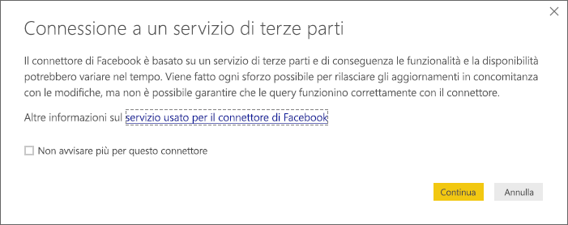
   
3. Selezionare **Continua**. 
   
4. Nella finestra di dialogo **Facebook** immettere il nome della pagina **microsoftbi** come **nome utente**, selezionare **post** dall'elenco a discesa **Connessione** e quindi selezionare **OK**.
   
   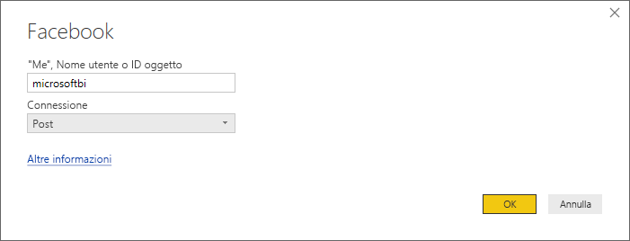
   
5. Alla richiesta di credenziali, accedere all'account Facebook e consentire l'accesso di Power BI al proprio account.
   
   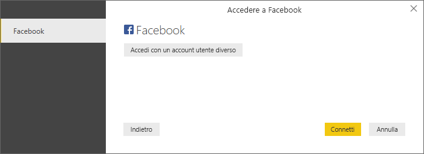

   Dopo la connessione alla pagina Facebook di Power BI, viene visualizzata un'anteprima dei dati dei post della pagina. 
   
   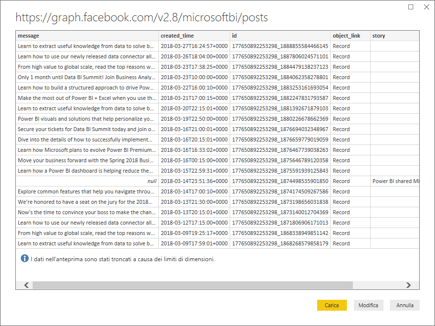
   
## Modellare e trasformare i dati importati

Si supponga di voler individuare e visualizzare i post che hanno avuto più commenti nel corso del tempo. Si nota tuttavia che nell'anteprima dei post i dati **created_time** sono difficili da leggere e comprendere e che sono presenti pochi dati sui commenti. Per ottenere il massimo da queste informazioni, è necessario eseguire alcune operazioni di data shaping e pulizia dei dati. A tale scopo è possibile usare l'editor di Power Query di Power BI Desktop per modificare i dati, prima o dopo l'importazione in Power BI Desktop. 

### Suddividere la colonna data/ora

Prima di tutto, separare i valori di data e ora nella colonna **created_time** per renderli più leggibili. 

1. Nell'anteprima dei dati di Facebook selezionare **Modifica**. 
   
   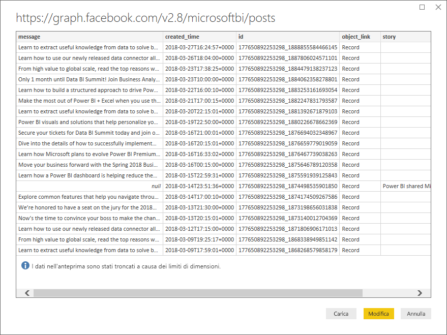
   
   L'editor di Power Query di Power BI Desktop viene aperto in una nuova finestra e mostra l'anteprima dei dati dalla pagina Facebook di Power BI. 
   
   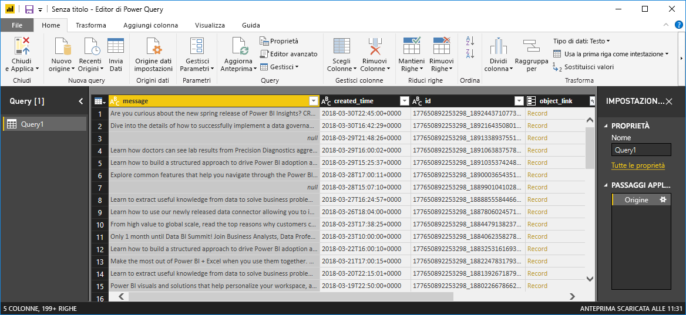
   
2. Selezionare la colonna **created_time**. Si noti che il tipo di dati della colonna è **Testo**, come indicato dall'icona **ABC** nell'intestazione di colonna. Fare clic con il pulsante destro del mouse sull'intestazione e scegliere **Dividi colonna** > **In base al delimitatore** dall'elenco a discesa. In alternativa, selezionare **Dividi colonna** > **In base al delimitatore** nel gruppo **Trasforma** della scheda **Home** della barra multifunzione.  
   
   
   
3. Nella finestra di dialogo **Dividi colonna in base al delimitatore** selezionare **Personalizzato** dall'elenco a discesa, immettere **T** (il carattere che inizia la parte relativa all'ora dei valori di **created_time**) nel campo di input e quindi selezionare **OK**. 
   
   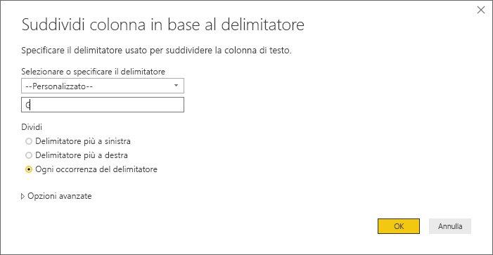
   
   La colonna si divide in due colonne che contengono le stringhe prima e dopo il delimitatore *T*. Le nuove colonne sono denominate rispettivamente **created_time.1** e **created_time.2**. Power BI ha rilevato e modificato automaticamente i tipi di dati in **Date** per la prima colonna e **Time** per la seconda colonna, quindi ha formattato i valori di data e ora per renderli più leggibili.
   
4. Rinominare le due colonne. Selezionare la colonna **created_time.1**, quindi selezionare **Rinomina** nel gruppo **Qualsiasi colonna** della scheda **Trasforma** nella barra multifunzione. In alternativa, fare doppio clic sull'intestazione di colonna e immettere il nome della nuova colonna, **created_date**. Ripetere l'operazione per la colonna **created_time.2** e rinominarla **created_time**.
   
   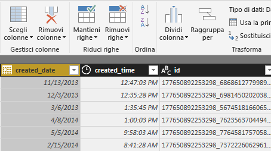
   
### Espandere la colonna annidata

A questo punto i dati di data e ora hanno il formato desiderato ed è possibile esporre i dati sui commenti espandendo una colonna annidata. 

1. Selezionare l'icona  nella parte superiore della colonna **object_link** per aprire la finestra di dialogo **Espandi/Aggrega**. Selezionare **connections** e quindi selezionare **OK**. 
   
   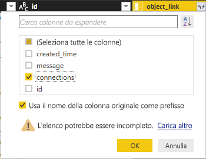
   
   L'intestazione di colonna diventa **object_link.connections**.
2. Selezionare l' nella parte superiore della colonna **object_link.connections**, selezionare **comments** e quindi selezionare **OK**. L'intestazione di colonna diventa **object_link.connections.comments**.
   
3. Selezionare l' nella parte superiore della colonna **object_link.connections.comments** e questa volta selezionare **Aggrega** invece di **Espandi** nella finestra di dialogo. Selezionare **# Conteggio di id** e quindi selezionare **OK**. 
   
   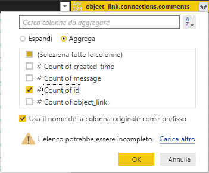
   
   La colonna visualizza ora il numero dei commenti per ogni messaggio. 
   
4. Rinominare la colonna **Conteggio di object_link.connections.comments.id** in **Numero di commenti**.
   
5. Selezionare la freccia verso il basso accanto all'intestazione **Numero di commenti** e selezionare **Ordinamento decrescente** per vedere i post ordinati in base al numero di commenti in ordine decrescente. 
   
   
   
### Rivedere i passaggi della query

Durante il data shaping e la trasformazione dei dati nell'editor di Power Query, ogni passaggio viene registrato nell'area **Passaggi applicati** del riquadro **Impostazioni query** sul lato destro della finestra **Editor di Power Query**. È possibile tornare indietro nelle voci dell'elenco di **Passaggi applicati** per rivedere esattamente le modifiche apportate e, se necessario, modificarle, eliminarle o riorganizzarle. Prestare attenzione quando si modificano questi passaggi, perché la modifica di un passaggio può causare interruzioni nei passaggi successivi. 

Dopo l'applicazione delle trasformazioni dei dati finora eseguite, il riquadro **Passaggi applicati** dovrebbe avere l'aspetto seguente:
   
   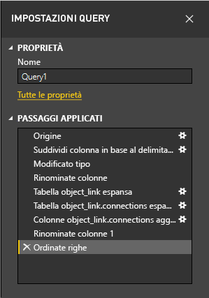
   
   >[!TIP]
   >I passaggi riportati in **Passaggi applicati** hanno formule sottostanti scritte nel [linguaggio delle formule M di Power Query](https://docs.microsoft.com/powerquery-m/quick-tour-of-the-power-query-m-formula-language). Per visualizzare e modificare le formule, selezionare **Editor avanzato** nel gruppo **Query** della scheda **Home** della barra multifunzione. 

### Importare i dati trasformati

Quando si è soddisfatti dei dati, selezionare **Chiudi e applica** > **Chiudi e applica** nella scheda **Home** della barra multifunzione per importarli in Power BI Desktop. 
   
   
   
   In una finestra di dialogo viene visualizzato lo stato di avanzamento del caricamento dei dati nel modello di dati di Power BI Desktop. 
   
   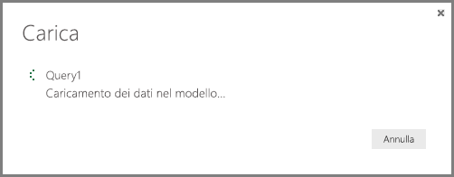
   
   Al termine del caricamento, i dati compaiono nella visualizzazione **Report** come nuova query nel riquadro **Campi**.
   
   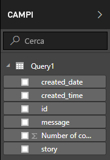
   
## Usare i dati nelle visualizzazioni dei report 

Dopo aver importato i dati dalla pagina Facebook, è possibile ricavare in maniera rapida e semplice informazioni approfondite sui dati usando le visualizzazioni. Creare una visualizzazione è semplice: basta selezionare un campo o trascinarlo dal riquadro **Campi** nell'area di disegno del report.

### Creare un grafico a barre

1. Nella visualizzazione **Report** di Power BI Desktop selezionare **message** dal riquadro **Campi** oppure trascinarlo nell'area di disegno. Verrà visualizzata una tabella che mostra tutti i messaggi dei post nell'area di disegno. 
   
   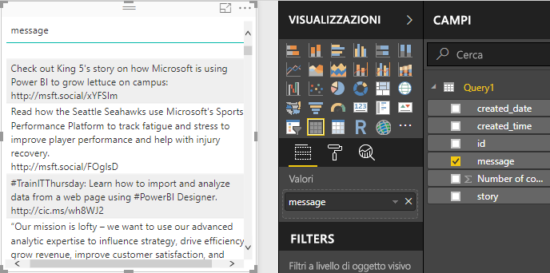
   
2. Con la tabella selezionata, selezionare anche **Numero di commenti** dal riquadro **Campi** oppure trascinarlo nella tabella. 
   
3. Selezionare l'icona **Grafico a barre in pila** nel riquadro **Visualizzazioni**. La tabella diventa un grafico a barre che mostra il numero di commenti per ogni post. 
   
   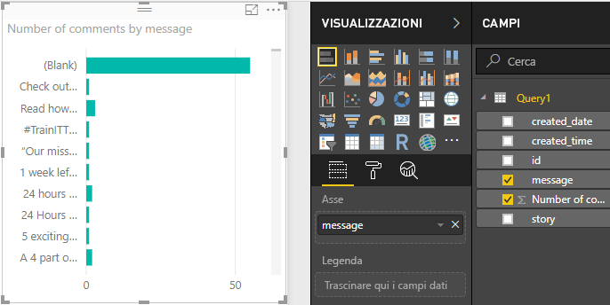
   
4. Selezionare **Altre opzioni** (...) accanto alla visualizzazione e quindi selezionare **Ordina per** > **Numero di commenti** per disporre la tabella in ordine decrescente in base al numero di commenti. 

   Si noti che la maggior parte dei commenti è stata associata ai messaggi di tipo **(Vuoto)** , ovvero senza messaggi, ma questi post potrebbero include storie, collegamenti, video o altri contenuti non testuali. 
   
5. Per escludere le righe vuote, selezionare **message è (Tutto)** dal riquadro **Filtri**, selezionare **Seleziona tutto** e quindi selezionare **(Vuoto)** per deselezionare questa opzione. 

   La voce nel riquadro **Filtri** diventa **message non è (Vuoto)** e la riga **(Vuoto)** scompare dalla visualizzazione del grafico.
   
   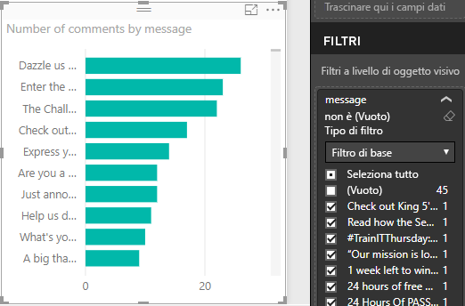
   
### Formattare il grafico

La visualizzazione è ora più interessante, ma non è possibile visualizzare gran parte del testo dei post nel grafico. Per visualizzare più testo dei post:

1. Usare i punti di controllo nella visualizzazione del grafico per ridimensionare il grafico in modo da ingrandirlo al massimo. 
   
2. Con il grafico selezionato selezionare l'icona **Formato** (a forma di rullo per vernice) nel riquadro **Visualizzazioni**.
   
3. Selezionare la freccia verso il basso accanto ad **Asse Y** e trascinare il dispositivo di scorrimento accanto a **Dimensioni massime** tutto verso destra (**50%** ). 
4. Ridurre il valore di **Dimensione testo** a **10 pt** in modo da visualizzare più testo.
   
   
   
   Nel grafico viene ora visualizzato più contenuto dei post. 
   
   
   
L'asse X (numero di commenti) del grafico non mostra valori esatti ed è poco visibile nella parte inferiore del grafico. Si useranno in alternativa le etichette dei dati: 

1. Selezionare l'icona **Formato** e quindi impostare il dispositivo di scorrimento per **Asse X** su **No**. 
   
2. Selezionare il dispositivo di scorrimento **Etichette dati** su **Sì**. 

   Il grafico mostra ora il numero esatto di commenti per ogni post.
   
   
   
### Modificare il tipo di dati

La visualizzazione è migliore, ma tutte le etichette dei dati hanno la cifra decimale **.0**, che risulta un elemento di distrazione oltre a essere fuorviante, perché **Numero di commenti** deve essere un numero intero. Per correggerle, è necessario modificare il tipo di dati della colonna **Numero di commenti** impostando **Numero intero**:

1. Fare clic con il pulsante destro del mouse su **Query1** nel riquadro **Campi** oppure passare il puntatore del mouse su di esso e selezionare **Altre opzioni** (...). 

2. Scegliere **Modifica query** dal menu di scelta rapida. In alternativa, selezionare **Modifica query** > **Modifica query** dal gruppo **Dati esterni** nella scheda **Home** della barra multifunzione. 
   
3. Nella finestra **Editor di Power Query** selezionare la colonna **Numero di commenti** e modificare il tipo di dati eseguendo una di queste operazioni: 
   - Selezionare l'icona **1.2** accanto all'intestazione di colonna **Numero di commenti** e quindi scegliere **Numero intero** nell'elenco a discesa
   - Fare clic con il pulsante destro del mouse sull'intestazione di colonna e quindi scegliere **Modifica tipo** > **Numero intero**.
   - Selezionare **Tipo di dati: Numero decimale** nel gruppo **Trasforma** della scheda **Home** oppure nel gruppo **Qualsiasi colonna** della scheda **Trasforma** e selezionare **Numero intero**.
   
   L'icona nell'intestazione di colonna diventa **123**, per indicare il tipo di dati **Numero intero**.
   
   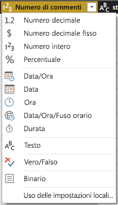
   
3. Per applicare le modifiche, selezionare **File** > **Chiudi e applica** o **File** > **Applica** per mantenere aperta la finestra **Editor di Power Query**. 

   Dopo il caricamento delle modifiche, le etichette dei dati nel grafico diventano numeri interi.
   
   
   
### Creare un filtro dei dati

Si supponga di voler visualizzare il numero di commenti relativi ai post nel corso del tempo. È possibile creare una visualizzazione filtro dei dati per filtrare i dati del grafico in base a intervalli di tempo diversi. 

1. Fare clic su un'area vuota dell'area di disegno e quindi selezionare l'icona **Filtro dei dati** nel riquadro **Visualizzazioni**. 

   Verrà visualizzata una visualizzazione filtro dei dati vuota.
   
   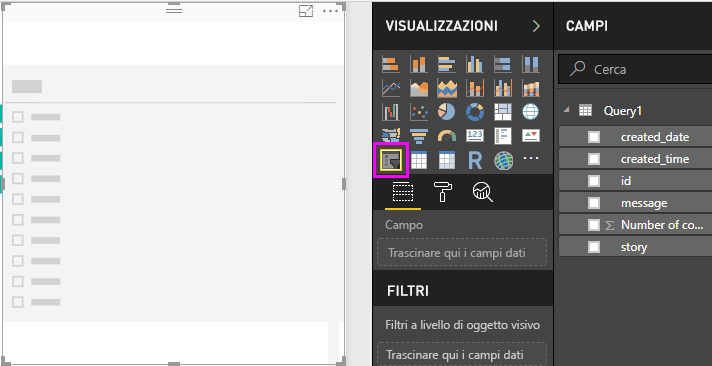
   
2. Selezionare il campo **created_date** nell'elenco **Campi** oppure trascinarlo nel nuovo filtro dei dati. 

   Il filtro dei dati diventa un dispositivo di scorrimento dell'intervallo di date, basato sul tipo di dati **Data** del campo.
   
   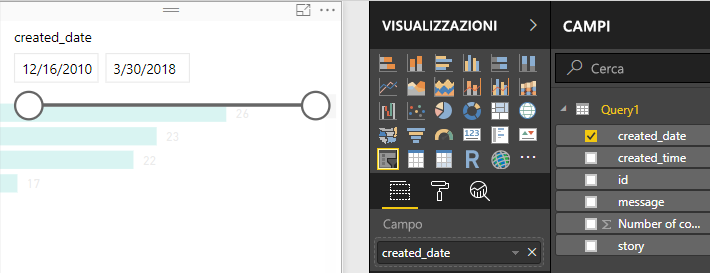
   
3. Spostare i punti di controllo del dispositivo di scorrimento per selezionare diversi intervalli di date e notare come vengono filtrati di conseguenza i dati del grafico. È anche possibile selezionare i campi di data nel filtro dei dati e digitare date specifiche o sceglierle da un calendario popup.
    
   
   
### Formattare le visualizzazioni

Assegnare al grafico un titolo più descrittivo e interessante: 

1. Con il grafico selezionato, selezionare l'icona **Formato** nel riquadro **Visualizzazioni** e quindi selezionare la freccia verso il basso accanto a **Titolo** per espandere l'elenco a discesa.

2. Specificare **Commenti per post** in **Testo titolo**. 

3. Selezionare la freccia verso il basso accanto a **Colore carattere** e selezionare un colore verde abbinato alle barre verdi della visualizzazione.

4. Aumentare il valore di **Dimensione testo** impostando la casella su **10 pt** e impostare **Famiglia di caratteri** su **Segoe (grassetto)** .

5. Sperimentare altre opzioni e impostazioni di formattazione per modificare l'aspetto delle visualizzazioni. 

   

## Creare altre visualizzazioni

Come si può notare, è facile personalizzare le visualizzazioni nel report per presentare i dati nel modo desiderato. Provare, ad esempio, a usare i dati di Facebook importati per creare questo grafico a linee che mostra il numero di commenti nel corso del tempo.

Power BI Desktop offre un'esperienza end-to-end molto semplice, dal recupero di dati da una vasta gamma di origini dati, al data shaping per soddisfare le esigenze di analisi, fino alla visualizzazione dei dati in modi accattivanti e interattivi. Quando il report è pronto, è possibile [caricarlo nel servizio Power BI](../create-reports/desktop-upload-desktop-files.md) e creare dashboard basati sul report da condividere con altri utenti di Power BI.

## Passaggi successivi
* [Altre esercitazioni su Power BI Desktop](https://go.microsoft.com/fwlink/?LinkID=521937)
* [Video su Power BI Desktop](https://go.microsoft.com/fwlink/?LinkID=519322)
* [Forum di Power BI](https://go.microsoft.com/fwlink/?LinkID=519326)
* [Blog su Power BI](https://go.microsoft.com/fwlink/?LinkID=519327)
