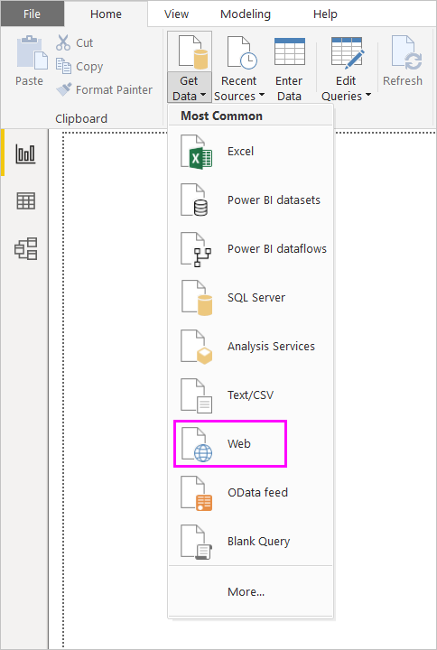
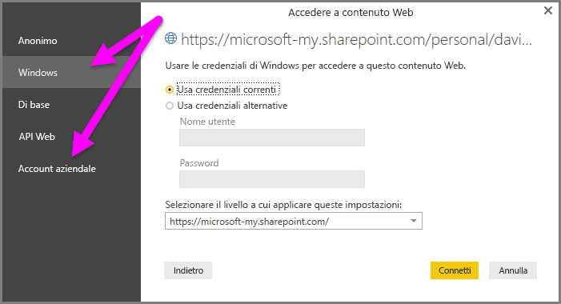

# Usare collegamenti OneDrive for Business in Power BI Desktop
Molti utenti archiviano le cartelle di lavoro di Excel in OneDrive for Business, che offre un'ottima soluzione di interazione con Power BI Desktop. In Power BI Desktop si possono usare collegamenti online ai file di Excel archiviati in OneDrive for Business per creare report e oggetti visivi. È possibile usare un account di gruppo di OneDrive for Business oppure l'account OneDrive for Business personale.

Per ottenere un collegamento online da OneDrive for Business sono necessari alcuni passaggi specifici. Le sezioni seguenti illustrano i passaggi che consentono di condividere il collegamento del file tra gruppi, tra computer e con i colleghi.

## Ottenere un collegamento da Excel
1. Passare a OneDrive for Business usando un browser. Fare clic con il pulsante destro del mouse sul file da usare e quindi scegliere **Apri in Excel**.
   
   > [!NOTE]
   > L'interfaccia del browser potrebbe non apparire esattamente come nell'immagine seguente. Esistono diversi modi per selezionare **Apri in Excel** per i file nell'interfaccia del browser di OneDrive for Business. È possibile usare qualsiasi opzione che consenta di aprire il file in Excel.
   > 
   > 
   
   
2. In Excel selezionare **File** > **Informazioni** e quindi selezionare **Copia percorso** sopra **Proteggi cartella di lavoro**.
   
   

## Usare il collegamento in Power BI Desktop
In Power BI Desktop è possibile usare il collegamento che è stato appena copiato negli Appunti. Eseguire queste operazioni:

1. In Power BI Desktop selezionare **Recupera dati** > **Web**.
   
   
2. Con l'opzione **Di base** selezionata, incollare il collegamento nella finestra di dialogo **Da Web**.
3. Rimuovere la stringa *?web=1* alla fine del collegamento, in modo che Power BI Desktop possa accedere correttamente al file, e quindi selezionare **OK**.
   
     
4. Se Power BI Desktop richiede le credenziali, scegliere **Windows** per i siti SharePoint locali o **Account aziendale** per i siti Office 365 o OneDrive for Business.
   
   

   Verrà visualizzata la finestra **Strumento di navigazione** che consente di eseguire operazioni di selezione dall'elenco di tabelle, fogli e intervalli disponibili nella cartella di lavoro di Excel. Da qui è possibile usare il file di OneDrive for Business esattamente come qualsiasi altro file di Excel. Si possono creare report e usarli nei set di dati proprio come per qualsiasi altra origine dati.

> [!NOTE]
> Per usare un file di OneDrive for Business come origine dati nel servizio Power BI, con l'**aggiornamento del servizio** abilitato per tale file, assicurarsi di selezionare **OAuth2** come **metodo di autenticazione** quando si configurano le impostazioni di aggiornamento. In caso contrario, è possibile che venga restituito un errore (ad esempio *L'aggiornamento delle credenziali dell'origine dati non è riuscito.* ) quando si prova a eseguire la connessione o l'aggiornamento. Selezionare **OAuth2** come metodo di autenticazione per risolvere l'errore delle credenziali.
> 
> 

