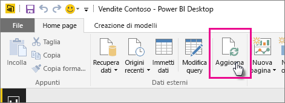

# Aggiornare un set di dati creato da un file di Power BI Desktop in un'unità locale

## Che cosa è supportato?

Le opzioni Aggiorna ora e Pianifica aggiornamenti in Power BI sono supportate per i set di dati creati dai file di Power BI Desktop importati da un'unità locale in cui viene usato Recupera dati/Editor di query per connettersi e caricare i dati da una delle origini dati seguenti:

### Power BI Gateway - Personal

- Tutte le origini dati online visualizzate in Recupera dati ed Editor di query di Power BI Desktop.
- Tutte le origini dati locali visualizzate in Recupera dati ed Editor di query di Power BI Desktop, tranne il file Hadoop (HDFS) e Microsoft Exchange.

<!-- Refresh Data sources-->
[!INCLUDE [refresh-datasources](../includes/refresh-datasources.md)]

> [!NOTE]
> un gateway deve essere installato e in esecuzione per connettere Power BI alle origini dati locali e aggiornare il set di dati.
>
>

È possibile eseguire un aggiornamento singolo manuale in Power BI Desktop selezionando **Aggiorna** nella scheda Home della barra multifunzione. Quando si seleziona **Aggiorna**, i dati nel modello di *file* vengono aggiornati con dati aggiornati provenienti dall'origine dati originale. Questo tipo di aggiornamento, completamente interno all'applicazione di Power BI Desktop, è diverso da un aggiornamento manuale o pianificato in Power BI ed è importante comprendere la differenza.

Quando si importa il file di Power BI Desktop da un'unità locale, i dati e le altre informazioni sul modello vengono caricati in un set di dati nel servizio Power BI. Nel servizio Power BI, e non in Power BI Desktop, è opportuno aggiornare i dati nel set di dati perché i report nel servizio Power BI si basano su di essi. Dal momento che le origini dati sono esterne, è possibile aggiornare manualmente il set di dati usando **Aggiorna adesso** oppure impostare una pianificazione per l'aggiornamento usando **Pianifica aggiornamenti**.

Quando si aggiorna il set di dati, Power BI non si connette al file nell'unità locale per eseguire query per i dati aggiornati. Usa le informazioni nel set di dati per connettersi direttamente alle origini dati per eseguire query per i dati aggiornati, quindi li carica nel set di dati.

> [!NOTE]
> I dati aggiornati nel set di dati non vengono sincronizzati di nuovo con il file nell'unità locale.
>
>

## Come si pianifica l'aggiornamento?

Quando si configura una pianificazione dell'aggiornamento, Power BI si connette direttamente alle origini dati usando le informazioni e le credenziali di connessione nel set di dati per eseguire query per i dati aggiornati e quindi carica i dati aggiornati nel set di dati. Vengono aggiornate anche le visualizzazioni nei report e nei dashboard basati sul set di dati nel servizio Power BI.

Per informazioni dettagliate su come configurare l'aggiornamento pianificato, vedere [Configurare l'aggiornamento pianificato](refresh-scheduled-refresh.md).

## In caso di errore

In caso di errori, il problema in genere è dovuto al fatto che Power BI non riesce ad accedere alle origini dati oppure, se il set di dati si connette a un'origine dati locale, al fatto che il gateway è offline. Assicurarsi che Power BI possa accedere alle origini dati. Se una password usata per accedere a un'origine dati viene modificata oppure Power BI viene disconnesso da un'origine dati, provare a effettuare di nuovo l'accesso alle origini dei dati in Credenziali origine dati.

Assicurarsi di lasciare selezionato **Inviami il messaggio di notifica di aggiornamento non riuscito** . È opportuno sapere immediatamente se un aggiornamento pianificato non riesce.

## Risoluzione dei problemi

A volte, l'aggiornamento dei dati non funziona come previsto. In genere si tratta di un problema relativo al gateway. Consultare gli articoli sulla risoluzione dei problemi del gateway per individuare gli strumenti utili e i problemi noti.

- [Risoluzione dei problemi del gateway dati locale](service-gateway-onprem-tshoot.md)
- [Risoluzione dei problemi di Gateway di Power BI - Personale](service-admin-troubleshooting-power-bi-personal-gateway.md)

Altre domande? [Provare a rivolgersi alla community di Power BI](https://community.powerbi.com/)
