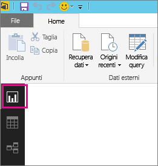
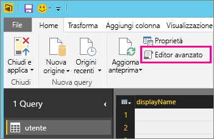
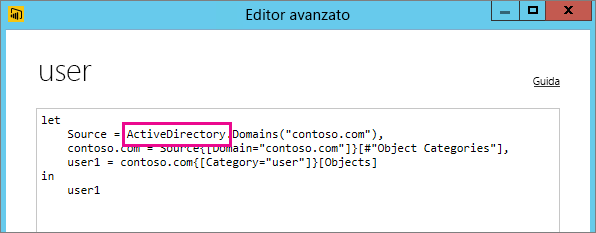

# Risoluzione dei problemi relativi all'origine dati non supportata per l'aggiornamento
Durante la configurazione di un set di dati per l'aggiornamento pianificato è possibile che venga visualizzato un errore.

        You cannot schedule refresh for this dataset because it gets data from sources that currently don’t support refresh.

Questo problema si verifica quando l'origine dati usata in Power BI Desktop non è supportata per l'aggiornamento. È quindi necessario trovare l'origine dati usata e verificare se è presente nell'elenco delle origini dati supportate in [Aggiornare i dati in Power BI](refresh-data.md). 

## Individuare l'origine dati
Se non si è sicuri dell'origine dati usata, è possibile individuarla eseguendo la procedura seguente in Power BI Desktop.  

1. In Power BI Desktop verificare che il riquadro attivo sia **Report** .  
   
2. Selezionare **Modifica query** dalla barra multifunzione.  
   
3. Selezionare **Editor avanzato**.  
   
4. Prendere nota del provider indicato per l'origine.  In questo esempio il provider è ActiveDirectory.  
   
5. Confrontare il provider con l'elenco delle origini dati supportate in [Origini dati supportate in Power BI](power-bi-data-sources.md).

> [!NOTE]
> Per i problemi di aggiornamento correlati alle origini dati dinamiche, incluse le origini dati con query create manualmente, vedere [Aggiornamento e origini dati dinamiche](refresh-data.md#refresh-and-dynamic-data-sources).

## Passaggi successivi
[Aggiornamento dei dati](refresh-data.md)  
[Power BI Gateway - Personale](service-gateway-personal-mode.md)  
[On-premises data gateway (Gateway dati locale)](service-gateway-onprem.md)  
[Risoluzione dei problemi del gateway dati locale](service-gateway-onprem-tshoot.md)  
[Risoluzione dei problemi di Gateway di Power BI - Personale](service-admin-troubleshooting-power-bi-personal-gateway.md)  

Altre domande? [Provare a rivolgersi alla community di Power BI](https://community.powerbi.com/)
