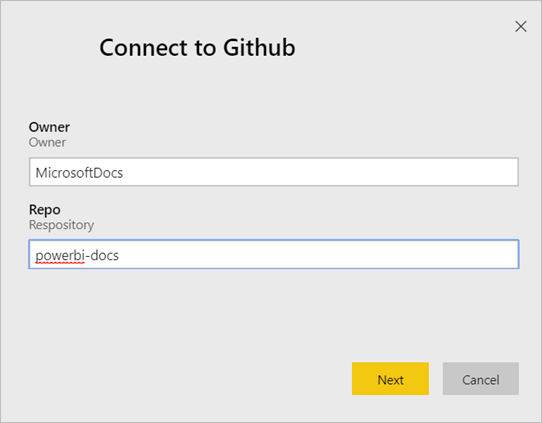
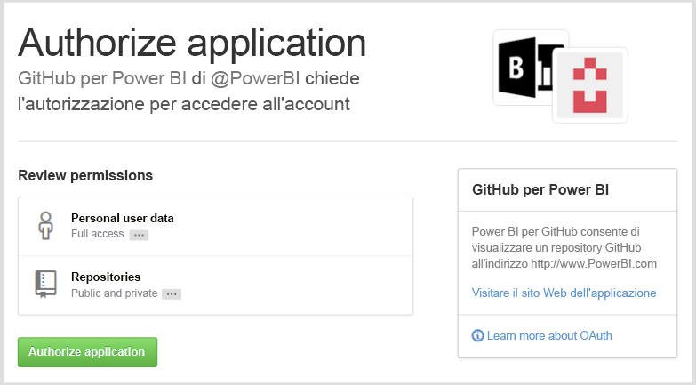
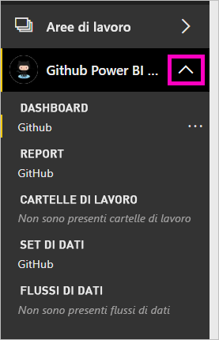
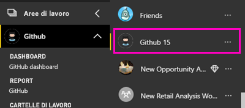
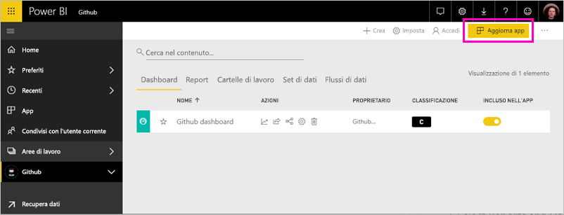
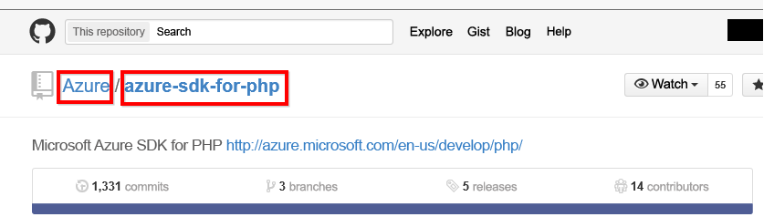

# Connettersi a GitHub con Power BI
Questo articolo illustra come eseguire il pull dei dati dall'account GitHub con un'app modello di Power BI. L'app modello genera un'area di lavoro con un dashboard, un set di report e un set di dati, per consentire l'esplorazione dei dati di GitHub. L'app GitHub per Power BI permette di ottenere informazioni dettagliate su un repository GitHub con dati relativi a contributi, problemi, richieste pull e utenti attivi.

Dopo avere installato l'app modello, è possibile modificare il dashboard e il report. È quindi possibile eseguirne la distribuzione come app ai colleghi dell'organizzazione.

Connettersi all'[app modello GitHub](https://app.powerbi.com/groups/me/getapps/services/pbi-contentpacks.pbiapps-github) oppure leggere altre informazioni sull'[integrazione di GitHub](https://powerbi.microsoft.com/integrations/github) con Power BI.

È anche possibile provare l'[esercitazione su GitHub](service-tutorial-connect-to-github.md). Vengono installati dati di GitHub reali sul repository pubblico per la documentazione di Power BI.

>[!NOTE]
>Questa app modello richiede che l'account GitHub abbia accesso al repository. Di seguito sono fornite informazioni più dettagliate sui requisiti.
>
>Questa app modello non supporta GitHub Enterprise. 

## Come connettersi
[!INCLUDE [powerbi-service-apps-get-more-apps](../includes/powerbi-service-apps-get-more-apps.md)]
   
3. Selezionare **GitHub** \> **Scarica adesso**.
4. In **Installare questa app di Power BI?** selezionare **Installa**.
4. Nel riquadro **App** selezionare il riquadro **GitHub**.

    

6. In **Operazioni iniziali con la nuova app** selezionare **Connetti**.

    

5. Immettere il nome del repository e il proprietario del repository. Per informazioni dettagliate su [come trovare questi parametri](#FindingParams), vedere più avanti.
   
    

5. Immettere le credenziali di GitHub. È possibile saltare questo passaggio se è già stato effettuato l'accesso nel browser. 
6. Per **Metodo di autenticazione**, selezionare **oAuth2** \> **Accedi**. 
7. Seguire le istruzioni nelle schermate di autenticazione di GitHub. Concedere all'app modello GitHub per Power BI le autorizzazioni per i dati di GitHub.
   
   
   
    Power BI si connette a GitHub e ai dati.  I dati vengono aggiornati una volta al giorno. Quando Power BI importa i dati, vengono visualizzati i contenuti della nuova area di lavoro GitHub.

## Modificare e distribuire l'app

È stata installata l'app modello GitHub. Ciò significa che è stata anche creata l'area di lavoro GitHub. Nell'area di lavoro è possibile modificare il report e il dashboard e quindi eseguirne la distribuzione come *app* ai colleghi dell'organizzazione. 

1. Selezionare la freccia accanto al nome dell'area di lavoro nel riquadro di spostamento. È possibile vedere che l'area di lavoro contiene un dashboard e un report.

    

8. Selezionare il nuovo [dashboard GitHub](https://powerbi.microsoft.com/integrations/github).    
    

3. Per visualizzare tutti i contenuti della nuova area di lavoro GitHub, nel riquadro di spostamento selezionare **Aree di lavoro** > **GitHub**.
 
   

    Questa visualizzazione rappresenta l'elenco di contenuti per l'area di lavoro. Nell'angolo in alto a destra è disponibile il comando **Aggiorna app**. Quando si è pronti per distribuire l'app ai colleghi, è possibile iniziare. 

    

2. Selezionare **Report** e **Set di dati** per visualizzare gli altri elementi nell'area di lavoro.

    Leggere altre informazioni sulla [distribuzione di app](../collaborate-share/service-create-distribute-apps.md) ai colleghi.

## Elementi inclusi nell'app
I dati seguenti sono disponibili da GitHub in Power BI:     

| Nome tabella | Descrizione |
| --- | --- |
| Contributi |La tabella dei contributi fornisce il totale delle operazioni di aggiunta, eliminazione e commit effettuate dal collaboratore, aggregato per ogni settimana. Sono inclusi i 100 collaboratori principali. |
| Issues |Elenca tutti i problemi per il repository selezionato e include calcoli quali il tempo totale e medio per la chiusura di un problema, il numero totale di problemi aperti e il numero totale di problemi chiusi. Questa tabella sarà vuota se il repository non include alcun problema. |
| Pull requests |Questa tabella contiene tutte le richieste pull per il repository e gli autori di tali richieste. Contiene anche calcoli relativi a numero di richieste pull aperte, chiuse e totali, tempo necessario per il pull delle richieste e durata media delle richieste pull. Questa tabella sarà vuota se il repository non include alcun problema. |
| Utenti |Questa tabella fornisce un elenco di utenti o collaboratori di GitHub che hanno contribuito, hanno sottoposto problemi o hanno risolto richieste pull per il repository selezionato. |
| Milestones |Include tutte le attività cardine per il repository selezionato. |
| DateTable |Questa tabella contiene date a partire da quella corrente e per gli anni passati che consentono di analizzare i dati di GitHub in base alla data. |
| ContributionPunchCard |Questa tabella può essere usata come una scheda perforata di collaborazione per il repository selezionato. Mostra i commit in base al giorno della settimana e all'ora del giorno. Questa tabella non è connessa ad altre tabelle nel modello. |
| RepoDetails |Questa tabella fornisce dettagli per il repository selezionato. |

## Requisiti di sistema
* Account GitHub autorizzato ad accedere al repository.  
* Autorizzazione concessa a Power BI per l'app GitHub durante il primo accesso. Vedere i dettagli riportati di seguito relativi alla revoca dell'accesso.  
* Chiamate API disponibili sufficienti per eseguire il pull e aggiornare i dati.
>[!NOTE]
>Questa app modello non supporta GitHub Enterprise.

### Rimuovere le autorizzazioni per Power BI
Per rimuovere le autorizzazioni per la connessione di Power BI al repository GitHub, è possibile revocare l'accesso in GitHub. Per informazioni dettagliate, vedere questo argomento della [guida di GitHub](https://help.github.com/articles/keeping-your-ssh-keys-and-application-access-tokens-safe/#reviewing-your-authorized-applications-oauth).

## Individuazione dei parametri
È possibile determinare il proprietario e il repository esaminando il repository in GitHub:

La prima parte, "Azure", è il proprietario e la seconda parte, "azure-sdk-for-php", è il repository stesso.  Questi due elementi sono visibili nell'URL del repository:

    <https://github.com/Azure/azure-sdk-for-php> .

## Risoluzione dei problemi
Se necessario, è possibile verificare le credenziali per GitHub.  

1. In un'altra finestra del browser passare al sito Web GitHub e accedere a GitHub. Per verificare se l'accesso è stato effettuato, vedere l'angolo superiore destro del sito GitHub.    
2. In GitHub passare all'URL del repository a cui si vuole accedere in Power BI. Ad esempio: https://github.com/dotnet/corefx.  
3. In Power BI provare a connettersi a GitHub. Nella finestra di dialogo di configurazione di GitHub usare i nomi del repository e del proprietario del repository per lo stesso repository.  

## Passaggi successivi

* [Esercitazione: Connettersi a un repository GitHub con Power BI](service-tutorial-connect-to-github.md)
* [Creare le nuove aree di lavoro in Power BI](../collaborate-share/service-create-the-new-workspaces.md)
* [Installare e usare app in Power BI](../consumer/end-user-apps.md)
* [Connettersi alle app Power BI per servizi esterni](service-connect-to-services.md)
* Domande? [Provare a rivolgersi alla community di Power BI](https://community.powerbi.com/)
