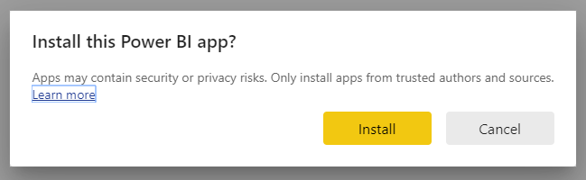

# Connettersi a GitHub con Power BI
Questo articolo illustra come eseguire il pull dei dati dall'account GitHub con un'app modello di Power BI. L'app modello genera un'area di lavoro con un dashboard, un set di report e un set di dati, per consentire l'esplorazione dei dati di GitHub. L'app GitHub per Power BI permette di ottenere informazioni dettagliate su un repository GitHub con dati relativi a contributi, problemi, richieste pull e utenti attivi.

Dopo avere installato l'app modello, è possibile modificare il dashboard e il report. È quindi possibile eseguirne la distribuzione come app ai colleghi dell'organizzazione.

Connettersi all'[app modello GitHub](https://app.powerbi.com/groups/me/getapps/services/pbi-contentpacks.pbiapps-github) oppure leggere altre informazioni sull'[integrazione di GitHub](https://powerbi.microsoft.com/integrations/github) con Power BI.

È anche possibile provare l'[esercitazione su GitHub](service-tutorial-connect-to-github.md). Vengono installati dati di GitHub reali sul repository pubblico per la documentazione di Power BI.

>[!NOTE]
>Questa app modello richiede che l'account GitHub abbia accesso al repository. Di seguito sono fornite informazioni più dettagliate sui requisiti.
>
>Questa app modello non supporta GitHub Enterprise.

## Installare l'app

1. Per ottenere l'app, fare clic sul collegamento seguente: [App modello GitHub](https://app.powerbi.com/groups/me/getapps/services/pbi-contentpacks.pbiapps-github)

1. Nella pagina di AppSource per l'app selezionare [**Scarica adesso**](https://app.powerbi.com/groups/me/getapps/services/pbi-contentpacks.pbiapps-github).

    

1. Selezionare **Installa**. 

    

    Dopo l'installazione, l'app sarà visualizzata nella pagina App.

   

## Connessione alle origini dati

1. Selezionare l'icona nella pagina App per aprire l'app.

1. Nella schermata iniziale selezionare **Esplora app**.

   

   L'app viene aperta e visualizza dati di esempio.

1. Selezionare il collegamento **Connettere i dati** nel banner nella parte superiore della pagina.

   

1. Nella finestra di dialogo visualizzata immettere il nome del repository e il proprietario del repository. Per informazioni dettagliate su [come trovare questi parametri](#FindingParams), vedere più avanti. Al termine fare clic su **Avanti**.

   

1. Nella finestra di dialogo successiva visualizzata verificare che il metodo di autenticazione sia impostato su **OAuth2**. Non è necessario eseguire alcuna operazione per l'impostazione della privacy. Quando si è pronti, fare clic su **Accedi**.

   

1. Immettere le credenziali di GitHub e seguire il processo di autenticazione di GitHub. È possibile saltare questo passaggio se è già stato effettuato l'accesso nel browser.

   

Dopo aver eseguito l'accesso, il report si connette alle origini dati e viene popolato con dati aggiornati. Durante questo periodo viene attivato il monitoraggio attività.

I dati del report verranno aggiornati automaticamente una volta al giorno, a meno che l'aggiornamento non sia stato disabilitato durante il processo di accesso. Volendo, è anche possibile [configurare un aggiornamento pianificato](./refresh-scheduled-refresh.md) per mantenere aggiornati i dati del report.

## Personalizza e condividi

Per personalizzare e condividere l'app, selezionare l'icona della matita nell'angolo in alto a destra della pagina.

Per informazioni sulla modifica degli artefatti nell'area di lavoro, vedere
* [Presentazione dell'editor di report in Power BI](../create-reports/service-the-report-editor-take-a-tour.md)
* [Concetti di base del servizio Power BI](../fundamentals/service-basic-concepts.md)

Dopo aver apportato le modifiche desiderate agli artefatti nell'area di lavoro, si è pronti per pubblicare e condividere l'app. Vedere [Pubblicare l'app](../collaborate-share/service-create-distribute-apps.md#publish-your-app) per informazioni su come eseguire questa operazione.

## Elementi inclusi nell'app
I dati seguenti sono disponibili da GitHub in Power BI:     

| Nome tabella | Descrizione |
| --- | --- |
| Contributi |La tabella dei contributi fornisce il totale delle operazioni di aggiunta, eliminazione e commit effettuate dal collaboratore, aggregato per ogni settimana. Sono inclusi i 100 collaboratori principali. |
| Issues |Elenca tutti i problemi per il repository selezionato e include calcoli quali il tempo totale e medio per la chiusura di un problema, il numero totale di problemi aperti e il numero totale di problemi chiusi. Questa tabella sarà vuota se il repository non include alcun problema. |
| Pull requests |Questa tabella contiene tutte le richieste pull per il repository e gli autori di tali richieste. Contiene anche calcoli relativi a numero di richieste pull aperte, chiuse e totali, tempo necessario per il pull delle richieste e durata media delle richieste pull. Questa tabella sarà vuota se il repository non include alcun problema. |
| Utenti |Questa tabella fornisce un elenco di utenti o collaboratori di GitHub che hanno contribuito, hanno sottoposto problemi o hanno risolto richieste pull per il repository selezionato. |
| Milestones |Include tutte le attività cardine per il repository selezionato. |
| DateTable |Questa tabella contiene date a partire da quella corrente e per gli anni passati che consentono di analizzare i dati di GitHub in base alla data. |
| ContributionPunchCard |Questa tabella può essere usata come una scheda perforata di collaborazione per il repository selezionato. Mostra i commit in base al giorno della settimana e all'ora del giorno. Questa tabella non è connessa ad altre tabelle nel modello. |
| RepoDetails |Questa tabella fornisce dettagli per il repository selezionato. |

## Requisiti di sistema
* Account GitHub autorizzato ad accedere al repository.  
* Autorizzazione concessa a Power BI per l'app GitHub durante il primo accesso. Vedere i dettagli riportati di seguito relativi alla revoca dell'accesso.  
* Chiamate API disponibili sufficienti per eseguire il pull e aggiornare i dati.
>[!NOTE]
>Questa app modello non supporta GitHub Enterprise.

### Rimuovere le autorizzazioni per Power BI
Per rimuovere le autorizzazioni per la connessione di Power BI al repository GitHub, è possibile revocare l'accesso in GitHub. Per informazioni dettagliate, vedere questo argomento della [guida di GitHub](https://help.github.com/articles/keeping-your-ssh-keys-and-application-access-tokens-safe/#reviewing-your-authorized-applications-oauth).

## Individuazione dei parametri
È possibile determinare il proprietario e il repository esaminando il repository in GitHub:

La prima parte, "Azure", è il proprietario e la seconda parte, "azure-sdk-for-php", è il repository stesso.  Questi due elementi sono visibili nell'URL del repository:

    <https://github.com/Azure/azure-sdk-for-php> .

## Risoluzione dei problemi
Se necessario, è possibile verificare le credenziali per GitHub.  

1. In un'altra finestra del browser passare al sito Web GitHub e accedere a GitHub. Per verificare se l'accesso è stato effettuato, vedere l'angolo superiore destro del sito GitHub.    
2. In GitHub passare all'URL del repository a cui si vuole accedere in Power BI. Ad esempio: https://github.com/dotnet/corefx.  
3. In Power BI provare a connettersi a GitHub. Nella finestra di dialogo di configurazione di GitHub usare i nomi del repository e del proprietario del repository per lo stesso repository.  

## Passaggi successivi

* [Esercitazione: Connettersi a un repository GitHub con Power BI](service-tutorial-connect-to-github.md)
* [Creare le nuove aree di lavoro in Power BI](../collaborate-share/service-create-the-new-workspaces.md)
* [Installare e usare app in Power BI](../consumer/end-user-apps.md)
* [Connettersi alle app Power BI per servizi esterni](service-connect-to-services.md)
* Domande? [Provare a rivolgersi alla community di Power BI](https://community.powerbi.com/)
