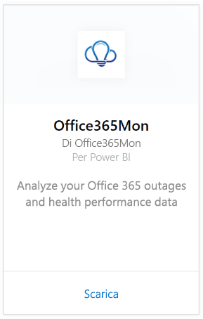
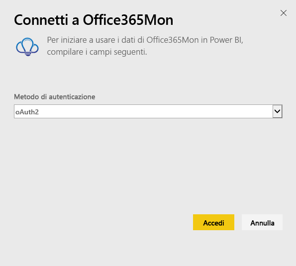
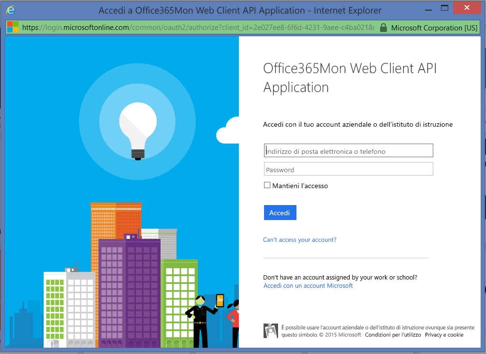
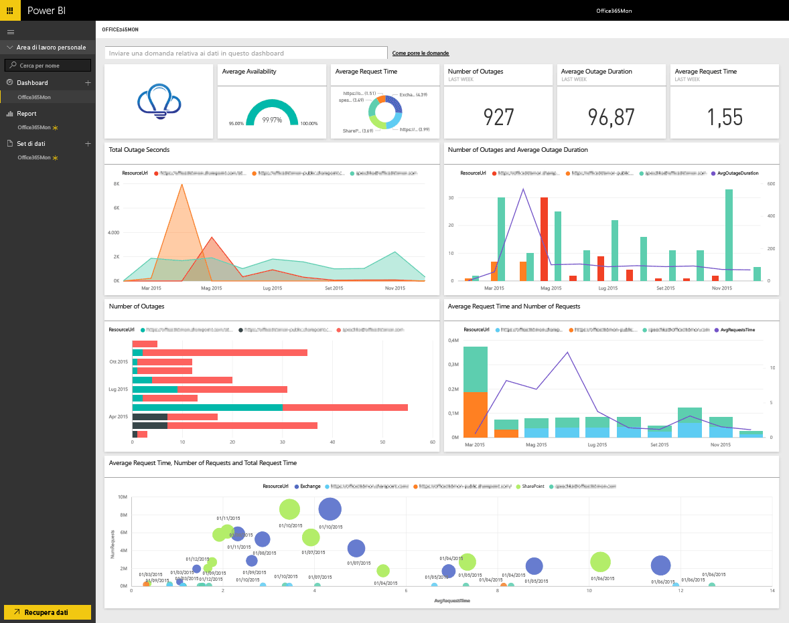

# Connettersi a Office365Mon con Power BI
Con Power BI e l'app modello Office365Mon è facile analizzare i dati sulle prestazioni, sull'integrità e sulle interruzioni di servizio di Office 365. Power BI recupera i dati, inclusi i probe di integrità e interruzione del servizio, quindi crea il dashboard e i report predefiniti in base a tali dati.

Connettersi all'[app modello Office365Mon](https://msit.powerbi.com/groups/me/getapps/services/office365mon.office365mon_powerbi_v3) per Power BI.

>[!NOTE]
>È necessario un account amministratore di Office365Mon per connettersi e caricare l'app modello di Power BI.

## Come connettersi
1. Selezionare **Recupera dati** nella parte inferiore del riquadro di spostamento.
   
   
2. Nella casella **Servizi** selezionare **Recupera**.
   
    
3. Selezionare **Office365Mon** \> **Recupera**.
   
   
4. Per Metodo di autenticazione selezionare **oAuth2** \> **Accedi**.
   
   Quando richiesto, immettere le credenziali dell'account amministratore di Office365Mon e seguire il processo di autenticazione.
   
   
   
   
5. Dopo l'importazione dei dati in Power BI, nel riquadro di spostamento vengono visualizzati il nuovo dashboard, il nuovo report e il nuovo set di dati. I nuovi elementi vengono contrassegnati con un asterisco giallo \*, selezionare la voce Office365Mon.
   
   

**Altre operazioni**

* Provare a [porre una domanda nella casella Domande e risposte](../consumer/end-user-q-and-a.md) nella parte superiore del dashboard
* [Cambiare i riquadri](../create-reports/service-dashboard-edit-tile.md) nel dashboard.
* [Selezionare un riquadro](../consumer/end-user-tiles.md) per aprire il report sottostante.
* Anche se la pianificazione prevede che il set di dati venga aggiornato quotidianamente, è possibile modificarne la frequenza di aggiornamento o provare ad aggiornarlo su richiesta usando **Aggiorna ora**

## Risoluzione dei problemi
Se si verifica un errore **"Accesso non riuscito"** dopo aver usato le credenziali di sottoscrizione di Office365Mon per eseguire accesso, significa che l'account in uso non ha le autorizzazioni per recuperare i dati di Office365Mon dall'account. Verificare che sia un account amministratore e riprovare.

## Passaggi successivi
[Che cos'è Power BI?](../fundamentals/power-bi-overview.md)

[Recuperare dati per Power BI](service-get-data.md)
