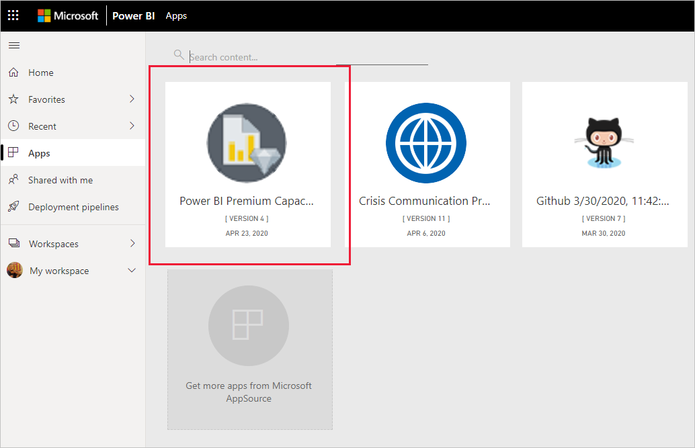
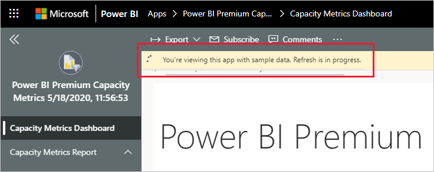

# Connettersi a Power BI Premium Capacity Metrics
Il monitoraggio delle capacità è essenziale per prendere decisioni informate sull'uso ottimale delle risorse della capacità Premium. L'app Power BI Premium Capacity Metrics offre informazioni dettagliate sulle prestazioni delle capacità.

Questo articolo descrive come installare l'app e connettersi alle origini dati. Per informazioni sul contenuto del report e su come usarlo, vedere [Monitorare le capacità Premium con l'app](../service-admin-premium-monitor-capacity.md) e il [post di blog sull'app Premium Capacity Metrics](https://powerbi.microsoft.com/blog/premium-capacity-metrics-app-new-health-center-with-kpis-to-explore-relevant-metrics-and-steps-to-mitigate-issues/).

Dopo aver installato l'app e aver effettuato la connessione alle origini dati, è possibile personalizzare il report in base alle esigenze specifiche. È quindi possibile distribuirlo ai colleghi dell'organizzazione.

> [!NOTE]
> Per l'installazione di app modello, sono necessarie [autorizzazioni](./service-template-apps-install-distribute.md#prerequisites). Se le autorizzazioni disponibili non sono sufficienti, contattare l'amministratore del tenant.

## Installare l'app

1. Per ottenere l'app, fare clic sul collegamento seguente: [App modello Power BI Premium Capacity Metrics](https://app.powerbi.com/groups/me/getapps/services/pbi_pcmm.capacity-metrics-dxt)

1. Nella pagina di AppSource per l'app selezionare [**Scarica adesso**](https://app.powerbi.com/groups/me/getapps/services/pbi_pcmm.capacity-metrics-dxt).

    

1. Selezionare **Installa**. 

    

    > [!NOTE]
    > Se l'app è stata installata in precedenza, verrà chiesto se si vuole [sovrascrivere l'installazione](./service-template-apps-install-distribute.md#update-a-template-app) o eseguire l'installazione in una nuova area di lavoro.

    Dopo l'installazione, l'app sarà visualizzata nella pagina App.

   

## Connessione alle origini dati

1. Selezionare l'icona nella pagina App per aprire l'app.

1. Nella schermata iniziale selezionare **Esplora app**.

   

   L'app viene aperta e visualizza dati di esempio.

1. Selezionare il collegamento **Connettere i dati** nel banner nella parte superiore della pagina.

   

1. Nella finestra di dialogo visualizzata impostare la differenza dall'ora UTC, ovvero la differenza in ore tra l'ora UTC (Coordinated Universal Time) e l'ora della propria località. Fare quindi clic su **Next** (Avanti).
  
   

1. Nella finestra di dialogo successiva visualizzata non è necessario eseguire alcuna operazione. Selezionare solo **Accedi**.

   

1. Nella schermata di accesso di Microsoft accedere a Power BI.

   

   Dopo aver eseguito l'accesso, il report si connette alle origini dati e viene popolato con dati aggiornati. Durante questo periodo viene attivato il monitoraggio attività.

   

   I dati del report verranno aggiornati automaticamente una volta al giorno, a meno che l'aggiornamento non sia stato disabilitato durante il processo di accesso. Volendo, è anche possibile [configurare un aggiornamento pianificato](./refresh-scheduled-refresh.md) per mantenere aggiornati i dati del report.

## Personalizza e condividi

Per iniziare a personalizzare l'app, fare clic sull'icona della matita nell'angolo in alto a destra.

 

Per informazioni dettagliate, vedere [Personalizzare e condividere l'app](./service-template-apps-install-distribute.md#customize-and-share-the-app).

## Passaggi successivi
* [Monitorare le capacità Premium con l'app](../admin/service-admin-premium-monitor-capacity.md)
* [Post di blog sull'app Premium Capacity Metrics](https://powerbi.microsoft.com/blog/premium-capacity-metrics-app-new-health-center-with-kpis-to-explore-relevant-metrics-and-steps-to-mitigate-issues/)
* [Che cosa sono le app modello di Power BI?](./service-template-apps-overview.md)
* [Installare e distribuire le app modello nell'organizzazione](./service-template-apps-install-distribute.md)
* Domande? [Provare a rivolgersi alla community di Power BI](https://community.powerbi.com/)