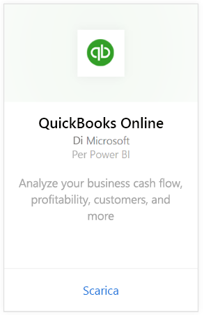
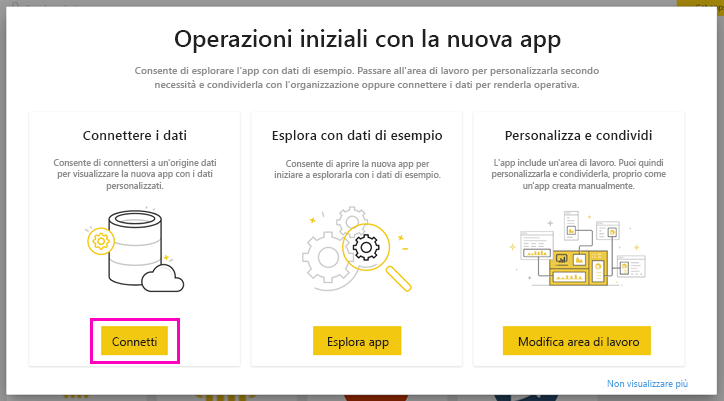
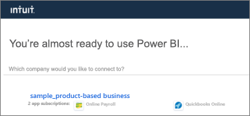
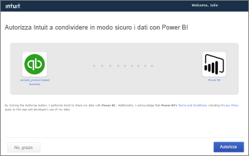
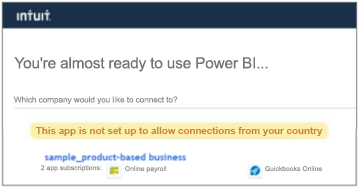

# Connettersi a QuickBooks Online con Power BI
Quando ci si connette ai dati di QuickBooks Online da Power BI, vengono immediatamente visualizzati un dashboard e report di Power BI che forniscono informazioni dettagliate sul flusso di cassa aziendale, sulla redditività, sui clienti e molto altro ancora. È possibile usare il dashboard e i report senza alcuna modifica oppure personalizzarli per evidenziare le informazioni a cui si è maggiormente interessati. I dati vengono aggiornati automaticamente una volta al giorno.

Connettersi all'[app modello QuickBooks Online](https://dxt.powerbi.com/getdata/services/quickbooks-online) per Power BI.

>[!NOTE]
>Per importare i dati di QuickBooks Online in Power BI, è necessario usare un account amministratore di QuickBooks Online e accedere con le credenziali di tale account. Non è possibile usare questo connettore con il software QuickBooks Desktop. 

## Come connettersi

[!INCLUDE [powerbi-service-apps-get-more-apps](../includes/powerbi-service-apps-get-more-apps.md)]

3. Selezionare **QuickBooks Online**e quindi **Recupera**.
   
   

4. In **Installare questa app di Power BI?** selezionare **Installa**.

    

4. Nel riquadro **App** selezionare il riquadro **QuickBooks**.

   

6. In **Operazioni iniziali con la nuova app** selezionare **Connetti**.

    

4. Selezionare **oAuth2** come Metodo di autenticazione e fare clic su **Accedi**. 
5. Quando richiesto, immettere le credenziali di QuickBooks Online e seguire il processo di autenticazione. Se è già stato effettuato l'accesso a QuickBooks Online nel browser, le credenziali potrebbero non essere  richieste.
   >[!NOTE]
   >Sono necessarie le credenziali dell'account amministratore di QuickBooks Online.
6. Selezionare la società da connettere a Power BI nella schermata successiva.
   
   

7. Selezionare **Autorizza** nella schermata successiva per avviare il processo di importazione. Il processo può richiedere qualche minuto a seconda delle dimensioni dei dati aziendali. 
   
   
   
8. Dopo l'importazione dei dati in Power BI, viene visualizzato l'elenco contenuto dell'app QuickBooks: un nuovo dashboard, un nuovo report e un nuovo set di dati.
9. Selezionare il dashboard QuickBooks per avviare il processo di esplorazione. Il dashboard viene creato automaticamente in Power BI per visualizzare i dati importati.

    

**Altre operazioni**

* Provare a [porre una domanda nella casella Domande e risposte](../consumer/end-user-q-and-a.md) nella parte superiore del dashboard
* [Cambiare i riquadri](../create-reports/service-dashboard-edit-tile.md) nel dashboard.
* [Selezionare un riquadro](../consumer/end-user-tiles.md) per aprire il report sottostante.
* Anche se la pianificazione prevede che il set di dati venga aggiornato quotidianamente, è possibile modificarne la frequenza di aggiornamento o provare ad aggiornarlo su richiesta usando **Aggiorna ora**

## Risoluzione dei problemi
**"Si è verificato un errore"**

Se dopo aver selezionato **Autorizza**, viene visualizzato un messaggio di errore simile al seguente:

" "Si è verificato un errore". Chiudere la finestra e riprovare.

Un altro utente di questa società ha già effettuato la sottoscrizione per questa applicazione. Contattare [indirizzo di posta elettronica dell'amministratore] per apportare modifiche alla sottoscrizione."

... un altro amministratore della società ha già stabilito la connessione tra i dati aziendali e Power BI. Chiedere all'amministratore di condividere il dashboard. Attualmente, un solo utente amministratore può connettere un determinato set di dati di QuickBooks Online a Power BI. Dopo la creazione del dashboard in Power BI, l'amministratore può condividerlo con più colleghi negli stessi tenant di Power BI.

**"Questa app non è configurata per consentire connessioni dal paese dell'utente"**

Attualmente, Power BI supporta solo le versioni di QuickBooks Online per gli Stati Uniti. 

## Passaggi successivi
[Che cos'è Power BI?](../fundamentals/power-bi-overview.md)

[Concetti di base del servizio Power BI](../fundamentals/service-basic-concepts.md)
