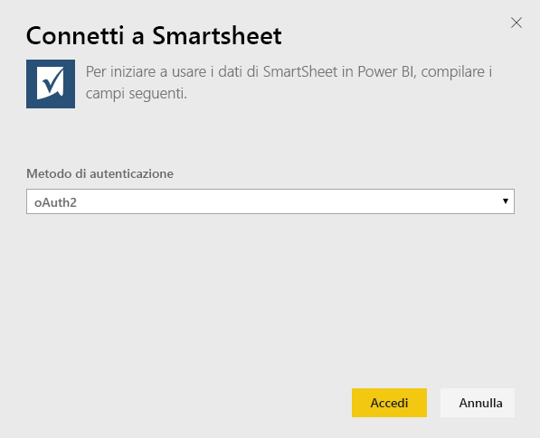
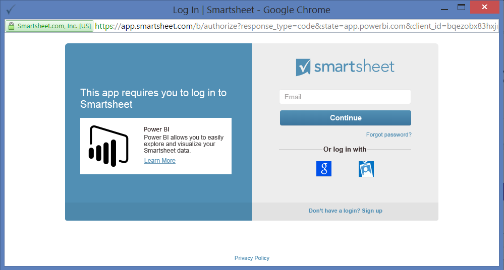
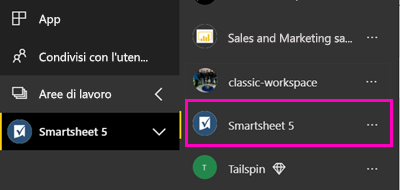

# Connettersi a Smartsheet con Power BI
Questo articolo illustra come eseguire il pull dei dati dall'account Smartsheet con un'app modello di Power BI. Smartsheet offre una piattaforma semplice per la collaborazione e la condivisione di file. L'app modello Smartsheet per Power BI offre un dashboard, report e set di dati che consentono di visualizzare una panoramica del proprio account Smartsheet. È anche possibile usare [Power BI Desktop](desktop-connect-to-data.md) per connettersi direttamente a singoli fogli nell'account. 

Dopo avere installato l'app modello, è possibile modificare il dashboard e il report. È quindi possibile eseguirne la distribuzione come app ai colleghi dell'organizzazione.

Connettersi all'[app modello Smartsheet](https://app.powerbi.com/groups/me/getapps/services/pbi-contentpacks.pbiapps-smartsheet) per Power BI.

>[!NOTE]
>Per connettersi e caricare l'app modello di Power BI, è preferibile usare un account amministratore di Smartsheet perché tale account usufruisce di accesso aggiuntivo.

## Come connettersi

[!INCLUDE [powerbi-service-apps-get-more-apps](../includes/powerbi-service-apps-get-more-apps.md)]

3. Selezionare **Smartsheet**  \> **Scarica adesso**.
4. In **Installare questa app di Power BI?** selezionare **Installa**.
4. Nel riquadro **App** selezionare il riquadro **Smartsheet**.

    

6. In **Operazioni iniziali con la nuova app** selezionare **Connetti**.

    

4. In Metodo di autenticazione selezionare **oAuth2 \> Accedi**.
   
   Quando richiesto, immettere le credenziali di Smartsheet e seguire il processo di autenticazione.
   
   
   
   

5. Dopo l'importazione dei dati in Power BI, viene aperto il dashboard Smartsheet.
   
   

## Modificare e distribuire l'app

È stata installata l'app modello Smartsheet. Ciò significa che è stata anche creata l'area di lavoro per Smartsheet. Nell'area di lavoro è possibile modificare il report e il dashboard e quindi eseguirne la distribuzione come *app* ai colleghi dell'organizzazione. 

1. Per visualizzare tutti i contenuti della nuova area di lavoro Smartsheet, nel riquadro di spostamento selezionare **Aree di lavoro** > **Smartsheet**. 

    

    Questa visualizzazione rappresenta l'elenco di contenuti per l'area di lavoro. Nell'angolo in alto a destra è disponibile il comando **Aggiorna app**. Quando si è pronti per distribuire l'app ai colleghi, è possibile iniziare. 

    

2. Selezionare **Report** e **Set di dati** per visualizzare gli altri elementi nell'area di lavoro.

    Leggere altre informazioni sulla [distribuzione di app](../collaborate-share/service-create-distribute-apps.md) ai colleghi.

## Cosa è incluso
L'app modello Smartsheet per Power BI include una panoramica dell'account Smartsheet, ad esempio il numero di aree di lavoro, i report e i fogli disponibili, le date di modifica di questi elementi e così via. Gli utenti amministratori visualizzano anche alcune informazioni sugli utenti del proprio sistema, ad esempio i principali autori di fogli.  

Per connettersi direttamente a singoli fogli nell'account, è possibile usare il connettore Smartsheet in [Power BI Desktop](desktop-connect-to-data.md).  

## Passaggi successivi

* [Creare le nuove aree di lavoro in Power BI](../collaborate-share/service-create-the-new-workspaces.md)
* [Installare e usare app in Power BI](../consumer/end-user-apps.md)
* [Connettersi alle app Power BI per servizi esterni](service-connect-to-services.md)
* Domande? [Provare a rivolgersi alla community di Power BI](https://community.powerbi.com/)