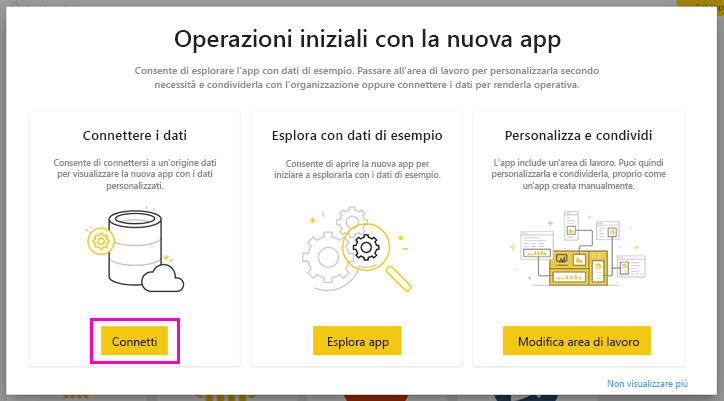

# Connettersi a Xero con Power BI
Xero è un software per la contabilità online facile da usare, progettato in modo specifico per le piccole imprese. È possibile creare visualizzazioni accattivanti basate sui dati finanziari di Xero con questa app modello per Power BI. Il dashboard predefinito include molte metriche relative alle piccole imprese, ad esempio disponibilità liquide, ricavi e costi, tendenza profitti e perdite, scadenziario e ritorno sugli investimenti.

Connettersi all'[app modello Xero](https://app.powerbi.com/getdata/services/xero) per Power BI oppure ottenere altre informazioni sull'integrazione tra [Xero e Power BI](https://help.xero.com/Power-BI).

## Come connettersi

[!INCLUDE [powerbi-service-apps-get-more-apps](../includes/powerbi-service-apps-get-more-apps.md)]

3. Selezionare **Xero** \> **Scarica adesso**.
4. In **Installare questa app di Power BI?** selezionare **Installa**.

    

4. Nel riquadro **App** selezionare il riquadro **Xero**.

   

6. In **Operazioni iniziali con la nuova app** selezionare **Connetti**.

    

4. Immettere un nome alternativo per l'organizzazione associata all'account Xero. È possibile usare qualsiasi valore. Questo nome serve principalmente per aiutare gli utenti con più organizzazioni di Xero a gestirle in modo ottimale. Vedere i dettagli sul [reperimento dei parametri](#FindingParams) più avanti in questo articolo.

    

5. In **Metodo di autenticazione** selezionare **OAuth**. Quando richiesto accedere all'account Xero e selezionare l'organizzazione a cui connettersi. Effettuato l'accesso, selezionare **Accedi** per avviare il processo di caricamento.
   
    
   
    
6. Dopo l'approvazione, il processo di importazione inizierà automaticamente. Al termine, nel riquadro di spostamento verranno visualizzati un nuovo dashboard, un nuovo report e un nuovo modello. Selezionare il dashboard per visualizzare i dati importati.
   
     

**Altre operazioni**

* Provare a [porre una domanda nella casella Domande e risposte](../consumer/end-user-q-and-a.md) nella parte superiore del dashboard
* [Cambiare i riquadri](../create-reports/service-dashboard-edit-tile.md) nel dashboard.
* [Selezionare un riquadro](../consumer/end-user-tiles.md) per aprire il report sottostante.
* Anche se la pianificazione prevede che il set di dati venga aggiornato quotidianamente, è possibile modificarne la frequenza di aggiornamento o provare ad aggiornarlo su richiesta usando **Aggiorna ora**

## Cosa è incluso
Il dashboard dell'app modello include riquadri e metriche relative a diverse aree, con report corrispondenti che contengono altre informazioni:  

| Area | Riquadro del dashboard | Report |
| --- | --- | --- |
| Cassa |Flusso di cassa giornaliero  Incassi  Flussi di cassa in uscita  Saldo di chiusura per account  Saldo di chiusura odierno |Conti correnti bancari |
| Cliente |Vendite fatturate  Vendite fatturate per cliente  Tendenza di incremento delle vendite fatturate  Fatture in scadenza  Crediti in sospeso  Crediti scaduti |Cliente  Inventory |
| Fornitore |Acquisti fatturati  Acquisti fatturati per fornitore  Tendenza di incremento degli acquisti fatturati   Pagamenti in scadenza  Pagamenti in sospeso  Pagamenti scaduti |Fornitori  Inventory |
| Inventory |Importo di vendite mensili per prodotto |Inventory |
| Profitti e perdite |Profitti e perdite mensili  Profitti netti per l'anno fiscale  Profitti netti per il mese  Note spese principali |Profitti e perdite |
| Stato patrimoniale |Totale cespiti  Totale passività  Titoli azionari |Stato patrimoniale |
| Salute |Rapporto corrente  Percentuale di profitto lordo   Redditività dei cespiti totali  Totale passivo rapporto capitale netto |Salute  Glossario e note tecniche |

Il set di dati include anche le tabelle seguenti per personalizzare i report e i dashboard:  

* Indirizzi  
* Avvisi  
* Saldo giornaliero rendiconto bancario  
* Rendiconti bancari  
* Contatti  
* Note di rimborso spese  
* Voci della fattura  
* Fatture  
* Elementi  
* Fine mese  
* Organizzazione  
* Trial Balance  
* Account Xero

## Requisiti di sistema
I ruoli seguenti sono necessari per accedere all'app modello Xero: "Standard + Report" o "Advisor".

## Individuazione dei parametri
Specificare un nome per l'organizzazione di cui tenere traccia in Power BI. Un nome specifico consente di connettersi a più organizzazioni diverse. Non è possibile connettersi più volte alla stessa organizzazione, perché ciò influirà sull'aggiornamento pianificato.   

## Risoluzione dei problemi
* Gli utenti Xero devono avere i ruoli seguenti per accedere all'app modello Xero per Power BI: "Standard + Report" o "Advisor". L'app modello si basa sulle autorizzazioni basate sugli utenti per accedere ai dati di creazione di report con Power BI.
* Durante il caricamento, i riquadri nel dashboard sono in stato di caricamento generico. Rimangono in questo stato fino al termine del caricamento completo. Se si riceve una notifica che il caricamento è stato completato ma i riquadri sono ancora in fase di caricamento, provare ad aggiornare i riquadri del dashboard usando ... nella parte superiore destra del dashboard.
* Se l'app modello non viene aggiornata, assicurarsi di non essersi connessi più volte alla stessa organizzazione in Power BI. Xero consente solo una singola connessione attiva a un'organizzazione e potrebbe essere visualizzato un errore che indica che le credenziali non sono valide se ci si connette più volte alla stessa organizzazione.  
* Per problemi di connessione all'app modello Xero per Power BI, ad esempio messaggi di errore o tempi di caricamento lenti, cancellare prima di tutto la cache o i cookie e riavviare il browser, quindi riconnettersi a Power BI.  

Per altri problemi, inviare un ticket all'indirizzo https://support.powerbi.com se il problema persiste.

## Passaggi successivi
[Introduzione a Power BI](../fundamentals/service-get-started.md)

[Recuperare dati in Power BI](service-get-data.md)
