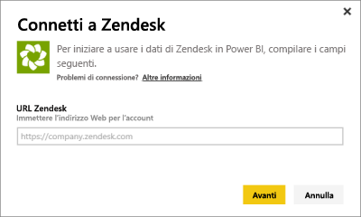
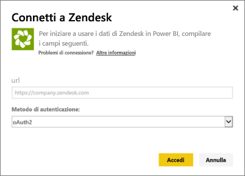
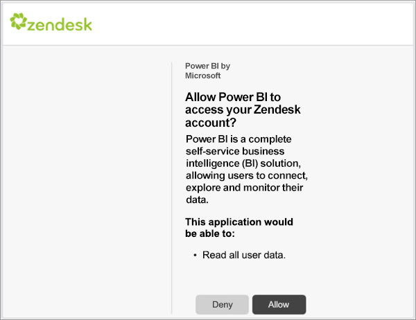
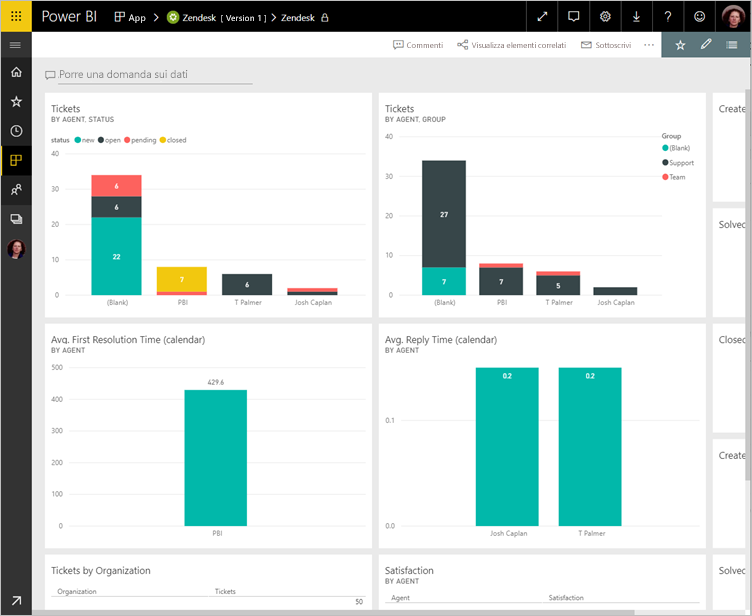
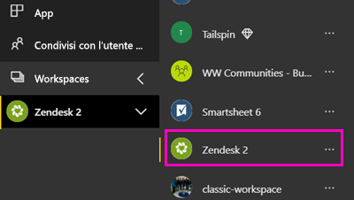
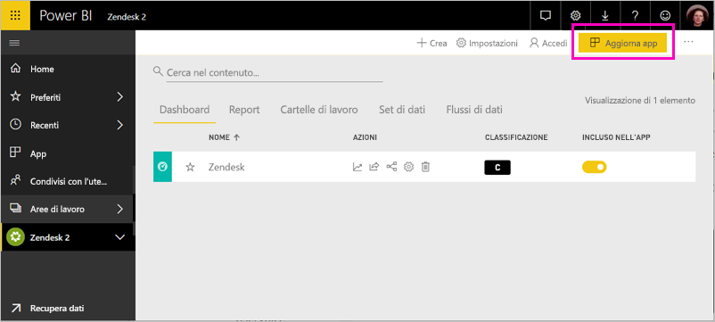

# Connettersi a Zendesk con Power BI

Questo articolo illustra come eseguire il pull dei dati dall'account Zendesk con un'app modello di Power BI. L'app Zendesk offre un dashboard di Power BI e un set di report di Power BI che rendono disponibili informazioni dettagliate sul numero di ticket e sulle prestazioni degli agenti. I dati vengono aggiornati automaticamente una volta al giorno. 

Dopo aver installato l'app modello, è possibile personalizzare il dashboard e il report per evidenziare le informazioni a cui si è maggiormente interessati. È quindi possibile eseguirne la distribuzione come app ai colleghi dell'organizzazione.

Connettersi all'[app modello Zendesk](https://app.powerbi.com/getdata/services/zendesk) oppure leggere altre informazioni sull'[integrazione di Zendesk](https://powerbi.microsoft.com/integrations/zendesk) con Power BI.

Dopo avere installato l'app modello, è possibile modificare il dashboard e il report. È quindi possibile eseguirne la distribuzione come app ai colleghi dell'organizzazione.

>[!NOTE]
>Per la connessione, è necessario un account amministratore di Zendesk. Altre informazioni sui [requisiti](#system-requirements) sono disponibili più avanti.

## Come connettersi

[!INCLUDE [powerbi-service-apps-get-more-apps](../includes/powerbi-service-apps-get-more-apps.md)]

3. Selezionare **Zendesk** \> **Scarica adesso**.
4. In **Installare questa app di Power BI?** selezionare **Installa**.
4. Nel riquadro **App** selezionare il riquadro **Zendesk**.

    

6. In **Operazioni iniziali con la nuova app** selezionare **Connetti**.

    

4. Specificare l'URL associato all'account. Il formato dell'URL è **https://company.zendesk.com** . Per informazioni dettagliate su [come trovare questi parametri](#finding-parameters), vedere più avanti.
   
   

5. Quando richiesto, immettere le credenziali di Zendesk.  Selezionare **oAuth 2** come meccanismo di autenticazione e fare clic su **Accedi**. Seguire il flusso di autenticazione di Zendesk. Se è già stato effettuato l'accesso a Zendesk nel browser, le credenziali potrebbero non essere richieste.
   
   > [!NOTE]
   > Questa app modello richiede la connessione a un account amministratore Zendesk. 
   > 
   
   
6. Fare clic su **Consenti** per consentire a Power BI di accedere ai dati Zendesk.
   
   
7. Fare clic su **Connetti** per avviare il processo di importazione. 
8. Dopo l'importazione dei dati in Power BI, viene visualizzato l'elenco contenuto dell'app Zendesk: un nuovo dashboard, un nuovo report e un nuovo set di dati.
9. Selezionare il dashboard per avviare il processo di esplorazione.

    
   
## Modificare e distribuire l'app

È stata installata l'app modello Zendesk. Ciò significa che è stata anche creata l'area di lavoro Zendesk. Nell'area di lavoro è possibile modificare il report e il dashboard e quindi eseguirne la distribuzione come *app* ai colleghi dell'organizzazione. 

1. Per visualizzare tutti i contenuti della nuova area di lavoro Zendesk, nel riquadro di spostamento selezionare **Aree di lavoro** > **Zendesk**. 

    

    Questa visualizzazione rappresenta l'elenco di contenuti per l'area di lavoro. Nell'angolo in alto a destra è disponibile il comando **Aggiorna app**. Quando si è pronti per distribuire l'app ai colleghi, è possibile iniziare. 

    

2. Selezionare **Report** e **Set di dati** per visualizzare gli altri elementi nell'area di lavoro.

    Leggere altre informazioni sulla [distribuzione di app](../collaborate-share/service-create-distribute-apps.md) ai colleghi.

## Requisiti di sistema
Per accedere all'app modello Zendesk, è necessario un account amministratore di Zendesk. Gli agenti o gli utenti finali interessati a visualizzare i dati di Zendesk possono aggiungere un suggerimento ed esaminare il connettore di Zendesk in [Power BI Desktop](desktop-connect-to-data.md).

## Individuazione dei parametri
L'URL di Zendesk corrisponderà a quello usato per accedere all'account Zendesk. Se non si è certi di quale sia l'URL di Zendesk, è possibile vedere la [Guida di accesso](https://www.zendesk.com/login/) di Zendesk.

## Risoluzione dei problemi
In caso di problemi di connessione, verificare l'URL di Zendesk e assicurarsi che si stia usando un account amministratore di Zendesk.

## Passaggi successivi

* [Creare le nuove aree di lavoro in Power BI](../collaborate-share/service-create-the-new-workspaces.md)
* [Installare e usare app in Power BI](../consumer/end-user-apps.md)
* [Connettersi alle app Power BI per servizi esterni](service-connect-to-services.md)
* Domande? [Provare a rivolgersi alla community di Power BI](https://community.powerbi.com/)
