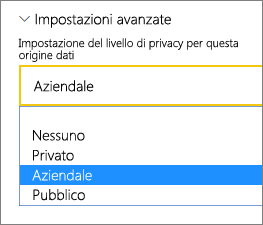

# <a name="manage-your-data-source---analysis-services"></a>Gestire l'origine dati - Analysis Services

[!INCLUDE [gateway-rewrite](../includes/gateway-rewrite.md)]

Dopo aver [installato il gateway dati locale](/data-integration/gateway/service-gateway-install), è necessario [aggiungere le origini dati](service-gateway-data-sources.md#add-a-data-source) che possono essere usate con il gateway. Questo articolo descrive l'uso di gateway e origini dati di SQL Server Analysis Services (SSAS) per l'aggiornamento pianificato o le connessioni in tempo reale.

Per altre informazioni sulla configurazione di una connessione dinamica ad Analysis Services, [guardare questo video](https://www.youtube.com/watch?v=GPf0YS-Xbyo&feature=youtu.be).

> [!NOTE]
> Se si dispone di un'origine dati di Analysis Services, è necessario installare il gateway in un computer appartenente allo stesso insieme di strutture o dominio del server Analysis Services.

## <a name="add-a-data-source"></a>Aggiungere un'origine dati

Per informazioni sull'aggiunta di un'origine dati, vedere [Aggiungere un'origine dati](service-gateway-data-sources.md#add-a-data-source). Selezionare **Analysis Services** come **Tipo di origine dati** se ci si connette a un server tabulare o multidimensionale.


Immettere le informazioni per l'origine dati, ovvero **Server** e **Database**. Le informazioni immesse per **Nome utente** e **Password** vengono usate dal gateway per connettersi all'istanza di Analysis Services.

> [!NOTE]
> L'account di Windows immesso deve disporre delle autorizzazioni di amministratore del server per l'istanza a cui ci si connette. Se la password dell'account è impostata in modo da scadere, gli utenti potrebbero visualizzare un errore di connessione se la password non viene aggiornata per l'origine dati. Per altre informazioni sulla modalità di archiviazione delle credenziali, vedere [Archiviazione di credenziali crittografate nel cloud](service-gateway-data-sources.md#store-encrypted-credentials-in-the-cloud).


Dopo aver compilato tutti i campi, selezionare **Aggiungi**. È ora possibile usare questa origine dati per l'aggiornamento pianificato o per le connessioni in tempo reale su un'istanza di Analysis Services locale. Se la connessione ha esito positivo, viene visualizzato il messaggio *Connessione riuscita*.


### <a name="advanced-settings"></a>Impostazioni avanzate

È possibile configurare il livello di privacy per l'origine dati, se necessario. Questa impostazione controlla il modo in cui possono essere combinati i dati e viene usata solo per l'aggiornamento pianificato, ma non si applica alle connessioni in tempo reale. Per altre informazioni sui livelli di privacy per l'origine dati, vedere [Livelli di privacy (Power Query)](https://support.office.com/article/Privacy-levels-Power-Query-CC3EDE4D-359E-4B28-BC72-9BEE7900B540).



## <a name="user-names-with-analysis-services"></a>Nomi utente con Analysis Services

<iframe width="560" height="315" src="https://www.youtube.com/embed/Qb5EEjkHoLg" frameborder="0" allowfullscreen></iframe>

Ogni volta che un utente interagisce con un report connesso ad Analysis Services, il nome utente effettivo viene passato al gateway e quindi al server Analysis Services locale. L'indirizzo di posta elettronica usato per accedere a Power BI viene passato ad Analysis Services come utente effettivo. Tale informazione viene passata nella proprietà di connessione [EffectiveUserName](https://msdn.microsoft.com/library/dn140245.aspx#bkmk_auth). 

Questo indirizzo di posta elettronica deve corrispondere a un nome di entità utente (UPN) definito nel dominio di Active Directory locale. L'UPN è una proprietà di un account di Active Directory. L'account di Windows deve essere presente in un ruolo Analysis Services. Se non viene rilevata alcuna corrispondenza in Active Directory, non è possibile eseguire l'accesso. Per altre informazioni su Active Directory e sulla denominazione degli utenti, vedere [Attributi di denominazione degli utenti](https://msdn.microsoft.com/library/ms677605.aspx).

È anche possibile eseguire il [mapping del nome di accesso a Power BI con un UPN della directory locale](service-gateway-enterprise-manage-ssas.md#map-user-names-for-analysis-services-data-sources).

## <a name="map-user-names-for-analysis-services-data-sources"></a>Eseguire il mapping dei nomi utente per le origini dati di Analysis Services

<iframe width="560" height="315" src="https://www.youtube.com/embed/eATPS-c7YRU" frameborder="0" allowfullscreen></iframe>

Power BI consente di eseguire il mapping di nomi utente per le origini dati di Analysis Services. È possibile configurare regole per eseguire il mapping di un nome utente che ha eseguito l'accesso a Power BI a un nome che viene passato per EffectiveUserName sulla connessione ad Analysis Services. La funzionalità di mapping dei nomi utente rappresenta un'ottima soluzione alternativa quando il nome utente in Azure Active Directory (Azure AD) non corrisponde a un UPN nell'istanza di Active Directory locale. Se ad esempio l'indirizzo di posta elettronica è nancy@contoso.onmicrsoft.com, eseguirne il mapping a nancy@contoso.com per passare tale valore al gateway.

È possibile eseguire il mapping dei nomi utente per Analysis Services in due modi diversi:

* Nuovo mapping manuale dell'utente
* Ricerca proprietà in Active Directory per eseguire un nuovo mapping degli UPN di Azure AD agli utenti di Active Directory (mapping con ricerca tramite Active Directory)

È possibile eseguire il mapping manuale usando il secondo approccio, ma questa operazione richiede molto tempo ed è difficile da gestire, soprattutto quando i criteri di corrispondenza non sono sufficienti, ad esempio quando i nomi di dominio sono diversi tra le istanze di Azure AD e Active Directory locale oppure quando i nomi degli account utente sono diversi tra Azure AD e Active Directory. Per questo motivo, non è consigliabile eseguire il mapping manuale tramite il secondo approccio.

Questi due approcci vengono descritti nelle due sezioni seguenti.

### <a name="manual-user-name-remapping"></a>Nuovo mapping manuale dei nomi utente

Per le origini dati di Analysis Services, è possibile configurare regole personalizzate del nome dell'entità utente. Le regole personalizzate consentono di determinare se i nomi di accesso al servizio Power BI non corrispondono al nome dell'entità utente della directory locale. Se ad esempio si accede a Power BI con john@contoso.com, ma il nome dell'entità utente della directory locale è john@contoso.local, è possibile configurare una regola di mapping in modo che john@contoso.local venga passato ad Analysis Services.

Per ottenere la schermata di mapping del nome dell'entità utente, eseguire queste operazioni.

1. Passare all'icona dell’ingranaggio e selezionare **Gestisci gateway**.
2. Espandere il gateway che contiene l'origine dati di Analysis Services. In alternativa, se non è stata creata l'origine dati di Analysis Services, è possibile farlo ora.
3. Selezionare l'origine dati, quindi la scheda **Utenti**.
4. Selezionare **Mapping nome utente**.

    

Vengono visualizzate le opzioni per aggiungere regole e testarle per un determinato utente.

> [!NOTE]
> È possibile che venga modificato un utente che non si intendeva modificare. Se ad esempio **Sostituisci (nome originale)** è contoso.com e **con (nuovo nome)** è @contoso.local, tutti gli utenti con un nome di accesso contenente @contoso.com vengono sostituiti con @contoso.local. Se **Sostituisci (nome originale)** è dave@contoso.com e **con (nuovo nome)** è dave@contoso.local, un utente con nome di accesso v-dave@contoso.com viene inviato come v-dave@contoso.local.

### <a name="active-directory-lookup-mapping"></a>Mapping con ricerca tramite Active Directory

Per eseguire la ricerca proprietà in Active Directory locale in modo da eseguire il nuovo mapping dei nomi UPN di Azure AD agli utenti di Active Directory, eseguire le operazioni indicate in questa sezione. Per iniziare, esaminarne il funzionamento.

Nel servizio Power BI si verifica quanto segue:

* Per ogni query da un utente di Azure AD di Power BI a un server SSAS locale, viene passata una stringa UPN, ad esempio:      firstName.lastName@contoso.com

> [!NOTE]
> Tutti i mapping utente UPN manuali definiti nella configurazione di origine dati di Power BI vengono comunque applicati *prima* che la stringa del nome utente venga inviata al gateway dati locale.

Nel gateway dati locale con mapping utente personalizzato configurabile, eseguire queste operazioni.

1. Trovare l'istanza di Active Directory per la ricerca, automatica o configurabile.
2. Cercare l'attributo dell'utente di Active Directory, ad esempio Email, dal servizio Power BI. Tale attributo è basato su una stringa UPN in ingresso, come firstName.lastName@contoso.com.
3. Se la ricerca in Active Directory ha esito negativo, provare a usare il nome dell'entità utente passato come EffectiveUser a SSAS.
4. Se la ricerca in Active Directory ha esito positivo, viene recuperato il valore UserPrincipalName di tale utente di Active Directory.
5. Viene anche passato l'indirizzo di posta elettronica di UserPrincipalName come EffectiveUser a SSAS, ad esempio Alias@corp.on-prem.contoso.

Per configurare il gateway per eseguire la ricerca tramite Active Directory:

1. [Scaricare e installare il gateway più recente](/data-integration/gateway/service-gateway-install).

2. Nel gateway modificare il servizio gateway dati locale in modo che venga eseguito con un account di dominio anziché con un account del servizio locale. In caso contrario, la ricerca con Active Directory non funzionerà in modo corretto in fase di esecuzione. Passare all'[app del gateway dati locale](/data-integration/gateway/service-gateway-app) nel computer, quindi passare a **Impostazioni servizio** > **Modifica account di servizio**. Verificare di disporre della chiave di ripristino per il gateway, poiché sarà necessario ripristinarlo nello stesso computer, a meno che non si desideri creare invece un nuovo gateway. Riavviare il servizio gateway per rendere effettive le modifiche.

3. Passare alla cartella di installazione del gateway, *C:\Programmi\gateway dati locale*, come amministratore e verificare di disporre delle autorizzazioni di scrittura. Aprire il file *Microsoft.PowerBI.DataMovement.Pipeline.GatewayCore.dll.config*.

4. Modificare i due valori di configurazione seguenti in base alla *propria* configurazione di attributi per gli utenti di Active Directory. I valori di configurazione seguenti vengono indicati come esempio. Specificare i valori in base alla configurazione di Active Directory in uso. Tali configurazioni fanno distinzione tra maiuscole e minuscole, quindi verificare che corrispondano ai valori in Active Directory.

    

    Se non viene specificato alcun valore per la configurazione di ADServerPath, il gateway usa il catalogo globale predefinito. Per ADServerPath è anche possibile specificare più valori. I valori devono essere separati da un punto e virgola, come indicato nell'esempio seguente.

    ```xml
    <setting name="ADServerPath" serializeAs="String">
        <value> >GC://serverpath1; GC://serverpath2;GC://serverpath3</value>
    </setting>
    ```

    Il gateway analizza i valori di ADServerPath da sinistra a destra fino a quando non trova una corrispondenza. Se non viene trovata alcuna corrispondenza, viene usato il nome dell'entità utente originale. Verificare che l'account che esegue il servizio gateway (PBIEgwService) disponga delle autorizzazioni di query su tutti i server Active Directory specificati in ADServerPath.

    Il gateway supporta due tipi di ADServerPath, come indicato negli esempi seguenti.

    **WinNT**

    ```xml
    <value="WinNT://usa.domain.corp.contoso.com,computer"/>
    ```

    **GC**

    ```xml
    <value> GC://USA.domain.com </value>
    ```

5. Riavviare il servizio gateway dati locale per rendere effettiva la modifica della configurazione.

### <a name="work-with-mapping-rules"></a>Usare le regole di mapping

Per creare una regola di mapping, immettere un valore per i campi **Nome originale** e **Nuovo nome** e quindi selezionare **Aggiungi**.

| Campo | Description |
| --- | --- |
| Sostituisci (nome originale) |Indirizzo di posta elettronica usato per accedere a Power BI. |
| Con (nuovo nome) |Valore con cui si vuole sostituirlo. Il risultato della sostituzione è l'elemento passato alla proprietà EffectiveUserName per la connessione ad Analysis Services. |


Quando si seleziona un elemento nell'elenco, è possibile scegliere di riordinarlo utilizzando le icone delle frecce oppure di eliminare la voce.


### <a name="use-a-wildcard"></a>Usare un carattere jolly

È possibile usare un carattere jolly (*) per la stringa **Sostituisci (nome originale)** . Il carattere jolly può essere usato da solo, ma non con nessun'altra parte della stringa. Usare un carattere jolly se si intende usare tutti gli utenti e passare un singolo valore all'origine dati. Tale approccio è utile quando si desidera che tutti gli utenti nell'organizzazione usino lo stesso nome utente nell'ambiente locale.

### <a name="test-a-mapping-rule"></a>Testare una regola di mapping

Per verificare come verrà sostituito un nome originale, immettere un valore nel campo **Nome originale**. Selezionare **Testa regola**.


> [!NOTE]
> Le regole salvate richiedono alcuni minuti prima che il servizio inizi a utilizzarle. Nel browser la regola funziona immediatamente.

### <a name="limitations-for-mapping-rules"></a>Limitazioni per le regole di mapping

Il mapping è destinato all'origine dati specifica in fase di configurazione e non è un'impostazione globale. Se sono presenti più origini dati di Analysis Services, è necessario eseguire il mapping degli utenti per ogni origine dati.

## <a name="authentication-to-a-live-analysis-services-data-source"></a>Autenticazione a un'origine dati Analysis Services live

Ogni volta che un utente interagisce con Analysis Services, il nome utente effettivo viene passato al gateway e quindi al server di Analysis Services locale. Il nome dell'entità utente, che in genere corrisponde all'indirizzo di posta elettronica con cui si accede al cloud, viene passato ad Analysis Services come utente effettivo. L'UPN viene passato nella proprietà di connessione EffectiveUserName. 

Questo indirizzo di posta elettronica deve corrispondere a un UPN definito all'interno del dominio di Active Directory locale. L'UPN è una proprietà di un account di Active Directory. Per accedere al server, questo account di Windows deve quindi essere presente in un ruolo di Analysis Services. Se in Active Directory non viene rilevata alcuna corrispondenza, non è possibile eseguire l'accesso.

Analysis Services può anche fornire filtri basati su questo account. che possono usare la sicurezza basata sui ruoli o la sicurezza a livello di riga.

## <a name="role-based-security"></a>Sicurezza basata sui ruoli

I modelli assicurano la sicurezza basata sui ruoli utente. I ruoli vengono definiti per un particolare progetto di modello durante la creazione in SQL Server Data Tools - Business Intelligence oppure dopo la distribuzione di un modello, usando SQL Server Management Studio. I ruoli contengono membri in base al nome utente o al gruppo di Windows e definiscono le autorizzazioni di un utente per eseguire una query o azioni sul modello. La maggior parte degli utenti appartiene a un ruolo con autorizzazioni di lettura. Altri ruoli sono destinati agli amministratori con autorizzazioni di elaborazione degli elementi, gestione delle funzioni di database e di altri ruoli.

## <a name="row-level-security"></a>Sicurezza a livello di riga

La sicurezza a livello di riga è specifica per la sicurezza a livello di Analysis Services. I modelli possono fornire sicurezza dinamica a livello di riga. La sicurezza dinamica non è richiesta per alcun modello tabulare e non prevede alcun ruolo associato agli utenti. A un livello elevato, la sicurezza dinamica definisce l'accesso in lettura ai dati fino a una specifica riga di una determinata tabella. In modo analogo ai ruoli, la sicurezza dinamica a livello di riga si basa su un nome utente Windows.

La capacità di un utente di eseguire query e visualizzare i dati del modello è determinata dagli elementi seguenti:

- Ruoli a cui l'account utente Windows appartiene come membro.
- Sicurezza dinamica a livello di riga, se configurata.

L'implementazione della sicurezza basata sui ruoli e della sicurezza dinamica a livello di riga nei modelli esula dall'ambito di questo articolo. Per altre informazioni, vedere [Ruoli (SSAS tabulare)](https://msdn.microsoft.com/library/hh213165.aspx) e [Ruoli di sicurezza (Analysis Services - Dati multidimensionali)](https://msdn.microsoft.com/library/ms174840.aspx) in MSDN. Per una conoscenza più approfondita della sicurezza nel modello tabulare, scaricare e leggere il white paper [Protezione del modello semantico BI tabulare](https://msdn.microsoft.com/library/jj127437.aspx).

## <a name="what-about-azure-ad"></a>Informazioni su Azure AD?

I servizi cloud Microsoft usano [Azure AD](/azure/active-directory/fundamentals/active-directory-whatis) per gestire l'autenticazione degli utenti. Azure AD è il tenant che contiene i nomi utente e i gruppi di sicurezza. In genere, un utente accede con lo stesso indirizzo di posta elettronica dell'UPN dell'account.

## <a name="what-is-the-role-of-my-local-active-directory-instance"></a>Qual è il ruolo dell'istanza di Active Directory locale?

Per determinare se un utente connesso appartiene a un ruolo con autorizzazioni di lettura dei dati, il server di Analysis Services deve convertire il nome utente effettivo passato da Azure AD al gateway e quindi al server di Analysis Services. Quest'ultimo passa il nome utente effettivo a un controller di dominio di Windows Active Directory. Il controller di dominio di Active Directory verifica quindi che il nome utente effettivo sia un nome dell'entità utente valido in un account locale e restituisce il nome utente di Windows al server Analysis Services.

EffectiveUserName non può essere usato in un server di Analysis Services non appartenente al dominio. Per evitare errori di accesso, il server di Analysis Services locale deve appartenere a un dominio.

## <a name="how-do-i-tell-what-my-upn-is"></a>Come si identifica l'UPN?

È possibile che non si conosca il nome dell'entità utente e che l'utente non sia un amministratore di dominio. È possibile usare il comando seguente dalla workstation per identificare l'UPN dell'account.

    whoami /upn

Il risultato è analogo a un indirizzo di posta elettronica, ma si tratta del nome dell'entità utente presente nell'account di dominio. Se si usa un'origine dati di Analysis Services per le connessioni dinamiche e il valore non corrisponde all'indirizzo di posta elettronica con cui si accede a Power BI, è consigliabile verificare come [eseguire il mapping dei nomi utente](#map-user-names-for-analysis-services-data-sources).

## <a name="synchronize-an-on-premises-active-directory-with-azure-ad"></a>Sincronizzare un'istanza di Active Directory locale con Azure AD

Se si prevede di usare connessioni ad Analysis Services dinamiche, gli account di Active Directory locali devono corrispondere a quelli di Azure AD. Il nome dell'entità utente deve corrispondere negli account.

I servizi cloud rilevano solo gli account presenti in Azure AD. Anche se un account è stato aggiunto nell'istanza di Active Directory locale, non può essere usato se non esiste in Azure AD. Per associare gli account Active Directory locali con quelli in Azure AD, è possibile operare in modi diversi:

- È possibile aggiungere manualmente gli account di Azure AD.

   È possibile creare un account nel portale di Azure o nell'interfaccia di amministrazione di Microsoft 365. Il nome dell'account corrisponde all'UPN dell'account Active Directory locale.

- È possibile usare lo strumento [Azure AD Connect](/azure/active-directory/hybrid/how-to-connect-sync-whatis) per sincronizzare gli account locali al tenant di Azure AD.

   Nello strumento Azure AD Connect sono disponibili le opzioni per la sincronizzazione delle directory e la configurazione dell'autenticazione. Tali opzioni includono la sincronizzazione dell'hash delle password, l'autenticazione pass-through e la federazione. Se non si è un amministratore del tenant o del dominio locale, contattare l'amministratore IT per eseguire la configurazione.

   L'uso di Azure AD Connect garantisce che il nome dell'entità utente corrisponda tra Azure AD e l'istanza di Active Directory locale.

> [!NOTE]
> La sincronizzazione degli account con lo strumento Azure AD Connect consente di creare nuovi account nel tenant di Azure AD.

## <a name="use-the-data-source"></a>Usare l'origine dati

Dopo aver creato l'origine dati, è possibile usarla con le connessioni dinamiche o tramite l'aggiornamento pianificato.

> [!NOTE]
> I nomi del server e del database devono corrispondere tra Power BI Desktop e l'origine dati nel gateway dati locale.

Il collegamento tra il set di dati e l'origine dati all'interno del gateway si basa sul nome del server e sul nome del database. Tali nomi devono corrispondere. Se ad esempio si specifica un indirizzo IP per il nome del server all'interno di Power BI Desktop, è necessario usare l'indirizzo IP per l'origine dati nella configurazione del gateway. Se si usa in Power BI Desktop si usa l'opzione *SERVER\INSTANCE* (SERVER\ISTANZA), è necessario usarla anche nell'origine dati configurata per il gateway.

Questo requisito vale sia per le connessioni dinamiche che per l'aggiornamento pianificato.

### <a name="use-the-data-source-with-live-connections"></a>Usare l'origine dati con le connessioni dinamiche

Verificare che i nomi del server e del database corrispondano in Power BI Desktop e l'origine dati configurata per il gateway. È anche necessario verificare che l'utente sia elencato nella scheda **Utenti** dell'origine dati per pubblicare i set di dati delle connessioni dinamiche. Per le connessioni dinamiche, la selezione viene eseguita in Power BI Desktop alla prima importazione dei dati.

Dopo la pubblicazione, da Power BI Desktop o **Recupera dati**, i report devono iniziare a funzionare. Dopo la creazione dell'origine dati nel gateway, potrebbero essere necessari alcuni minuti prima di usare la connessione.

### <a name="use-the-data-source-with-scheduled-refresh"></a>Uso dell’origine dati con l'aggiornamento pianificato

Se l'utente corrente è presente nella scheda **Utenti** dell'origine dati configurata all'interno del gateway e i nomi del server e del database corrispondono, il gateway viene visualizzato come un'opzione per l'uso con l'aggiornamento pianificato.


### <a name="limitations-of-analysis-services-live-connections"></a>Limitazioni di connessioni dinamiche ad Analysis Services

È possibile usare una connessione dinamica su istanze tabulari o multidimensionali.

| **Versione del server** | **SKU necessario** |
| --- | --- |
| 2012 SP1 CU4 o versione successiva |Business Intelligence e SKU Enterprise |
| 2014 |Business Intelligence e SKU Enterprise |
| 2016 |SKU standard o versione successiva |

* La formattazione a livello di cella e le funzionalità di conversione non sono supportate.
* Azioni e set denominati non sono esposti a Power BI. È comunque possibile connettersi a cubi multidimensionali che contengono anche azioni o set denominati e creare oggetti visivi e report.

## <a name="next-steps"></a>Passaggi successivi

* [Risoluzione dei problemi del gateway dati locale](/data-integration/gateway/service-gateway-tshoot)
* [Risolvere i problemi relativi ai gateway - Power BI](service-gateway-onprem-tshoot.md)

Altre domande? Provare la [Community di Power BI](https://community.powerbi.com/).
