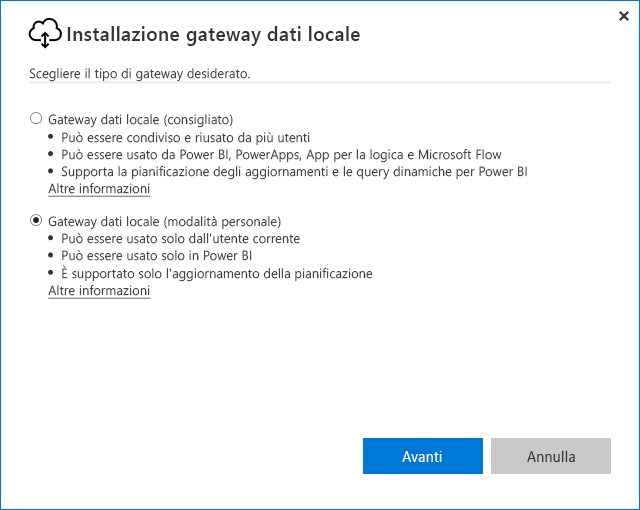

# <a name="use-personal-gateways-in-power-bi"></a>Usare i gateway personali in Power BI

[!INCLUDE [gateway-rewrite](../includes/gateway-rewrite.md)]

Il gateway dati locale in modalità personale è una versione del gateway dati locale che funziona solo con Power BI. È possibile usare un gateway personale se si vuole installarne uno nel computer e accedere ai dati locali.

> [!NOTE]
> Si può eseguire un solo gateway in modalità personale per ogni utente di Power BI. Se si installa un altro gateway in modalità personale per lo stesso utente, anche in un computer diverso, l'installazione più recente sostituisce l'installazione esistente precedente.

## <a name="on-premises-data-gateway-vs-on-premises-data-gateway-personal-mode"></a>Confronto tra gateway dati locale e gateway dati locale in modalità personale

La tabella seguente descrive le differenze tra un gateway dati locale e un gateway dati locale in modalità personale.

|   |Gateway dati locale | Gateway dati locale (modalità personale) |
| ---- | ---- | ---- |
|Servizi cloud supportati |Power BI, Power Apps, App per la logica di Azure, Power Automate, Azure Analysis Services, flussi di dati |Power BI |
|Esecuzioni |Come configurato dagli utenti che hanno accesso al gateway |Come per l'autenticazione di Windows e come configurato dall'utente per altri tipi di autenticazione |
|Può eseguire l'installazione solo come amministratore del computer |Sì |No |
|Gestione centralizzata di origini dati e gateway |Sì |No |
|Importare dati e pianificare l'aggiornamento |Sì |Sì |
|Supporto di DirectQuery |Sì |No |
|Supporto di LiveConnect per Analysis Services |Sì |No |

## <a name="install-the-on-premises-data-gateway-personal-mode"></a>Installare il gateway dati locale (modalità personale)

Per installare il gateway dati locale in modalità personale:

1. [Scaricare il gateway dati locale](https://go.microsoft.com/fwlink/?LinkId=820925&clcid=0x409).

2. Nel programma di installazione selezionare il gateway dati locale (modalità personale) e quindi selezionare **Avanti**.

   

I file del gateway vengono installati in _"%localappdata%\Microsoft\Gateway dati locale (modalità personale)_ . Dopo aver completato l'installazione e aver eseguito l'accesso, viene visualizzata la schermata seguente.


## <a name="use-fast-combine-with-the-personal-gateway"></a>Usare la Combinazione rapida con il gateway personale

La combinazione rapida per un gateway personale consente di ignorare i livelli di privacy specificati durante l'esecuzione delle query. Per abilitare la combinazione rapida per l'uso con il gateway dati locale (modalità personale):

1. Da Esplora File, aprire il file seguente:

   `%localappdata%\Microsoft\On-premises data gateway (personal mode)\Microsoft.PowerBI.DataMovement.Pipeline.GatewayCore.dll.config`

2. Nella parte inferiore del file, aggiungere il testo seguente:

    ```xml
    <setting name="EnableFastCombine" serializeAs="String">
       <value>true</value>
    </setting>
    ```

3. Al termine dell'operazione, l'impostazione diventerà effettiva entro circa un minuto. Per verificare il corretto funzionamento, provare a eseguire un aggiornamento su richiesta nel servizio Power BI per verificare che la Combinazione rapida funzioni.

## <a name="frequently-asked-questions-faq"></a>Domande frequenti

**Domanda:** È possibile eseguire il gateway dati locale (modalità personale) contemporaneamente al gateway dati locale (precedentemente noto come versione aziendale del gateway)?
  
**Risposta:** Sì, è possibile eseguirli contemporaneamente.

**Domanda:** È possibile eseguire il gateway dati locale (modalità personale) come servizio?
  
**Risposta:** No. Il gateway dati locale (modalità personale) può essere eseguito solo come applicazione. Se è necessario eseguirlo come servizio o in modalità amministratore, occorre prendere in considerazione il [gateway dati locale](/data-integration/gateway/service-gateway-onprem) (precedentemente noto come gateway aziendale).

**Domanda:** Con quale frequenza viene aggiornato il gateway dati locale (modalità personale)?
  
**Risposta:** l'obiettivo è aggiornare il gateway personale ogni mese.

**Domanda:** Per quale motivo viene chiesto di aggiornare le credenziali?
  
**Risposta:** molte situazioni possono attivare una richiesta di credenziali, la più comune delle quali è la reinstallazione del gateway dati locale (modalità personale) in un computer diverso rispetto al gateway Power BI personale. Potrebbe anche esserci un problema nell'origine dati e Power BI non è riuscito a eseguire una connessione di prova oppure si è verificato un timeout o un errore di sistema. Per aggiornare le credenziali nel servizio Power BI, selezionare l'icona dell'ingranaggio, quindi **Impostazioni** > **Set di dati**. Individuare il set di dati in questione e selezionare **Credenziali origine dati**.

**Domanda:** Per quanto tempo il gateway personale precedente sarà offline durante l'aggiornamento?
  
**Risposta:** L'aggiornamento del gateway personale alla nuova versione richiederà solo alcuni minuti.

**Domanda:** Sto usando gli script R e Python. Sono supportati?
  
**Risposta:** Gli script R e Python sono supportati per la modalità personale.

## <a name="next-steps"></a>Passaggi successivi

* [Configurazione delle impostazioni del proxy per il gateway dati locale](/data-integration/gateway/service-gateway-proxy)  

Altre domande? Provare la [Community di Power BI](https://community.powerbi.com/).
