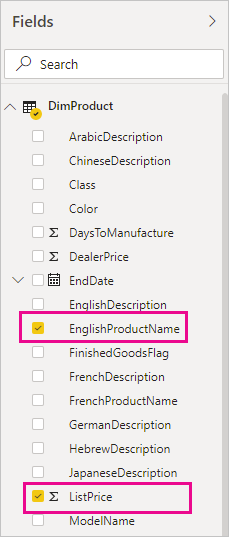
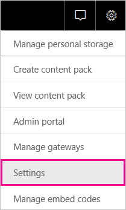

# <a name="refresh-data-from-an-on-premises-sql-server-database"></a>Aggiornare i dati da un database di SQL Server locale

In questa esercitazione viene descritto come aggiornare un set di dati di Power BI da un database relazionale locale nella rete locale. In particolare, questa esercitazione usa un database di SQL Server di esempio a cui Power BI deve accedere tramite un gateway dati locale.

In questa esercitazione viene completata la procedura seguente:

> [!div class="checklist"]
> * Creare e pubblicare un file di Power BI Desktop (file con estensione pbix) che importa i dati da un database di SQL Server locale.
> * Configurare le impostazioni dell'origine dati e del set di dati in Power BI per la connettività di SQL Server tramite un gateway dati.
> * Configurare una pianificazione dell'aggiornamento per assicurarsi che il set di dati di Power BI abbia i dati più recenti.
> * Eseguire un aggiornamento su richiesta del set di dati.
> * Esaminare la cronologia aggiornamenti per analizzare i risultati dei cicli di aggiornamento precedenti.
> * Pulire le risorse eliminando gli artefatti creati in questa esercitazione.

## <a name="prerequisites"></a>Prerequisiti

- Se non è già stato fatto in precedenza, registrarsi per ottenere una [versione di prova gratuita di Power BI](https://app.powerbi.com/signupredirect?pbi_source=web) prima di iniziare.
- [Installare Power BI Desktop](https://powerbi.microsoft.com/desktop/) in un computer locale.
- [Installare SQL Server](/sql/database-engine/install-windows/install-sql-server) in un computer locale e ripristinare il [database di esempio da un backup](https://github.com/Microsoft/sql-server-samples/releases/download/adventureworks/AdventureWorksDW2017.bak). Per altre informazioni su AdventureWorks, vedere [Configurazione e installazione di AdventureWorks](/sql/samples/adventureworks-install-configure).
- [Installare un gateway dati locale](service-gateway-onprem.md) nello stesso computer locale (nell'ambiente di produzione si usa in genere un computer diverso).

> [!NOTE]
> Se non si è un amministratore di gateway e non si vuole installare un gateway, contattare un amministratore di gateway dell'organizzazione. L'amministratore può creare la definizione dell'origine dati necessaria per connettere il set di dati al database di SQL Server.

## <a name="create-and-publish-a-power-bi-desktop-file"></a>Creare e pubblicare un file di Power BI Desktop

Usare la procedura seguente per creare un report di Power BI di base usando il database di esempio AdventureWorksDW. Pubblicare il report nel servizio Power BI in modo da ottenere un set di dati in Power BI che è possibile configurare e aggiornare nei passaggi successivi.

1. In Power BI Desktop nella scheda **Home** selezionare **Recupera dati** \> **SQL Server**.

2. Nella finestra di dialogo **Database di SQL Server** immettere il nome del **Server** e del **Database** (facoltativo), assicurarsi che **Modalità Connettività dati** sia impostata su **Importazione** e quindi selezionare **OK**.

    

    In questa esercitazione non vengono usate le **Opzioni avanzate**, ma si noti che è possibile specificare un'istruzione SQL e impostare altre opzioni, ad esempio l'uso del [failover di SQL Server](/sql/database-engine/availability-groups/windows/failover-clustering-and-always-on-availability-groups-sql-server).

    

3. Verificare le **credenziali**, quindi selezionare **Connetti**.

    > [!NOTE]
    > Se non si riesce a eseguire l'autenticazione, assicurarsi di aver selezionato il metodo di autenticazione corretto e di usare un account con accesso al database. In ambienti di test è possibile usare l'autenticazione Database con nome utente e password espliciti. Negli ambienti di produzione viene in genere usata l'autenticazione di Windows. Fare riferimento a [Scenari per la risoluzione dei problemi di aggiornamento](refresh-troubleshooting-refresh-scenarios.md) e contattare l'amministratore del database per ulteriore assistenza.

1. Se viene visualizzata una finestra di dialogo **Supporto crittografia** selezionare **OK**.

2. Nella finestra di dialogo **Strumento di navigazione** selezionare la tabella **DimProduct** e quindi selezionare **Carica**.

    

3. Nella visualizzazione **Report** di Power BI Desktop selezionare **Istogramma a colonne in pila** nel riquadro **Visualizzazioni**.

    

4. Con l'istogramma selezionato nell'area di disegno report, nel riquadro **Campi** selezionare i campi **EnglishProductName** e **ListPrice**.

    

5. Trascinare **EndDate** in **Filtri a livello di report** e in **Filtro di base** selezionare solo la casella di controllo **(Vuoto)** .

    

    Il grafico dovrebbe ora apparire come nell'immagine seguente.

    

    Si noti che i cinque prodotti **Road-250** sono elencati con il prezzo di listino più alto. Quando si aggiorneranno i dati e quindi il report, più avanti in questa esercitazione, il quadro cambierà.

6. Salvare il report con il nome "AdventureWorksProducts.pbix".

7. Nella scheda **Home** selezionare **Pubblica** \> **Area di lavoro personale** \> **Seleziona**. Se viene chiesto di farlo, accedere al servizio Power BI.

8. Nella schermata **Operazione riuscita** selezionare **Apri 'AdventureWorksProducts.pbix' in Power BI**.

    [Pubblica in Power BI](./media/service-gateway-sql-tutorial/publish-to-power-bi.png)

## <a name="connect-a-dataset-to-a-sql-server-database"></a>Connettere un set di dati a un database di SQL Server

Sebbene in Power BI Desktop sia stata stabilita una connessione diretta al database di SQL Server locale, il servizio Power BI richiede un gateway dati che svolga la funzione di bridge tra il cloud e la rete locale. Seguire questa procedura per aggiungere il database di SQL Server locale come origine dati a un gateway e quindi connettere il set di dati all'origine dati.

1. Accedere a Power BI. Nell'angolo superiore destro selezionare l'icona a forma di ingranaggio e scegliere **Impostazioni**.

    

2. Nella scheda **Set di dati** selezionare il set di dati **AdventureWorksProducts** in modo da connettersi al database di SQL Server locale attraverso un gateway dati.

3. Espandere **Connessione gateway** e verificare che sia elencato almeno un gateway. Se non è presente alcun gateway, vedere la sezione precedente [Prerequisiti](#prerequisites) di questa esercitazione per un collegamento alla documentazione del prodotto relativa all'installazione e alla configurazione di un gateway.

    

4. In **Azioni** espandere il pulsante di attivazione e disattivazione per visualizzare le origini dati e selezionare il collegamento **Aggiungi al gateway**.

    

    > [!NOTE]
    > Se non si è un amministratore di gateway e non si vuole installare un gateway, contattare un amministratore di gateway dell'organizzazione. L'amministratore può creare la definizione dell'origine dati necessaria per connettere il set di dati al database di SQL Server.

5. Nella pagina di gestione **Gateway** nella scheda **Impostazioni origini dati** immettere e verificare le informazioni seguenti e selezionare **Aggiungi**.

    | Opzione | Value |
    | --- | --- |
    | Nome origine dati | AdventureWorksProducts |
    | Tipo di origine dati | SQL Server |
    | Server | Nome dell'istanza di SQL Server, ad esempio SQLServer01 (deve corrispondere al nome specificato in Power BI Desktop). |
    | SQL | Nome del database di SQL Server, ad esempio AdventureWorksDW (deve corrispondere al nome specificato in Power BI Desktop). |
    | Metodo di autenticazione | Windows o Di base (in genere Windows). |
    | Nome utente | Account utente usato per connettersi a SQL Server. |
    | Password | Password dell'account usato per connettersi a SQL Server. |

    

6. Nella scheda **Set di dati** espandere nuovamente la sezione **Connessione gateway**. Selezionare il gateway dati configurato che mostra uno **stato** di esecuzione nel computer in cui è stato installato e selezionare **Applica**.

    

## <a name="configure-a-refresh-schedule"></a>Configurare una pianificazione per gli aggiornamenti

Dopo aver connesso il set di dati in Power BI al database di SQL Server locale attraverso un gateway dati, seguire questa procedura per configurare una pianificazione per gli aggiornamenti. L'aggiornamento dei set di dati in base a una pianificazione assicura che i report e i dashboard includano i dati più recenti.

1. Nel riquadro di spostamento aprire **Area di lavoro personale** \> **Set di dati**. Selezionare i puntini di sospensione ( **. . .** ) per il set di dati **AdventureWorksProducts** e quindi selezionare **Pianifica aggiornamento**.

    > [!NOTE]
    > Assicurarsi di selezionare i puntini di sospensione per il set di dati **AdventureWorksProducts** e non i puntini di sospensione per il report con lo stesso nome. Il menu di scelta rapida del report **AdventureWorksProducts** non include l'opzione **Pianifica aggiornamento**.

2. Nella sezione **Aggiornamento pianificato** in **Mantieni aggiornati i dati** impostare l'aggiornamento su **Attivato**.

3. Selezionare una **Frequenza di aggiornamento** appropriata, ad esempio **Ogni giorno**, e quindi in **Ora** selezionare **Aggiungi ancora** per specificare l'ora di aggiornamento desiderata, ad esempio 6:30 e 18:30.

    

    > [!NOTE]
    > È possibile configurare fino a 8 orari giornalieri se il set di dati si trova in una capacità condivisa o 48 orari in Power BI Premium.

4. Lasciare selezionata la casella di controllo **Invia messaggi di notifica di aggiornamento non riuscito a me** e selezionare **Applica**.

## <a name="perform-an-on-demand-refresh"></a>Eseguire un aggiornamento su richiesta

Dopo aver configurato una pianificazione per gli aggiornamenti, Power BI aggiorna il set di dati al successivo orario pianificato, entro un margine di 15 minuti. Per aggiornare i dati prima dell'orario pianificato, ad esempio per testare la configurazione del gateway e dell'origine dati, eseguire un aggiornamento su richiesta usando l'opzione **Aggiorna adesso** nel menu del set di dati nel riquadro di spostamento. Gli aggiornamenti su richiesta non influiscono sull'orario del successivo aggiornamento pianificato, ma vengono conteggiati rispetto al limite di aggiornamenti giornalieri, come descritto nella sezione precedente.

A scopo illustrativo, simulare una modifica ai dati di esempio aggiornando la tabella DimProduct del database AdventureWorksDW tramite SQL Server Management Studio (SSMS).

```sql

UPDATE [AdventureWorksDW].[dbo].[DimProduct]
SET ListPrice = 5000
WHERE EnglishProductName ='Road-250 Red, 58'

```

A questo punto seguire questa procedura in modo che i dati aggiornati possano passare attraverso la connessione del gateway al set di dati e nei report in Power BI.

1. Nel riquadro di spostamento del servizio Power BI selezionare ed espandere **Area di lavoro personale**.

2. In **Set di dati** per il set di dati **AdventureWorksProducts** selezionare i puntini di sospensione ( **. . .** ) e quindi selezionare **Aggiorna adesso**.

    

    Nell'angolo superiore destro è possibile osservare che Power BI sta preparando l'esecuzione dell'aggiornamento richiesto.

3. Selezionare **Area di lavoro personale \> Report \> AdventureWorksProducts**. Osservare il passaggio dei dati aggiornati e notare che il prodotto con il prezzo di listino più alto è ora **Road-250 Red, 58**.

    

## <a name="review-the-refresh-history"></a>Esaminare la cronologia aggiornamenti

È consigliabile verificare periodicamente i risultati dei cicli di aggiornamento precedenti nella cronologia aggiornamenti. È possibile che le credenziali del database siano scadute o che il gateway selezionato fosse offline nell'orario di un aggiornamento pianificato. Seguire questa procedura per esaminare la cronologia aggiornamenti e verificare la presenza di eventuali problemi.

1. Nell'angolo superiore destro dell'interfaccia utente di Power BI selezionare l'icona a forma di ingranaggio e scegliere **Impostazioni**.

2. Passare a **Set di dati** e selezionare il set di dati da esaminare, ad esempio **AdventureWorksProducts**.

3. Selezionare il collegamento **Cronologia aggiornamenti** per aprire la finestra di dialogo **Cronologia aggiornamenti**.

    

4. Nella scheda **Pianificato** osservare gli aggiornamenti precedenti pianificati e su richiesta con gli orari **Inizio** e **Fine** e lo **Stato** impostato su **Completato** che indica che l'aggiornamento è stato eseguito correttamente da Power BI. Per gli aggiornamenti non riusciti, è possibile visualizzare il messaggio di errore ed esaminare i dettagli dell'errore.

    

    > [!NOTE]
    > La scheda OneDrive riguarda soltanto i set di dati connessi a file di Power BI Desktop, cartelle di lavoro di Excel o file CSV in OneDrive o SharePoint Online, come descritto più dettagliatamente in [Aggiornamento dei dati in Power BI](refresh-data.md).

## <a name="clean-up-resources"></a>Pulire le risorse

Se non si vogliono più usare i dati di esempio, eliminare il database in SQL Server Management Studio (SSMS). Se non si vuole usare l'origine dati di SQL Server, rimuovere l'origine dati dal gateway dati. Può essere utile anche disinstallare il gateway dati se è stato installato solo allo scopo di completare questa esercitazione. Eliminare anche il set di dati AdventureWorksProducts e il report AdventureWorksProducts creato da Power BI al caricamento del file AdventureWorksProducts.pbix.

## <a name="next-steps"></a>Passaggi successivi

In questa esercitazione è stato descritto come importare dati da un database di SQL Server locale in un set di dati di Power BI e come aggiornare il set di dati in base a una pianificazione e su richiesta per mantenere aggiornati i report e i dashboard che usano il set di dati in Power BI. A questo punto è possibile ottenere altre informazioni sulla gestione dei gateway dati e delle origini dati in Power BI. Potrebbe anche essere una buona idea rivedere l'articolo concettuale Aggiornamento dei dati in Power BI.

- [Gestire un gateway dati locale in PowerApps](/data-integration/gateway/service-gateway-manage)
- [Gestire l'origine dati - Importazione/aggiornamento pianificato](service-gateway-enterprise-manage-scheduled-refresh.md)
- [Aggiornamento dei dati in Power BI](refresh-data.md)
