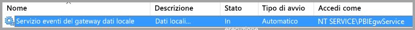
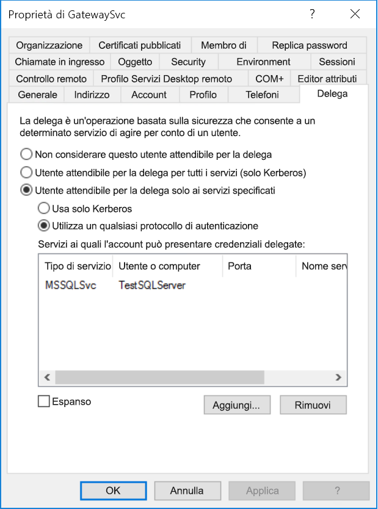
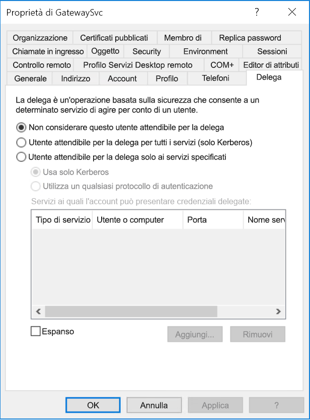
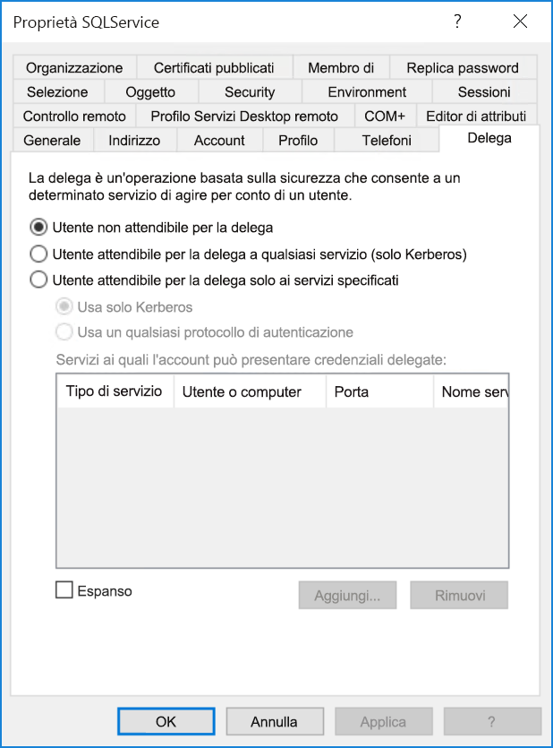
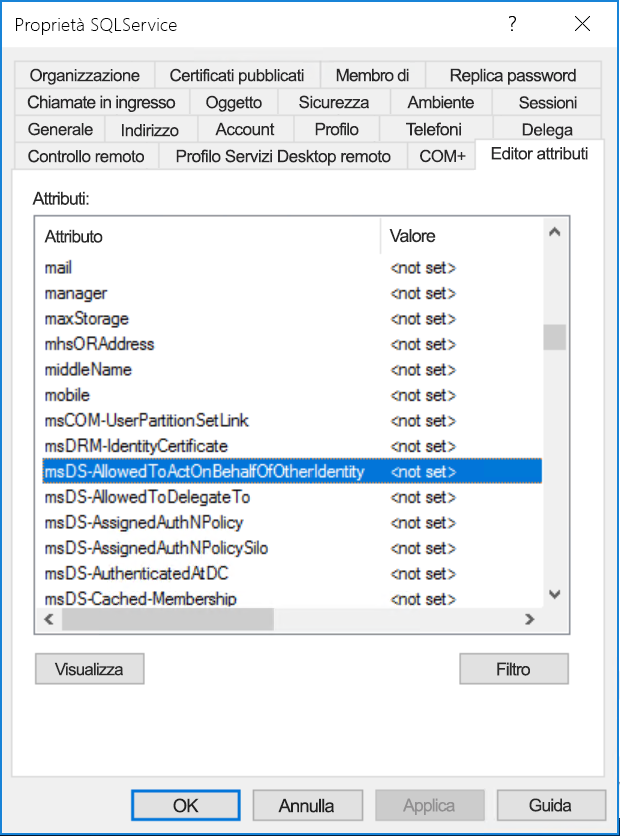
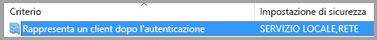
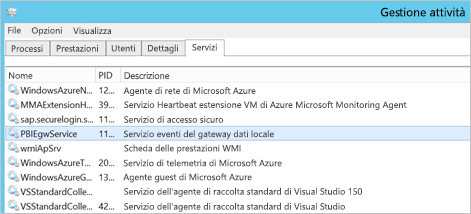

# <a name="configure-kerberos-based-sso-from-power-bi-service-to-on-premises-data-sources"></a>Configurare il Single Sign-On basato su Kerberos dal servizio Power BI alle origini dati locali

L'abilitazione di SSO rende più semplice per i report e i dashboard di Power BI aggiornare i dati delle origini locali pur rispettando le autorizzazioni a livello di utente configurate per tali origini. Usare la [delega vincolata Kerberos](/windows-server/security/kerberos/kerberos-constrained-delegation-overview) per abilitare una connettività SSO ottimale. 

## <a name="prerequisites"></a>Prerequisiti

Per il corretto funzionamento della delega vincolata Kerberos è necessario configurare diversi elementi, ad esempio i _nomi delle entità servizio_ e le impostazioni di delega per gli account del servizio.

### <a name="install-and-configure-the-microsoft-on-premises-data-gateway"></a>installare e configurare il gateway dati locale

Il gateway dati locale supporta un aggiornamento sul posto nonché l'_acquisizione della proprietà delle impostazioni_ dei gateway esistenti.

### <a name="run-the-gateway-windows-service-as-a-domain-account"></a>eseguire il servizio di Windows gateway come account di dominio

In un'installazione standard, il gateway viene eseguito come account del servizio locale del computer, ovvero **NT Service\PBIEgwService**.



Per abilitare la delega vincolata Kerberos, il gateway deve essere eseguito come account di dominio, a meno che l'istanza di Azure Active Directory (Azure AD) non sia già sincronizzata con l'istanza di Active Directory locale tramite Azure AD DirSync/Connect. Per passare a un account di dominio, vedere [Modificare l'account del servizio gateway](/data-integration/gateway/service-gateway-service-account).

> [!NOTE]
> Se Azure AD Connect è configurato e gli account utente sono sincronizzati, il servizio gateway non dovrà eseguire ricerche locali in Azure AD in fase di esecuzione. Per completare la configurazione necessaria in Azure AD, è invece possibile usare semplicemente l'ID di sicurezza (SID) del servizio locale per il servizio gateway. La procedura di configurazione della delega vincolata Kerberos descritta in questo articolo è uguale a quella necessaria nel contesto di Azure AD. Viene applicata all'oggetto computer del gateway, identificato dall'ID di sicurezza (SID) del servizio locale, in Azure AD anziché all'account di dominio.

## <a name="obtain-domain-admin-rights-to-configure-spns-setspn-and-kerberos-constrained-delegation-settings"></a>Ottenere i diritti di amministratore di dominio per configurare i nomi delle entità servizio (SetSPN) e le impostazioni di delega vincolata Kerberos

Per configurare i nomi delle entità servizio e le impostazioni di delega Kerberos, un amministratore di dominio deve evitare di concedere diritti a un utente che non ha i diritti di amministratore di dominio. Nella sezione seguente viene illustrata in modo più dettagliato la procedura di configurazione consigliata.

## <a name="configure-kerberos-constrained-delegation-for-the-gateway-and-data-source"></a>Configurare la delega vincolata Kerberos per il gateway e l'origine dati

Se necessario, configurare un nome dell'entità servizio (SPN) per l'account di dominio del servizio gateway come amministratore di dominio e configurare le impostazioni di delega nell'account di dominio del servizio gateway.

### <a name="configure-an-spn-for-the-gateway-service-account"></a>Configurare un nome dell'entità servizio per l'account del servizio gateway

Determinare prima se è già stato creato un nome dell'entità servizio per l'account di dominio usato come account del servizio gateway:

1. Come amministratore di dominio avviare lo snap-in Microsoft Management Console (MMC) **Utenti e computer di Active Directory**.

2. Nel riquadro sinistro fare clic con il pulsante destro del mouse sul nome del dominio, scegliere **Trova** e quindi immettere il nome dell'account del servizio gateway.

3. Nei risultati della ricerca fare clic con il pulsante destro del mouse sull'account del servizio gateway e scegliere **Proprietà**.

4. Se la scheda **Delega** è visibile nella finestra di dialogo **Proprietà**, un nome dell'entità servizio è già stato creato ed è possibile passare a [Decidere il tipo di delega vincolata Kerberos da usare](#decide-on-the-type-of-kerberos-constrained-delegation-to-use).

5. Se la scheda **Delega** non è presente nella finestra di dialogo **Proprietà**, è possibile creare manualmente un nome dell'entità servizio nell'account per abilitarla. Usare lo [strumento setspn](https://technet.microsoft.com/library/cc731241.aspx) incluso in Windows. Per creare il nome SPN sono necessari diritti di amministratore di dominio.

   Si supponga, ad esempio, che l'account del servizio gateway sia **Contoso\GatewaySvc** e che il servizio gateway sia in esecuzione in un computer denominato **MyGatewayMachine**. Per impostare il nome dell'entità servizio per l'account del servizio gateway, eseguire il comando seguente:

   ```setspn -a gateway/MyGatewayMachine Contoso\GatewaySvc```

   Per impostare il nome dell'entità servizio, è anche possibile usare lo snap-in MMC **Utenti e computer di Active Directory**.
   
### <a name="add-gateway-service-account-to-windows-authorization-and-access-group-if-required"></a>Aggiungere l'account del servizio gateway al Gruppo di accesso e autorizzazioni Windows se necessario

In alcuni scenari è necessario aggiungere l'account del servizio gateway al Gruppo di accesso e autorizzazioni Windows. Questi scenari includono la protezione avanzata dell'ambiente Active Directory e il caso in cui l'account del servizio gateway e gli account utente che il gateway rappresenterà si trovino in domini o foreste distinti. È anche possibile aggiungere l'account del servizio gateway al Gruppo di accesso e autorizzazioni Windows in situazioni in cui la finalizzazione di dominio o foresta non sia stata eseguita, ma non sia necessaria.

Per altre informazioni, vedere [Gruppo di accesso e autorizzazioni Windows](/windows/security/identity-protection/access-control/active-directory-security-groups#bkmk-winauthaccess).

Per completare questo passaggio di configurazione, per ogni dominio contenente utenti Active Directory è necessario che l'account del servizio gateway possa eseguire una rappresentazione:
1. Accedere a un computer nel dominio e avviare lo snap-in MMC Utenti e computer di Active Directory.
2. Individuare il **Gruppo di accesso e autorizzazioni Windows**  che in genere si trova nel contenitore **Builtin**.
3. Fare doppio clic sul gruppo e fare clic sulla scheda **Membri**.
4. Fare clic su **Aggiungi** e modificare il percorso del dominio nel dominio in cui si trova l'account del servizio gateway.
5. Digitare il nome dell'account del servizio gateway e fare clic su **Controlla nomi** per verificare che l'account del servizio gateway sia accessibile.
6. Fare clic su **OK**.
7. Fare clic su **Applica**.
8. Riavviare il servizio gateway.

### <a name="decide-on-the-type-of-kerberos-constrained-delegation-to-use"></a>Decidere il tipo di delega vincolata Kerberos da usare

È possibile configurare le impostazioni di delega per la delega vincolata Kerberos standard o per la delega vincolata Kerberos basata sulle risorse. Usare la delega basata sulle risorse (è richiesto Windows Server 2012 o versione successiva) se l'origine dati appartiene a un dominio diverso da quello del gateway. Per altre informazioni sulle differenze tra i due approcci alla delega, vedere [Panoramica della delega vincolata Kerberos](/windows-server/security/kerberos/kerberos-constrained-delegation-overview).

 A seconda dell'approccio che si vuole usare, passare a una delle sezioni seguenti. Non completare entrambe le sezioni:
 - [Configurare l'account del servizio gateway per la delega vincolata Kerberos standard](#configure-the-gateway-service-account-for-standard-kerberos-constrained-delegation)
- [Configurare l'account del servizio gateway per la delega vincolata Kerberos basata sulle risorse](#configure-the-gateway-service-account-for-resource-based-kerberos-constrained-delegation) 

## <a name="configure-the-gateway-service-account-for-standard-kerberos-constrained-delegation"></a>Configurare l'account del servizio gateway per la delega vincolata Kerberos standard

> [!NOTE]
> Completare i passaggi descritti in questa sezione se si vuole [abilitare la delega vincolata Kerberos standard](/windows-server/security/kerberos/kerberos-constrained-delegation-overview). Se si vuole invece abilitare la delega vincolata Kerberos basata sulle risorse, completare i passaggi descritti in [Configurare l'account del servizio gateway per la delega vincolata Kerberos basata sulle risorse](#configure-the-gateway-service-account-for-resource-based-kerberos-constrained-delegation).

Verranno ora configurate le impostazioni di delega per l'account del servizio gateway. Per eseguire questi passaggi sono disponibili vari strumenti. Qui si userà lo snap-in MMC **Utenti e computer di Active Directory** per amministrare e pubblicare le informazioni nella directory. Nei controller di dominio è disponibile per impostazione predefinita. In altri computer è possibile abilitarlo tramite la configurazione delle funzionalità di Windows.

È necessario configurare la delega vincolata Kerberos con protocollo in transito. Con la delega vincolata è necessario dichiarare esplicitamente a quali servizi il gateway potrà presentare credenziali delegate. Ad esempio, solo SQL Server o il server SAP HANA accettano le chiamate di delega dall'account del servizio gateway.

Questa sezione presuppone che i nomi delle entità servizio per le origini dati sottostanti, ad esempio SQL Server, SAP HANA, SAP BW, Teradata o Spark, siano già stati configurati. Per informazioni su come configurare i nomi dell'entità servizio del server dell'origine dati, fare riferimento alla documentazione tecnica per il rispettivo server di database e vedere la sezione *What SPN does your app require?* (Quale nome dell'entità servizio è richiesto per l'app?) nel post di blog [My Kerberos Checklist](https://techcommunity.microsoft.com/t5/SQL-Server-Support/My-Kerberos-Checklist-8230/ba-p/316160) (Elenco di controllo per Kerberos).

Nei passaggi seguenti si presuppone un ambiente locale con due computer nello stesso dominio: un computer gateway e un server di database con SQL Server che è già stato configurato per SSO basato su Kerberos. È possibile adottare i passaggi per una delle altre origini dati supportate, a condizione che questa sia già stata configurata per il Single Sign-On basato su Kerberos. Per questo esempio, verranno usate le impostazioni seguenti:

* Dominio di Active Directory (Netbios): **Contoso**
* Nome del computer del gateway: **MyGatewayMachine**
* Account del servizio gateway: **Contoso\GatewaySvc**
* Nome del computer dell'origine dati SQL Server: **TestSQLServer**
* Account del servizio dell'origine dati SQL Server: **Contoso\SQLService**

Ecco come configurare le impostazioni di delega:

1. Aprire lo snap-in MMC **Utenti e computer di Active Directory** con diritti di amministratore di dominio.

2. Fare clic con il pulsante destro del mouse sull'account del servizio gateway (**Contoso\GatewaySvc**) e selezionare **Proprietà**.

3. Selezionare la scheda **Delega**.

4. Selezionare **Computer attendibile per la delega solo ai servizi specificati** > **Usa un qualsiasi protocollo di autenticazione**.

5. In **Servizi ai quali l'account può presentare credenziali delegate** selezionare **Aggiungi**.

6. Nella nuova finestra di dialogo selezionare **Utenti o computer**.

7. Immettere l'account del servizio per l'origine dati e quindi selezionare **OK**.

   Ad esempio, un'origine dati di SQL Server può avere un account del servizio come *Contoso\SQLService*. Un nome SPN appropriato per l'origine dati deve essere già stato impostato per l'account. 

8. Selezionare il nome dell'entità servizio creato per il server di database. 

   In questo esempio il nome SPN inizia con *MSSQLSvc*. Se sono stati aggiunti sia il nome di dominio completo sia il nome dell'entità servizio NetBIOS, verranno selezionati entrambi, ma potrebbe esserne visibile solo uno.

9. Selezionare **OK**. 

   A questo punto il nome SPN verrà visualizzato nell'elenco dei servizi a cui l'account del servizio gateway può presentare le credenziali delegate.

    

10. Per continuare il processo di configurazione, passare a [Concedere all'account del servizio gateway diritti di criteri locali nel computer gateway](#grant-the-gateway-service-account-local-policy-rights-on-the-gateway-machine).

## <a name="configure-the-gateway-service-account-for-resource-based-kerberos-constrained-delegation"></a>Configurare l'account del servizio gateway per la delega vincolata Kerberos basata sulle risorse

> [!NOTE]
> Completare i passaggi descritti in questa sezione se si vuole abilitare la [delega vincolata Kerberos basata sulle risorse](/windows-server/security/kerberos/kerberos-constrained-delegation-overview#resource-based-constrained-delegation-across-domains). Se si vuole invece abilitare la delega vincolata Kerberos standard, completare i passaggi descritti in [Configurare l'account del servizio gateway per la delega vincolata Kerberos standard](#configure-the-gateway-service-account-for-standard-kerberos-constrained-delegation).

Usare la [delega vincolata Kerberos basata sulle risorse](/windows-server/security/kerberos/kerberos-constrained-delegation-overview#resource-based-constrained-delegation-across-domains) per abilitare la connettività Single Sign-On per Windows Server 2012 e versioni successive. Questo tipo di delega consente l'appartenenza a domini diversi per i servizi front-end e back-end. Per il corretto funzionamento, il dominio del servizio back-end deve considerare attendibile il dominio del servizio front-end.

Nei passaggi seguenti si presuppone un ambiente locale con due computer in domini diversi: un computer gateway e un server di database con SQL Server che è già stato configurato per il Single Sign-On basato su Kerberos. È possibile adottare questi passaggi per una delle altre origini dati supportate, a condizione che questa sia già stata configurata per l'accesso Single Sign-On basato su Kerberos. Per questo esempio, verranno usate le impostazioni seguenti:

* Dominio front-end di Active Directory (Netbios): **ContosoFrontEnd**
* Dominio back-end di Active Directory (Netbios): **ContosoBackEnd**
* Nome del computer del gateway: **MyGatewayMachine**
* Account del servizio gateway: **ContosoFrontEnd\GatewaySvc**
* Nome del computer dell'origine dati SQL Server: **TestSQLServer**
* Account del servizio dell'origine dati SQL Server: **ContosoBackEnd\SQLService**

Completare la procedura di configurazione seguente:

1. Usare lo snap-MMC **Utenti e computer di Active Directory** nel controller di dominio per il dominio **ContosoFrontEnd** e verificare che non siano state applicate impostazioni di delega per l'account del servizio gateway.

    

2. Usare **Utenti e computer di Active Directory** nel controller di dominio per il dominio **ContosoBackEnd** e verificare che per l'account del servizio back-end non siano applicate impostazioni di delega.

    

3. Nella scheda **Editor attributi** delle proprietà dell'account verificare che l'attributo **msDS-AllowedToActOnBehalfOfOtherIdentity** non sia impostato.

    

4. In **Utenti e computer di Active Directory** creare un gruppo nel controller di dominio per il dominio **ContosoBackEnd**. Aggiungere l'account del servizio gateway **GatewaySvc** al gruppo **ResourceDelGroup**. 

    

5. Aprire un prompt dei comandi ed eseguire i comandi seguenti nel controller di dominio per il dominio **ContosoBackEnd** per aggiornare l'attributo **msDS-AllowedToActOnBehalfOfOtherIdentity** dell'account del servizio back-end:

    ```powershell
    $c = Get-ADGroup ResourceDelGroup
    Set-ADUser SQLService -PrincipalsAllowedToDelegateToAccount $c
    ```

6. In **Utenti e computer di Active Directory** verificare che l'aggiornamento sia rispecchiato nella scheda **Editor attributi** nelle proprietà per l'account del servizio back-end. 

## <a name="grant-the-gateway-service-account-local-policy-rights-on-the-gateway-machine"></a>Concedere all'account del servizio gateway diritti di criteri locali nel computer gateway

Infine, nel computer in cui è in esecuzione il servizio gateway, **MyGatewayMachine** in questo esempio, concedere all'account del servizio gateway i criteri locali **Rappresenta un client dopo l'autenticazione** e **Agire come parte del sistema operativo (SeTcbPrivilege)** . Eseguire questa configurazione con l'Editor Criteri di gruppo locali (**gpedit.msc**).

1. Nel computer gateway eseguire **gpedit.msc**.

2. Vai a **Criteri del computer locale** &gt; **Configurazione computer** &gt; **Impostazioni di Windows** &gt; **Impostazioni di sicurezza** &gt; **Criteri locali** &gt; **Assegnazione diritti utente**.

    

3. Nell'elenco di criteri in **Assegnazione diritti utente** selezionare **Rappresenta un client dopo l'autenticazione**.

    
    
4. Fare clic con il pulsante destro del mouse sul criterio, scegliere **Proprietà** e quindi visualizzare l'elenco degli account. 

    L'elenco deve includere l'account del servizio gateway (**Contoso\GatewaySvc** o **ContosoFrontEnd\GatewaySvc** a seconda del tipo di delega vincolata).

5. In **Diritti assegnazione utente** selezionare **Agire come parte del sistema operativo (SeTcbPrivilege)** nell'elenco dei criteri. Accertarsi che l'account del servizio gateway sia incluso nell'elenco degli account.

6. Riavviare il processo del servizio **Gateway dati locale**.

### <a name="set-user-mapping-configuration-parameters-on-the-gateway-machine-if-necessary"></a>Impostare i parametri di configurazione del mapping utente nel computer gateway, se necessario

Se Azure AD Connect non è configurato, seguire questa procedura per mappare un utente del servizio Power BI a un utente Active Directory locale. Ogni utente Active Directory mappato in questo modo deve avere le autorizzazioni SSO necessarie per l'origine dati. Per altre informazioni, vedere il [video Guy in a Cube](https://www.youtube.com/watch?v=NG05PG9aiRw).

1. Aprire il file di configurazione del gateway principale Microsoft.PowerBI.DataMovement.Pipeline.GatewayCore.dll. Per impostazione predefinita, il file si trova in C:\Programmi\Gateway dati locale.

1. Impostare **ADUserNameLookupProperty** su un attributo Active Directory non usato. Nei passaggi successivi verrà usato `msDS-cloudExtensionAttribute1`. Questo attributo è disponibile solo in Windows Server 2012 e versioni successive. 

1. Impostare **ADUserNameReplacementProperty** su `SAMAccountName` e quindi salvare il file di configurazione.

1. Nella scheda **Servizi** di Gestione attività fare clic con il pulsante destro del mouse sul servizio gateway e selezionare **Riavvia**.

    

1. Per ogni utente del servizio Power BI per il quale si vuole abilitare l'accesso Single Sign-On Kerberos, impostare la proprietà `msDS-cloudExtensionAttribute1` di un utente Active Directory locale (con autorizzazione SSO per l'origine dati) sul nome utente completo (UPN) dell'utente del servizio Power BI. Ad esempio, se si accede al servizio Power BI come test@contoso.com e si vuole mappare questo utente a un utente di Active Directory locale con autorizzazioni SSO, quale ad esempio test@LOCALDOMAIN.COM, impostare l'attributo `msDS-cloudExtensionAttribute1` dell'utente su test@contoso.com.

    È possibile impostare la proprietà `msDS-cloudExtensionAttribute1` con lo snap-in MMC Utenti e computer di Active Directory:
    
    1. Come amministratore di dominio, avviare **Utenti e computer di Active Directory**.
    
    1. Fare clic con il pulsante destro del mouse sul nome del dominio, scegliere **Trova** e quindi immettere il nome dell'account dell'utente di Active Directory locale da mappare.
    
    1. Selezionare la scheda **Editor attributi**.
    
        Individuare la proprietà `msDS-cloudExtensionAttribute1` e fare doppio clic su di essa. Impostare il valore sul nome utente completo (UPN) dell'utente usato per accedere al servizio Power BI.
    
    1. Selezionare **OK**.
    
        
    
    1. Selezionare **Applica**. Verificare che sia stato impostato il valore corretto nella colonna **Valore**.

## <a name="complete-data-source-specific-configuration-steps"></a>Completare i passaggi di configurazione specifici dell'origine dati

SAP HANA e SAP BW hanno requisiti di configurazione specifici dell'origine dati e prerequisiti che è necessario soddisfare prima che sia possibile stabilire una connessione SSO tramite il gateway a queste origini dati. Per altre informazioni, vedere la [configurazione di SAP HANA](service-gateway-sso-kerberos-sap-hana.md) e [la pagina di configurazione di SAP BW - CommonCryptoLib (sapcrypto.dll)](service-gateway-sso-kerberos-sap-bw-commoncryptolib.md). Sebbene sia possibile [configurare SAP BW per l'uso con la libreria SNC gx64krb5](service-gateway-sso-kerberos-sap-bw-gx64krb.md), questa libreria è sconsigliata perché non più supportata da SAP. Come libreria SNC, è consigliabile usare CommonCryptoLib _oppure_ gx64krb5. Non completare i passaggi di configurazione per entrambe le librerie.

> [!NOTE]
> Sebbene per l'accesso SSO a BW possano essere usate anche altre librerie SNC, non sono ufficialmente supportate da Microsoft.

## <a name="run-a-power-bi-report"></a>Eseguire un report di Power BI

Dopo aver completato tutti i passaggi di configurazione, usare la pagina **Gestisci gateway** in Power BI per configurare l'origine dati da usare per SSO. In presenza di più gateway, assicurarsi di selezionare il gateway configurato per il Single Sign-On Kerberos. In **Impostazioni avanzate** per l'origine dati verificare quindi che l'opzione **Usa SSO tramite Kerberos per le query DirectQuery** o **Usa SSO tramite Kerberos per le query DirectQuery e di importazione** sia selezionata per i report basati su DirectQuery e che **Usa SSO tramite Kerberos per le query DirectQuery e di importazione** sia selezionata per i report basati sull'aggiornamento.


Se si pubblica un report basato su DirectQuery da Power BI Desktop e si esegue il mapping del report a un'origine dati con l'opzione **Usa SSO tramite Kerberos per le query DirectQuery** o **Usa SSO tramite Kerberos per le query DirectQuery e di importazione** selezionata, il report userà i dati accessibili all'utente mappato all'utente di (Azure) Active Directory che accede al servizio Power BI.

Analogamente, se si pubblica un report basato sull'aggiornamento da Power BI Desktop e si esegue il mapping del report a un'origine dati con l'opzione **Usa SSO tramite Kerberos per le query DirectQuery e di importazione** selezionata, non è necessario fornire alcuna credenziale. L'aggiornamento viene eseguito nel contesto di Active Directory del proprietario del set di dati.

Se tuttavia si esegue il mapping a un'origine dati in cui l'opzione **Usa SSO tramite Kerberos per le query DirectQuery e di importazione** non è selezionata, l'aggiornamento usa le credenziali immesse nei campi **Nome utente** e **Password** quando è stata creata l'origine dati. In altre parole, *non* viene usato l'accesso SSO Kerberos. 

 Quando si esegue la pubblicazione, selezionare il gateway configurato per SSO se sono presenti più gateway. 

Questa configurazione funziona nella maggior parte dei casi. Con Kerberos, tuttavia, potrebbero essere necessarie configurazioni diverse a seconda dell'ambiente in uso. Se il report non viene caricato, contattare l'amministratore di dominio per indagini più approfondite. Se l'origine dati è SAP BW, fare riferimento alle sezioni relative alla risoluzione dei problemi delle pagine di configurazione specifiche dell'origine dati per [CommonCryptoLib](service-gateway-sso-kerberos-sap-bw-commoncryptolib.md#troubleshooting) e [gx64krb5/gsskrb5](service-gateway-sso-kerberos-sap-bw-gx64krb.md#troubleshooting), a seconda della libreria SNC scelta.

## <a name="next-steps"></a>Passaggi successivi

Per altre informazioni sul gateway dati locale e su DirectQuery, vedere le risorse seguenti:

* [Informazioni sul gateway dati locale](/data-integration/gateway/service-gateway-onprem)
* [DirectQuery in Power BI](desktop-directquery-about.md)
* [Data sources supported by DirectQuery](power-bi-data-sources.md) (Origini dati supportate da DirectQuery)
* [DirectQuery e SAP BW](desktop-directquery-sap-bw.md)
* [DirectQuery e SAP HANA](desktop-directquery-sap-hana.md)
