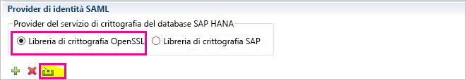
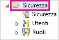
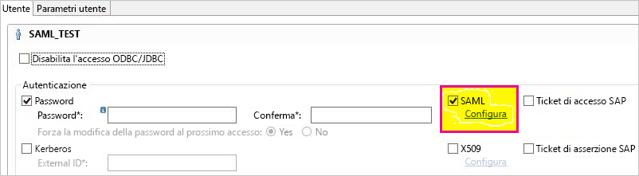
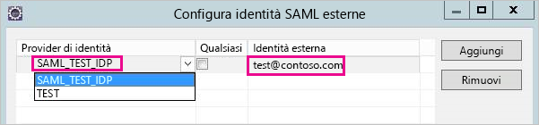
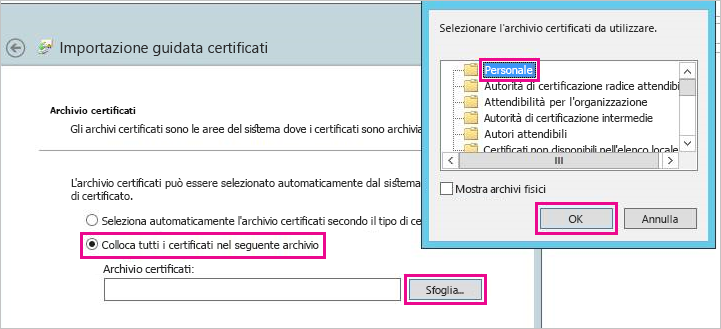
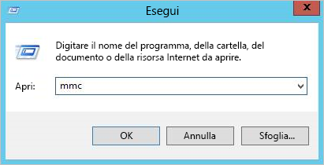
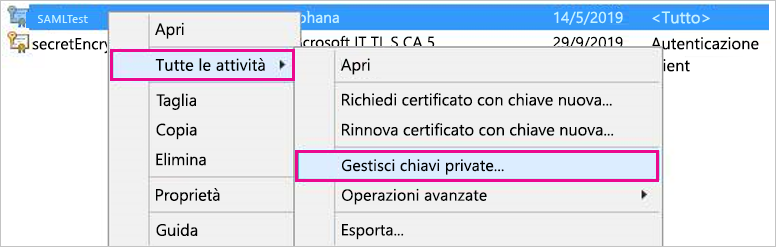
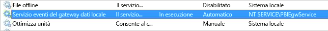
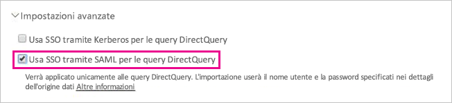

# <a name="use-security-assertion-markup-language-saml-for-sso-from-power-bi-to-on-premises-data-sources"></a>Usare SAML (Security Assertion Markup Language) per l'accesso SSO da Power BI alle origini dati locali

L'abilitazione di SSO rende più semplice per i report e i dashboard di Power BI aggiornare i dati delle origini locali pur rispettando le autorizzazioni a livello di utente configurate per tali origini. Usare [SAML (Security Assertion Markup Language)](https://www.onelogin.com/pages/saml) per abilitare la connettività Single Sign-On. 

## <a name="supported-data-sources"></a>Origini dati supportate

Attualmente sono supportate le origini dati SAP HANA con SAML. Per altre informazioni sull'impostazione e la configurazione di Single Sign-On per SAP HANA tramite SAML, vedere [SSO SAML per la piattaforma BI per HANA](https://wiki.scn.sap.com/wiki/display/SAPHANA/SAML+SSO+for+BI+Platform+to+HANA).

Sono supportate ulteriori origini dati con [Kerberos](service-gateway-sso-kerberos.md) (incluso SAP HANA).

Per SAP HANA è consigliabile abilitare la crittografia prima di stabilire una connessione SSO SAML. Per abilitare la crittografia, configurare il server HANA in modo che accetti connessioni crittografate e configurare il gateway in modo che usi la crittografia per la comunicazione con il server HANA. Poiché per impostazione predefinita il driver ODBC per HANA non crittografa le asserzioni SAML, l'asserzione SAML firmata viene inviata dal gateway al server HANA *in chiaro* ed è vulnerabile all'intercettazione e al riutilizzo da parte di terze parti. Per istruzioni su come abilitare la crittografia per HANA con la libreria OpenSSL, vedere [Abilitare la crittografia per SAP HANA](/power-bi/desktop-sap-hana-encryption).

## <a name="configuring-the-gateway-and-data-source"></a>Configurazione del gateway e dell'origine dati

Per usare SAML, è necessario stabilire una relazione di trust tra i server HANA per cui si vuole abilitare l'accesso SSO e il gateway. In questo scenario il gateway funge da provider di identità (IdP) SAML. Esistono vari modi per stabilire questa relazione, ad esempio l'importazione del certificato x509 del provider di identità del gateway nell'archivio attendibilità dei server HANA o la firma del certificato x509 del gateway da parte di un'autorità di certificazione (CA) radice attendibile per i server HANA. Anche se in questa guida viene descritto il secondo approccio, è possibile usarne un altro se risulta più pratico.

Benché questa guida usi OpenSSL come provider del servizio di crittografia del server HANA, SAP consiglia di usare la libreria di crittografia SAP (nota anche come CommonCryptoLib o sapcrypto) invece di OpenSSL per completare la procedura di configurazione in cui si stabilisce la relazione di trust. Per altre informazioni, vedere la documentazione ufficiale di SAP.

I passaggi seguenti descrivono come stabilire una relazione di trust tra un server HANA e il provider di identità del gateway usando la firma del certificato x509 del provider di identità del gateway con un'autorità di certificazione radice attendibile per il server HANA. Verrà creata questa autorità di certificazione radice:

1. Creare il certificato x509 e la chiave privata dell'autorità di certificazione radice. Per creare il certificato x509 e la chiave privata dell'autorità di certificazione radice nel formato con estensione pem, immettere questo comando:

   ```
   openssl req -new -x509 -newkey rsa:2048 -days 3650 -sha256 -keyout CA_Key.pem -out CA_Cert.pem -extensions v3_ca
   ```

    Verificare che la chiave privata dell'autorità di certificazione radice sia protetta correttamente. Se ottenuta da terze parti, potrebbe essere usata per ottenere l'accesso non autorizzato al server HANA. 

 1. Aggiungere il certificato (ad esempio CA_Cert.pem) all'archivio attendibilità del server HANA in modo che quest'ultimo consideri attendibili tutti i certificati firmati dall'autorità di certificazione radice creata. 

    È possibile trovare la posizione dell'archivio attendibilità del server HANA esaminando l'impostazione di configurazione **ssltruststore**. Se sono state seguite le istruzioni fornite nella documentazione SAP sulla configurazione di OpenSSL, è possibile che il server HANA consideri già attendibile un'autorità di certificazione radice che è possibile riutilizzare. Per altre informazioni, vedere [Come configurare Open SSL tra SAP HANA Studio e SAP HANA Server](https://archive.sap.com/documents/docs/DOC-39571). Se si dispone di più server HANA per cui abilitare SSO SAML, assicurarsi che ogni server consideri attendibile questa autorità di certificazione radice.

1. Creare il certificato x509 del provider di identità del gateway. 

   Ad esempio, per creare una richiesta di firma del certificato (IdP_Req.pem) e una chiave privata (IdP_Key.pem) valide per un anno, eseguire il comando seguente:

   ```
   openssl req -newkey rsa:2048 -days 365 -sha256 -keyout IdP_Key.pem -out IdP_Req.pem -nodes
   ```

 1. Firmare la richiesta di firma del certificato usando l'autorità di certificazione radice che i server HANA considerano attendibile in base alla configurazione definita. 

    Ad esempio, per firmare IdP_Req.pem usando CA_Cert.pem e CA_Key.pem (certificato e chiave dell'autorità di certificazione radice), eseguire il comando seguente:

    ```
    openssl x509 -req -days 365 -in IdP_Req.pem -sha256 -extensions usr_cert -CA CA_Cert.pem -CAkey CA_Key.pem -CAcreateserial -out IdP_Cert.pem
    ```

     Il certificato del provider di identità risultante è valido per un anno (vedere l'opzione -days). 

Importare il certificato del provider di identità in HANA Studio per creare un nuovo provider di identità SAML:

1. In SAP HANA Studio fare clic con il pulsante destro del mouse sul nome del server SAP HANA, quindi passare a **Security** (Sicurezza) &gt; **Open Security Console** (Apri console sicurezza) &gt; **SAML Identity Provider** (Provider identità SAML) &gt; **OpenSSL Cryptographic Library** (Libreria di crittografia OpenSSL).

    

1. Selezionare **Import** (Importa), passare al file IdP_Cert.pem e importarlo.

1. In SAP HANA Studio selezionare la cartella **Security** (Sicurezza).

    

1. Espandere **Users** (Utenti) e quindi selezionare l'utente a cui si vuole eseguire il mapping dell'utente di Power BI.

1. Selezionare **SAML** e quindi **Configure** (Configura).

    

1. Selezionare il provider di identità creato nel passaggio 2. Come **identità esterna**, immettere l'UPN dell'utente di Power BI, in genere l'indirizzo di posta elettronica che l'utente usa per accedere a Power BI, e quindi selezionare **Add** (Aggiungi). Se il gateway è stato configurato per l'uso dell'opzione di configurazione *ADUserNameReplacementProperty*, immettere il valore che sostituirà l'UPN originale dell'utente di Power BI. 

   Se ad esempio si imposta *ADUserNameReplacementProperty* su **SAMAccountName**, è necessario immettere il nome **SAMAccountName** dell'utente.

    

Dopo aver configurato il certificato e l'identità del gateway, convertire il certificato in formato PFX e configurare il gateway per l'uso del certificato:

1. Convertire il certificato in formato PFX eseguendo il comando seguente. Questo comando assegna al file con estensione pfx risultante il nome samlcert.pfx e imposta *root* come password:

    ```
    openssl pkcs12 -export -out samltest.pfx -in IdP_Cert.pem -inkey IdP_Key.pem -passin pass:root -passout pass:root
    ```

1. Copiare il file pfx nel computer gateway:

    1. Fare doppio clic su samltest.pfx e quindi selezionare **Computer locale** &gt; **Avanti**.

    1. Immettere la password e quindi selezionare **Next** (Avanti).

    1. Selezionare **Colloca tutti i certificati nel seguente archivio** e quindi selezionare **Sfoglia** &gt; **Personale** &gt; **OK**.

    1. Selezionare **Next** (Avanti) e quindi **Finish** (Fine).

       

1. Concedere all'account di servizio gateway l'accesso alla chiave privata del certificato:

    1. Nel computer gateway eseguire Microsoft Management Console (MMC).

        

    1. In **File** selezionare **Add/Remove Snap-in** (Aggiungi/Rimuovi snap-in).

        

    1. Selezionare **Certificati** &gt; **Aggiungi** e quindi selezionare **Account computer** &gt; **Avanti**.

    1. Selezionare **Computer locale** &gt; **Fine** &gt; **OK**.

    1. Espandere **Certificati** &gt; **Personale** &gt; **Certificati** e trovare il certificato.

    1. Fare clic con il pulsante destro del mouse sul certificato e passare a **Tutte le attività** &gt; **Gestisci chiavi private**.

        

    1. Aggiungere l'account di servizio gateway all'elenco. Per impostazione predefinita, l'account è **NT SERVICE\PBIEgwService**. È possibile individuare l'account in cui è in esecuzione il servizio gateway eseguendo **services.msc** e individuando il **servizio gateway dati locale**.

        

Infine, seguire questa procedura per aggiungere l'identificazione personale del certificato alla configurazione del gateway:

1. Eseguire il comando PowerShell seguente per visualizzare l'elenco dei certificati nel computer:

    ```powershell
    Get-ChildItem -path cert:\LocalMachine\My
    ```

1. Copiare l'identificazione personale per il certificato creato.

1. Passare alla directory del gateway che, per impostazione predefinita, è C:\Programmi\Gateway dati locale.

1. Aprire PowerBI.DataMovement.Pipeline.GatewayCore.dll.config e trovare la sezione *SapHanaSAMLCertThumbprint*. Incollare l'identificazione personale copiata.

1. Riavviare il servizio gateway.

## <a name="running-a-power-bi-report"></a>Esecuzione di un report di Power BI

Ora è possibile usare la pagina **Gestisci gateway** in Power BI per configurare l'origine dati SAP HANA. In **Impostazioni avanzate** abilitare SSO tramite SAML. In questo modo è possibile pubblicare report e set di dati associati all'origine dati.

   

## <a name="troubleshooting"></a>Risoluzione dei problemi

Dopo aver configurato l'accesso SSO basato su SAML, potrebbe essere visualizzato l'errore seguente nel portale di Power BI: *Le credenziali specificate non possono essere usate per l'origine SapHana*. Questo errore indica che la credenziale SAML è stata rifiutata da SAP HANA.

Le tracce di autenticazione sul lato server offrono informazioni dettagliate per la risoluzione dei problemi relativi alle credenziali in SAP HANA. Seguire questi passaggi per configurare la traccia per il server SAP HANA:

1. Nel server SAP HANA attivare la traccia di autenticazione eseguendo la query seguente:

    ```
    ALTER SYSTEM ALTER CONFIGURATION ('indexserver.ini', 'SYSTEM') set ('trace', 'authentication') = 'debug' with reconfigure 
    ```

1. Riprodurre il problema.

1. In HANA Studio aprire la console di amministrazione e selezionare la scheda **Diagnosis Files** (File di diagnosi).

1. Aprire la traccia del server di indice più recente e cercare *SAMLAuthenticator.cpp*.

    È necessario trovare un messaggio di errore dettagliato che indica la causa principale, ad esempio:

    ```
    [3957]{-1}[-1/-1] 2018-09-11 21:40:23.815797 d Authentication   SAMLAuthenticator.cpp(00091) : Element '{urn:oasis:names:tc:SAML:2.0:assertion}Assertion', attribute 'ID': '123123123123123' is not a valid value of the atomic type 'xs:ID'.
    [3957]{-1}[-1/-1] 2018-09-11 21:40:23.815914 i Authentication   SAMLAuthenticator.cpp(00403) : No valid SAML Assertion or SAML Protocol detected
    ```

1. Dopo aver completato la risoluzione dei problemi, disattivare la traccia di autenticazione eseguendo la query seguente:

    ```
    ALTER SYSTEM ALTER CONFIGURATION ('indexserver.ini', 'SYSTEM') UNSET ('trace', 'authentication');
    ```

## <a name="next-steps"></a>Passaggi successivi

Per altre informazioni sul gateway dati locale e su DirectQuery, vedere le risorse seguenti:

* [Informazioni sul gateway dati locale](/data-integration/gateway/service-gateway-onprem)
* [DirectQuery in Power BI](desktop-directquery-about.md)
* [Data sources supported by DirectQuery](power-bi-data-sources.md) (Origini dati supportate da DirectQuery)
* [DirectQuery e SAP BW](desktop-directquery-sap-bw.md)
* [DirectQuery e SAP HANA](desktop-directquery-sap-hana.md)
