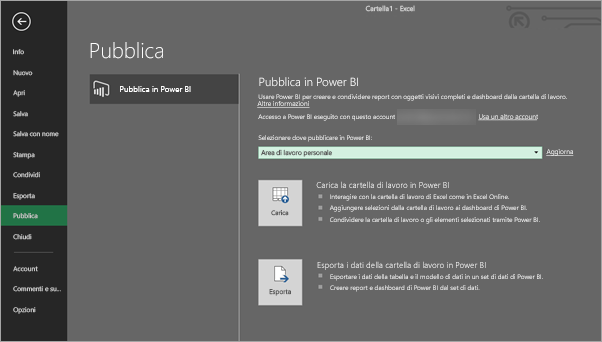
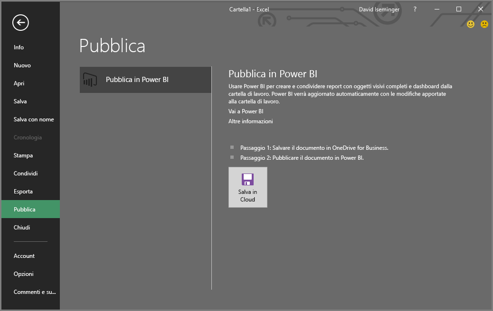

# Pubblicare in Power BI da Microsoft Excel
Con Microsoft Excel 2016 e versioni successive è possibile pubblicare le cartelle di lavoro di Excel direttamente nell'area di lavoro di [Power BI](https://powerbi.microsoft.com), in cui si possono creare report e dashboard estremamente interattivi basati sui dati contenuti nella cartella di lavoro. È quindi possibile condividere le informazioni con altri utenti dell'organizzazione.

Quando si pubblica una cartella di lavoro in Power BI è necessario considerare alcuni aspetti:

* L'account usato per accedere a Office, OneDrive for Business (se si usano cartelle di lavoro salvate in quella posizione) e Power BI deve essere lo stesso.
* Non è possibile pubblicare una cartella di lavoro vuota o una cartella di lavoro che non ha alcun contenuto supportato di Power BI.
* Non è possibile pubblicare cartelle di lavoro crittografate, protette con password o gestite tramite IRM.
* Per la pubblicazione in Power BI è necessario che l'autenticazione moderna sia abilitata (impostazione predefinita). Se è disabilitata, l'opzione Pubblica non è disponibile nel menu File.

## Pubblicare una cartella di lavoro di Excel
Per pubblicare una cartella di lavoro di Excel, in Excel selezionare **File** > **Pubblica** e selezionare **Carica** o **Esporta**.

Se si **carica** la cartella di lavoro in Power BI, è possibile interagire con essa come si farebbe usando Excel Online. È anche possibile aggiungere selezioni dalla cartella di lavoro nei dashboard di Power BI e condividere la cartella di lavoro, o elementi selezionati, usando Power BI.

Se si seleziona **Esporta**, è possibile esportare i dati tabella e il relativo modello di dati in un set di dati di Power BI, che potrò quindi essere usato per creare report e dashboard di Power BI.

### Pubblicazione di file locali
Excel supporta la pubblicazione dei file di Excel locali. Non è necessario che i file siano salvati in OneDrive for Business o SharePoint Online.

> [!IMPORTANT]
> È possibile pubblicare file locali solo se si usa Excel 2016 (o versione successiva) con un abbonamento a Office 365. Le installazioni autonome di Excel 2016 possono pubblicare in Power BI, ma solo se la cartella di lavoro viene salvata in OneDrive for business o SharePoint Online.
> 

Quando si seleziona **Pubblica** è possibile selezionare l'area di lavoro in cui pubblicare. Se il file di Excel si trova in OneDrive for Business, è possibile pubblicare solo in *Area di lavoro personale*. Se il file di Excel si trova in un'unità locale, è possibile eseguire la pubblicazione in *Area di lavoro personale* o in un'area di lavoro condivisa a cui si ha accesso.

Due opzioni per la pubblicazione della cartella di lavoro in Power BI.

Dopo la pubblicazione, il contenuto della cartella di lavoro pubblicato viene importato in Power BI, separato dal file locale. Se si vuole aggiornare il file in Power BI, è necessario pubblicare di nuovo la versione aggiornata oppure aggiornare i dati configurando un aggiornamento pianificato, per la cartella di lavoro o per il set di dati in Power BI.

### Pubblicazione da un'installazione autonoma di Excel
Quando si esegue la pubblicazione da un'installazione autonoma di Excel, è necessario salvare la cartella di lavoro in OneDrive for Business. Selezionare **Salva nel cloud** e scegliere una posizione in OneDrive for Business.

Dopo avere salvato la cartella di lavoro in OneDrive for Business, quando si seleziona **Pubblica** vengono presentate due opzioni per la pubblicazione della cartella di lavoro in Power BI, **Carica** o **Esporta**:

#### Carica la cartella di lavoro in Power BI
Quando si sceglie l'opzione **Carica** la cartella di lavoro viene visualizzata in Power BI esattamente come in Excel Online. A differenza di Excel Online, però, sono disponibili alcune opzioni che consentono di aggiungere elementi dai fogli di lavoro ai dashboard.

Non è possibile modificare la cartella di lavoro in Power BI. Se è necessario apportare modifiche, è possibile selezionare **Modifica** e quindi scegliere se modificare la cartella di lavoro in Excel Online oppure aprirla in Excel nel computer. Tutte le modifiche apportate vengono salvate nella cartella di lavoro in OneDrive for Business.

Con il **caricamento** non viene creato alcun set di dati in Power BI. La cartella di lavoro verrà visualizzata in Report, nel riquadro di spostamento dell'area di lavoro. Le cartelle di lavoro caricate in Power BI hanno una speciale icona di Excel che le identifica come cartelle di lavoro di Excel che sono state caricate.

Scegliere l'opzione **Carica** se i fogli di lavoro contengono solo dati o se sono presenti tabelle pivot e grafici che si vuole visualizzare in Power BI.

L'opzione Carica disponibile in Pubblica in Power BI in Excel assicura un'esperienza simile all'uso di **Recupera dati > File > OneDrive for Business > Connetti, gestisci e visualizza i dati di Excel in Power BI** da Power BI nel browser.

#### Esporta i dati della cartella di lavoro in Power BI
Quando si sceglie l'opzione **Esporta** tutti i dati supportati nelle tabelle e/o in un modello di dati vengono esportati in un nuovo set di dati in Power BI. Gli eventuali fogli di Power View nella cartella di lavoro vengono creati nuovamente in Power BI come report.

È possibile continuare a modificare la cartella di lavoro. Quando vengono salvate, le modifiche vengono sincronizzate con il set di dati in Power BI, in genere entro circa un'ora. Se gli aggiornamenti devono essere eseguiti più rapidamente, è possibile selezionare di nuovo **Pubblica** da Excel e le modifiche verranno immediatamente esportate. Anche le visualizzazioni nei report e nei dashboard vengono aggiornate.

Scegliere l'opzione **Pubblica** se si usa la funzionalità Recupera e trasforma o Power Pivot per caricare i dati in un modello di dati oppure se la cartella di lavoro contiene fogli di Power View con visualizzazioni che si vogliono visualizzare in Power BI.

L'uso di **Esporta** è molto simile all'uso di **Recupera dati > File > OneDrive for Business > Esporta i dati di Excel in Power BI** da Power BI nel browser.

## Pubblicazione
Quando si sceglie una di queste opzioni, Excel accede a Power BI con l'account corrente, quindi pubblica la cartella di lavoro nell'area di lavoro di Power BI. È possibile monitorare la barra di stato in Excel per verificare l'avanzamento del processo di pubblicazione.

Al termine è possibile passare a Power BI direttamente da Excel.

## Passaggi successivi
[Dati di Excel in Power BI](service-excel-workbook-files.md)  
Altre domande? [Provare la community di Power BI](https://community.powerbi.com/)

