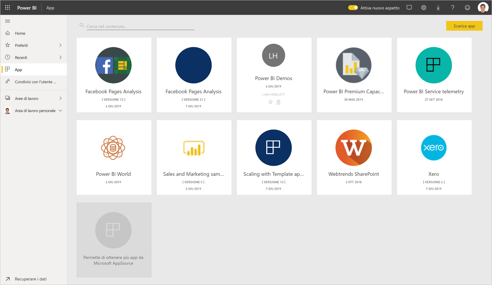
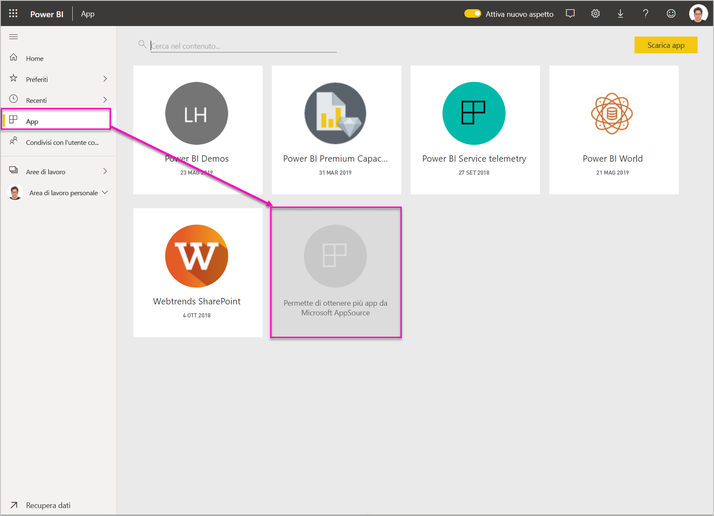
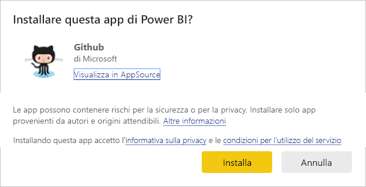
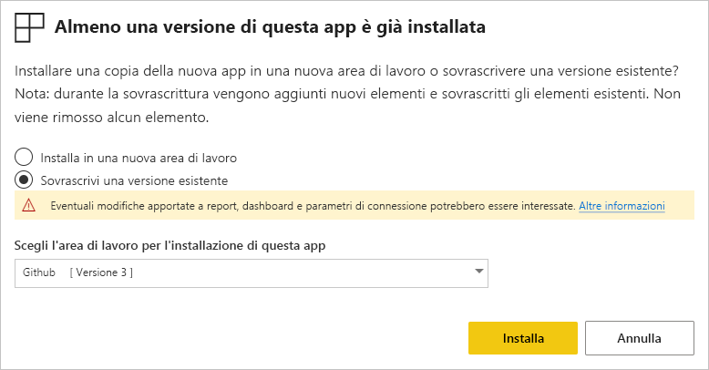

# Installare e distribuire le app modello nell'organizzazione

Se l'utente è un analista di Power BI, troverà utile questo articolo che illustra la procedura per installare [app modello](service-template-apps-overview.md) da connettere a molti dei servizi usati per eseguire l'attività aziendale, ad esempio Salesforce, Microsoft Dynamics e Google Analytics. È quindi possibile modificare il dashboard e i report predefiniti dell'app modello in base alle esigenze dell'organizzazione e distribuirli ai colleghi come [app](../consumer/end-user-apps.md). 

Se si è interessati alla creazione di app modello per la distribuzione all'esterno dell'organizzazione, vedere [Creare un'app modello in Power BI](service-template-apps-create.md). I partner Power BI possono creare app di Power BI senza codice o con pochissimo codice e distribuirle ai clienti di Power BI. 

## Prerequisiti  

Per installare, personalizzare e distribuire un'app modello, è necessario: 

* Una [licenza di Power BI Pro](../fundamentals/service-self-service-signup-for-power-bi.md).
* Autorizzazioni per l'installazione delle app modello nel tenant.
* Un collegamento di installazione valido per l'app, ottenuto da AppSource o dall'autore dell'app.
* Una certa familiarità con i [concetti di base di Power BI](../fundamentals/service-basic-concepts.md).

## Installare un'app modello

1. Nel riquadro di spostamento del servizio Power BI selezionare **App** > **Scarica app**.

    

1. Nella finestra AppSource visualizzata selezionare **App**. Cercare l'app desiderata e quindi selezionare **Scarica adesso**.

    

1. Nella finestra di dialogo visualizzata selezionare **Installa**.

    
    
    L'app viene installata con un'area di lavoro associata. **Se si decide di personalizzare l'app, questa operazione verrà eseguita in questa area di lavoro associata**.

    > [!NOTE]
    > Se si usa un collegamento di installazione per un'app che non è elencata in AppSource, una finestra di dialogo di convalida richiederà di confermare la selezione.
    >
    >Per poter installare un'app modello non elencata in AppSource, è necessario richiedere le autorizzazioni appropriate all'amministratore. Per informazioni dettagliate, vedere [Impostazioni app modello](../admin/service-admin-portal.md#template-apps-settings) nel portale di amministrazione di Power BI.

    Una volta completata l'installazione, una notifica indica che la nuova app è pronta.

    

## Connettersi ai dati

1. Selezionare **Vai all'app**. Viene visualizzata la finestra **Operazioni iniziali con la nuova app**.

   

1. Fare clic su **Connetti**.
    
    Verrà visualizzata una finestra di dialogo o una serie di finestre di dialogo in cui è possibile sostituire l'origine dati dei dati di esempio con la propria origine dati. Questo significa in genere ridefinire i parametri del set di dati e le credenziali dell'origine dati. Vedere [Limitazioni note](service-template-apps-overview.md#known-limitations).
    
    Nell'esempio seguente, la connessione ai dati include due finestre di dialogo.

   

    Al termine della compilazione delle finestre di dialogo di connessione, viene avviato il processo di connessione. Un banner informa che si stanno visualizzando dati di esempio.

    

    Attendere il completamento della connessione e dell'aggiornamento dei dati. Per sapere quando il processo viene completato, controllare l'indicatore di stato nella riga (nuovo aspetto) o nella scheda (aspetto precedente) del set di dati.

   Al termine della connessione e dell'aggiornamento dei dati, aggiornare il browser. Il banner indica ora che è necessario aggiornare l'app per applicare le eventuali modifiche apportate all'app e condividerla.

    

## Personalizzare e condividere l'app

Dopo aver aggiornato il browser al termine della connessione e dell'aggiornamento dei dati, viene visualizzata l'area di lavoro associata all'app. A questo punto è possibile modificare gli eventuali artefatti presenti, come in qualsiasi area di lavoro. Tuttavia, tenere presente che le modifiche apportate verranno sovrascritte quando si aggiorna l'app con una nuova versione, a meno che non si salvino gli elementi modificati con nomi diversi. [Vedere informazioni dettagliate sulla sovrascrittura](#overwrite-behavior).

Per informazioni sulla modifica degli artefatti nell'area di lavoro, vedere
* [Presentazione dell'editor di report in Power BI](../create-reports/service-the-report-editor-take-a-tour.md)
* [Concetti di base del servizio Power BI](../fundamentals/service-basic-concepts.md)

Dopo aver apportato le modifiche desiderate agli artefatti nell'area di lavoro, si è pronti per pubblicare e condividere l'app. Vedere [Pubblicare l'app](../collaborate-share/service-create-distribute-apps.md#publish-your-app) per informazioni su come eseguire questa operazione.

## Caricare un'app modello

Di tanto in tanto, gli autori di app modello rilasciano nuove versioni migliorate delle app modello, tramite AppSource, collegamenti diretti o entrambi i metodi.

Se l'app è stata originariamente scaricata da AppSource, quando diventa disponibile una nuova versione dell'app modello, si riceve una notifica in due modi:
* Nel servizio Power BI viene visualizzato un banner di aggiornamento che informa che è disponibile una nuova versione dell'app.
  
* Si riceve una notifica nel riquadro delle notifiche di Power BI.

  

>[!NOTE]
>Se l'app è stata originariamente ottenuta tramite collegamento diretto anziché tramite AppSource, l'unico modo per stabilire quando è disponibile una nuova versione è contattare l'autore dell'app modello.

  Per installare l'aggiornamento, fare clic su **Scarica adesso** nel banner di notifica o nel centro notifiche oppure ritrovare l'app in AppSource e scegliere **Scarica adesso**. Se si è ottenuto un collegamento diretto per l'aggiornamento dall'autore dell'app modello, è sufficiente fare clic sul collegamento.
  
  Verrà chiesto se si desidera sovrascrivere la versione corrente o installare la nuova versione in una nuova area di lavoro. Per impostazione predefinita, è selezionata l'opzione "Sovrascrivi".

  

- **Sovrascrivi una versione esistente:** sovrascrive l'area di lavoro esistente con la versione aggiornata dell'app modello. [Vedere informazioni dettagliate sulla sovrascrittura](#overwrite-behavior).

- **Installa in una nuova area di lavoro:** installa una versione aggiornata dell'area di lavoro e dell'app che è necessario riconfigurare (ovvero connettersi ai dati, definire la struttura di spostamento e le autorizzazioni).

### Comportamento di sovrascrittura

* La sovrascrittura aggiorna i report, i dashboard e il set di dati all'interno dell'area di lavoro e non l'app. La sovrascrittura non modifica la struttura di spostamento, la configurazione e le autorizzazioni dell'app.
* Dopo aver aggiornato l'area di lavoro, **è necessario aggiornare l'app per applicare le modifiche dall'area di lavoro all'app**.
* La sovrascrittura mantiene i parametri e l'autenticazione configurati. Dopo l'aggiornamento, viene avviato un aggiornamento automatico dei set di dati. **Durante questo aggiornamento, l'app, i report e i dashboard presentano dati di esempio**.

  

* Con la sovrascrittura vengono sempre presentati i dati di esempio fino al completamento dell'aggiornamento. Se l'autore dell'app modello ha apportato modifiche al set di dati o ai parametri, gli utenti dell'area di lavoro e dell'app non vedranno i nuovi dati fino al completamento dell'aggiornamento. Continueranno invece a visualizzare i dati di esempio durante questo periodo di tempo.
* La sovrascrittura non comporta mai l'eliminazione dei report o dei dashboard nuovi aggiunti all'area di lavoro. Vengono solo sovrascritti i report e i dashboard originali con le modifiche apportate dall'autore originale.

>[!IMPORTANT]
>Ricordarsi di [aggiornare l'app](#customize-and-share-the-app) dopo la sovrascrittura per applicare le modifiche ai report e ai dashboard per gli utenti dell'app aziendale.

## Passaggi successivi

[Creare aree di lavoro con i colleghi in Power BI](../collaborate-share/service-create-workspaces.md)
