# Esercitazione: creare un modello di Machine Learning in Power BI

In questo articolo dell'esercitazione viene usato il **Machine Learning automatizzato** per creare e applicare un modello di previsione per dati binari in Power BI. L'esercitazione include le istruzioni per la creazione di un flusso di dati di Power BI e l'uso delle entità definite nel flusso di dati per eseguire il training e la convalida di un modello di Machine Learning direttamente in Power BI. Il modello viene quindi usato per l'assegnazione dei punteggi ai nuovi dati per generare stime.

Viene innanzitutto creato un modello di Machine Learning di previsione per dati binari per prevedere la finalità di acquisto degli acquirenti online in base a un set di attributi della sessione online. Per questo esercizio viene usato un set di dati di Machine Learning benchmark. Dopo aver eseguito il training di un modello, Power BI genera automaticamente un report di convalida che illustra i risultati del modello. È quindi possibile esaminare il report di convalida e applicare il modello ai dati per l'assegnazione dei punteggi.

Questa esercitazione prevede i passaggi seguenti:
> [!div class="checklist"]

> * Creare un flusso di dati con i dati di input
> * Creare ed eseguire il training di un modello di Machine Learning
> * Esaminare il report di convalida del modello
> * Applicare il modello a un'entità del flusso di dati
> * Uso dell'output con punteggio dal modello di un report Power BI

## Creare un flusso di dati con i dati di input

La prima parte di questa esercitazione consiste nel creare un flusso di dati con i dati di input. Questo processo richiede alcuni passaggi, come illustrato nelle sezioni seguenti, a partire dal recupero dei dati.

### Recuperare i dati

Il primo passaggio per la creazione di un flusso di dati consiste nell'avere le origini dati pronte. In questo caso viene usato un set di dati di Machine Learning di un set di sessioni online, alcune delle quali sono terminate con un acquisto. Il set di dati contiene un set di attributi relativi a queste sessioni che verrà usato per il training del modello.

È possibile scaricare il set di dati dal sito Web UC Irvine. Il set di dati per questa esercitazione è disponibile anche al collegamento seguente: [online_shoppers_intention.csv](https://raw.githubusercontent.com/santoshc1/PowerBI-AI-samples/master/Tutorial_AutomatedML/online_shoppers_intention.csv).

### Creare le entità

Per creare le entità nel flusso di dati, accedere al servizio Power BI e passare a un'area di lavoro nella propria capacità dedicata in cui sia abilitata la funzionalità di intelligenza artificiale.

Se non è già presente un'area di lavoro, è possibile crearne una selezionando **Aree di lavoro** nel menu del riquadro di spostamento del servizio Power BI e selezionando **Crea area di lavoro** nella parte inferiore del pannello visualizzato. Viene aperto un pannello a destra in cui immettere i dettagli dell'area di lavoro. Immettere il nome di un'area di lavoro e selezionare **Avanzate**. Verificare che l'area di lavoro usi la capacità dedicata con il pulsante di opzione e che sia assegnata a un'istanza di capacità dedicata per cui è attivata l'anteprima di intelligenza artificiale. Selezionare quindi **Salva**.

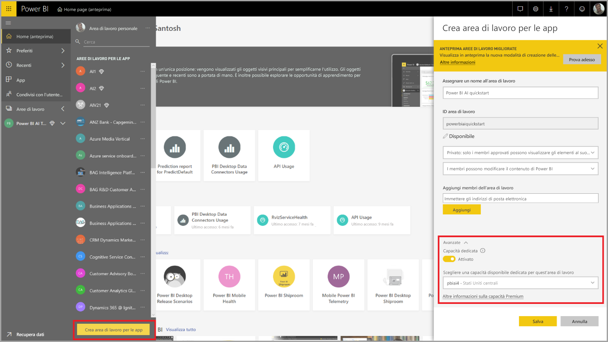

Dopo aver creato l'area di lavoro, è possibile selezionare **Ignora** nella parte inferiore destra della schermata iniziale, come illustrato nell'immagine seguente.

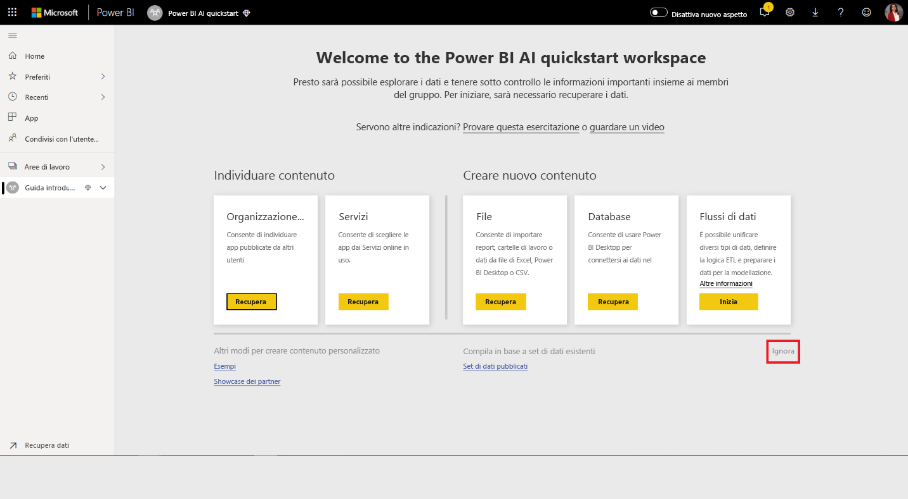

 Selezionare il pulsante **Crea** nella parte superiore destra dell'area di lavoro e quindi selezionare **Flusso di dati**.

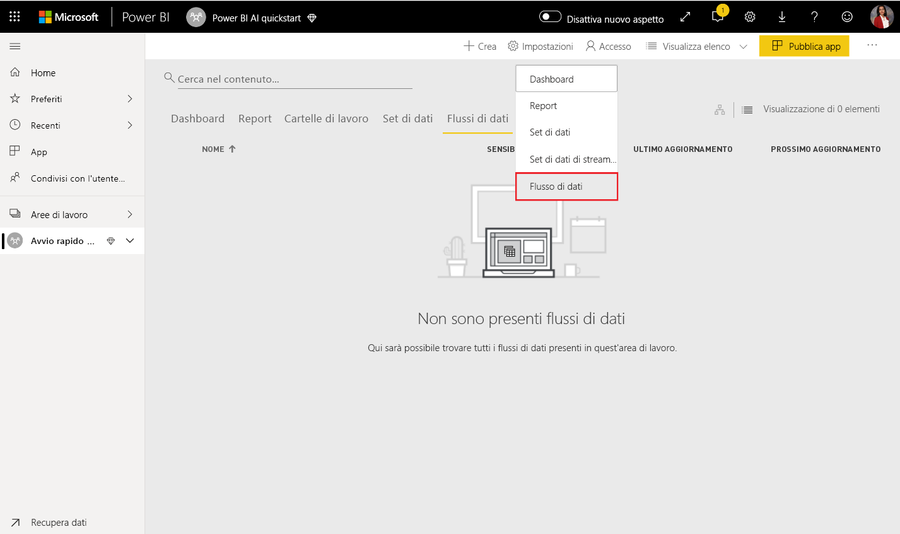

Selezionare **Aggiungi nuove entità**. Viene avviato un editor di **Power Query** nel browser.

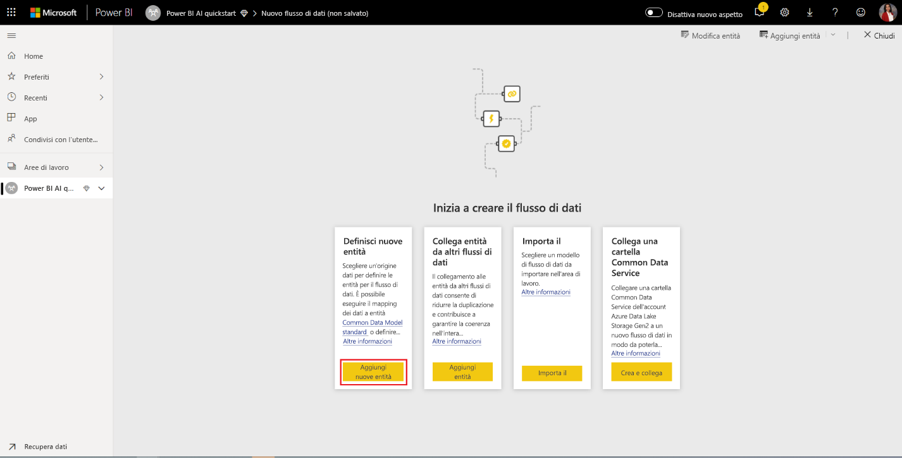

Selezionare **File di testo/File CSV** come origine dati, come illustrato nell'immagine seguente.

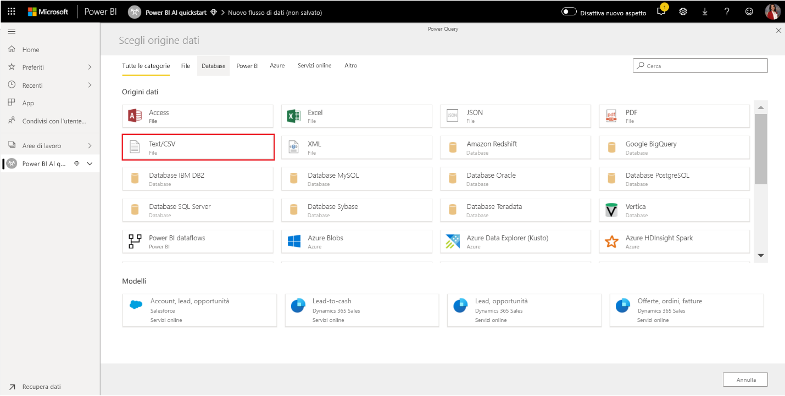

Nella pagina **Connessione a un'origine dati** copiare il collegamento seguente a _online_shoppers_intention.csv_ nella casella **Percorso file o URL** e quindi selezionare **Avanti**.

`https://raw.githubusercontent.com/santoshc1/PowerBI-AI-samples/master/Tutorial_AutomatedML/online_shoppers_intention.csv`

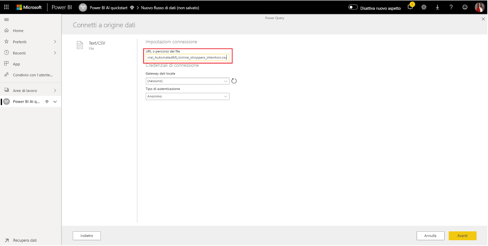

L'editor di Power Query visualizza un'anteprima dei dati del file CSV. È possibile rinominare la query con un nome più descrittivo modificando il valore nella casella Nome disponibile nel riquadro di destra. Ad esempio, è possibile modificare il nome della query in _Online Visitors_.

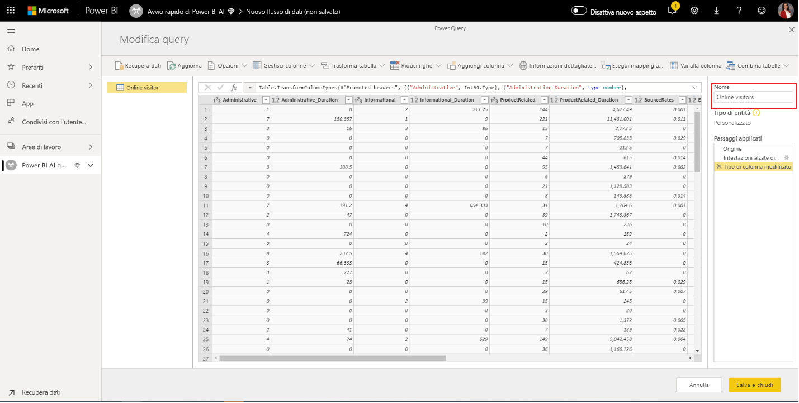

Power Query deduce automaticamente il tipo di colonne. È possibile modificare il tipo di colonna facendo clic sull'icona del tipo di attributo nella parte superiore dell'intestazione di colonna. In questo esempio il tipo della colonna Revenue viene modificato in True/False.

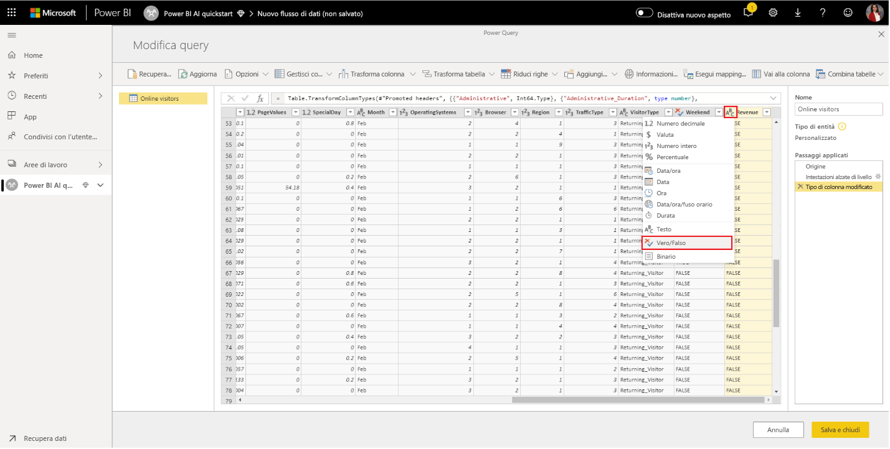

Selezionare il pulsante **Salva e chiudi** per chiudere l'editor di Power Query. Specificare un nome per il flusso di dati e quindi selezionare **Salva** nella finestra di dialogo, come illustrato nell'immagine seguente.

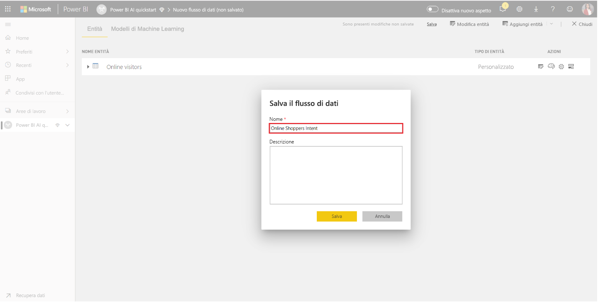

## Creare ed eseguire il training di un modello di Machine Learning

Per aggiungere un modello di Machine Learning, selezionare il pulsante **Applica modello di ML** nell'elenco **Azioni** dell'entità di base che contiene i dati di training e le informazioni sull'etichetta e quindi selezionare **Aggiungi un modello di Machine Learning**.

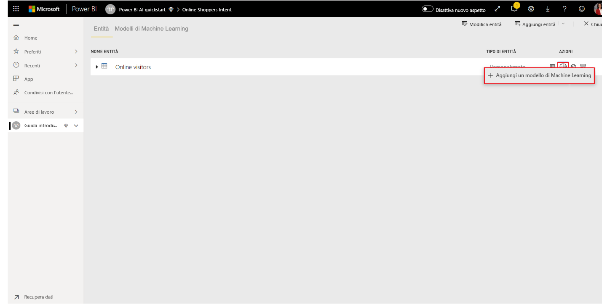

Il primo passaggio per la creazione del modello di Machine Learning consiste nell'identificare i dati cronologici, incluso il campo del risultato da stimare. Il modello verrà creato in base a questi dati.

Nel caso del set di dati in uso, si tratta del campo **Revenue** (Ricavi). Selezionare **Revenue** come valore 'Campo Risultato' e quindi selezionare **Avanti**.

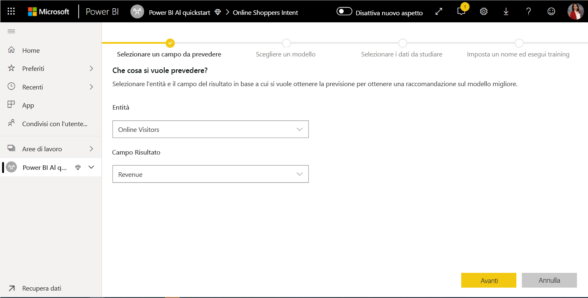

Successivamente è necessario selezionare il tipo di modello di Machine Learning da creare. Power BI analizza i valori nel campo del risultato identificato e suggerisce i tipi di modelli di Machine Learning che è possibile creare per stimare tale campo.

In questo caso, poiché si sta stimando un risultato binario che indica se un utente effettuerà un acquisto o meno, è consigliabile selezionare Previsione per dati binari. Poiché si è interessati alla stima degli utenti che effettueranno un acquisto, selezionare True come risultato dei ricavi a cui si è maggiormente interessati. È inoltre possibile specificare etichette descrittive per i risultati da usare nel report generato automaticamente che riepiloga i risultati della convalida del modello. Selezionare quindi Avanti.

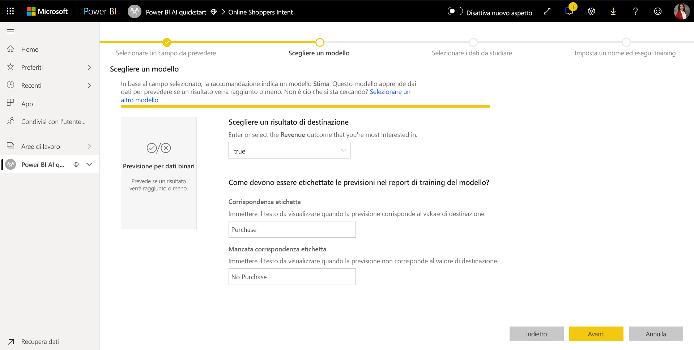

Successivamente, Power BI esegue un'analisi preliminare di un campione di dati e suggerisce gli input che possono produrre stime più accurate. Se Power BI non consiglia un campo, accanto ad esso viene fornita una spiegazione. È possibile modificare le selezioni in modo da includere solo i campi da esaminare nel modello oppure selezionare tutti i campi selezionando la casella di controllo accanto al nome dell'entità. Selezionare **Avanti** per accettare gli input.

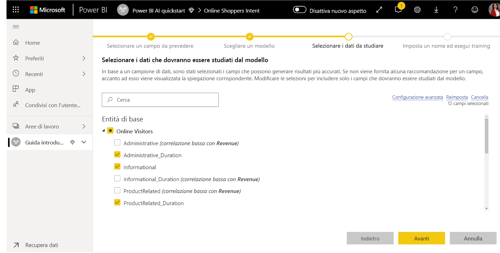

Nel passaggio finale è necessario specificare un nome per il modello. Denominare il modello _Purchase Intent Prediction_ (Stima finalità di acquisto). È possibile scegliere di ridurre il tempo di training per visualizzare risultati rapidi o aumentare la quantità di tempo impiegato per il training per ottenere il modello migliore. Selezionare quindi **Salva ed esegui training** per avviare il training del modello.

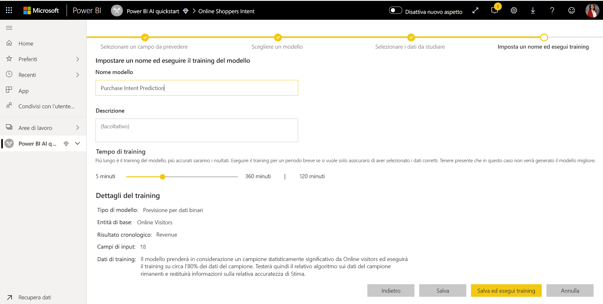

Il processo di training inizierà con il campionamento e la normalizzazione dei dati cronologici e la suddivisione del set di dati in due nuove entità _Purchase Intent Prediction Training Data_ (Dati training previsione finalità di acquisto) e _Purchase Intent Prediction Testing Data_ (Dati test previsione finalità di acquisto).

A seconda delle dimensioni del set di dati, il processo di training può richiedere da pochi minuti al tempo di training selezionato nella schermata precedente. A questo punto è possibile visualizzare il modello nella scheda **Modelli di Machine Learning** del flusso di dati. Lo stato Pronto indica che il modello è stato accodato per il training o è in fase di training.

È possibile verificare che il modello sia in fase di training e convalidato controllando lo stato del flusso di dati. Viene visualizzato un aggiornamento dei dati in corso nella scheda **Flussi di dati** dell'area di lavoro.

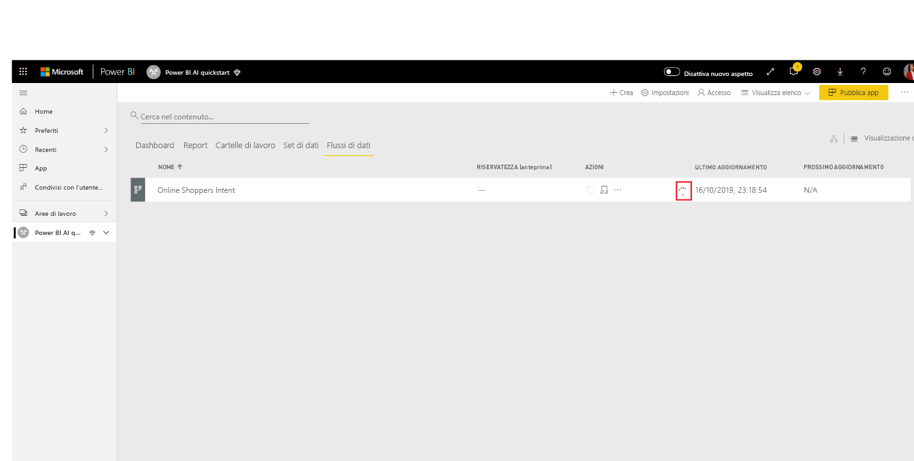

Una volta completato il training del modello, il flusso di dati visualizza una nuova ora di aggiornamento. È possibile verificare che il modello sia in fase di training, passando alla scheda **Modelli di Machine Learning** nel flusso di dati. Il modello creato dovrebbe visualizzare lo stato **Con training** e l'ora **Ultimo training** dovrebbe essere aggiornata.

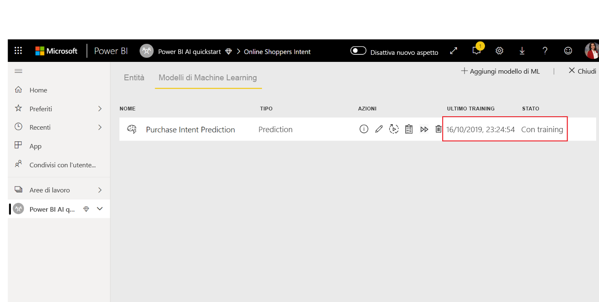

## Esaminare il report di convalida del modello
Per esaminare il report di convalida del modello, nella scheda Modelli di Machine Learning selezionare il pulsante Visualizza report di training nella colonna Azioni per il modello. Questo report descrive le prestazioni probabili del modello di Machine Learning.

Nella pagina **Prestazioni del modello** del report selezionare **See top predictors** (Vedi fattori di previsione principali) per visualizzare i fattori di previsione principali del modello. È possibile selezionare uno dei fattori di previsione per visualizzare come la distribuzione dei risultati sia associata al fattore di previsione.

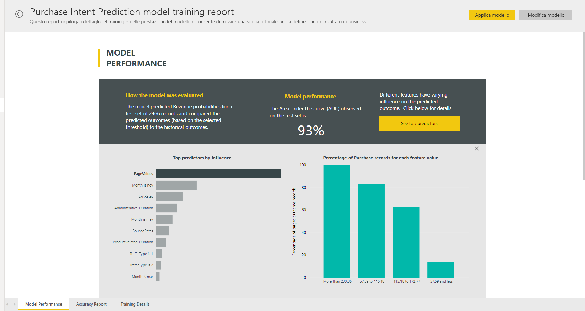

È possibile usare il filtro dei dati **Soglia probabilità** nella pagina Prestazioni del modello per esaminarne l'influenza sulla precisione e il richiamo del modello.

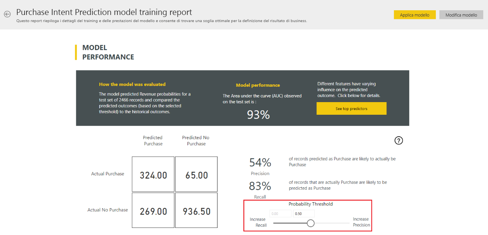

Le altre pagine del report descrivono le metriche delle prestazioni statistiche per il modello.

Il report include anche una pagina Dettagli del training che descrive le diverse iterazioni eseguite, il modo in cui le funzionalità sono state estratte dagli input e gli iperparametri usati per il modello finale.

## Applicare il modello a un'entità del flusso di dati

Selezionare il pulsante **Applica modello** nella parte superiore del report per richiamare il modello. Nella finestra di dialogo **Applica** è possibile specificare l'entità di destinazione con i dati di origine a cui applicare il modello.

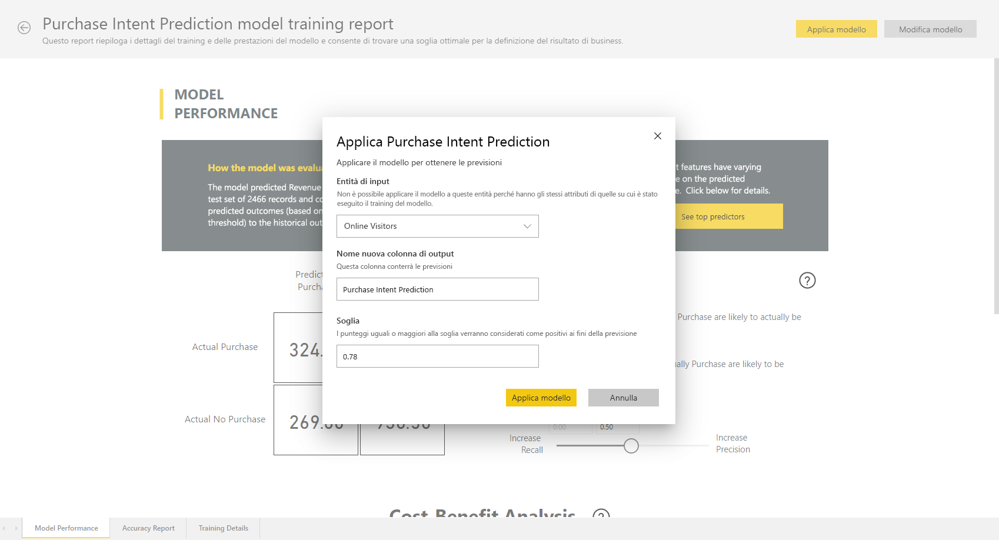

Quando richiesto, scegliere **Aggiorna** per aggiornare il flusso di dati per visualizzare in anteprima i risultati del modello.

L'applicazione del modello creerà due nuove entità, con il suffisso **enriched <nome_modello>** e **enriched <nome_modello> explanations**. In questo caso l'applicazione del modello all'entità **Online Visitors** creerà **Online Visitors enriched Purchase Intent Prediction**, che include l'output stimato del modello, e **Online Visitors enriched Purchase Intent Prediction explanations**, che contiene i principali fattori di influenza specifici dei record per la stima. 

L'applicazione di un modello Previsione per dati binari aggiunge quattro colonne con il risultato stimato, il punteggio di probabilità, i principali fattori di influenza specifici dei record per la stima e l'indice di spiegazione, ognuno con il nome di colonna specificato.  

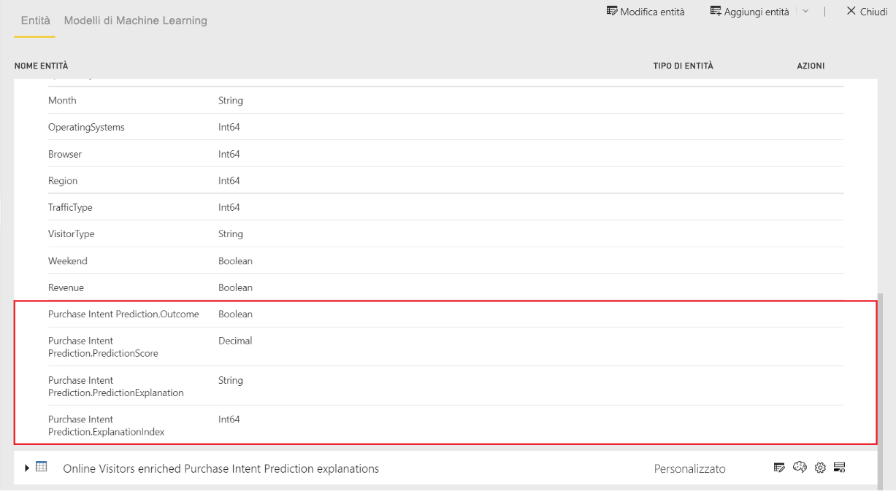

Una volta completato l'aggiornamento del flusso di dati, è possibile selezionare l'entità **Online Visitors enriched Purchase Intent Prediction** per visualizzare i risultati.

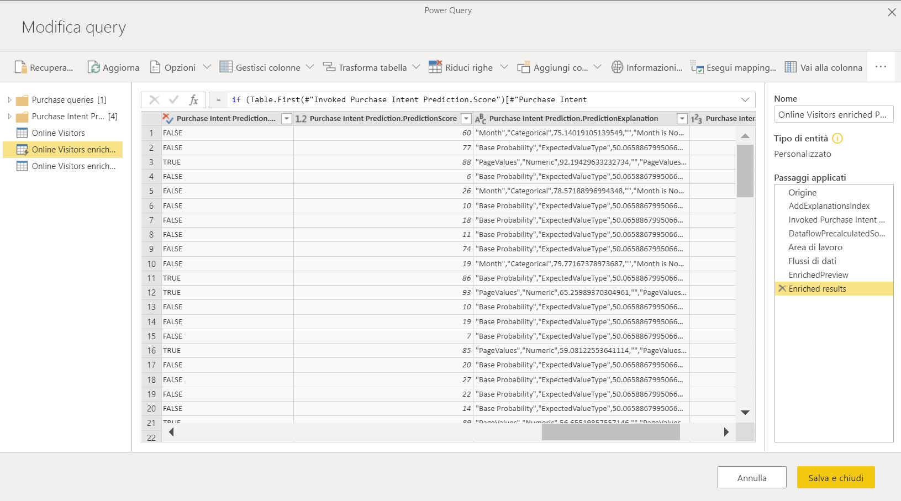

## Uso dell'output con punteggio dal modello di un report Power BI

Per usare l'output con punteggio del modello di Machine Learning, è possibile connettersi al flusso di dati da Power BI Desktop usando il connettore Flussi di dati. L'entità **Online Visitors enriched Purchase Intent Prediction** può ora essere usata per incorporare le stime del modello nei report di Power BI.

## Passaggi successivi

In questa esercitazione è stato creato e applicato un modello di previsione per dati binari in Power BI eseguendo i passaggi seguenti:

* Creare un flusso di dati con i dati di input
* Creare ed eseguire il training di un modello di Machine Learning
* Esaminare il report di convalida del modello
* Applicare il modello a un'entità del flusso di dati
* Uso dell'output con punteggio dal modello di un report Power BI

Per altre informazioni sull'automazione di Machine Learning in Power BI, vedere [Machine Learning automatizzato in Power BI](../transform-model/service-machine-learning-automated.md).
